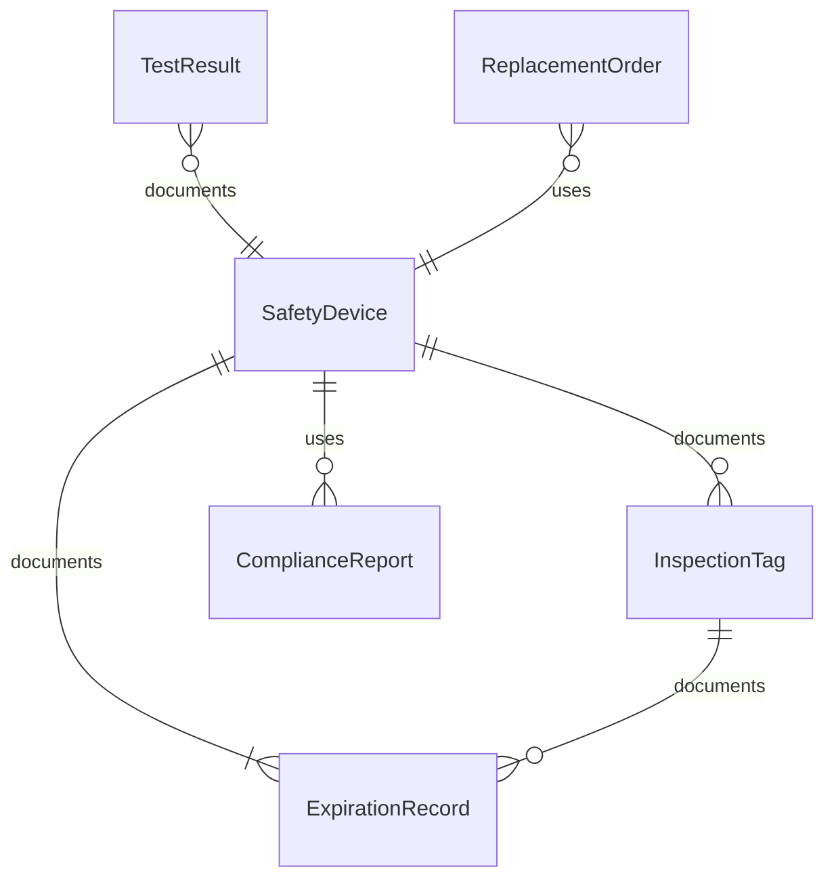
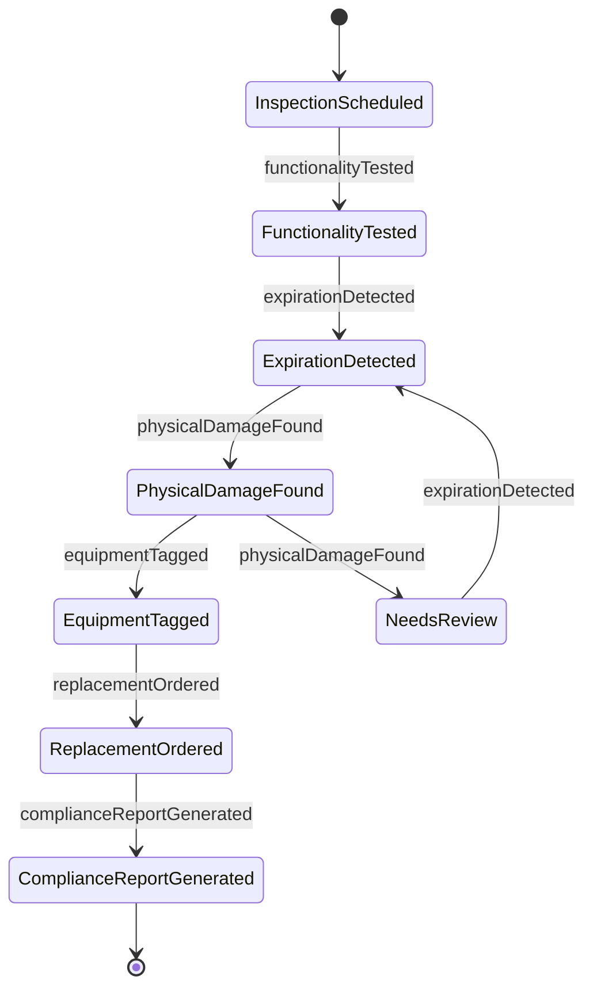
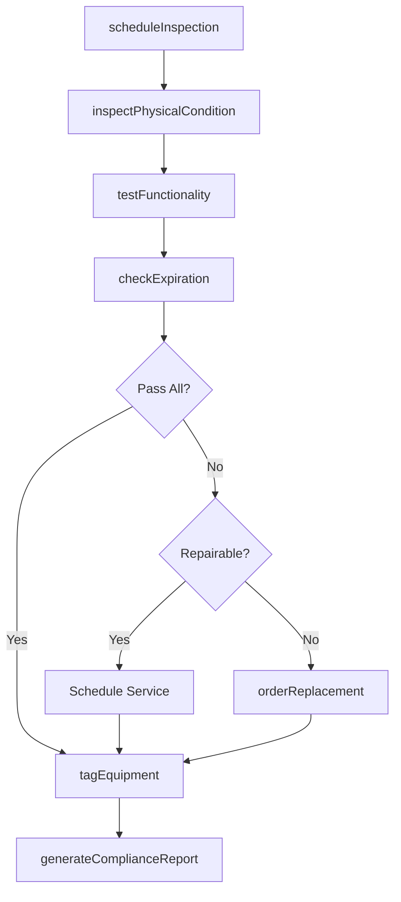
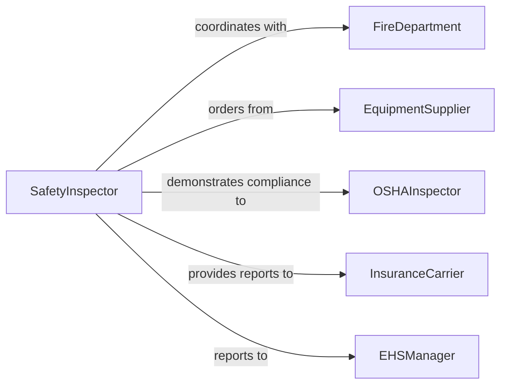

# Inspect Safety Equipment Ensure Proper

> Business-as-Code definition for inspecting safety equipment to ensure proper functioning. Models the complete safety equipment inspection lifecycle from scheduling through testing, certification, and replacement planning for fire protection, personal protective, and emergency response equipment.

## Overview

Safety equipment inspection ensures that fire extinguishers, smoke detectors, sprinkler systems, emergency lighting, fall protection gear, personal protective equipment, and other life-safety devices are functioning correctly and ready for use when needed. Regular inspections are mandated by OSHA, NFPA, and local fire codes, with specific intervals for different equipment types. Inspectors verify physical condition, test functionality, check expiration dates, and confirm that equipment is accessible and properly maintained.

## Actors

| Actor | Description |
|-------|-------------|
| FireDepartment | Conducts or witnesses fire protection equipment inspections |
| EquipmentSupplier | Provides safety equipment and replacement components |
| OSHAInspector | Enforces workplace safety equipment standards and citations |
| InsuranceCarrier | Requires safety equipment compliance for policy coverage |
| BuildingOccupants | Rely on safety equipment functioning in emergencies |

## Roles

| Role | Description |
|------|-------------|
| SafetyInspector | Tests and documents the condition of safety equipment |
| FireProtectionSpecialist | Conducts specialized inspections of fire suppression and detection systems |
| EHSManager | Oversees the environmental, health, and safety compliance program |
| FacilitiesCoordinator | Manages inspection schedules and coordinates equipment placement |

## Entities

| Entity | Description |
|--------|-------------|
| SafetyDevice | A piece of safety equipment subject to inspection (extinguisher, detector, harness) |
| InspectionTag | Physical or digital tag recording the most recent inspection date and result |
| TestResult | Documented outcome of a functional test on safety equipment |
| ExpirationRecord | Tracking record for equipment with service life limits |
| ComplianceReport | Summary of safety equipment compliance status across a facility |
| ReplacementOrder | A purchase request for expired or failed safety equipment |

## Actions

| Action | Description |
|--------|-------------|
| scheduleInspection | Plan safety equipment inspections by type, location, or due date |
| testFunctionality | Verify that safety equipment operates correctly under test conditions |
| checkExpiration | Review service life dates and certification validity |
| inspectPhysicalCondition | Examine equipment for damage, corrosion, tampering, or wear |
| tagEquipment | Apply or update the inspection tag with results and next due date |
| orderReplacement | Initiate procurement for equipment that cannot be recertified |
| generateComplianceReport | Produce a facility-wide safety equipment compliance summary |

## Events

| Event | Description |
|-------|-------------|
| inspectionScheduled | Safety equipment inspections have been planned |
| functionalityTested | A safety device has been tested and results recorded |
| expirationDetected | Equipment has been identified as expired or nearing expiration |
| physicalDamageFound | Visible damage or tampering has been discovered |
| equipmentTagged | An inspection tag has been applied or updated |
| replacementOrdered | A purchase order for replacement safety equipment has been placed |
| complianceReportGenerated | A facility compliance summary has been published |

## Searches

| Search | Description |
|--------|-------------|
| findSafetyDevices | List safety equipment by type, location, or inspection status |
| getExpiringEquipment | Retrieve devices approaching or past their expiration date |
| getFailedTests | Find safety equipment that failed recent functional tests |
| getComplianceStatus | Query overall compliance by facility, floor, or equipment type |

## Entity Relationships



## State Diagram



## Workflow



## Actor Relationships



## Usage

### Calling Actions

```typescript
import { inspectSafetyEquipmentEnsureProper } from '@headlessly/inspect-safety-equipment-ensure-proper'

const safety = inspectSafetyEquipmentEnsureProper()

// Schedule monthly fire extinguisher inspections
const schedule = await safety.scheduleInspection({
  type: 'fire-extinguisher',
  facility: 'Main Office Building',
  frequency: 'monthly',
  startDate: '2026-03-01'
})

// Test functionality of a fire extinguisher
await safety.testFunctionality({
  deviceId: 'FE-2026-0112',
  type: 'fire-extinguisher',
  tests: [
    { check: 'pressure-gauge', result: 'pass', reading: 'green-zone' },
    { check: 'pin-and-tamper-seal', result: 'pass' },
    { check: 'hose-condition', result: 'fail', notes: 'Cracked nozzle' }
  ]
})

// Order replacement for failed device
await safety.orderReplacement({
  deviceId: 'FE-2026-0112',
  reason: 'Cracked nozzle - not repairable',
  replacementType: 'ABC-dry-chemical-10lb',
  priority: 'standard'
})
```

### Event-Driven Automation

```typescript
// Alert EHS manager when critical safety equipment fails
safety.functionalityTested(async ({ deviceId, type, passed }) => {
  if (!passed && ['fire-extinguisher', 'smoke-detector', 'emergency-light'].includes(type)) {
    await notify({
      to: 'ehs-manager',
      message: `${type} ${deviceId} failed functional test - replacement needed`
    })
  }
})

// Auto-flag expiring equipment 30 days before deadline
safety.expirationDetected(async ({ deviceId, expirationDate }) => {
  await safety.orderReplacement({
    deviceId,
    reason: `Expiring on ${expirationDate}`,
    priority: 'planned'
  })
})
```
