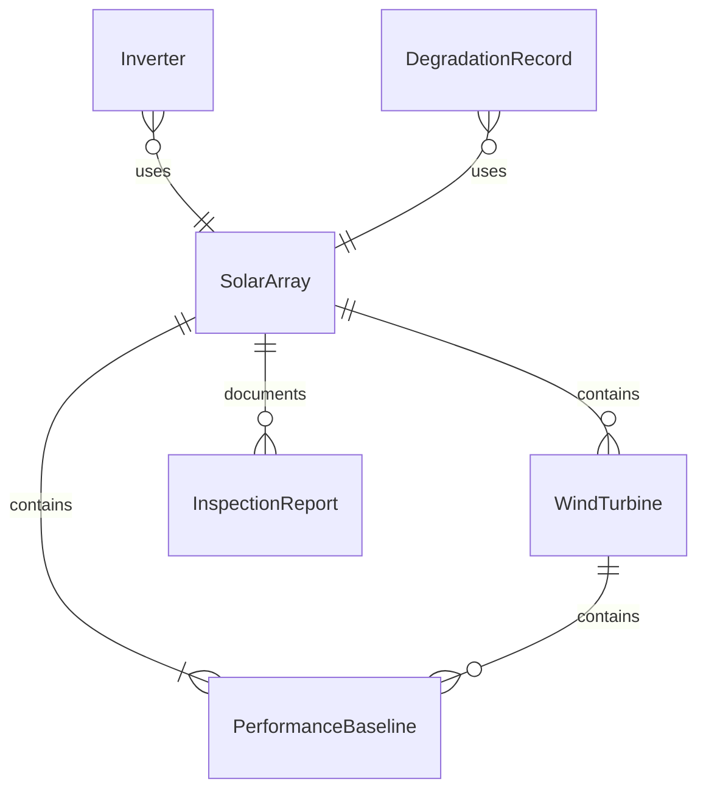
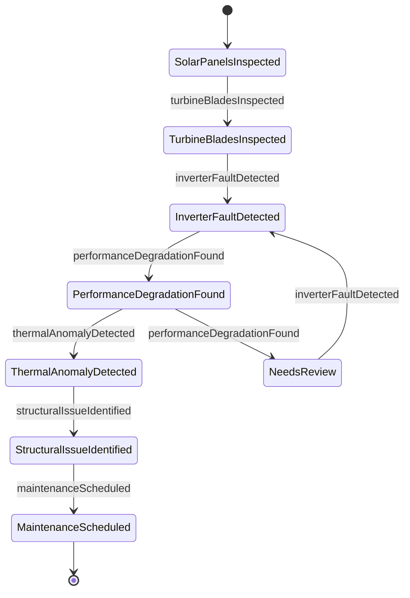
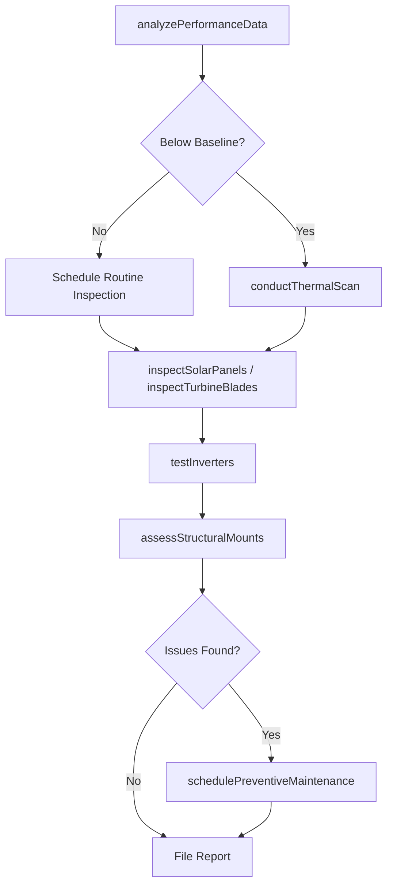
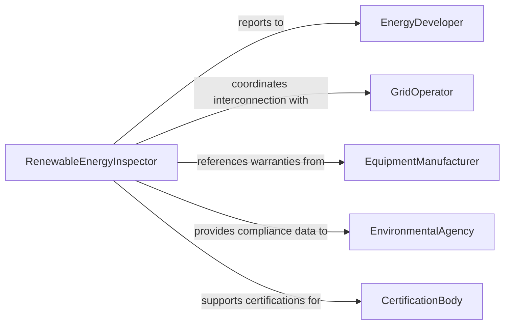

# Inspect Sustainable Energy Production Facilities

> Business-as-Code definition for inspecting sustainable energy production facilities and equipment. Models the inspection process for solar, wind, geothermal, and hydroelectric installations from performance monitoring through component examination, degradation analysis, and maintenance planning.

## Overview

Inspecting sustainable energy production facilities involves examining solar panels, wind turbines, geothermal systems, battery storage, inverters, and associated electrical infrastructure to ensure optimal energy output, structural integrity, and regulatory compliance. Inspectors use thermal imaging, electrical testing, visual assessment, and performance data analysis to detect panel degradation, turbine blade damage, inverter faults, and connection issues. These inspections protect capital investments and maintain energy production targets.

## Actors

| Actor | Description |
|-------|-------------|
| EnergyDeveloper | Owns and finances renewable energy projects |
| GridOperator | Manages the electrical grid that receives generated power |
| EquipmentManufacturer | Provides solar panels, turbines, inverters, and warranty support |
| EnvironmentalAgency | Regulates environmental compliance at energy production sites |
| UtilityPurchaser | Buys generated energy under power purchase agreements |
| CertificationBody | Issues and maintains renewable energy certifications |

## Roles

| Role | Description |
|------|-------------|
| RenewableEnergyInspector | Conducts physical and performance inspections of energy systems |
| PlantManager | Oversees daily operations and maintenance of the energy facility |
| ElectricalEngineer | Evaluates electrical systems, inverters, and grid interconnections |
| PerformanceAnalyst | Monitors energy output data and identifies underperforming assets |

## Entities

| Entity | Description |
|--------|-------------|
| SolarArray | A collection of photovoltaic panels configured for energy production |
| WindTurbine | A turbine converting wind energy into electricity |
| Inverter | Equipment converting DC power from panels to AC for grid delivery |
| PerformanceBaseline | Expected energy output benchmarks for comparison |
| InspectionReport | Documented findings from a facility or equipment inspection |
| DegradationRecord | Tracked decline in equipment performance over time |

## Actions

| Action | Description |
|--------|-------------|
| inspectSolarPanels | Examine panels for cracks, hotspots, soiling, and degradation |
| inspectTurbineBlades | Assess wind turbine blades for erosion, cracks, and lightning damage |
| testInverters | Verify inverter performance, efficiency, and fault codes |
| analyzePerformanceData | Compare actual energy output against production baselines |
| conductThermalScan | Use infrared imaging to detect hotspots and electrical faults |
| assessStructuralMounts | Inspect racking, foundations, and tower structures for integrity |
| schedulePreventiveMaintenance | Plan maintenance activities based on inspection findings |

## Events

| Event | Description |
|-------|-------------|
| solarPanelsInspected | Solar array inspection has been completed |
| turbineBladesInspected | Wind turbine blade assessment has been performed |
| inverterFaultDetected | An inverter malfunction or performance issue has been identified |
| performanceDegradationFound | Energy output has fallen below acceptable baseline thresholds |
| thermalAnomalyDetected | Infrared imaging has revealed a hotspot or electrical fault |
| structuralIssueIdentified | A mounting, foundation, or tower integrity concern has been found |
| maintenanceScheduled | Preventive maintenance activities have been planned |

## Searches

| Search | Description |
|--------|-------------|
| findFacilities | List energy facilities by type, location, capacity, or inspection status |
| getPerformanceData | Retrieve energy output records by facility, date range, or variance |
| getDegradationTrends | Query degradation rates for specific equipment or arrays |
| getPendingMaintenance | Find outstanding maintenance activities by facility or priority |

## Entity Relationships



## State Diagram



## Workflow



## Actor Relationships



## Usage

### Calling Actions

```typescript
import { inspectSustainableEnergyProductionFacilities } from '@headlessly/inspect-sustainable-energy-production-facilities'

const energy = inspectSustainableEnergyProductionFacilities()

// Analyze performance data for a solar farm
const analysis = await energy.analyzePerformanceData({
  facility: 'Sunfield Solar Farm',
  period: { start: '2026-01-01', end: '2026-03-01' },
  baseline: 'design-capacity-v2'
})

// Conduct thermal scan on underperforming sections
const scan = await energy.conductThermalScan({
  facility: 'Sunfield Solar Farm',
  sections: ['Array-B3', 'Array-B4'],
  instrument: 'FLIR-T650sc'
})

// Schedule maintenance for detected hotspots
await energy.schedulePreventiveMaintenance({
  facility: 'Sunfield Solar Farm',
  items: [
    { component: 'Panel-B3-22', issue: 'hotspot-bypass-diode', priority: 'high' },
    { component: 'Inverter-B3', issue: 'efficiency-drop', priority: 'medium' }
  ]
})
```

### Event-Driven Automation

```typescript
// Alert plant manager on significant performance degradation
energy.performanceDegradationFound(async ({ facility, variance }) => {
  if (variance > 10) {
    await notify({
      to: 'plant-manager',
      message: `${facility} performance ${variance}% below baseline - inspection recommended`
    })
  }
})

// Auto-report inverter faults to manufacturer
energy.inverterFaultDetected(async ({ facility, inverterId, faultCode }) => {
  await support.createTicket({
    vendor: 'inverter-manufacturer',
    equipment: inverterId,
    facility,
    faultCode,
    type: 'warranty-claim'
  })
})
```
