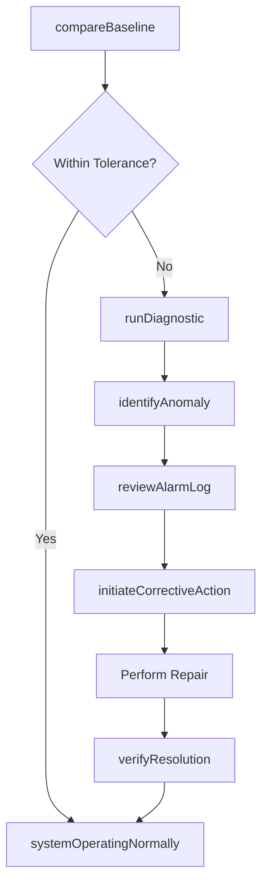
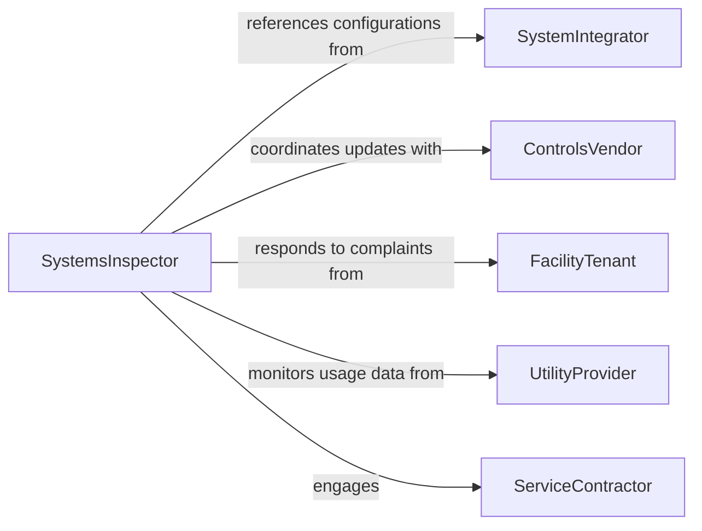

# Inspect Systems Determine If They

> Business-as-Code definition for inspecting systems to determine if they are operating properly. Models the operational verification process from baseline performance comparison through diagnostic testing, anomaly detection, and corrective action initiation.

## Overview

Inspecting systems to determine proper operation involves verifying that mechanical, electrical, HVAC, plumbing, process control, and building automation systems are functioning within their designed parameters. Inspectors compare real-time performance metrics against established baselines, run diagnostic tests, and observe system behavior under normal and stress conditions. This activity is essential for maintaining operational continuity, preventing unplanned downtime, and ensuring occupant comfort and safety.

## Actors

| Actor | Description |
|-------|-------------|
| SystemIntegrator | Designs and configures integrated building or process systems |
| ControlsVendor | Provides automation controllers, sensors, and software updates |
| FacilityTenant | Reports operational complaints such as temperature or noise issues |
| UtilityProvider | Supplies power, water, or gas and monitors consumption patterns |
| ServiceContractor | Performs specialized diagnostics and system tuning |

## Roles

| Role | Description |
|------|-------------|
| SystemsInspector | Conducts operational checks and diagnostic testing on building and process systems |
| BuildingEngineer | Manages day-to-day system operations and responds to alarms |
| ControlsTechnician | Programs, calibrates, and troubleshoots automation and control systems |
| OperationsDirector | Makes decisions on system upgrades, replacements, and capital investments |

## Entities

| Entity | Description |
|--------|-------------|
| System | An integrated set of components performing a specific operational function |
| PerformanceBaseline | Expected operating parameters under normal conditions |
| DiagnosticTest | A structured test procedure to evaluate system behavior |
| Anomaly | A deviation from expected system performance |
| AlarmLog | A record of system-generated alerts and fault notifications |
| CorrectiveAction | A planned response to restore proper system operation |

## Actions

| Action | Description |
|--------|-------------|
| compareBaseline | Check current system performance against established baselines |
| runDiagnostic | Execute a structured diagnostic test on a system or subsystem |
| monitorOperatingParameters | Observe real-time readings for temperature, pressure, flow, and power |
| identifyAnomaly | Flag a performance deviation that indicates a system problem |
| reviewAlarmLog | Analyze historical alarm data for recurring patterns |
| initiateCorrectiveAction | Assign and schedule a corrective response to a detected problem |
| verifyResolution | Confirm that the corrective action restored proper operation |

## Events

| Event | Description |
|-------|-------------|
| baselineCompared | System performance has been evaluated against expected parameters |
| diagnosticCompleted | A structured diagnostic test has been executed and results recorded |
| anomalyIdentified | A performance deviation has been detected and documented |
| alarmTriggered | The system has generated a fault or warning alarm |
| correctiveActionInitiated | A repair or adjustment has been planned in response to a finding |
| resolutionVerified | Proper system operation has been confirmed after corrective action |
| systemOperatingNormally | The system has been confirmed to be within all baseline parameters |

## Searches

| Search | Description |
|--------|-------------|
| findSystems | List systems by type, building, status, or last inspection date |
| getAnomalies | Retrieve anomaly records by system, severity, or resolution status |
| getAlarmHistory | Query alarm logs by system, date range, or frequency |
| getDiagnosticResults | Look up diagnostic test outcomes by system or test type |

## Workflow



## Actor Relationships



## Usage

### Calling Actions

```typescript
import { inspectSystemsDetermineIfThey } from '@headlessly/inspect-systems-determine-if-they'

const systems = inspectSystemsDetermineIfThey()

// Compare HVAC system against baseline
const comparison = await systems.compareBaseline({
  system: 'HVAC-AHU-03',
  building: 'Corporate Headquarters',
  parameters: {
    supplyAirTemp: { current: 58.2, baseline: 55.0, tolerance: 2.0 },
    staticPressure: { current: 1.8, baseline: 1.5, tolerance: 0.3 },
    returnAirTemp: { current: 74.5, baseline: 72.0, tolerance: 2.0 }
  }
})

// Run a diagnostic on the out-of-range system
const diagnostic = await systems.runDiagnostic({
  system: 'HVAC-AHU-03',
  tests: ['coil-delta-t', 'damper-stroke', 'fan-vibration', 'filter-pressure-drop']
})

// Initiate corrective action
await systems.initiateCorrectiveAction({
  system: 'HVAC-AHU-03',
  anomaly: 'Elevated supply air temperature',
  action: 'Inspect and clean cooling coil, verify chilled water valve operation',
  assignee: 'building-engineer',
  priority: 'high'
})
```

### Event-Driven Automation

```typescript
// Escalate repeated alarms
systems.alarmTriggered(async ({ system, alarmType, count24h }) => {
  if (count24h > 5) {
    await notify({
      to: 'operations-director',
      message: `${system} has triggered ${count24h} ${alarmType} alarms in 24 hours`
    })
  }
})

// Auto-verify resolution 48 hours after corrective action
systems.correctiveActionInitiated(async ({ system, actionId }) => {
  await schedule({
    task: () => systems.verifyResolution({ system, actionId }),
    delay: '48h'
  })
})
```
