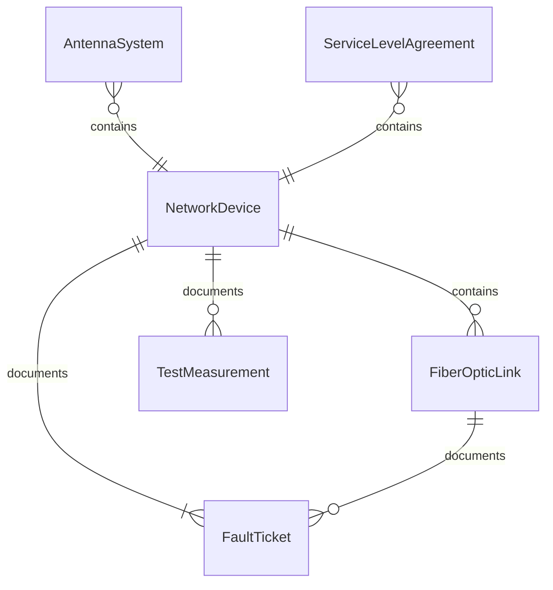
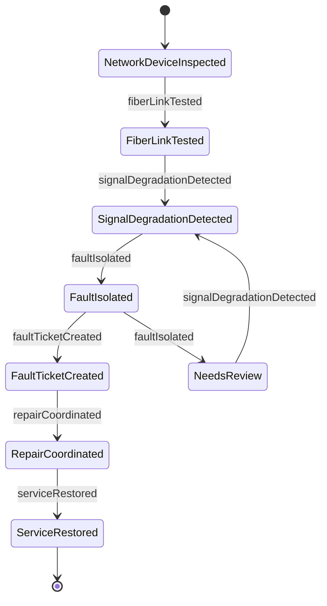
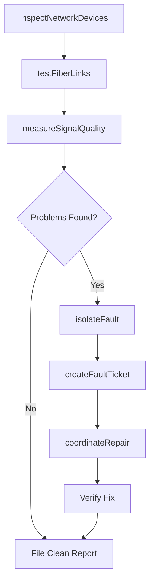
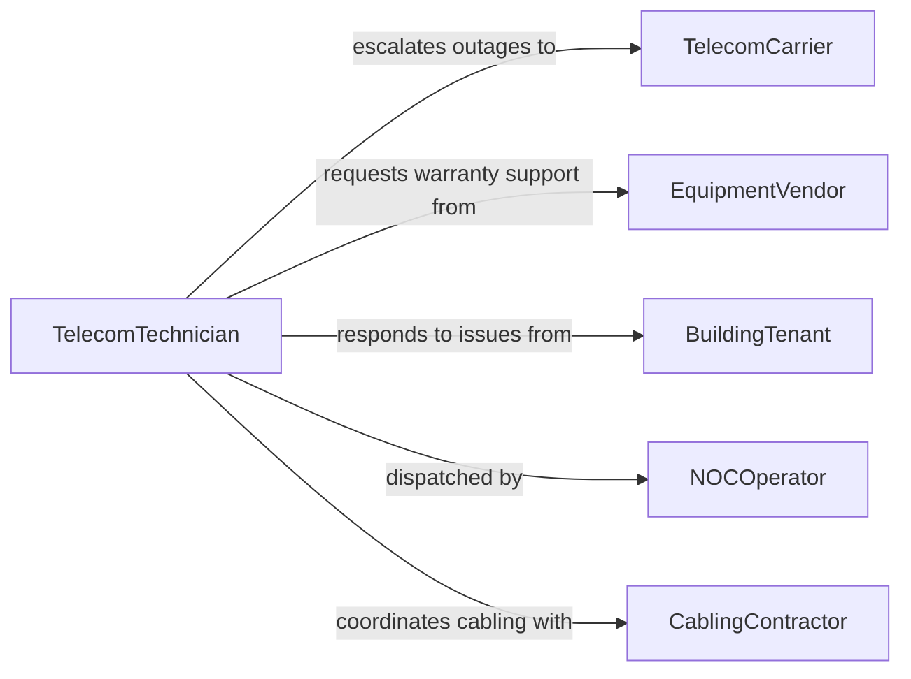

# Inspect Telecommunications Equipment Identify Problems

> Business-as-Code definition for inspecting telecommunications equipment to identify problems. Models the inspection process from signal quality assessment through physical examination of network infrastructure, fault isolation, and service restoration coordination.

## Overview

Telecommunications equipment inspection involves examining network switches, routers, fiber optic cables, antenna systems, cell towers, PBX systems, and structured cabling to identify faults, signal degradation, and hardware failures. Technicians use optical time-domain reflectometers (OTDR), cable analyzers, spectrum analyzers, and network monitoring tools to locate problems such as fiber breaks, connector contamination, signal interference, and equipment overheating. Timely detection prevents service outages and maintains network reliability.

## Actors

| Actor | Description |
|-------|-------------|
| TelecomCarrier | Operates the wider telecommunications network and escalates outages |
| EquipmentVendor | Manufactures and provides warranty support for telecom hardware |
| BuildingTenant | Reports service quality issues such as dropped calls or slow connectivity |
| FCC | Regulates telecommunications equipment and spectrum usage |
| CablingContractor | Installs and maintains structured cabling and fiber infrastructure |
| TowerCompany | Owns and maintains cell tower structures and site access |

## Roles

| Role | Description |
|------|-------------|
| TelecomTechnician | Performs hands-on inspection, testing, and troubleshooting of telecom equipment |
| NetworkEngineer | Analyzes network performance data and designs fault resolution strategies |
| NOCOperator | Monitors network operations center dashboards and dispatches field teams |
| SiteManager | Oversees telecom equipment rooms, closets, and tower sites |

## Entities

| Entity | Description |
|--------|-------------|
| NetworkDevice | A switch, router, access point, or other active network component |
| FiberOpticLink | A fiber cable segment connecting network nodes |
| AntennaSystem | A cell tower or rooftop antenna assembly for wireless transmission |
| FaultTicket | A documented network issue requiring investigation |
| TestMeasurement | A recorded reading from diagnostic instruments (signal strength, latency, loss) |
| ServiceLevelAgreement | Contracted performance thresholds that must be maintained |

## Actions

| Action | Description |
|--------|-------------|
| inspectNetworkDevices | Examine switches, routers, and access points for indicator lights, fans, and errors |
| testFiberLinks | Use OTDR and power meters to measure fiber loss, reflectance, and continuity |
| assessAntennaSystem | Inspect antenna alignment, cable connections, and signal patterns |
| measureSignalQuality | Record signal strength, noise floor, and interference levels |
| isolateFault | Narrow down the source of a network problem to a specific component |
| createFaultTicket | Document the identified problem with location, severity, and recommended fix |
| coordinateRepair | Assign and schedule the repair with appropriate teams or contractors |

## Events

| Event | Description |
|-------|-------------|
| networkDeviceInspected | A switch, router, or access point has been physically examined |
| fiberLinkTested | Fiber optic testing has been completed with measurements recorded |
| signalDegradationDetected | Signal quality has fallen below acceptable thresholds |
| faultIsolated | The root cause of a network problem has been identified |
| faultTicketCreated | A documented fault report has been filed |
| repairCoordinated | A repair assignment has been dispatched to the appropriate team |
| serviceRestored | Network service has been confirmed restored after repair |

## Searches

| Search | Description |
|--------|-------------|
| findNetworkDevices | List telecom equipment by type, location, status, or last inspection date |
| getFaultTickets | Retrieve open fault tickets by severity, location, or age |
| getSignalMetrics | Query historical signal quality measurements by link or site |
| getSLAViolations | Identify service level agreement breaches by circuit or customer |

## Entity Relationships



## State Diagram



## Workflow



## Actor Relationships



## Usage

### Calling Actions

```typescript
import { inspectTelecommunicationsEquipmentIdentifyProblems } from '@headlessly/inspect-telecommunications-equipment-identify-problems'

const telecom = inspectTelecommunicationsEquipmentIdentifyProblems()

// Inspect network devices in a telecom closet
const inspection = await telecom.inspectNetworkDevices({
  location: 'Building-C MDF Room',
  devices: ['Core-Switch-01', 'Distribution-Switch-02', 'Fiber-Patch-Panel-A'],
  checks: ['indicator-lights', 'fan-operation', 'error-logs', 'temperature']
})

// Test fiber links
const fiberTest = await telecom.testFiberLinks({
  link: 'MDF-to-IDF-3rd-Floor',
  instrument: 'OTDR',
  wavelength: 1310,
  measurements: {
    totalLoss: 1.8,
    connectorLoss: 0.3,
    spliceCount: 2
  }
})

// Isolate a fault
await telecom.isolateFault({
  symptom: 'Intermittent packet loss on 3rd floor',
  testedComponents: ['Core-Switch-01', 'Distribution-Switch-02', 'Fiber-Patch-Panel-A'],
  rootCause: 'Contaminated fiber connector at patch panel port 12',
  confidence: 'high'
})
```

### Event-Driven Automation

```typescript
// Alert NOC on signal degradation
telecom.signalDegradationDetected(async ({ link, metric, value, threshold }) => {
  await notify({
    to: 'noc-operator',
    message: `Signal degradation on ${link}: ${metric} at ${value} (threshold: ${threshold})`
  })
})

// Auto-escalate aged fault tickets
telecom.faultTicketCreated(async ({ ticketId, severity }) => {
  if (severity === 'critical') {
    await schedule({
      task: async () => {
        const ticket = await telecom.getFaultTickets({ ticketId })
        if (ticket.status === 'open') {
          await escalate({ ticketId, to: 'network-engineer' })
        }
      },
      delay: '2h'
    })
  }
})
```
