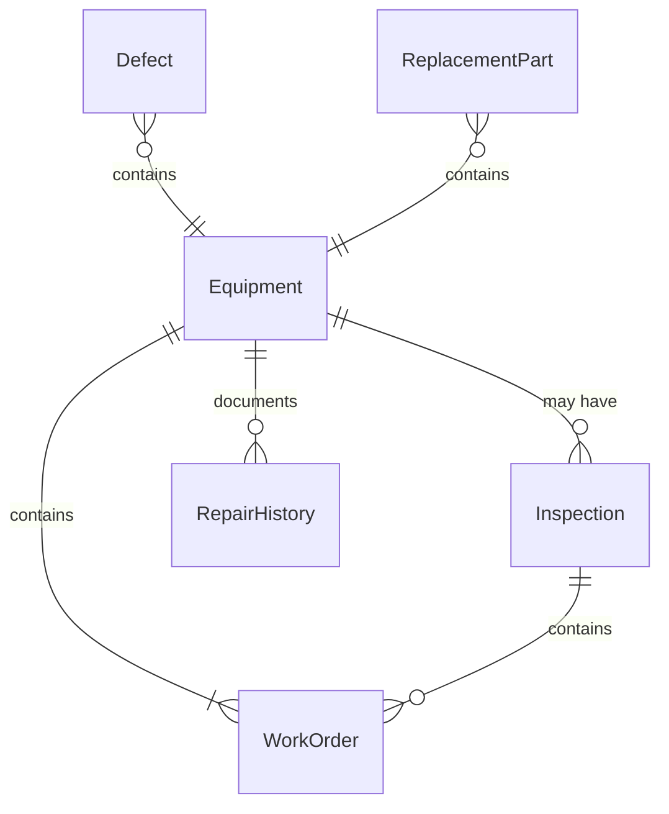
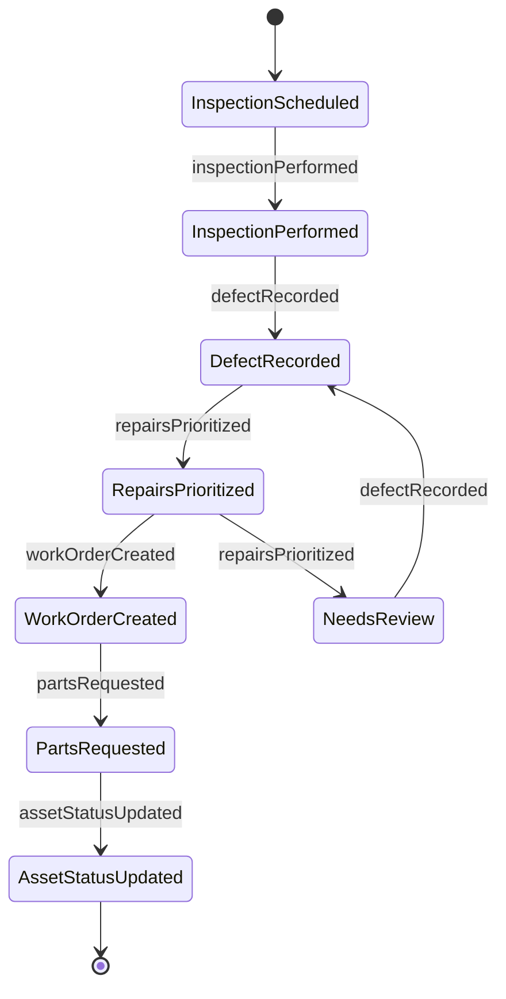
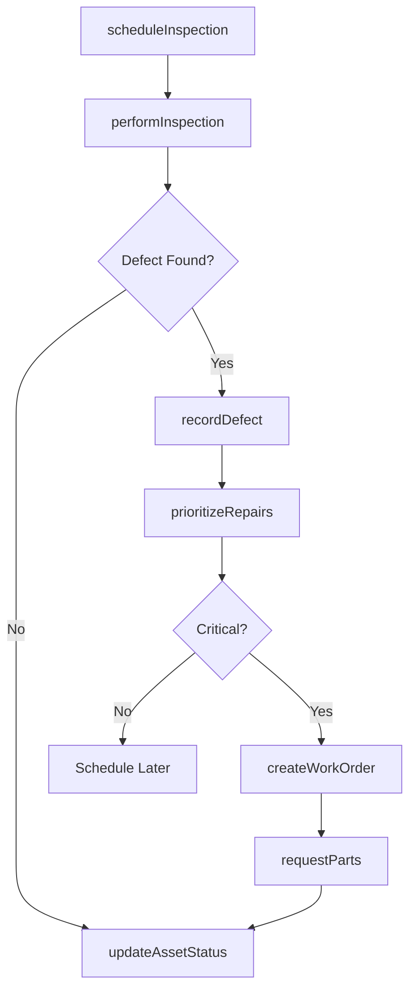
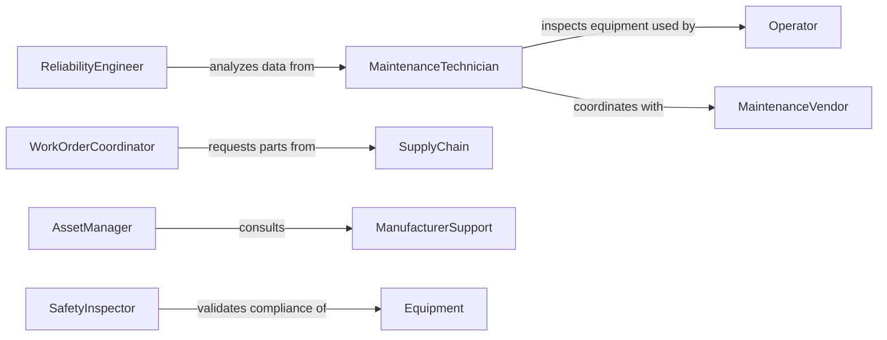

# Locate Equipment Materials Need Repair

> Business-as-Code definition for equipment fault detection and maintenance workflows. Models the complete identification process from inspection through repair coordination and asset tracking.

## Overview

Equipment fault localization involves systematic inspection of industrial systems to identify defects, degradation, and failure modes requiring maintenance intervention. This definition exposes actions for conducting inspections, documenting defects, prioritizing repairs, and coordinating with maintenance teams and vendors.

## Actors

| Actor | Description |
|-------|-------------|
| Operator | Reports equipment malfunctions during operation |
| MaintenanceVendor | Provides repair services and replacement parts |
| ManufacturerSupport | Offers technical guidance for complex failures |
| SafetyInspector | Reviews hazardous equipment for compliance |
| SupplyChain | Procures replacement materials and components |
| Insurer | Covers repair costs under equipment warranties |

## Roles

| Role | Description |
|------|-------------|
| MaintenanceTechnician | Conducts routine inspections and identifies issues |
| AssetManager | Tracks equipment condition and lifecycle |
| WorkOrderCoordinator | Schedules repair activities and resource allocation |
| ReliabilityEngineer | Analyzes failure patterns and recommends improvements |

## Entities

| Entity | Description |
|--------|-------------|
| Equipment | Physical asset requiring inspection and maintenance |
| Inspection | Systematic examination to identify defects |
| Defect | Specific fault or degradation requiring attention |
| WorkOrder | Authorized request for repair or replacement |
| RepairHistory | Record of previous maintenance interventions |
| ReplacementPart | Component needed to restore functionality |

## Actions

| Action | Description |
|--------|-------------|
| scheduleInspection | Plan systematic equipment examination |
| performInspection | Conduct visual and diagnostic assessment |
| recordDefect | Document identified fault or degradation |
| prioritizeRepairs | Rank defects by urgency and impact |
| createWorkOrder | Generate authorized maintenance request |
| requestParts | Order replacement components from suppliers |
| updateAssetStatus | Modify equipment condition in tracking system |

## Events

| Event | Description |
|-------|-------------|
| inspectionScheduled | Examination has been planned |
| inspectionPerformed | Assessment has been completed |
| defectRecorded | Fault has been documented |
| repairsPrioritized | Maintenance urgency has been determined |
| workOrderCreated | Repair authorization has been issued |
| partsRequested | Component order has been submitted |
| assetStatusUpdated | Equipment condition has been modified |

## Searches

| Search | Description |
|--------|-------------|
| findInspections | List examinations by equipment, date, or status |
| getDefects | Retrieve documented faults by severity or type |
| getWorkOrders | Find repair requests by priority or assignment |
| getRepairHistory | Review previous maintenance interventions |

## Entity Relationships



## State Diagram



## Workflow



## Actor Relationships



## Usage

### Calling Actions

```typescript
import { locateEquipmentMaterialsNeedRepair } from '@headlessly/locate-equipment-materials-need-repair'

const maintenance = locateEquipmentMaterialsNeedRepair()

// Schedule quarterly equipment inspection
const inspection = await maintenance.scheduleInspection({
  equipmentId: 'EQ-8472',
  inspectionType: 'preventive',
  scheduledDate: '2026-03-15T10:00:00Z',
  assignedTechnician: 'TECH-045'
})

// Record defect found during inspection
await maintenance.recordDefect({
  inspectionId: inspection.id,
  defectType: 'bearing_wear',
  severity: 'moderate',
  location: 'motor_assembly',
  description: 'Excessive noise and vibration in main bearing',
  evidencePhotos: ['IMG_5612.jpg']
})

// Prioritize repairs based on criticality
const priorities = await maintenance.prioritizeRepairs({
  equipmentId: 'EQ-8472',
  criteria: ['safety_risk', 'production_impact', 'repair_cost']
})
```

### Event-Driven Automation

```typescript
// Auto-create work orders for critical defects
maintenance.defectRecorded(async ({ inspectionId, severity, defectType }) => {
  if (severity === 'critical' || severity === 'severe') {
    await maintenance.createWorkOrder({
      inspectionId,
      priority: 'urgent',
      requestedCompletion: '24_hours'
    })
  }
})

// Request parts automatically for known failure modes
maintenance.workOrderCreated(async ({ equipmentId, defectType }) => {
  const parts = lookupReplacementParts(defectType)
  if (parts.length > 0) {
    await maintenance.requestParts({
      equipmentId,
      parts,
      urgency: 'standard'
    })
  }
})
```
