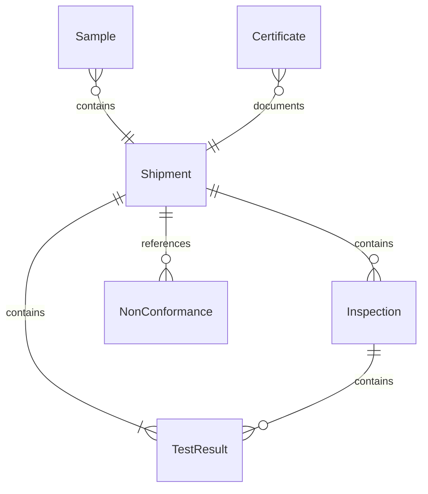
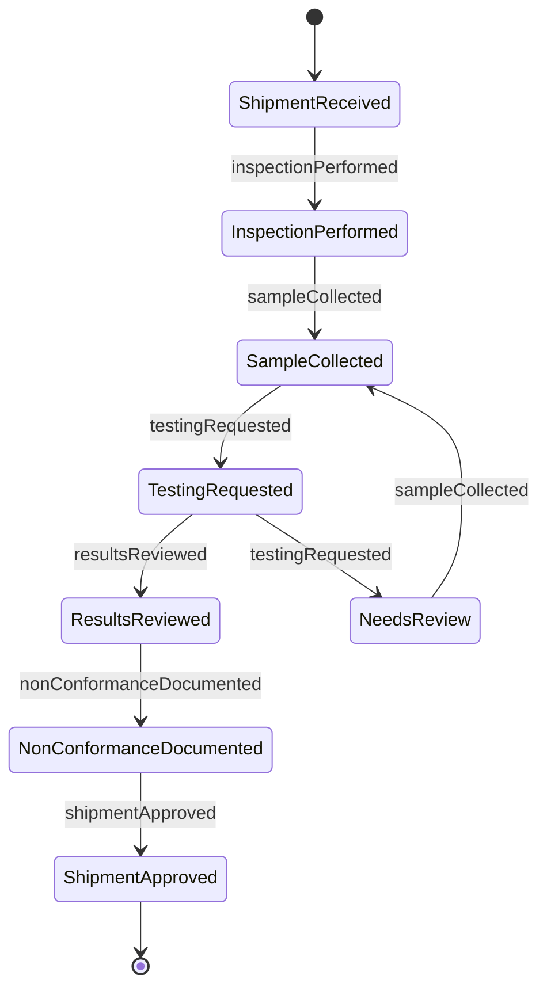
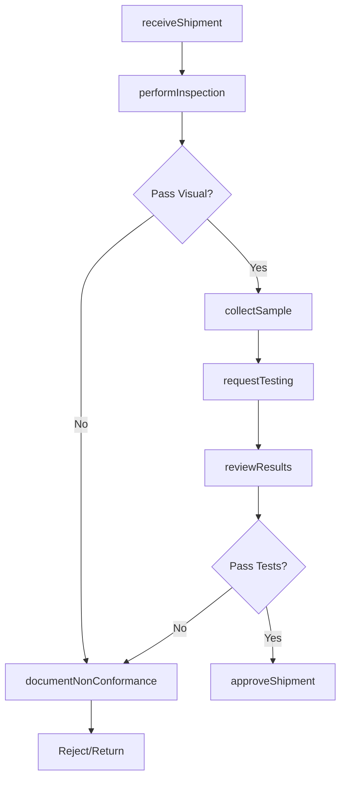
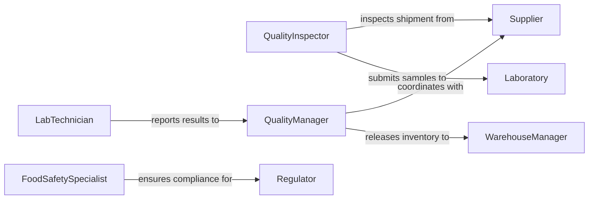

# Check Quality Foods Supplies

> Business-as-Code definition for food and supply quality control workflows. Models the complete inspection process from receiving through testing, approval, and disposition decisions.

## Overview

Food and supply quality inspection involves systematic evaluation of incoming materials against safety standards, specifications, and regulatory requirements. This definition exposes actions for conducting inspections, performing tests, documenting results, and coordinating with suppliers on quality issues.

## Actors

| Actor | Description |
|-------|-------------|
| Supplier | Provides food products and materials for inspection |
| Laboratory | Performs microbiological and chemical analysis |
| Regulator | Enforces food safety and quality standards |
| Customer | Consumes products meeting quality requirements |
| Distributor | Receives approved products for delivery |
| WarehouseManager | Stores accepted inventory under proper conditions |

## Roles

| Role | Description |
|------|-------------|
| QualityInspector | Conducts visual and sensory evaluations |
| FoodSafetySpecialist | Ensures compliance with safety regulations |
| LabTechnician | Performs chemical and microbiological testing |
| QualityManager | Reviews results and makes acceptance decisions |

## Entities

| Entity | Description |
|--------|-------------|
| Shipment | Batch of food or supplies received for inspection |
| Inspection | Systematic quality assessment of materials |
| Sample | Representative portion submitted for testing |
| TestResult | Laboratory analysis outcome |
| NonConformance | Deviation from quality specifications |
| Certificate | Documented proof of quality approval |

## Actions

| Action | Description |
|--------|-------------|
| receiveShipment | Log incoming food or supply delivery |
| performInspection | Conduct visual and sensory quality check |
| collectSample | Obtain representative portion for testing |
| requestTesting | Submit sample to laboratory for analysis |
| reviewResults | Evaluate test outcomes against specifications |
| documentNonConformance | Record quality deviations and defects |
| approveShipment | Accept materials meeting quality standards |

## Events

| Event | Description |
|-------|-------------|
| shipmentReceived | Materials have arrived for inspection |
| inspectionPerformed | Quality assessment has been completed |
| sampleCollected | Representative portion has been obtained |
| testingRequested | Laboratory analysis has been initiated |
| resultsReviewed | Test outcomes have been evaluated |
| nonConformanceDocumented | Quality deviation has been recorded |
| shipmentApproved | Materials have been accepted for use |

## Searches

| Search | Description |
|--------|-------------|
| findShipments | List deliveries by supplier, date, or status |
| getInspections | Retrieve quality assessments by result |
| getTestResults | Find laboratory analysis by parameter |
| getNonConformances | List quality deviations by severity |

## Entity Relationships



## State Diagram



## Workflow



## Actor Relationships



## Usage

### Calling Actions

```typescript
import { checkQualityFoodsSupplies } from '@headlessly/check-quality-foods-supplies'

const qualityControl = checkQualityFoodsSupplies()

// Log incoming produce shipment
const shipment = await qualityControl.receiveShipment({
  supplierId: 'SUP-3891',
  receivedDate: '2026-02-05T06:30:00Z',
  productType: 'fresh_produce',
  quantity: 500,
  units: 'kg',
  poNumber: 'PO-45789'
})

// Perform initial visual inspection
await qualityControl.performInspection({
  shipmentId: shipment.id,
  inspectionType: 'receiving',
  criteria: ['appearance', 'freshness', 'temperature', 'packaging'],
  findings: {
    appearance: 'acceptable',
    freshness: 'good',
    temperature: 4.2,
    packaging: 'intact'
  }
})

// Request microbiological testing
await qualityControl.requestTesting({
  shipmentId: shipment.id,
  testTypes: ['coliform', 'salmonella', 'listeria'],
  priority: 'routine'
})
```

### Event-Driven Automation

```typescript
// Auto-reject shipments failing visual inspection
qualityControl.inspectionPerformed(async ({ shipmentId, findings }) => {
  if (findings.temperature > 8 || findings.appearance === 'unacceptable') {
    await qualityControl.documentNonConformance({
      shipmentId,
      reason: 'failed_receiving_inspection',
      disposition: 'reject'
    })
  }
})

// Alert on positive pathogen tests
qualityControl.resultsReviewed(async ({ shipmentId, testResults }) => {
  const pathogens = testResults.filter(r => r.parameter === 'salmonella' && r.result === 'positive')
  if (pathogens.length > 0) {
    await notify({
      to: 'food_safety_team',
      priority: 'critical',
      message: `Pathogen detected in shipment ${shipmentId}`
    })
  }
})
```
