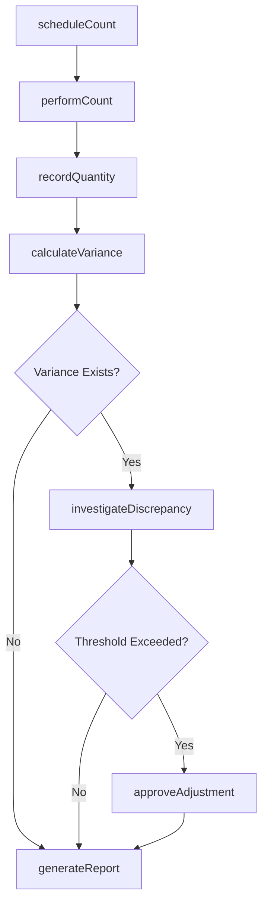
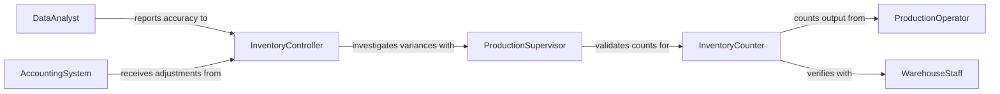

# Count Finished Products Workpieces

> Business-as-Code definition for production inventory counting and reconciliation workflows. Models the complete counting process from cycle counts through variance investigation and inventory adjustments.

## Overview

Production counting involves systematic enumeration of finished goods and work-in-process to maintain accurate inventory records and detect production discrepancies. This definition exposes actions for scheduling counts, recording quantities, investigating variances, and coordinating with warehouse and accounting systems.

## Actors

| Actor | Description |
|-------|-------------|
| ProductionOperator | Completes work orders and reports output |
| WarehouseStaff | Receives finished goods for storage |
| Auditor | Verifies inventory accuracy and controls |
| Customer | Places orders consuming finished inventory |
| ShippingCarrier | Transports finished products to customers |
| AccountingSystem | Records inventory value and cost of goods sold |

## Roles

| Role | Description |
|------|-------------|
| InventoryCounter | Performs physical count of materials |
| ProductionSupervisor | Validates count accuracy and production records |
| InventoryController | Investigates discrepancies and approves adjustments |
| DataAnalyst | Tracks count accuracy trends and cycle performance |

## Entities

| Entity | Description |
|--------|-------------|
| CountSession | Physical enumeration of specific inventory |
| CountRecord | Documented quantity for individual item |
| Variance | Difference between physical and system quantities |
| Adjustment | Authorized correction to inventory records |
| ProductionBatch | Group of items manufactured together |
| SKU | Unique identifier for product or workpiece |

## Actions

| Action | Description |
|--------|-------------|
| scheduleCount | Plan inventory enumeration for location or items |
| performCount | Execute physical counting of materials |
| recordQuantity | Document counted quantity for specific SKU |
| calculateVariance | Compare physical count to system records |
| investigateDiscrepancy | Analyze causes of inventory differences |
| approveAdjustment | Authorize correction to inventory records |
| generateReport | Create summary of count results and accuracy |

## Events

| Event | Description |
|-------|-------------|
| countScheduled | Enumeration has been planned |
| countPerformed | Physical counting has been executed |
| quantityRecorded | Counted quantity has been documented |
| varianceCalculated | Difference from system has been determined |
| discrepancyInvestigated | Variance analysis has been completed |
| adjustmentApproved | Inventory correction has been authorized |
| reportGenerated | Count summary has been created |

## Searches

| Search | Description |
|--------|-------------|
| findCountSessions | List enumerations by date, location, or status |
| getVariances | Retrieve discrepancies by magnitude or SKU |
| getAdjustments | Find authorized corrections by date or approver |
| getAccuracyMetrics | Analyze count accuracy trends over time |

## Workflow



## Actor Relationships



## Usage

### Calling Actions

```typescript
import { countFinishedProductsWorkpieces } from '@headlessly/count-finished-products-workpieces'

const counting = countFinishedProductsWorkpieces()

// Schedule end-of-shift cycle count
const session = await counting.scheduleCount({
  location: 'FINISHING_DEPT',
  countType: 'cycle',
  scheduledDate: '2026-02-05T15:00:00Z',
  items: ['SKU-1247', 'SKU-2891', 'SKU-3456']
})

// Record physical count for SKU
await counting.recordQuantity({
  sessionId: session.id,
  sku: 'SKU-1247',
  countedQuantity: 487,
  countedBy: 'CNT-042',
  location: 'RACK-A-12'
})

// Calculate variance against system records
const variance = await counting.calculateVariance({
  sessionId: session.id,
  sku: 'SKU-1247',
  systemQuantity: 502
})
```

### Event-Driven Automation

```typescript
// Auto-investigate significant variances
counting.varianceCalculated(async ({ sessionId, sku, variance }) => {
  if (Math.abs(variance.quantity) > 50 || Math.abs(variance.percentage) > 5) {
    await counting.investigateDiscrepancy({
      sessionId,
      sku,
      priority: 'high',
      assignedTo: 'inventory_controller'
    })
  }
})

// Approve adjustments within tolerance
counting.discrepancyInvestigated(async ({ sessionId, sku, variance, rootCause }) => {
  if (Math.abs(variance.quantity) <= 10 && rootCause !== 'unknown') {
    await counting.approveAdjustment({
      sessionId,
      sku,
      adjustmentQuantity: variance.quantity,
      reason: rootCause
    })
  }
})
```
