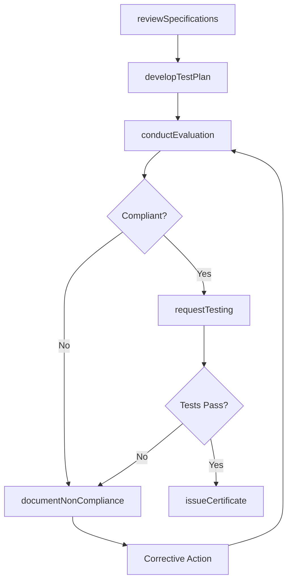
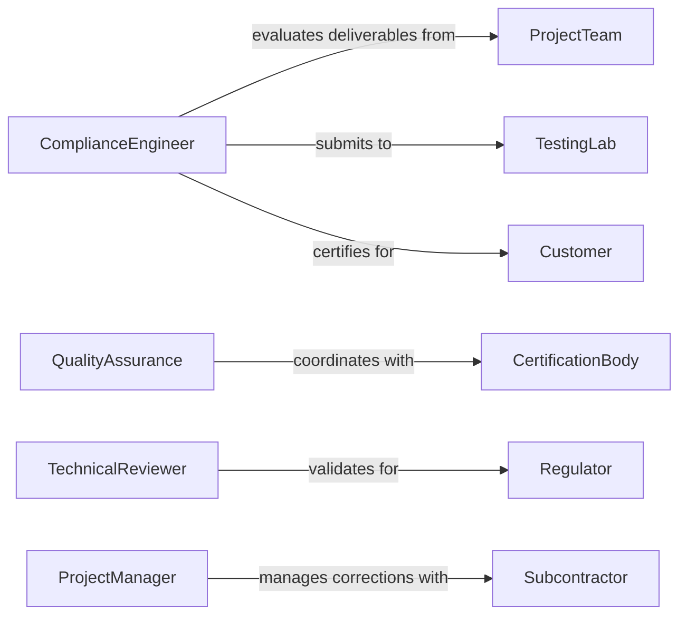

# Evaluate Projects Determine Compliance Technical

> Business-as-Code definition for technical compliance evaluation workflows. Models the complete assessment process from specification review through testing, verification, and certification.

## Overview

Technical compliance evaluation involves systematic assessment of project deliverables against engineering specifications, industry standards, and regulatory requirements. This definition exposes actions for reviewing documentation, conducting tests, documenting deviations, and coordinating with engineering teams and certification bodies.

## Actors

| Actor | Description |
|-------|-------------|
| ProjectTeam | Develops deliverables subject to compliance review |
| CertificationBody | Issues formal compliance certifications |
| Regulator | Enforces mandatory technical standards |
| Customer | Requires deliverables meeting specifications |
| TestingLab | Performs verification measurements and analysis |
| Subcontractor | Provides components requiring compliance verification |

## Roles

| Role | Description |
|------|-------------|
| ComplianceEngineer | Evaluates deliverables against technical requirements |
| QualityAssurance | Reviews test results and documentation |
| ProjectManager | Coordinates corrective actions for non-compliance |
| TechnicalReviewer | Validates engineering calculations and designs |

## Entities

| Entity | Description |
|--------|-------------|
| Project | Engineering effort subject to compliance evaluation |
| Specification | Technical requirement or standard to be met |
| Deliverable | Output requiring compliance verification |
| TestPlan | Strategy for verifying technical requirements |
| NonCompliance | Deviation from technical specifications |
| Certificate | Formal documentation of compliance achievement |

## Actions

| Action | Description |
|--------|-------------|
| reviewSpecifications | Analyze technical requirements for project |
| developTestPlan | Create strategy for compliance verification |
| conductEvaluation | Perform systematic assessment of deliverables |
| requestTesting | Submit items to laboratory for verification |
| documentNonCompliance | Record deviations from specifications |
| approveCorrections | Accept remediation for non-compliant items |
| issueCertificate | Provide formal compliance documentation |

## Events

| Event | Description |
|-------|-------------|
| specificationsReviewed | Technical requirements have been analyzed |
| testPlanDeveloped | Verification strategy has been created |
| evaluationConducted | Compliance assessment has been performed |
| testingRequested | Laboratory verification has been initiated |
| nonComplianceDocumented | Deviation has been recorded |
| correctionsApproved | Remediation has been accepted |
| certificateIssued | Formal compliance has been documented |

## Searches

| Search | Description |
|--------|-------------|
| findProjects | List efforts by status, deadline, or compliance |
| getSpecifications | Retrieve requirements by project or standard |
| getNonCompliances | Find deviations by severity or resolution status |
| getCertificates | List compliance documentation by date or scope |

## Workflow



## Actor Relationships



## Usage

### Calling Actions

```typescript
import { evaluateProjectsDetermineComplianceTechnical } from '@headlessly/evaluate-projects-determine-compliance-technical'

const compliance = evaluateProjectsDetermineComplianceTechnical()

// Review specifications for new construction project
const review = await compliance.reviewSpecifications({
  projectId: 'PROJ-8473',
  specificationDocuments: ['SPEC-001.pdf', 'SPEC-002.pdf'],
  applicableStandards: ['ASTM-A36', 'ISO-9001', 'ASME-B31.3']
})

// Develop comprehensive test plan
await compliance.developTestPlan({
  projectId: 'PROJ-8473',
  testTypes: ['dimensional', 'material_composition', 'pressure_test'],
  samplingStrategy: 'statistical',
  acceptanceCriteria: 'zero_defects'
})

// Conduct compliance evaluation
const evaluation = await compliance.conductEvaluation({
  projectId: 'PROJ-8473',
  deliverables: ['WELD-001', 'WELD-002', 'PIPE-001'],
  evaluationDate: '2026-02-10'
})
```

### Event-Driven Automation

```typescript
// Auto-document non-compliance findings
compliance.evaluationConducted(async ({ projectId, deliverables, findings }) => {
  const failures = findings.filter(f => f.status === 'non_compliant')
  for (const failure of failures) {
    await compliance.documentNonCompliance({
      projectId,
      deliverable: failure.deliverable,
      specification: failure.specification,
      deviation: failure.description
    })
  }
})

// Issue certificate upon full compliance
compliance.testingRequested(async ({ projectId, testResults }) => {
  const allPassed = testResults.every(r => r.result === 'pass')
  if (allPassed) {
    await compliance.issueCertificate({
      projectId,
      certificateType: 'technical_compliance',
      issuedBy: 'compliance_engineering'
    })
  }
})
```
