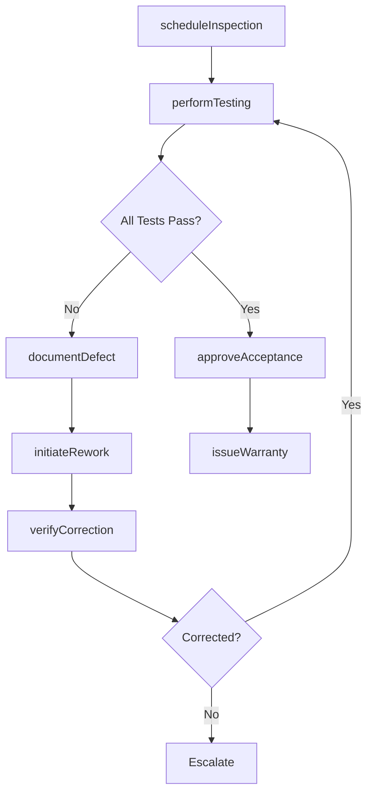
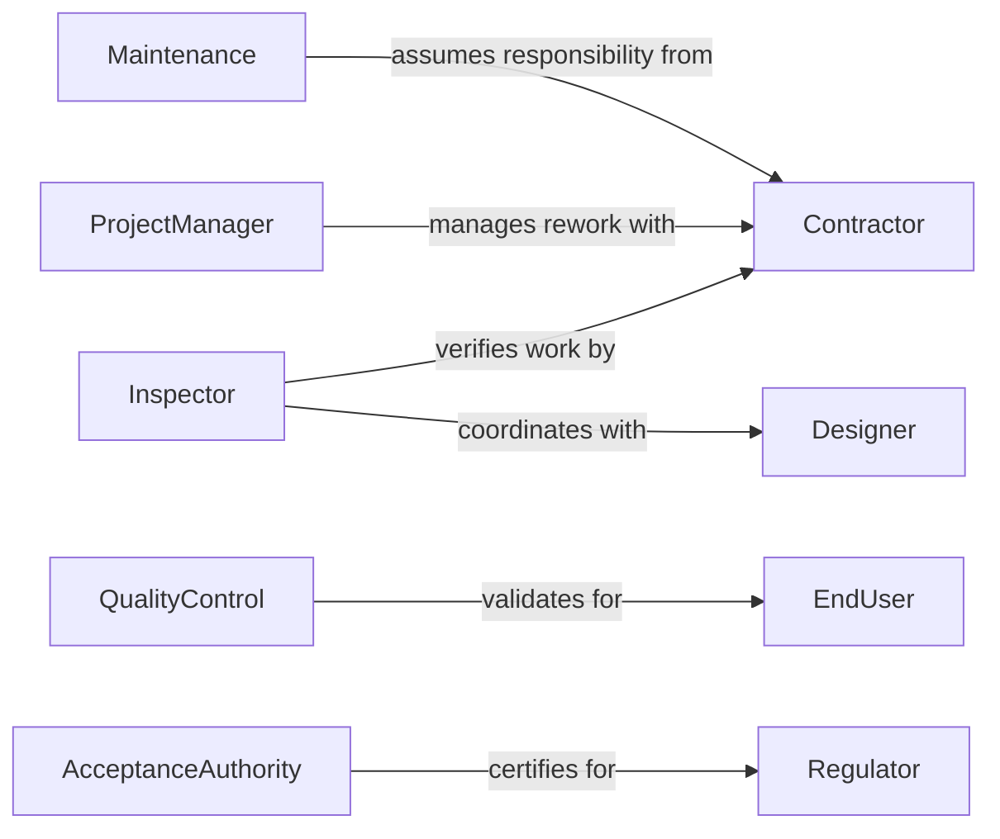

# Inspect Completed Work Ensure Proper

> Business-as-Code definition for functional verification and acceptance testing workflows. Models the complete inspection process from initial review through testing, defect remediation, and final acceptance.

## Overview

Completed work inspection involves systematic verification that deliverables function correctly according to design specifications and performance requirements. This definition exposes actions for conducting functional tests, documenting defects, coordinating rework, and authorizing acceptance of completed work.

## Actors

| Actor | Description |
|-------|-------------|
| Contractor | Completes work requiring functional verification |
| EndUser | Will operate system after acceptance |
| Designer | Provides specifications and acceptance criteria |
| Warranty | Covers defects discovered during inspection |
| Maintenance | Assumes responsibility after acceptance |
| Regulator | Verifies compliance with safety requirements |

## Roles

| Role | Description |
|------|-------------|
| Inspector | Conducts functional verification testing |
| QualityControl | Reviews test results and acceptance criteria |
| ProjectManager | Coordinates defect remediation activities |
| AcceptanceAuthority | Approves work for operational handover |

## Entities

| Entity | Description |
|--------|-------------|
| WorkOrder | Job or project subject to inspection |
| TestCase | Specific functional verification scenario |
| Defect | Malfunction or deviation from requirements |
| ReworkRequest | Authorization to correct defective work |
| AcceptanceReport | Documentation of inspection outcomes |
| Warranty | Guarantee period for post-acceptance defects |

## Actions

| Action | Description |
|--------|-------------|
| scheduleInspection | Plan functional verification testing |
| performTesting | Execute test cases to verify operation |
| documentDefect | Record malfunction or deviation |
| initiateRework | Authorize correction of defective work |
| verifyCorrection | Confirm defect has been remediated |
| approveAcceptance | Authorize operational handover |
| issueWarranty | Activate guarantee period for work |

## Events

| Event | Description |
|-------|-------------|
| inspectionScheduled | Verification testing has been planned |
| testingPerformed | Functional verification has been executed |
| defectDocumented | Malfunction has been recorded |
| reworkInitiated | Correction authorization has been issued |
| correctionVerified | Defect remediation has been confirmed |
| acceptanceApproved | Operational handover has been authorized |
| warrantyIssued | Guarantee period has been activated |

## Searches

| Search | Description |
|--------|-------------|
| findInspections | List verifications by date, contractor, or status |
| getDefects | Retrieve malfunctions by severity or remediation |
| getReworkRequests | Find correction authorizations by status |
| getAcceptanceReports | List inspection outcomes by approver |

## Workflow



## Actor Relationships



## Usage

### Calling Actions

```typescript
import { inspectCompletedWorkEnsureProper } from '@headlessly/inspect-completed-work-ensure-proper'

const inspection = inspectCompletedWorkEnsureProper()

// Schedule final inspection for HVAC installation
const scheduled = await inspection.scheduleInspection({
  workOrderId: 'WO-3847',
  inspectionType: 'final_functional',
  scheduledDate: '2026-02-12T10:00:00Z',
  testCases: ['temperature_control', 'airflow_distribution', 'safety_shutoff']
})

// Perform functional testing
const results = await inspection.performTesting({
  inspectionId: scheduled.id,
  testCase: 'temperature_control',
  parameters: { setpoint: 72, tolerance: 2 },
  duration: '30_minutes'
})

// Document defect if test fails
if (!results.passed) {
  await inspection.documentDefect({
    inspectionId: scheduled.id,
    testCase: 'temperature_control',
    description: 'Temperature fluctuates 5 degrees beyond tolerance',
    severity: 'major'
  })
}
```

### Event-Driven Automation

```typescript
// Auto-initiate rework for major defects
inspection.defectDocumented(async ({ inspectionId, defect }) => {
  if (defect.severity === 'major' || defect.severity === 'critical') {
    await inspection.initiateRework({
      inspectionId,
      defectId: defect.id,
      priority: 'urgent',
      requiredCompletion: '48_hours'
    })
  }
})

// Approve acceptance when all tests pass
inspection.correctionVerified(async ({ inspectionId, defects }) => {
  const openDefects = defects.filter(d => d.status !== 'corrected')
  if (openDefects.length === 0) {
    await inspection.approveAcceptance({
      inspectionId,
      approvedBy: 'quality_control',
      approvalDate: new Date().toISOString()
    })
  }
})
```
