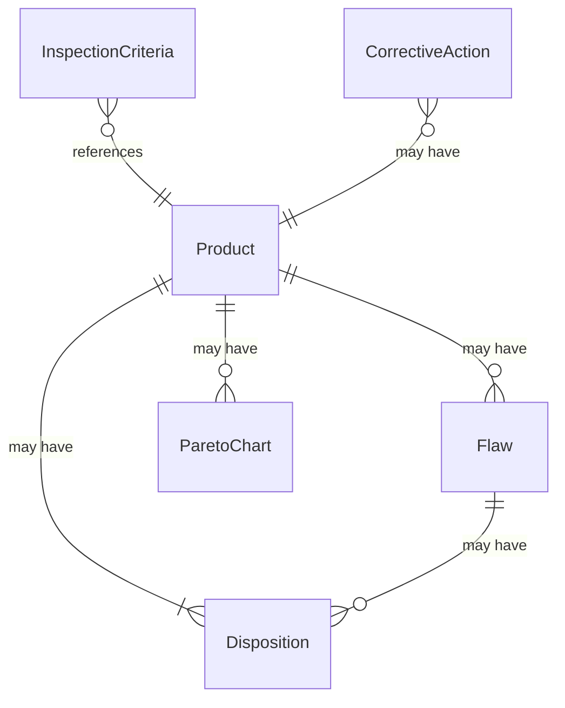
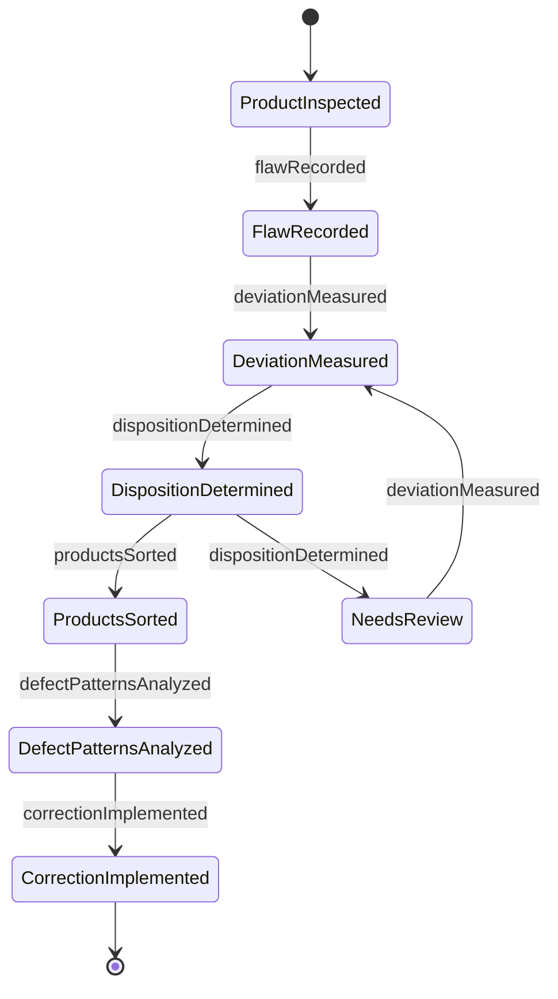
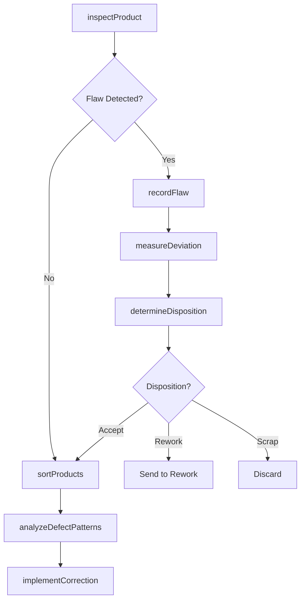
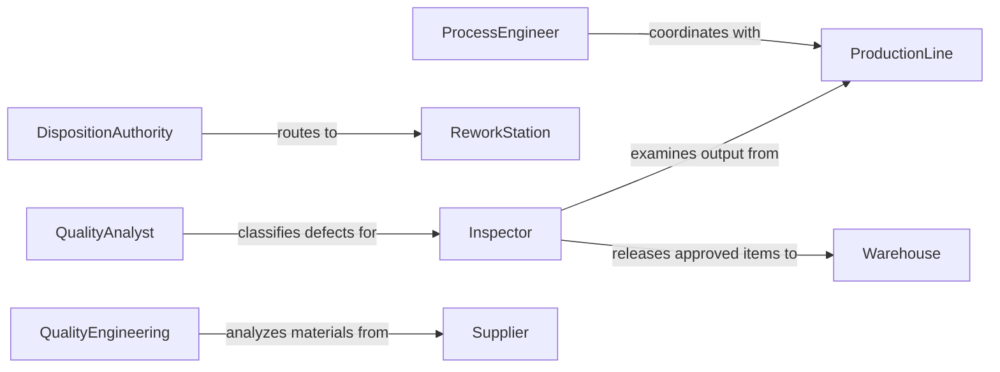

# Inspect Finished Products Locate Flaws

> Business-as-Code definition for defect detection and quality sorting workflows. Models the complete inspection process from visual examination through measurement, classification, and disposition decisions.

## Overview

Finished product inspection involves systematic examination to identify cosmetic defects, dimensional deviations, and functional flaws. This definition exposes actions for conducting inspections, classifying defects, determining disposition, and coordinating with production teams on quality improvement initiatives.

## Actors

| Actor | Description |
|-------|-------------|
| ProductionLine | Manufactures products subject to inspection |
| Customer | Receives products meeting quality standards |
| ReworkStation | Corrects repairable defects |
| Warehouse | Stores approved finished goods |
| QualityEngineering | Analyzes defect patterns for root cause |
| Supplier | Provides materials contributing to defects |

## Roles

| Role | Description |
|------|-------------|
| Inspector | Examines products and identifies flaws |
| QualityAnalyst | Classifies defects and determines severity |
| DispositionAuthority | Decides fate of defective products |
| ProcessEngineer | Implements corrective actions for defects |

## Entities

| Entity | Description |
|--------|-------------|
| Product | Finished item subject to inspection |
| Flaw | Specific defect or deviation from standard |
| InspectionCriteria | Acceptance standards and tolerances |
| Disposition | Decision on defective product handling |
| ParetoChart | Analysis of defect frequency and impact |
| CorrectiveAction | Process change to eliminate defect source |

## Actions

| Action | Description |
|--------|-------------|
| inspectProduct | Examine finished item for defects |
| recordFlaw | Document specific defect with classification |
| measureDeviation | Quantify dimensional or functional variance |
| determineDisposition | Decide handling for defective products |
| sortProducts | Separate items by quality grade |
| analyzeDefectPatterns | Identify common flaw types and root causes |
| implementCorrection | Execute process changes to reduce defects |

## Events

| Event | Description |
|-------|-------------|
| productInspected | Finished item has been examined |
| flawRecorded | Specific defect has been documented |
| deviationMeasured | Variance has been quantified |
| dispositionDetermined | Handling decision has been made |
| productsSorted | Items have been separated by quality |
| defectPatternsAnalyzed | Common flaws have been identified |
| correctionImplemented | Process change has been executed |

## Searches

| Search | Description |
|--------|-------------|
| findProducts | List items by inspection status or grade |
| getFlaws | Retrieve defects by type, severity, or frequency |
| getDispositions | Find handling decisions by outcome |
| getCorrectiveActions | List process improvements by effectiveness |

## Entity Relationships



## State Diagram



## Workflow



## Actor Relationships



## Usage

### Calling Actions

```typescript
import { inspectFinishedProductsLocateFlaws } from '@headlessly/inspect-finished-products-locate-flaws'

const inspection = inspectFinishedProductsLocateFlaws()

// Inspect finished electronic assembly
const result = await inspection.inspectProduct({
  productId: 'PROD-48291',
  serialNumber: 'SN-20260205-0482',
  inspectionType: 'final',
  criteria: ['visual', 'functional', 'dimensional']
})

// Record cosmetic flaw
await inspection.recordFlaw({
  productId: 'PROD-48291',
  flawType: 'scratch',
  location: 'front_panel',
  severity: 'minor',
  dimensions: { length: 5, width: 0.5, units: 'mm' },
  photoEvidence: 'IMG_7821.jpg'
})

// Determine disposition based on defect severity
const disposition = await inspection.determineDisposition({
  productId: 'PROD-48291',
  flaws: [{ type: 'scratch', severity: 'minor' }],
  customerRequirements: 'cosmetic_grade_b'
})
```

### Event-Driven Automation

```typescript
// Auto-sort products by disposition
inspection.dispositionDetermined(async ({ productId, disposition }) => {
  await inspection.sortProducts({
    productId,
    grade: disposition.grade,
    destination: disposition.routing
  })
})

// Trigger analysis when defect rate exceeds threshold
inspection.flawRecorded(async ({ flawType, productLine }) => {
  const rate = await getDefectRate(productLine, flawType)
  if (rate > 0.05) {
    await inspection.analyzeDefectPatterns({
      productLine,
      flawType,
      period: 'last_24_hours',
      priority: 'high'
    })
  }
})
```
