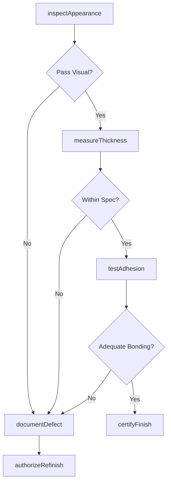
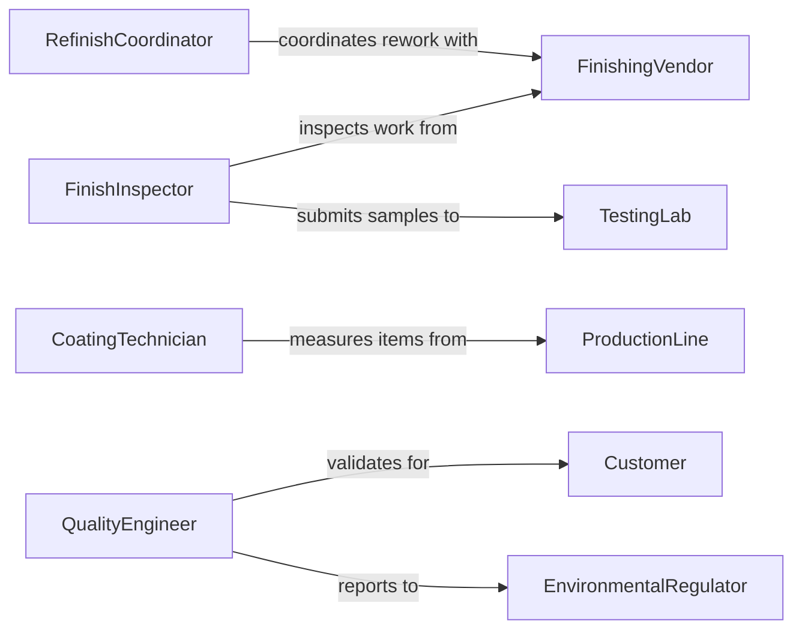

# Inspect Finishes Workpieces Finished Products

> Business-as-Code definition for surface finish quality inspection workflows. Models the complete assessment process from appearance evaluation through adhesion testing, thickness measurement, and certification.

## Overview

Surface finish inspection involves systematic evaluation of coatings, plating, painting, and other surface treatments for appearance, adhesion, thickness, and durability. This definition exposes actions for conducting inspections, measuring finish properties, documenting defects, and coordinating refinishing activities with coating vendors and production teams.

## Actors

| Actor | Description |
|-------|-------------|
| FinishingVendor | Applies coatings, plating, or surface treatments |
| Customer | Requires products meeting appearance standards |
| ProductionLine | Manufactures items requiring surface finishing |
| TestingLab | Performs adhesion and durability analysis |
| EnvironmentalRegulator | Enforces coating material regulations |
| Warehouse | Stores items with approved finishes |

## Roles

| Role | Description |
|------|-------------|
| FinishInspector | Evaluates surface appearance and quality |
| CoatingTechnician | Measures film thickness and properties |
| QualityEngineer | Determines acceptance or rejection criteria |
| RefinishCoordinator | Manages rework for defective finishes |

## Entities

| Entity | Description |
|--------|-------------|
| Workpiece | Item with surface finish requiring inspection |
| Finish | Coating, plating, or surface treatment applied |
| Defect | Flaw in surface appearance or properties |
| Measurement | Quantitative finish thickness or adhesion data |
| RefinishOrder | Authorization to strip and recoat item |
| Certificate | Documentation of finish quality approval |

## Actions

| Action | Description |
|--------|-------------|
| inspectAppearance | Evaluate visual quality of surface finish |
| measureThickness | Quantify coating film thickness |
| testAdhesion | Verify finish bonding to substrate |
| assessDurability | Evaluate resistance to environmental factors |
| documentDefect | Record finish flaws requiring correction |
| authorizeRefinish | Approve stripping and recoating |
| certifyFinish | Issue documentation of quality approval |

## Events

| Event | Description |
|-------|-------------|
| appearanceInspected | Visual evaluation has been completed |
| thicknessMeasured | Film thickness data has been captured |
| adhesionTested | Bonding strength has been verified |
| durabilityAssessed | Environmental resistance has been evaluated |
| defectDocumented | Finish flaw has been recorded |
| refinishAuthorized | Rework has been approved |
| finishCertified | Quality approval has been issued |

## Searches

| Search | Description |
|--------|-------------|
| findWorkpieces | List items by finish type, status, or inspector |
| getDefects | Retrieve finish flaws by type or severity |
| getMeasurements | Find thickness or adhesion data by location |
| getRefinishOrders | List rework authorizations by date or vendor |

## Workflow



## Actor Relationships



## Usage

### Calling Actions

```typescript
import { inspectFinishesWorkpiecesFinishedProducts } from '@headlessly/inspect-finishes-workpieces-finished-products'

const finishInspection = inspectFinishesWorkpiecesFinishedProducts()

// Inspect powder coat finish on metal cabinet
const inspection = await finishInspection.inspectAppearance({
  workpieceId: 'WP-5824',
  finishType: 'powder_coat',
  color: 'RAL-9006',
  gloss: 'semi_gloss',
  criteria: ['color_match', 'surface_smoothness', 'coverage']
})

// Measure coating thickness
const thickness = await finishInspection.measureThickness({
  workpieceId: 'WP-5824',
  locations: ['top', 'front', 'side', 'back'],
  device: 'magnetic_gauge',
  specification: { min: 50, max: 100, units: 'microns' }
})

// Test adhesion using cross-hatch method
const adhesion = await finishInspection.testAdhesion({
  workpieceId: 'WP-5824',
  method: 'cross_hatch',
  standard: 'ASTM-D3359',
  acceptanceCriteria: '5B_rating'
})
```

### Event-Driven Automation

```typescript
// Auto-document defects for out-of-spec measurements
finishInspection.thicknessMeasured(async ({ workpieceId, measurements, specification }) => {
  const outOfSpec = measurements.filter(m => m.value < specification.min || m.value > specification.max)
  if (outOfSpec.length > 0) {
    await finishInspection.documentDefect({
      workpieceId,
      defectType: 'thickness_deviation',
      locations: outOfSpec.map(m => m.location),
      severity: 'major'
    })
  }
})

// Authorize refinish for adhesion failures
finishInspection.adhesionTested(async ({ workpieceId, rating, acceptanceCriteria }) => {
  if (rating < acceptanceCriteria) {
    await finishInspection.authorizeRefinish({
      workpieceId,
      reason: 'adhesion_failure',
      process: 'strip_and_recoat',
      priority: 'urgent'
    })
  }
})
```
