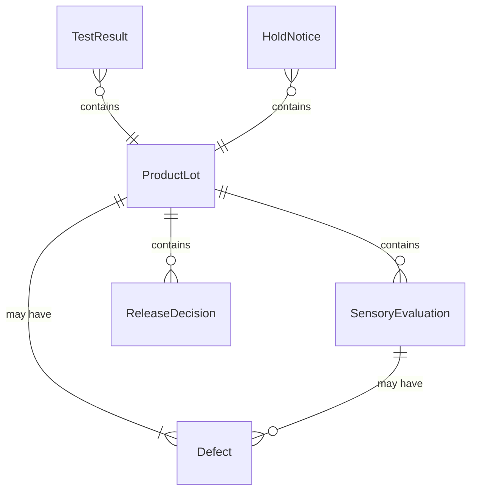
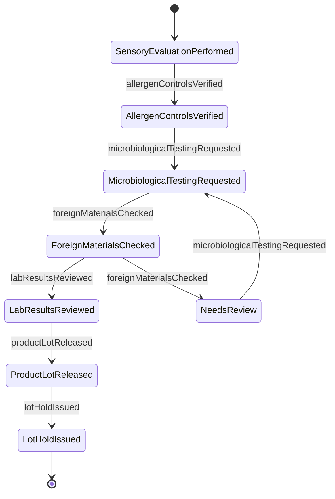
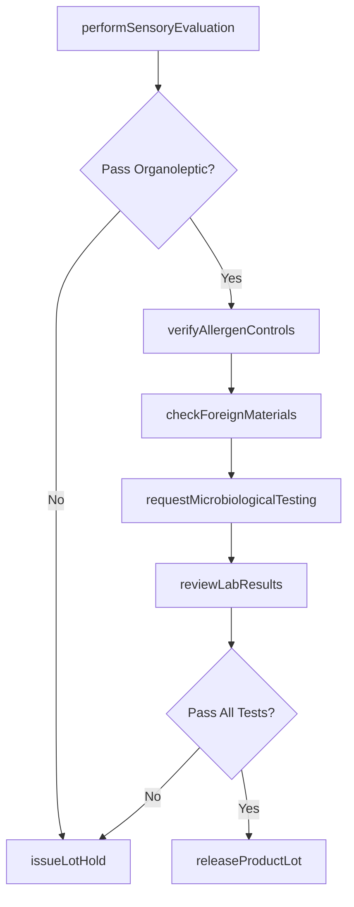
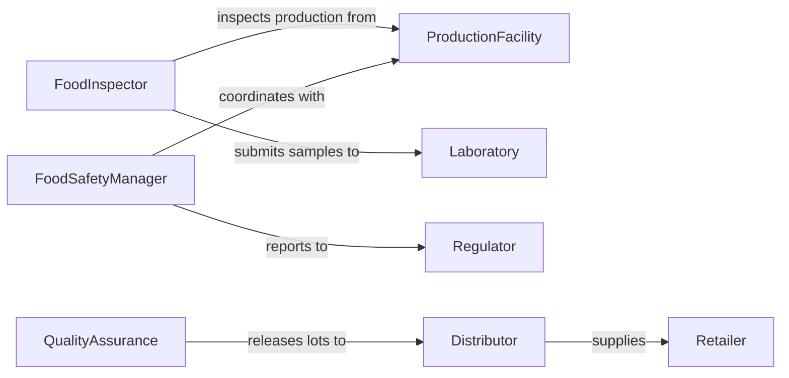

# Inspect Food Products

> Business-as-Code definition for food safety and quality inspection workflows. Models the complete inspection process from sensory evaluation through microbiological testing, allergen verification, and lot release.

## Overview

Food product inspection involves systematic evaluation of safety, quality, and compliance with regulations and specifications. This definition exposes actions for conducting organoleptic assessments, laboratory testing, allergen controls, and coordinating with production teams, regulators, and customers on food safety matters.

## Actors

| Actor | Description |
|-------|-------------|
| ProductionFacility | Manufactures food products requiring inspection |
| Consumer | Purchases products meeting safety standards |
| Regulator | Enforces food safety and labeling requirements |
| Laboratory | Performs microbiological and chemical analysis |
| Distributor | Receives released lots for market delivery |
| Retailer | Sells approved products to end consumers |

## Roles

| Role | Description |
|------|-------------|
| FoodInspector | Conducts sensory and visual evaluations |
| QualityAssurance | Reviews test results and release criteria |
| FoodSafetyManager | Ensures compliance with HACCP and regulations |
| LabTechnician | Performs microbiological and analytical testing |

## Entities

| Entity | Description |
|--------|-------------|
| ProductLot | Batch of food product subject to inspection |
| SensoryEvaluation | Organoleptic assessment of quality attributes |
| TestResult | Laboratory analysis for safety or composition |
| Defect | Quality issue or contamination requiring action |
| ReleaseDecision | Authorization to distribute product lot |
| HoldNotice | Quarantine of lot pending investigation |

## Actions

| Action | Description |
|--------|-------------|
| performSensoryEvaluation | Assess appearance, aroma, taste, texture |
| verifyAllergenControls | Confirm allergen labeling and prevention measures |
| requestMicrobiologicalTesting | Submit samples for pathogen analysis |
| checkForeignMaterials | Inspect for physical contamination |
| reviewLabResults | Evaluate test outcomes against specifications |
| releaseProductLot | Authorize distribution of approved batch |
| issueLotHold | Quarantine batch pending investigation |

## Events

| Event | Description |
|-------|-------------|
| sensoryEvaluationPerformed | Organoleptic assessment has been completed |
| allergenControlsVerified | Allergen measures have been confirmed |
| microbiologicalTestingRequested | Pathogen analysis has been initiated |
| foreignMaterialsChecked | Physical contamination inspection completed |
| labResultsReviewed | Test outcomes have been evaluated |
| productLotReleased | Distribution has been authorized |
| lotHoldIssued | Quarantine has been implemented |

## Searches

| Search | Description |
|--------|-------------|
| findProductLots | List batches by date, status, or facility |
| getSensoryEvaluations | Retrieve assessments by product or attribute |
| getTestResults | Find laboratory data by test type or outcome |
| getHoldNotices | List quarantined lots by reason or duration |

## Entity Relationships



## State Diagram



## Workflow



## Actor Relationships



## Usage

### Calling Actions

```typescript
import { inspectFoodProducts } from '@headlessly/inspect-food-products'

const foodInspection = inspectFoodProducts()

// Perform sensory evaluation on packaged bread
const sensory = await foodInspection.performSensoryEvaluation({
  lotNumber: 'LOT-20260205-B001',
  productType: 'white_bread',
  attributes: ['appearance', 'aroma', 'texture', 'taste'],
  panel: ['inspector_1', 'inspector_2', 'inspector_3'],
  results: {
    appearance: 'acceptable',
    aroma: 'fresh',
    texture: 'soft',
    taste: 'normal'
  }
})

// Verify allergen controls
await foodInspection.verifyAllergenControls({
  lotNumber: 'LOT-20260205-B001',
  declaredAllergens: ['wheat', 'soy'],
  cleaningSOP: 'SOP-ALL-001',
  lineChangeoverVerified: true,
  labelingVerified: true
})

// Request pathogen testing
await foodInspection.requestMicrobiologicalTesting({
  lotNumber: 'LOT-20260205-B001',
  testTypes: ['aerobic_plate_count', 'coliform', 'yeast_mold'],
  priority: 'routine'
})
```

### Event-Driven Automation

```typescript
// Auto-hold lot on positive pathogen result
foodInspection.labResultsReviewed(async ({ lotNumber, testResults }) => {
  const pathogens = testResults.filter(r => r.testType === 'pathogen' && r.result === 'positive')
  if (pathogens.length > 0) {
    await foodInspection.issueLotHold({
      lotNumber,
      reason: 'pathogen_detected',
      notifyFDA: true,
      quarantineLocation: 'HOLD_AREA'
    })
  }
})

// Release lot when all tests pass
foodInspection.labResultsReviewed(async ({ lotNumber, testResults }) => {
  const allPassed = testResults.every(r => r.status === 'pass')
  if (allPassed) {
    await foodInspection.releaseProductLot({
      lotNumber,
      releaseDate: new Date().toISOString(),
      approvedBy: 'quality_assurance'
    })
  }
})
```
