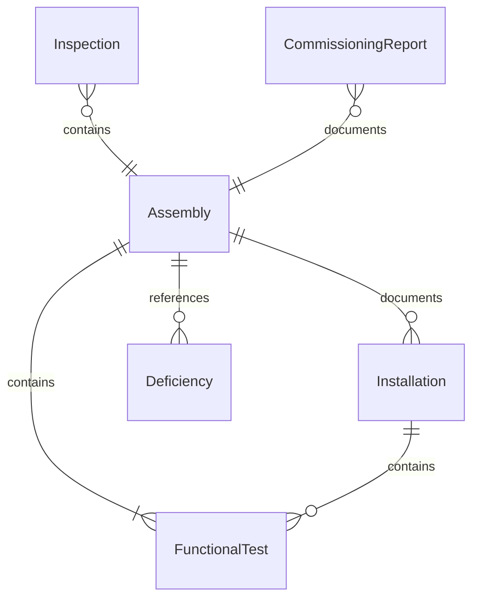
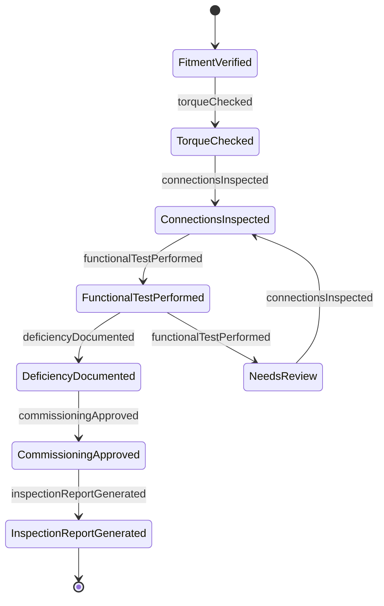
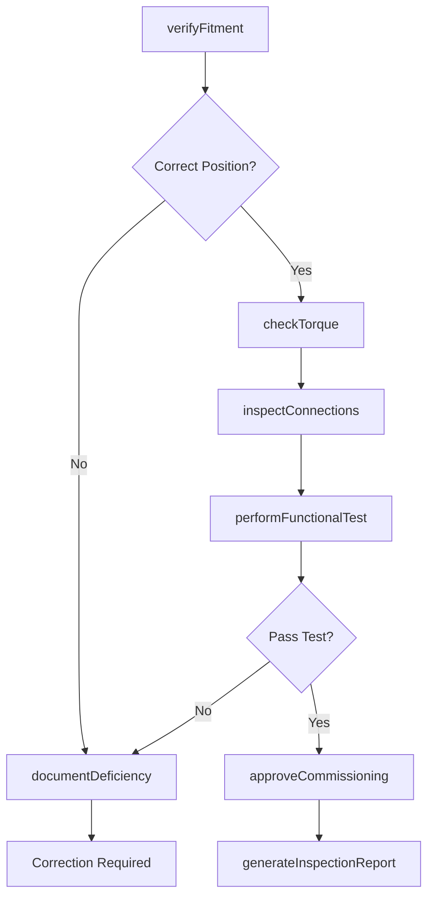
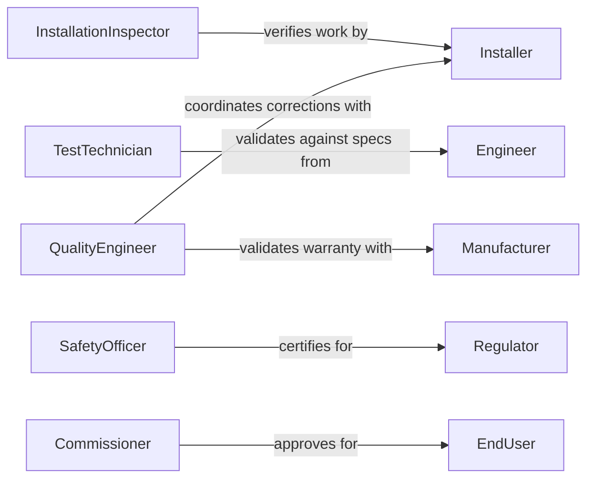

# Inspect Installed Components Assemblies

> Business-as-Code definition for post-installation verification workflows. Models the complete inspection process from fitment checks through functional testing, torque verification, and commissioning approval.

## Overview

Installed component inspection involves systematic verification that assemblies have been correctly positioned, secured, connected, and tested per installation specifications. This definition exposes actions for conducting inspections, verifying torque and alignment, testing functionality, and coordinating with installation teams and commissioning authorities.

## Actors

| Actor | Description |
|-------|-------------|
| Installer | Assembles and installs components requiring verification |
| EndUser | Will operate system after commissioning |
| Engineer | Designed system and specified installation requirements |
| Manufacturer | Provides warranty covering installation defects |
| Commissioner | Authorizes system for operational use |
| Regulator | Verifies compliance with safety codes |

## Roles

| Role | Description |
|------|-------------|
| InstallationInspector | Verifies correct assembly and positioning |
| TestTechnician | Performs functional verification testing |
| QualityEngineer | Reviews inspection results and acceptance |
| SafetyOfficer | Ensures compliance with safety requirements |

## Entities

| Entity | Description |
|--------|-------------|
| Assembly | Installed component group requiring inspection |
| Installation | Record of component placement and connection |
| Inspection | Systematic verification of installation quality |
| FunctionalTest | Verification of operational performance |
| Deficiency | Installation error or deviation from specifications |
| CommissioningReport | Documentation of installation acceptance |

## Actions

| Action | Description |
|--------|-------------|
| verifyFitment | Confirm proper positioning and alignment |
| checkTorque | Verify fastener tightness per specifications |
| inspectConnections | Validate electrical, mechanical, or fluid connections |
| performFunctionalTest | Execute operational verification |
| documentDeficiency | Record installation errors requiring correction |
| approveCommissioning | Authorize system for operational use |
| generateInspectionReport | Create documentation of verification results |

## Events

| Event | Description |
|-------|-------------|
| fitmentVerified | Positioning and alignment have been confirmed |
| torqueChecked | Fastener tightness has been verified |
| connectionsInspected | Connections have been validated |
| functionalTestPerformed | Operational verification has been executed |
| deficiencyDocumented | Installation error has been recorded |
| commissioningApproved | System has been authorized for operation |
| inspectionReportGenerated | Verification documentation has been created |

## Searches

| Search | Description |
|--------|-------------|
| findAssemblies | List installations by date, location, or status |
| getInspections | Retrieve verifications by inspector or result |
| getDeficiencies | Find installation errors by severity or status |
| getCommissioningReports | List acceptance documentation by approver |

## Entity Relationships



## State Diagram



## Workflow



## Actor Relationships



## Usage

### Calling Actions

```typescript
import { inspectInstalledComponentsAssemblies } from '@headlessly/inspect-installed-components-assemblies'

const installation = inspectInstalledComponentsAssemblies()

// Verify motor alignment and fitment
const fitment = await installation.verifyFitment({
  assemblyId: 'MOTOR-ASM-472',
  location: 'PUMP_STATION_3',
  criteria: ['alignment', 'level', 'clearance'],
  measurements: {
    alignment: { angular: 0.002, parallel: 0.001 },
    level: 0.0005,
    clearance: 50
  },
  specifications: {
    alignment: { angular: 0.003, parallel: 0.002 },
    level: 0.001,
    clearance: 25
  }
})

// Check bolt torque on mounting flange
await installation.checkTorque({
  assemblyId: 'MOTOR-ASM-472',
  fasteners: [
    { location: 'bolt_1', specification: 85, measured: 87, units: 'ft-lbs' },
    { location: 'bolt_2', specification: 85, measured: 84, units: 'ft-lbs' }
  ],
  tolerance: 5
})

// Perform motor functional test
const test = await installation.performFunctionalTest({
  assemblyId: 'MOTOR-ASM-472',
  testProcedure: 'TP-MOTOR-001',
  parameters: {
    voltage: 480,
    current: 125,
    speed: 1750,
    vibration: 0.15
  }
})
```

### Event-Driven Automation

```typescript
// Auto-document deficiencies for failed checks
installation.torqueChecked(async ({ assemblyId, fasteners }) => {
  const outOfSpec = fasteners.filter(f => Math.abs(f.measured - f.specification) > f.tolerance)
  if (outOfSpec.length > 0) {
    await installation.documentDeficiency({
      assemblyId,
      deficiencyType: 'torque_deviation',
      locations: outOfSpec.map(f => f.location),
      severity: 'major'
    })
  }
})

// Approve commissioning when all tests pass
installation.functionalTestPerformed(async ({ assemblyId, testResults }) => {
  const allPassed = testResults.every(r => r.status === 'pass')
  const noDeficiencies = await checkDeficiencies(assemblyId)
  if (allPassed && noDeficiencies) {
    await installation.approveCommissioning({
      assemblyId,
      approvedBy: 'commissioning_authority',
      approvalDate: new Date().toISOString()
    })
  }
})
```
