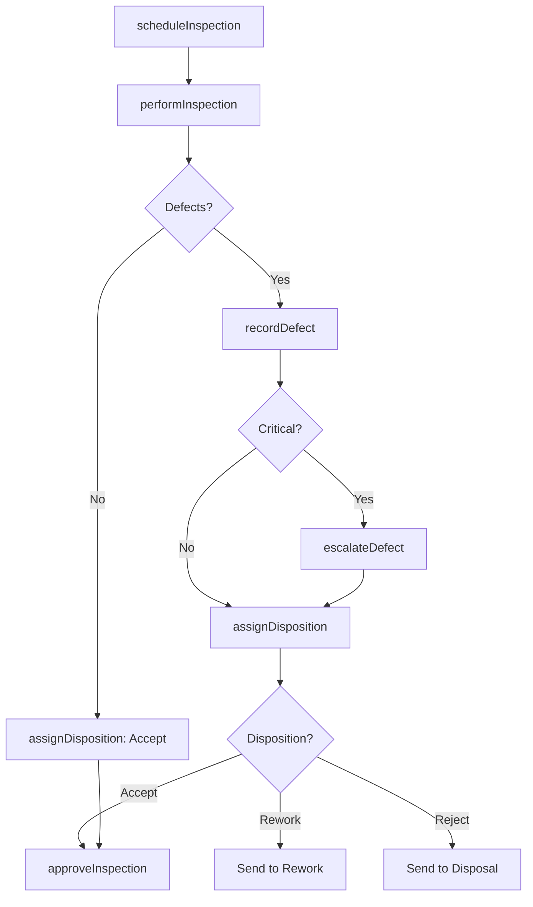
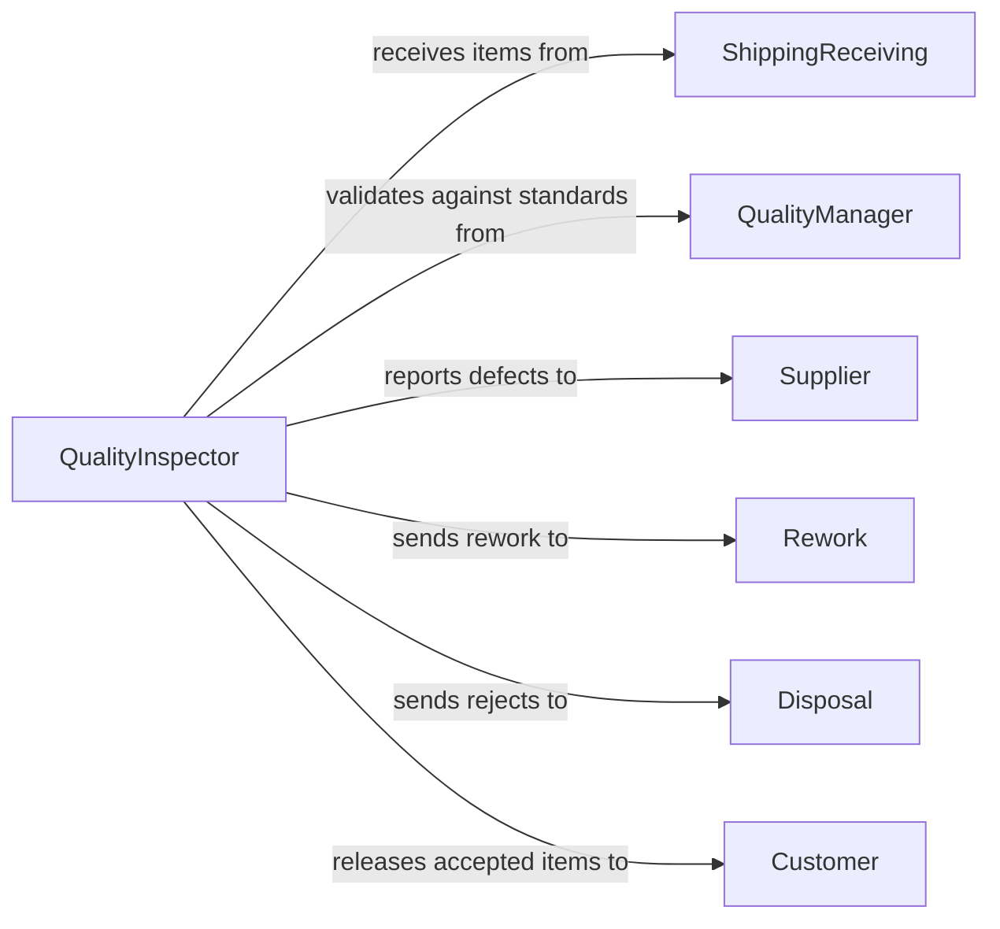

# Inspect Items Damage Defects

> Business-as-Code definition for inspecting items to identify damage or defects during quality control. Models the complete inspection lifecycle from item receipt through defect documentation and disposition.

## Overview

Item damage and defect inspection identifies quality issues in manufactured goods, components, or materials. This definition provides actions for visual inspection, defect classification, and disposition decisions, with events for automated defect tracking and compliance reporting.

## Actors

| Actor | Description |
|-------|-------------|
| Supplier | Provides materials or components for inspection |
| Customer | Receives inspected items and defect notifications |
| QualityManager | Oversees inspection standards and procedures |
| Rework | Repairs items with correctable defects |
| Disposal | Handles items that fail inspection criteria |
| ShippingReceiving | Manages incoming and outgoing material flow |

## Roles

| Role | Description |
|------|-------------|
| QualityInspector | Performs visual and physical inspections |
| InspectionSupervisor | Validates complex defect classifications |
| WarehouseOperator | Segregates items by inspection status |
| DataEntry | Records inspection results in tracking system |

## Entities

| Entity | Description |
|--------|-------------|
| InspectionLot | A batch of items scheduled for inspection |
| InspectionResult | Documentation of findings for a specific item |
| Defect | A recorded quality issue with classification |
| AcceptanceCriteria | Standards defining pass or fail thresholds |
| DispositionCode | The decision on how to handle defective items |
| DefectReport | Summary of defects found during a period |

## Actions

| Action | Description |
|--------|-------------|
| scheduleInspection | Create an inspection lot for incoming items |
| performInspection | Execute visual and physical examination |
| recordDefect | Document a specific defect with classification |
| assignDisposition | Determine accept, rework, or reject status |
| approveInspection | Validate inspection results and release items |
| generateReport | Create defect summary for period or supplier |
| escalateDefect | Notify supervisor of critical quality issues |

## Events

| Event | Description |
|-------|-------------|
| inspectionScheduled | An inspection lot has been created |
| inspectionPerformed | Visual examination has been completed |
| defectRecorded | A quality issue has been documented |
| dispositionAssigned | Item has been marked for accept, rework, or reject |
| inspectionApproved | Results have been validated and items released |
| reportGenerated | Defect summary has been created |
| defectEscalated | Critical issue has been flagged for review |

## Searches

| Search | Description |
|--------|-------------|
| findInspectionLots | List lots by status, date, or supplier |
| getDefects | Retrieve defects by type, severity, or item |
| getDispositions | Find items by accept, rework, or reject status |
| getDefectTrends | Analyze defect patterns over time or by supplier |

## Workflow



## Actor Relationships



## Usage

### Calling Actions

```typescript
import { inspectItemsDamageDefects } from '@headlessly/inspect-items-damage-defects'

const inspection = inspectItemsDamageDefects()

// Schedule inspection for incoming shipment
const lot = await inspection.scheduleInspection({
  poNumber: 'PO-2026-4521',
  supplier: 'Acme Manufacturing',
  itemCount: 500,
  expectedDate: '2026-02-10'
})

// Perform inspection and record findings
await inspection.performInspection({
  lotId: lot.id,
  inspector: 'J.Smith',
  sampleSize: 50
})

// Record identified defects
await inspection.recordDefect({
  lotId: lot.id,
  itemId: 'ITM-12345',
  defectType: 'Surface Scratch',
  severity: 'Minor',
  location: 'Front Panel',
  description: '3cm scratch on protective coating'
})

// Assign disposition based on criteria
await inspection.assignDisposition({
  lotId: lot.id,
  itemId: 'ITM-12345',
  disposition: 'Rework',
  reason: 'Correctable cosmetic defect'
})
```

### Event-Driven Automation

```typescript
// Alert supplier on critical defects
inspection.defectEscalated(async ({ lotId, defect, supplier }) => {
  await notify({
    to: supplier.qualityContact,
    subject: `Critical Defect - PO ${defect.poNumber}`,
    body: `${defect.type}: ${defect.description}`
  })
})

// Generate weekly defect report
inspection.inspectionApproved(async ({ lotId, timestamp }) => {
  if (isEndOfWeek(timestamp)) {
    await inspection.generateReport({
      period: 'weekly',
      recipients: ['quality-team@company.com']
    })
  }
})
```
