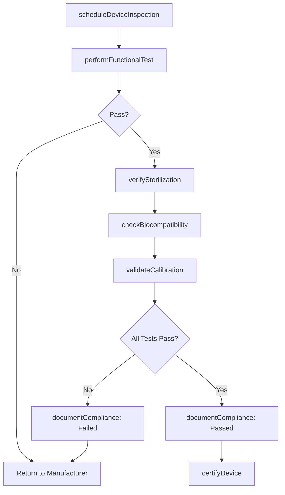
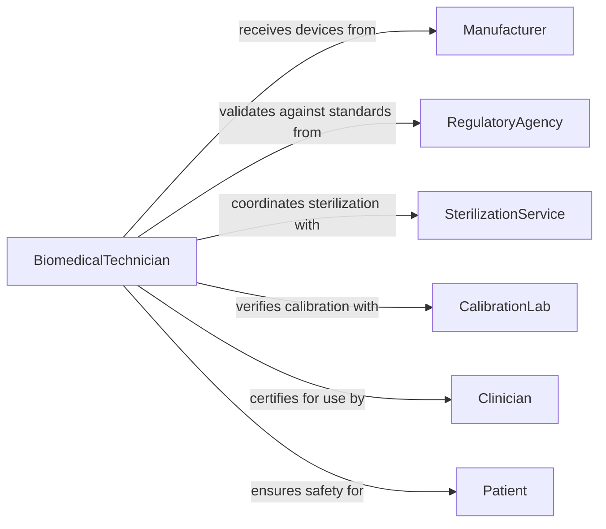

# Inspect Medical Dental Assistive Devices

> Business-as-Code definition for inspecting medical, dental, and assistive devices to ensure regulatory compliance and functional integrity. Models the complete inspection lifecycle from sterilization verification through device certification.

## Overview

Medical and dental device inspection verifies functional safety, biocompatibility, and regulatory compliance for therapeutic and assistive equipment. This definition provides actions for comprehensive device testing, regulatory documentation, and certification tracking with events for compliance automation and audit trails.

## Actors

| Actor | Description |
|-------|-------------|
| Manufacturer | Produces devices requiring regulatory inspection |
| RegulatoryAgency | Enforces compliance with medical device standards |
| Patient | End user whose safety depends on device integrity |
| Clinician | Healthcare provider who uses the device |
| SterilizationService | Processes reusable devices between uses |
| CalibrationLab | Verifies measurement accuracy of diagnostic devices |

## Roles

| Role | Description |
|------|-------------|
| BiomedicalTechnician | Performs device functionality and safety testing |
| QualityAssurance | Validates compliance with regulatory standards |
| RegulatorySpecialist | Maintains certification documentation |
| Sterilization | Verifies sterilization effectiveness |

## Entities

| Entity | Description |
|--------|-------------|
| MedicalDevice | A therapeutic or diagnostic instrument |
| InspectionProtocol | Standardized testing procedures for device type |
| ComplianceTest | A specific test required for certification |
| SterilizationCycle | Documentation of sterilization process |
| CalibrationRecord | Measurement accuracy verification results |
| DeviceCertificate | Regulatory approval documentation |

## Actions

| Action | Description |
|--------|-------------|
| scheduleDeviceInspection | Create inspection plan for device or batch |
| performFunctionalTest | Verify device operates per specifications |
| verifySterilization | Confirm sterilization cycle effectiveness |
| checkBiocompatibility | Test materials for tissue compatibility |
| validateCalibration | Verify measurement accuracy of diagnostic devices |
| documentCompliance | Record test results for regulatory submission |
| certifyDevice | Issue formal compliance certification |

## Events

| Event | Description |
|-------|-------------|
| deviceInspectionScheduled | Inspection protocol has been created |
| functionalTestPerformed | Device operation has been verified |
| sterilizationVerified | Sterilization cycle meets requirements |
| biocompatibilityChecked | Material safety has been confirmed |
| calibrationValidated | Measurement accuracy is within tolerance |
| complianceDocumented | Test results have been recorded |
| deviceCertified | Regulatory certification has been issued |

## Searches

| Search | Description |
|--------|-------------|
| findDevices | List devices by type, status, or certification date |
| getInspectionHistory | Retrieve past inspection results for a device |
| getExpiringCertifications | Find devices needing recertification |
| getFailedTests | Identify devices that failed compliance tests |

## Workflow



## Actor Relationships



## Usage

### Calling Actions

```typescript
import { inspectMedicalDentalAssistiveDevices } from '@headlessly/inspect-medical-dental-assistive-devices'

const deviceInspection = inspectMedicalDentalAssistiveDevices()

// Schedule inspection for surgical instruments
const inspection = await deviceInspection.scheduleDeviceInspection({
  deviceType: 'Surgical Retractor',
  manufacturer: 'MedTech Solutions',
  serialNumber: 'SR-2026-9845',
  regulatoryClass: 'Class II',
  inspectionDate: '2026-02-15'
})

// Perform functional tests
await deviceInspection.performFunctionalTest({
  inspectionId: inspection.id,
  tests: [
    { name: 'Blade Retention', result: 'Pass' },
    { name: 'Handle Integrity', result: 'Pass' },
    { name: 'Locking Mechanism', result: 'Pass' }
  ]
})

// Verify sterilization
await deviceInspection.verifySterilization({
  inspectionId: inspection.id,
  cycleNumber: 'ST-20260215-001',
  method: 'Autoclave',
  temperature: '134°C',
  duration: '4 minutes',
  biologicalIndicator: 'Negative'
})

// Issue certification
await deviceInspection.certifyDevice({
  inspectionId: inspection.id,
  certificationStandard: 'ISO 13485',
  validUntil: '2027-02-15',
  certifiedBy: 'J.Williams, Biomedical Engineer'
})
```

### Event-Driven Automation

```typescript
// Alert on failed biocompatibility test
deviceInspection.biocompatibilityChecked(async ({ deviceId, result }) => {
  if (result.status === 'Failed') {
    await notify({
      to: 'regulatory-team@hospital.org',
      priority: 'High',
      message: `Biocompatibility failure on device ${deviceId}: ${result.details}`
    })
  }
})

// Schedule recertification before expiration
deviceInspection.deviceCertified(async ({ deviceId, validUntil }) => {
  await scheduleTask({
    taskType: 'Recertification',
    deviceId,
    scheduledDate: subtractDays(validUntil, 30),
    assignee: 'biomedical-team'
  })
})
```
