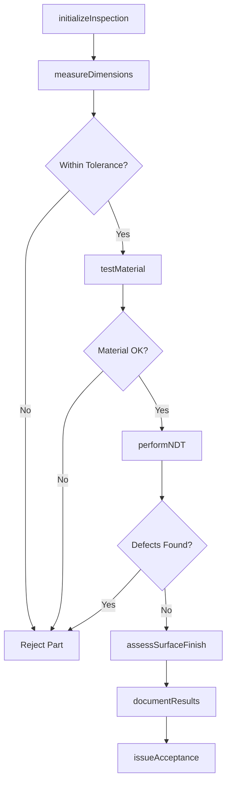
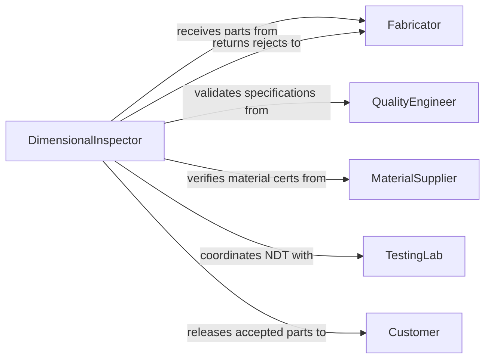

# Inspect Metal Plastic Composite Products

> Business-as-Code definition for inspecting fabricated metal, plastic, and composite materials to ensure dimensional accuracy and material integrity. Models the complete inspection process from receiving through final acceptance testing.

## Overview

Metal, plastic, and composite product inspection verifies dimensional tolerances, material properties, and surface finish quality for manufactured components. This definition provides actions for coordinate measuring, non-destructive testing, and material certification with events for automated quality tracking and supplier performance monitoring.

## Actors

| Actor | Description |
|-------|-------------|
| Fabricator | Manufactures metal, plastic, or composite parts |
| Customer | Receives inspected components for assembly |
| MaterialSupplier | Provides raw materials with certifications |
| TestingLab | Performs destructive and non-destructive testing |
| QualityEngineer | Defines inspection criteria and tolerances |
| ShippingDepartment | Manages outbound delivery of accepted parts |

## Roles

| Role | Description |
|------|-------------|
| DimensionalInspector | Measures parts using precision instruments |
| MaterialsTechnician | Verifies material composition and properties |
| NDTSpecialist | Performs non-destructive testing |
| InspectionCoordinator | Schedules and tracks inspection activities |

## Entities

| Entity | Description |
|--------|-------------|
| InspectionPlan | Defined testing requirements for a part |
| DimensionalReport | Measurement results against blueprint specifications |
| MaterialCert | Certification of material composition and grade |
| NDTResult | Non-destructive test findings for internal defects |
| SurfaceFinishReport | Documentation of surface quality measurements |
| AcceptanceCriteria | Pass/fail thresholds for all tests |

## Actions

| Action | Description |
|--------|-------------|
| initializeInspection | Create inspection plan from engineering drawings |
| measureDimensions | Verify part geometry against blueprint tolerances |
| testMaterial | Validate material composition and mechanical properties |
| performNDT | Execute non-destructive testing for internal defects |
| assessSurfaceFinish | Measure roughness and visual quality |
| documentResults | Record all inspection findings |
| issueAcceptance | Approve or reject part based on criteria |

## Events

| Event | Description |
|-------|-------------|
| inspectionInitialized | Inspection plan has been created |
| dimensionsMeasured | Geometric verification is complete |
| materialTested | Material properties have been validated |
| ndtPerformed | Non-destructive testing is complete |
| surfaceFinishAssessed | Surface quality has been measured |
| resultsDocumented | All findings have been recorded |
| acceptanceIssued | Part has been approved or rejected |

## Searches

| Search | Description |
|--------|-------------|
| findInspections | List inspections by part, date, or status |
| getDimensionalReports | Retrieve measurement results for parts |
| getMaterialCerts | Find material certifications by supplier or grade |
| getRejectedParts | Identify parts that failed acceptance criteria |

## Workflow



## Actor Relationships



## Usage

### Calling Actions

```typescript
import { inspectMetalPlasticCompositeProducts } from '@headlessly/inspect-metal-plastic-composite-products'

const inspection = inspectMetalPlasticCompositeProducts()

// Initialize inspection for machined aluminum part
const plan = await inspection.initializeInspection({
  partNumber: 'AL-6061-T6-BRK-001',
  quantity: 100,
  blueprint: 'DWG-2026-3421',
  fabricator: 'Precision Machining Co',
  inspectionLevel: 'Full Dimensional'
})

// Measure critical dimensions
await inspection.measureDimensions({
  planId: plan.id,
  measurements: [
    { feature: 'Overall Length', nominal: 150.00, tolerance: 0.05, actual: 150.02 },
    { feature: 'Bore Diameter', nominal: 25.40, tolerance: 0.02, actual: 25.39 },
    { feature: 'Surface Flatness', nominal: 0.00, tolerance: 0.01, actual: 0.008 }
  ],
  instrument: 'CMM-Zeiss-01'
})

// Perform ultrasonic testing
await inspection.performNDT({
  planId: plan.id,
  method: 'Ultrasonic',
  technician: 'R.Martinez',
  findings: 'No internal voids or delamination detected',
  acceptance: 'Pass'
})

// Issue final acceptance
await inspection.issueAcceptance({
  planId: plan.id,
  decision: 'Accepted',
  inspector: 'K.Chen',
  notes: 'All dimensions within tolerance, material cert verified'
})
```

### Event-Driven Automation

```typescript
// Alert engineering on out-of-tolerance trends
inspection.dimensionsMeasured(async ({ planId, measurements }) => {
  const outOfSpec = measurements.filter(m => m.actual > m.nominal + m.tolerance)
  if (outOfSpec.length > 0) {
    await notify({
      to: 'engineering-team@company.com',
      subject: `Dimensional variance detected - Part ${planId}`,
      body: `Features out of spec: ${outOfSpec.map(m => m.feature).join(', ')}`
    })
  }
})

// Track supplier quality metrics
inspection.acceptanceIssued(async ({ planId, decision, fabricator }) => {
  await updateSupplierMetrics({
    supplier: fabricator,
    partId: planId,
    accepted: decision === 'Accepted',
    timestamp: new Date()
  })
})
```
