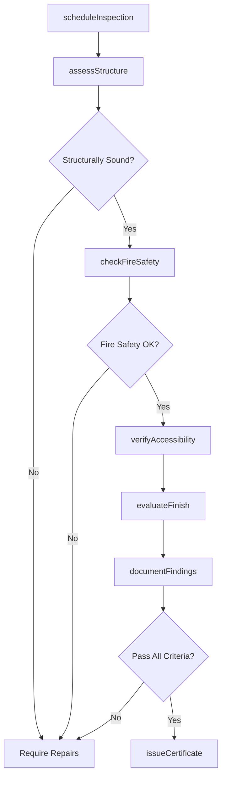
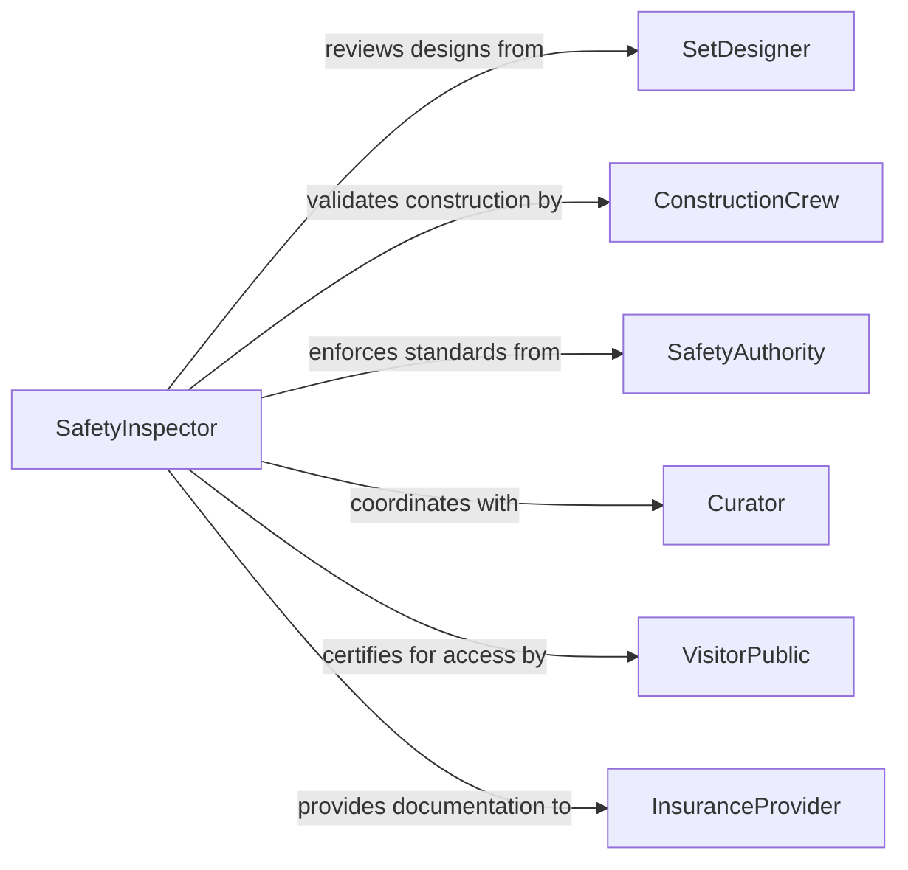

# Inspect Sets Exhibits

> Business-as-Code definition for inspecting theatrical sets, museum exhibits, and display installations to ensure structural safety and design integrity. Models the complete inspection process from pre-opening reviews through ongoing maintenance checks.

## Overview

Set and exhibit inspection verifies structural stability, visual quality, and visitor safety for theatrical productions, museum displays, and trade show installations. This definition provides actions for safety certification, design conformance, and maintenance tracking with events for automated compliance monitoring and incident prevention.

## Actors

| Actor | Description |
|-------|-------------|
| SetDesigner | Creates design specifications and construction plans |
| VisitorPublic | Interacts with exhibits and sets during operation |
| SafetyAuthority | Enforces building codes and public safety regulations |
| Curator | Manages exhibit content and preservation standards |
| ConstructionCrew | Builds and installs set pieces and displays |
| InsuranceProvider | Requires safety certification for liability coverage |

## Roles

| Role | Description |
|------|-------------|
| SafetyInspector | Verifies structural integrity and fire safety |
| QualityController | Validates design conformance and finish quality |
| MaintenanceTechnician | Performs ongoing condition monitoring |
| AccessibilitySpecialist | Ensures ADA compliance for public spaces |

## Entities

| Entity | Description |
|--------|-------------|
| SetExhibit | A complete installation or production environment |
| InspectionChecklist | Standardized safety and quality verification items |
| StructuralAssessment | Engineering evaluation of load-bearing components |
| AccessibilityReport | ADA compliance verification documentation |
| MaintenanceLog | Record of ongoing condition checks and repairs |
| SafetyCertificate | Approval for public operation |

## Actions

| Action | Description |
|--------|-------------|
| scheduleInspection | Create inspection plan for set or exhibit |
| assessStructure | Verify load-bearing capacity and stability |
| checkFireSafety | Validate egress routes and fire suppression |
| verifyAccessibility | Ensure ADA compliance for visitor access |
| evaluateFinish | Assess visual quality and design conformance |
| documentFindings | Record all inspection observations |
| issueCertificate | Approve set or exhibit for public operation |

## Events

| Event | Description |
|-------|-------------|
| inspectionScheduled | Inspection plan has been created |
| structureAssessed | Structural stability has been verified |
| fireSafetyChecked | Fire protection measures have been validated |
| accessibilityVerified | ADA compliance has been confirmed |
| finishEvaluated | Visual quality has been assessed |
| findingsDocumented | Inspection results have been recorded |
| certificateIssued | Approval for operation has been granted |

## Searches

| Search | Description |
|--------|-------------|
| findInspections | List inspections by venue, date, or status |
| getStructuralReports | Retrieve engineering assessments for sets |
| getCertifications | Find active safety certificates by location |
| getMaintenanceLogs | Review ongoing condition monitoring records |

## Workflow



## Actor Relationships



## Usage

### Calling Actions

```typescript
import { inspectSetsExhibits } from '@headlessly/inspect-sets-exhibits'

const inspection = inspectSetsExhibits()

// Schedule pre-opening inspection for museum exhibit
const plan = await inspection.scheduleInspection({
  exhibitName: 'Ancient Civilizations Gallery',
  location: 'Museum of Natural History - East Wing',
  openingDate: '2026-03-01',
  inspectionType: 'Pre-Opening Safety',
  designer: 'ExhibitWorks Design Studio'
})

// Assess structural integrity
await inspection.assessStructure({
  planId: plan.id,
  components: [
    { element: 'Display Cases', loadCapacity: '500 lbs', status: 'Pass' },
    { element: 'Platform Decking', loadCapacity: '100 psf', status: 'Pass' },
    { element: 'Ceiling Suspension', loadCapacity: '200 lbs', status: 'Pass' }
  ],
  engineer: 'P.Rodriguez, PE',
  certification: 'Meets IBC 2021 standards'
})

// Verify ADA accessibility
await inspection.verifyAccessibility({
  planId: plan.id,
  features: [
    { requirement: 'Wheelchair Clearance', measured: '42 inches', status: 'Pass' },
    { requirement: 'Display Height', measured: '48 inches max', status: 'Pass' },
    { requirement: 'Tactile Signage', status: 'Pass' }
  ],
  specialist: 'A.Kim'
})

// Issue safety certificate
await inspection.issueCertificate({
  planId: plan.id,
  certificateType: 'Public Operation Approval',
  validUntil: '2027-03-01',
  conditions: ['Monthly maintenance inspections required'],
  approvedBy: 'Fire Marshal J.Thompson'
})
```

### Event-Driven Automation

```typescript
// Alert curator on failed fire safety check
inspection.fireSafetyChecked(async ({ planId, result }) => {
  if (result.status === 'Failed') {
    await notify({
      to: 'curator@museum.org',
      priority: 'High',
      subject: `Fire Safety Issue - ${result.exhibitName}`,
      body: `Failed items: ${result.failures.join(', ')}`
    })
  }
})

// Schedule annual re-inspection
inspection.certificateIssued(async ({ planId, validUntil }) => {
  await scheduleTask({
    taskType: 'Annual Re-Inspection',
    exhibitId: planId,
    dueDate: validUntil,
    assignee: 'safety-team'
  })
})
```
