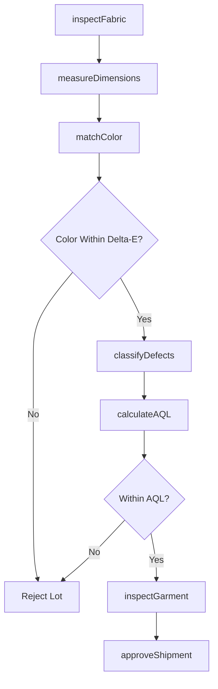
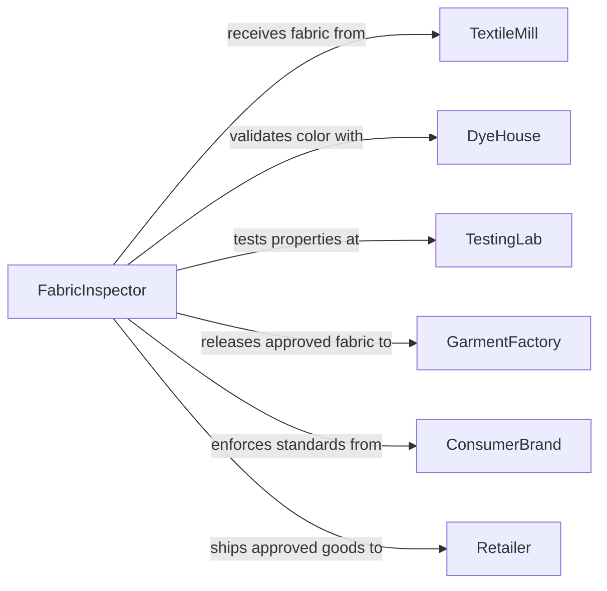

# Inspect Textile Products

> Business-as-Code definition for inspecting fabric, garments, and textile goods to ensure quality standards for color, construction, and material integrity. Models the complete inspection process from incoming fabric rolls through final garment acceptance.

## Overview

Textile product inspection verifies fabric quality, construction accuracy, and appearance standards for apparel, home goods, and industrial textiles. This definition provides actions for defect identification, color matching, and dimensional verification with events for automated quality tracking and supplier performance management.

## Actors

| Actor | Description |
|-------|-------------|
| TextileMill | Manufactures fabric and raw materials |
| GarmentFactory | Produces finished apparel from fabric |
| Retailer | Purchases finished goods for consumer sale |
| ConsumerBrand | Owns brand standards and quality specifications |
| DyeHouse | Provides color matching and finishing services |
| TestingLab | Performs physical and chemical property testing |

## Roles

| Role | Description |
|------|-------------|
| FabricInspector | Examines raw fabric for defects and conformance |
| GarmentInspector | Verifies finished product construction and appearance |
| ColorMatcher | Validates dye lots against approved standards |
| QualityManager | Defines acceptance criteria and tolerances |

## Entities

| Entity | Description |
|--------|-------------|
| FabricRoll | A continuous length of textile material |
| InspectionReport | Documentation of defects and measurements |
| DefectClassification | Categorization of flaw type and severity |
| ColorStandard | Approved color reference for dye lot matching |
| DimensionalSpec | Size and construction requirements |
| AcceptanceLevel | Statistical sampling plan for lot approval |

## Actions

| Action | Description |
|--------|-------------|
| inspectFabric | Examine fabric rolls for defects and color |
| measureDimensions | Verify width, weight, and construction specs |
| matchColor | Compare dye lot against approved standard |
| classifyDefects | Categorize and count fabric flaws |
| inspectGarment | Examine finished product for quality issues |
| calculateAQL | Determine acceptance based on sampling plan |
| approveShipment | Accept or reject lot based on criteria |

## Events

| Event | Description |
|-------|-------------|
| fabricInspected | Fabric roll examination is complete |
| dimensionsMeasured | Size and weight specs have been verified |
| colorMatched | Dye lot has been compared to standard |
| defectsClassified | Flaws have been categorized and counted |
| garmentInspected | Finished product examination is complete |
| aqlCalculated | Acceptance level determination is complete |
| shipmentApproved | Lot has been accepted or rejected |

## Searches

| Search | Description |
|--------|-------------|
| findInspections | List inspections by style, date, or supplier |
| getDefectReports | Retrieve defect data by type or severity |
| getColorMatches | Find dye lots and color variance data |
| getRejectedLots | Identify shipments that failed acceptance |

## Workflow



## Actor Relationships



## Usage

### Calling Actions

```typescript
import { inspectTextileProducts } from '@headlessly/inspect-textile-products'

const inspection = inspectTextileProducts()

// Inspect incoming fabric roll
const fabricReport = await inspection.inspectFabric({
  rollNumber: 'FR-2026-8452',
  style: 'Cotton Jersey Knit',
  supplier: 'Global Textiles Inc',
  quantity: '500 yards',
  inspectionType: '4-Point System'
})

// Measure physical properties
await inspection.measureDimensions({
  reportId: fabricReport.id,
  measurements: {
    width: { spec: '60 inches', actual: '59.8 inches', tolerance: '±0.5 inches' },
    weight: { spec: '180 gsm', actual: '178 gsm', tolerance: '±5%' },
    stretch: { spec: '40% recovery', actual: '42% recovery' }
  }
})

// Match color to approved standard
await inspection.matchColor({
  reportId: fabricReport.id,
  dyeLot: 'DL-20260205-04',
  colorCode: 'Navy Blue #2847',
  deltaE: 0.8,
  standard: 'Pantone 19-4024 TPX',
  lightSource: 'D65'
})

// Classify defects using 4-point system
await inspection.classifyDefects({
  reportId: fabricReport.id,
  defects: [
    { type: 'Slub', severity: '1-point', count: 3 },
    { type: 'Color Variation', severity: '2-point', count: 1 },
    { type: 'Hole', severity: '4-point', count: 0 }
  ],
  totalPoints: 5,
  pointsPer100Yards: 1.0
})

// Calculate AQL and approve
await inspection.calculateAQL({
  reportId: fabricReport.id,
  aqlLevel: 2.5,
  samplingPlan: 'General Level II',
  result: 'Accept'
})
```

### Event-Driven Automation

```typescript
// Alert on color variance
inspection.colorMatched(async ({ reportId, deltaE, dyeLot }) => {
  if (deltaE > 1.0) {
    await notify({
      to: 'quality-team@brand.com',
      subject: `Color variance alert - Dye Lot ${dyeLot}`,
      body: `Delta-E of ${deltaE} exceeds warning threshold`
    })
  }
})

// Track supplier quality trends
inspection.shipmentApproved(async ({ reportId, supplier, result }) => {
  await updateSupplierMetrics({
    supplier,
    shipmentId: reportId,
    accepted: result === 'Accept',
    timestamp: new Date()
  })
})
```
