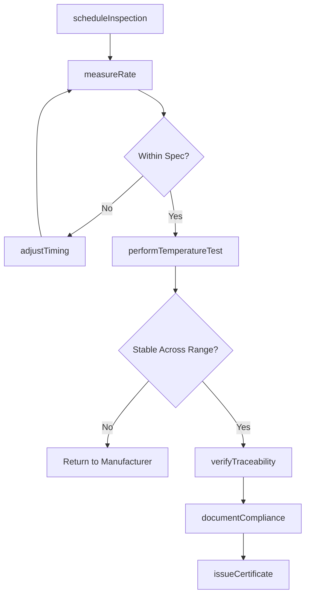
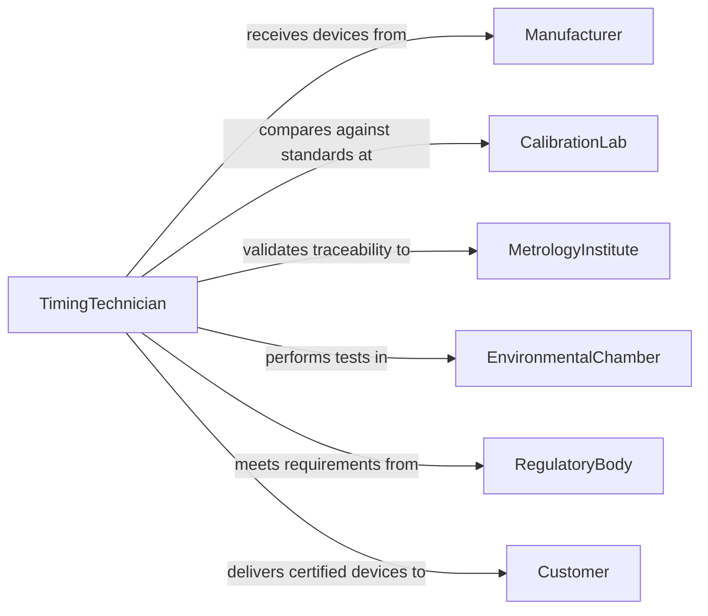

# Inspect Timing Devices

> Business-as-Code definition for inspecting precision timing devices to ensure accuracy and regulatory compliance. Models the complete inspection process from rate measurement through environmental testing and certification.

## Overview

Timing device inspection verifies rate accuracy, temperature stability, and regulatory compliance for chronometers, industrial timers, and synchronization equipment. This definition provides actions for precision measurement, environmental testing, and certification tracking with events for automated calibration scheduling and compliance monitoring.

## Actors

| Actor | Description |
|-------|-------------|
| Manufacturer | Produces timing devices requiring certification |
| RegulatoryBody | Enforces timing accuracy standards |
| CalibrationLab | Maintains reference standards for comparison |
| Customer | Purchases certified timing equipment |
| EnvironmentalChamber | Provides temperature and humidity test capability |
| MetrologyInstitute | Defines traceability to national time standards |

## Roles

| Role | Description |
|------|-------------|
| TimingTechnician | Performs rate measurements and adjustments |
| MetrologyEngineer | Validates measurement uncertainty and traceability |
| TestOperator | Executes environmental testing protocols |
| CertificationSpecialist | Issues compliance documentation |

## Entities

| Entity | Description |
|--------|-------------|
| TimingDevice | A chronometer, clock, or synchronization instrument |
| RateMeasurement | Documentation of timing accuracy over a period |
| TemperatureTest | Performance verification across thermal range |
| CalibrationCertificate | Traceability documentation to national standards |
| AdjustmentRecord | Log of timing corrections and modifications |
| ComplianceReport | Regulatory conformance documentation |

## Actions

| Action | Description |
|--------|-------------|
| scheduleInspection | Create inspection plan for timing device |
| measureRate | Determine time gain or loss over test period |
| performTemperatureTest | Verify accuracy across operating temperature range |
| adjustTiming | Correct rate errors to meet specifications |
| verifyTraceability | Confirm calibration chain to national standards |
| documentCompliance | Record test results for regulatory submission |
| issueCertificate | Provide formal accuracy certification |

## Events

| Event | Description |
|-------|-------------|
| inspectionScheduled | Inspection plan has been created |
| rateMeasured | Timing accuracy has been determined |
| temperatureTestPerformed | Thermal stability has been verified |
| timingAdjusted | Rate corrections have been applied |
| traceabilityVerified | Calibration chain has been documented |
| complianceDocumented | Test results have been recorded |
| certificateIssued | Accuracy certification has been provided |

## Searches

| Search | Description |
|--------|-------------|
| findDevices | List timing devices by type, status, or customer |
| getRateMeasurements | Retrieve accuracy data for specific devices |
| getCalibrationHistory | Review past certifications and adjustments |
| getExpiringCertificates | Identify devices needing recalibration |

## Workflow



## Actor Relationships



## Usage

### Calling Actions

```typescript
import { inspectTimingDevices } from '@headlessly/inspect-timing-devices'

const inspection = inspectTimingDevices()

// Schedule inspection for marine chronometer
const plan = await inspection.scheduleInspection({
  deviceType: 'Marine Chronometer',
  serialNumber: 'CHR-2026-3847',
  manufacturer: 'Precision Timepieces Ltd',
  standard: 'ISO 3159',
  requestedBy: 'Maritime Navigation Corp'
})

// Measure rate accuracy over 24 hours
await inspection.measureRate({
  planId: plan.id,
  testDuration: '24 hours',
  referenceStandard: 'Cesium Atomic Clock NIST-F2',
  measurements: [
    { elapsed: '6 hours', deviation: '+0.2 seconds' },
    { elapsed: '12 hours', deviation: '+0.4 seconds' },
    { elapsed: '18 hours', deviation: '+0.5 seconds' },
    { elapsed: '24 hours', deviation: '+0.7 seconds' }
  ],
  ratePerDay: '+0.7 seconds/day',
  specification: '±2 seconds/day'
})

// Test across temperature range
await inspection.performTemperatureTest({
  planId: plan.id,
  testPoints: [
    { temperature: '0°C', rate: '+0.8 sec/day' },
    { temperature: '20°C', rate: '+0.7 sec/day' },
    { temperature: '40°C', rate: '+0.9 sec/day' }
  ],
  maxVariation: '0.2 sec/day',
  specification: '±0.5 sec/day across range',
  result: 'Pass'
})

// Issue calibration certificate
await inspection.issueCertificate({
  planId: plan.id,
  certificateNumber: 'CAL-2026-0205-001',
  traceability: 'NIST UTC(NIST) via Cesium Standard',
  accuracy: '±0.7 seconds/day',
  validUntil: '2027-02-05',
  issuedBy: 'M.Johnson, Certified Metrologist'
})
```

### Event-Driven Automation

```typescript
// Alert on out-of-spec rate
inspection.rateMeasured(async ({ planId, ratePerDay, specification }) => {
  const [min, max] = parseSpecRange(specification)
  if (ratePerDay < min || ratePerDay > max) {
    await notify({
      to: 'metrology-team@lab.com',
      subject: `Rate out of specification - Device ${planId}`,
      body: `Measured ${ratePerDay}, spec is ${specification}`
    })
  }
})

// Schedule recalibration before expiration
inspection.certificateIssued(async ({ deviceId, validUntil }) => {
  await scheduleTask({
    taskType: 'Recalibration',
    deviceId,
    dueDate: subtractDays(validUntil, 30),
    assignee: 'calibration-lab'
  })
})
```
