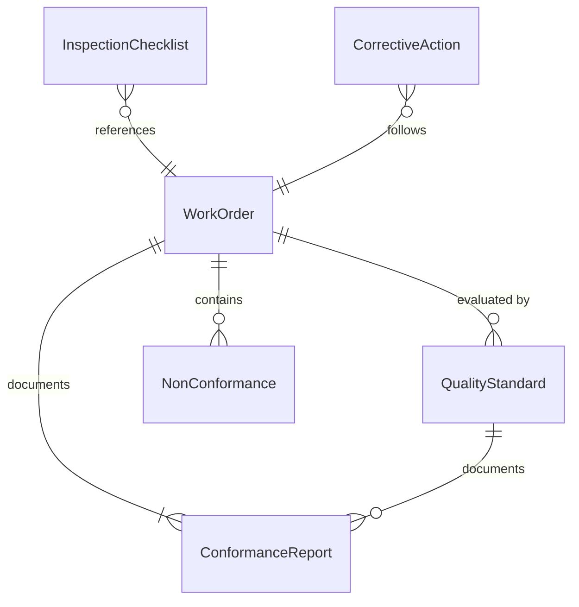
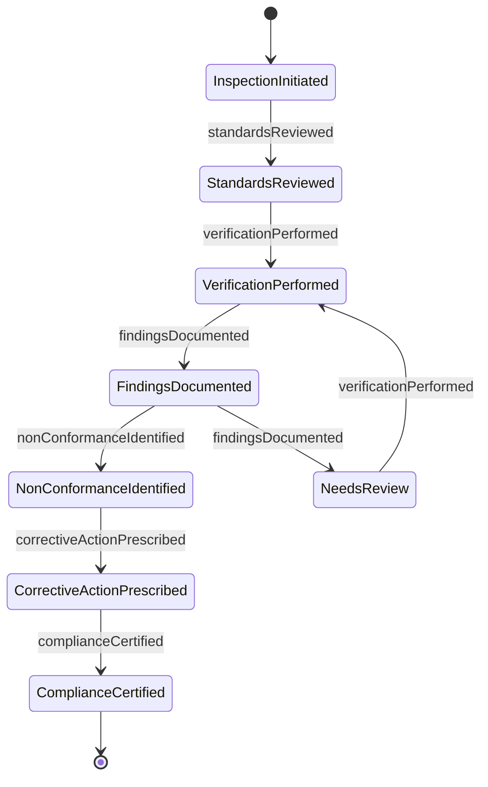
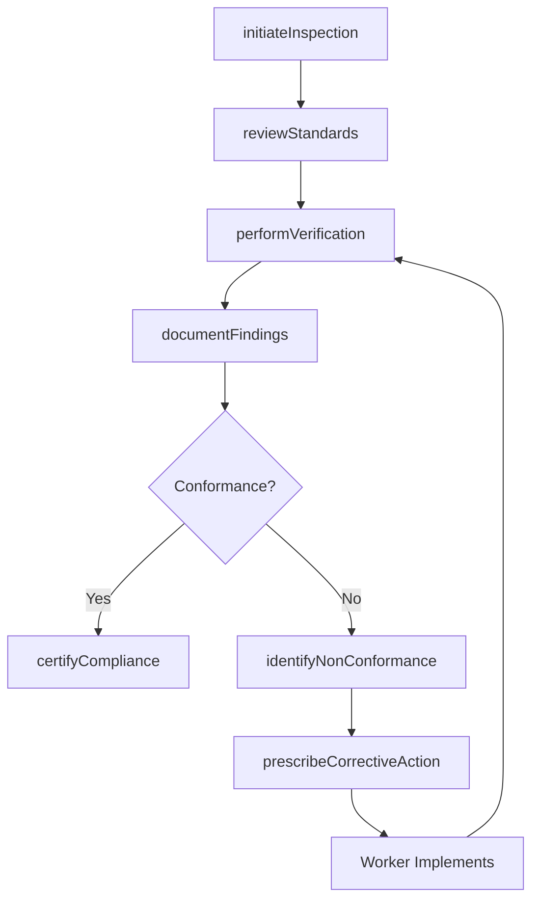
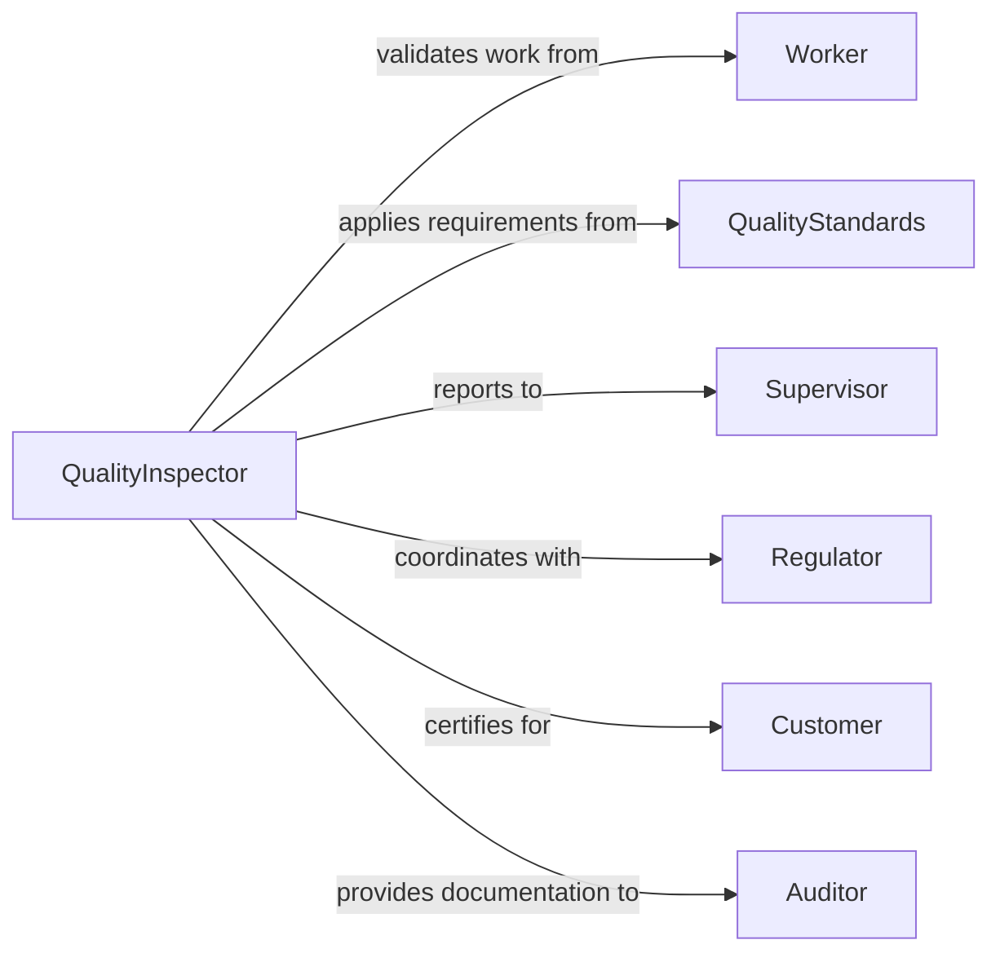

# Inspect Work Ensure Standards Are

> Business-as-Code definition for inspecting completed work to verify compliance with quality standards and specifications. Models the complete standards verification process from requirement review through conformance certification.

## Overview

Work standards inspection validates that completed tasks, deliverables, and outputs meet defined quality criteria and regulatory requirements. This definition provides actions for standards review, conformance testing, and corrective action tracking with events for automated compliance monitoring and audit trail generation.

## Actors

| Actor | Description |
|-------|-------------|
| Worker | Performs tasks requiring quality verification |
| QualityStandards | Defines requirements and acceptance criteria |
| Customer | Receives work and expects standards compliance |
| Regulator | Enforces industry or safety standards |
| Supervisor | Oversees work performance and quality outcomes |
| Auditor | Reviews conformance documentation for certification |

## Roles

| Role | Description |
|------|-------------|
| QualityInspector | Verifies work against defined standards |
| ComplianceOfficer | Ensures regulatory requirement adherence |
| ProcessAuditor | Reviews procedures and documentation |
| CorrectiveActionCoordinator | Manages non-conformance resolution |

## Entities

| Entity | Description |
|--------|-------------|
| WorkOrder | A task or deliverable requiring inspection |
| QualityStandard | Defined requirements and acceptance criteria |
| InspectionChecklist | Structured verification items for standards |
| ConformanceReport | Documentation of standards compliance |
| NonConformance | Identified deviation from requirements |
| CorrectiveAction | Plan to address standards violations |

## Actions

| Action | Description |
|--------|-------------|
| initiateInspection | Create inspection plan for completed work |
| reviewStandards | Identify applicable requirements and criteria |
| performVerification | Execute checklist-based conformance testing |
| documentFindings | Record compliance status and observations |
| identifyNonConformance | Flag deviations from standards |
| prescribeCorrectiveAction | Define remediation for non-compliant work |
| certifyCompliance | Issue formal conformance approval |

## Events

| Event | Description |
|-------|-------------|
| inspectionInitiated | Inspection plan has been created |
| standardsReviewed | Applicable requirements have been identified |
| verificationPerformed | Conformance testing is complete |
| findingsDocumented | Compliance status has been recorded |
| nonConformanceIdentified | Standards deviation has been flagged |
| correctiveActionPrescribed | Remediation plan has been defined |
| complianceCertified | Formal conformance approval has been issued |

## Searches

| Search | Description |
|--------|-------------|
| findInspections | List inspections by work order, date, or status |
| getConformanceReports | Retrieve compliance documentation |
| getNonConformances | Find standards violations by type or severity |
| getCorrectiveActions | Review remediation plans and status |

## Entity Relationships



## State Diagram



## Workflow



## Actor Relationships



## Usage

### Calling Actions

```typescript
import { inspectWorkEnsureStandardsAre } from '@headlessly/inspect-work-ensure-standards-are'

const inspection = inspectWorkEnsureStandardsAre()

// Initiate inspection for construction project
const plan = await inspection.initiateInspection({
  workOrderId: 'WO-2026-8834',
  projectName: 'Commercial Building Foundation',
  contractor: 'ABC Construction',
  inspectionType: 'Final Quality Verification',
  scheduledDate: '2026-02-15'
})

// Review applicable standards
await inspection.reviewStandards({
  planId: plan.id,
  standards: [
    { code: 'ACI 301', description: 'Concrete Specifications' },
    { code: 'ASTM C94', description: 'Ready-Mixed Concrete' },
    { code: 'IBC 2021', description: 'International Building Code' }
  ]
})

// Perform verification checklist
await inspection.performVerification({
  planId: plan.id,
  checklistItems: [
    { requirement: 'Concrete strength 4000 psi', result: 'Pass', actual: '4250 psi' },
    { requirement: 'Rebar spacing 12 inches', result: 'Pass', actual: '12 inches' },
    { requirement: 'Surface finish smooth trowel', result: 'Fail', notes: 'Rough patches in NE corner' },
    { requirement: 'Curing period 7 days', result: 'Pass', actual: '8 days' }
  ]
})

// Identify non-conformance
await inspection.identifyNonConformance({
  planId: plan.id,
  nonConformances: [
    {
      item: 'Surface finish smooth trowel',
      description: 'Rough patches approximately 10 sq ft in NE corner',
      severity: 'Minor',
      standard: 'ACI 301-16 Section 4.6'
    }
  ]
})

// Prescribe corrective action
await inspection.prescribeCorrectiveAction({
  planId: plan.id,
  actions: [
    {
      nonConformanceId: 'NC-001',
      remedy: 'Grind and refinish affected area',
      assignedTo: 'ABC Construction',
      dueDate: '2026-02-18',
      verificationRequired: true
    }
  ]
})
```

### Event-Driven Automation

```typescript
// Alert on critical non-conformance
inspection.nonConformanceIdentified(async ({ planId, severity, standard }) => {
  if (severity === 'Critical') {
    await notify({
      to: 'quality-manager@company.com',
      priority: 'High',
      subject: `Critical non-conformance - Work Order ${planId}`,
      body: `Standard violated: ${standard}`
    })
  }
})

// Track corrective action completion
inspection.correctiveActionPrescribed(async ({ planId, actions }) => {
  for (const action of actions) {
    await trackTask({
      taskId: action.id,
      assignee: action.assignedTo,
      dueDate: action.dueDate,
      notifyOnOverdue: true
    })
  }
})
```
