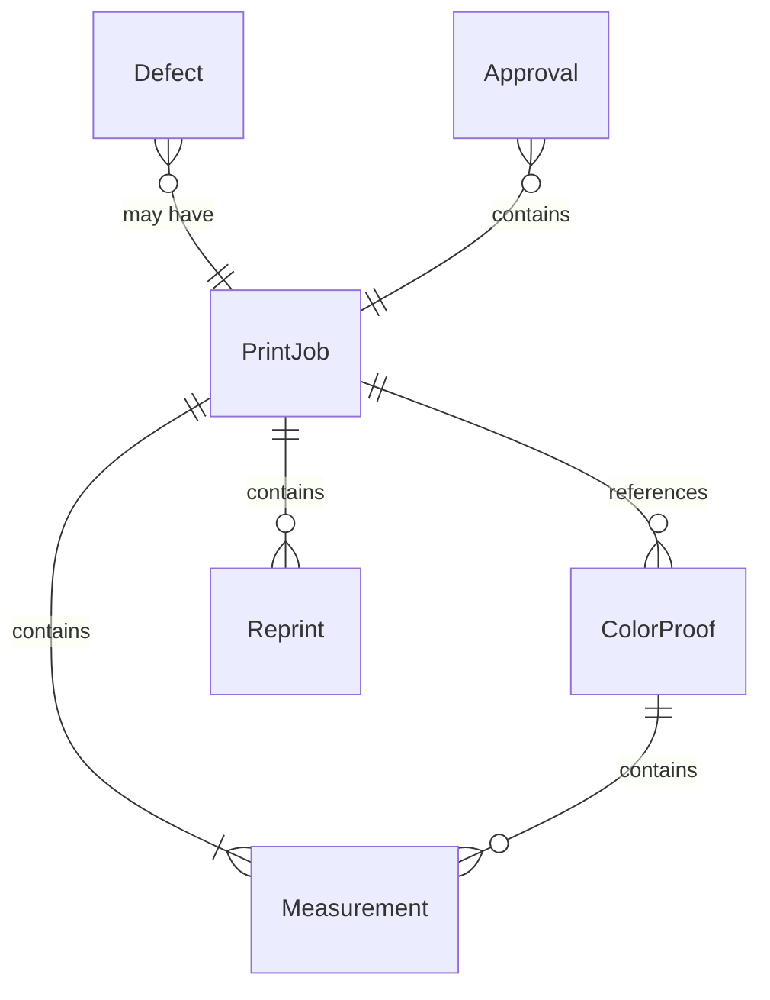
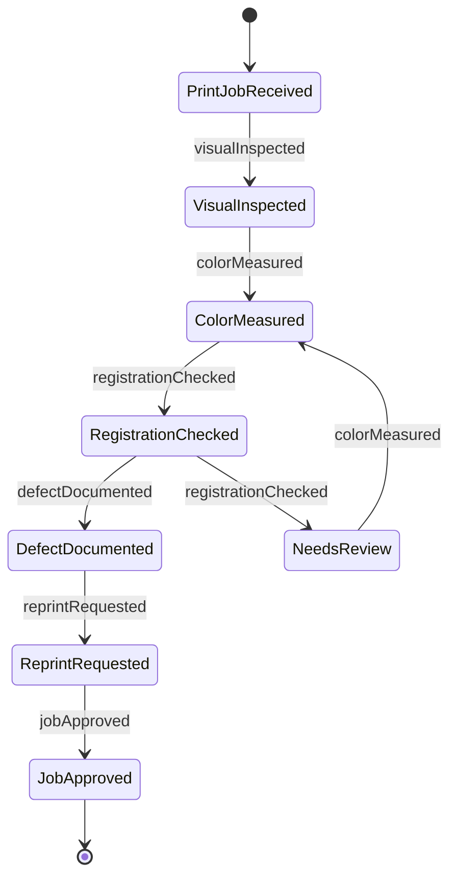
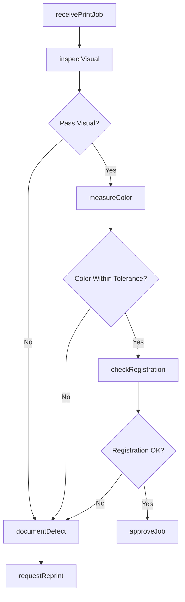
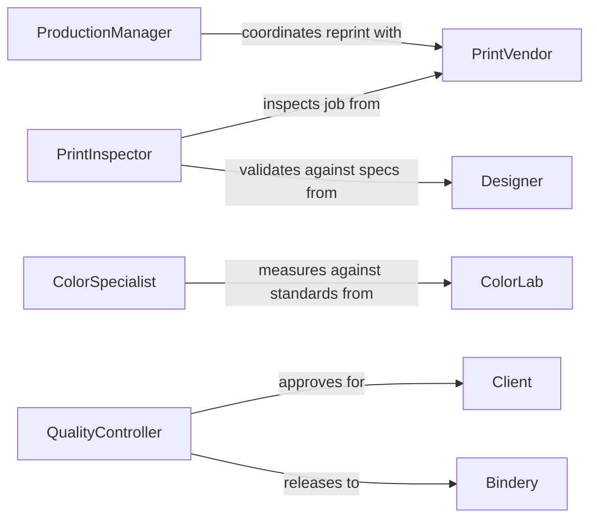

# Inspected Printed Materials Images Verify

> Business-as-Code definition for print and image quality verification workflows. Models the complete inspection process from color accuracy through registration, sharpness, and defect detection.

## Overview

Print quality inspection involves systematic evaluation of printed materials and images against design specifications, color standards, and production requirements. This definition exposes actions for conducting visual inspections, measuring color accuracy, documenting defects, and coordinating reprints with production teams and clients.

## Actors

| Actor | Description |
|-------|-------------|
| Client | Commissioned printed materials requiring verification |
| PrintVendor | Produces materials subject to quality inspection |
| Designer | Created original artwork and specifications |
| ColorLab | Provides calibration standards and measurements |
| Bindery | Performs finishing operations after print approval |
| Shipper | Delivers approved materials to destination |

## Roles

| Role | Description |
|------|-------------|
| PrintInspector | Evaluates printed output against specifications |
| ColorSpecialist | Verifies color accuracy and consistency |
| ProductionManager | Coordinates reprints for rejected materials |
| QualityController | Approves materials meeting standards |

## Entities

| Entity | Description |
|--------|-------------|
| PrintJob | Production run subject to quality inspection |
| ColorProof | Reference standard for color matching |
| Defect | Specific quality issue requiring correction |
| Measurement | Quantitative color or registration data |
| Reprint | Replacement production for rejected materials |
| Approval | Authorization to proceed with finishing |

## Actions

| Action | Description |
|--------|-------------|
| receivePrintJob | Log printed materials for inspection |
| inspectVisual | Conduct visual assessment of print quality |
| measureColor | Quantify color accuracy against standards |
| checkRegistration | Verify alignment of multiple print passes |
| documentDefect | Record quality issues requiring correction |
| requestReprint | Authorize replacement production |
| approveJob | Accept materials meeting quality standards |

## Events

| Event | Description |
|-------|-------------|
| printJobReceived | Materials have arrived for inspection |
| visualInspected | Visual assessment has been completed |
| colorMeasured | Quantitative color data has been captured |
| registrationChecked | Alignment verification has been performed |
| defectDocumented | Quality issue has been recorded |
| reprintRequested | Replacement production has been authorized |
| jobApproved | Materials have been accepted for finishing |

## Searches

| Search | Description |
|--------|-------------|
| findPrintJobs | List jobs by client, date, or approval status |
| getDefects | Retrieve quality issues by type or severity |
| getMeasurements | Find color data by job or location |
| getReprints | List replacement authorizations by reason |

## Entity Relationships



## State Diagram



## Workflow



## Actor Relationships



## Usage

### Calling Actions

```typescript
import { inspectedPrintedMaterialsImagesVerify } from '@headlessly/inspected-printed-materials-images-verify'

const printInspection = inspectedPrintedMaterialsImagesVerify()

// Receive print job for magazine production
const job = await printInspection.receivePrintJob({
  jobId: 'PRINT-2847',
  clientId: 'CLIENT-591',
  quantity: 50000,
  productType: 'magazine',
  receivedDate: '2026-02-05T14:30:00Z'
})

// Measure color accuracy on press sheet
const measurement = await printInspection.measureColor({
  jobId: job.id,
  location: 'page_3_cyan',
  standard: 'SWOP',
  device: 'spectrophotometer',
  readings: { L: 52.3, a: -37.1, b: -50.2 }
})

// Document defect if color out of tolerance
if (measurement.deltaE > 2.0) {
  await printInspection.documentDefect({
    jobId: job.id,
    defectType: 'color_shift',
    location: 'page_3_cyan',
    severity: 'major',
    deltaE: measurement.deltaE
  })
}
```

### Event-Driven Automation

```typescript
// Auto-request reprint for critical defects
printInspection.defectDocumented(async ({ jobId, defect }) => {
  if (defect.severity === 'critical' || defect.type === 'registration_failure') {
    await printInspection.requestReprint({
      jobId,
      reason: defect.type,
      urgency: 'rush'
    })
  }
})

// Notify client when job approved
printInspection.jobApproved(async ({ jobId, clientId }) => {
  await notify({
    to: clientId,
    message: `Print job ${jobId} has passed quality inspection and is proceeding to finishing`,
    method: 'email'
  })
})
```
