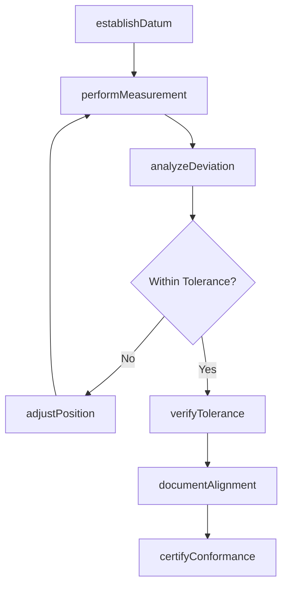
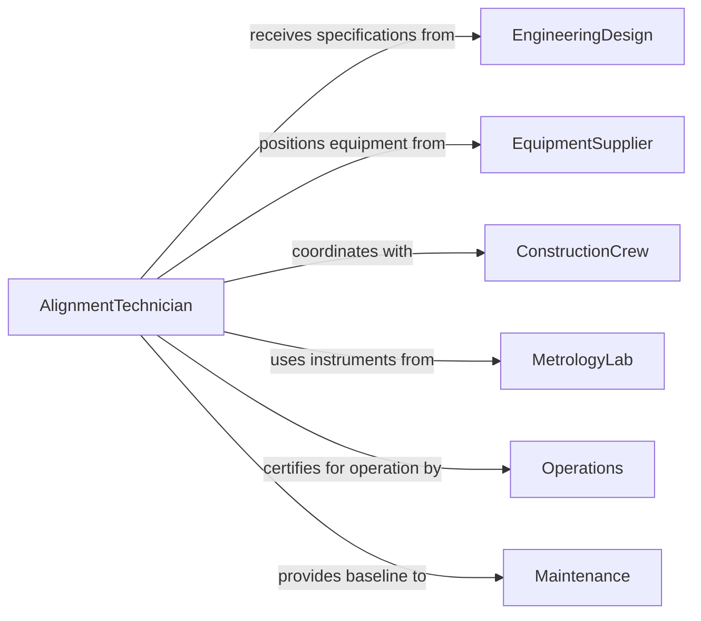

# Verify Alignment Structures Equipment

> Business-as-Code definition for verifying geometric alignment of structures and equipment to ensure proper positioning and operational integrity. Models the complete alignment verification process from datum establishment through precision measurement and adjustment.

## Overview

Alignment verification ensures structures and equipment are positioned within geometric tolerances for proper function and load distribution. This definition provides actions for laser measurement, datum establishment, and adjustment tracking with events for automated tolerance monitoring and maintenance scheduling.

## Actors

| Actor | Description |
|-------|-------------|
| EngineeringDesign | Defines alignment specifications and tolerances |
| EquipmentSupplier | Provides machinery requiring precise positioning |
| ConstructionCrew | Installs and positions structures and equipment |
| Operations | Relies on proper alignment for production efficiency |
| Maintenance | Monitors ongoing alignment for drift detection |
| MetrologyLab | Provides calibrated measurement instruments |

## Roles

| Role | Description |
|------|-------------|
| AlignmentTechnician | Performs precision measurement and adjustment |
| SurveyEngineer | Establishes control datums and reference points |
| MechanicalInstaller | Positions equipment based on alignment data |
| QualityEngineer | Validates alignment conformance to specifications |

## Entities

| Entity | Description |
|--------|-------------|
| AlignmentPlan | Defined positioning requirements and tolerances |
| ControlDatum | Established reference point for measurements |
| AlignmentMeasurement | Documented position data for verification |
| ToleranceReport | Analysis of deviation from specifications |
| AdjustmentRecord | Log of positioning corrections applied |
| CertificationReport | Formal approval of alignment conformance |

## Actions

| Action | Description |
|--------|-------------|
| establishDatum | Create reference points for alignment measurement |
| performMeasurement | Execute laser or optical position verification |
| analyzeDeviation | Calculate offset from design specifications |
| adjustPosition | Reposition equipment to reduce alignment error |
| verifyTolerance | Confirm final position within acceptance criteria |
| documentAlignment | Record measurement results and adjustments |
| certifyConformance | Issue formal alignment approval |

## Events

| Event | Description |
|-------|-------------|
| datumEstablished | Reference points have been created |
| measurementPerformed | Position verification is complete |
| deviationAnalyzed | Offset from specification has been calculated |
| positionAdjusted | Equipment has been repositioned |
| toleranceVerified | Final position meets acceptance criteria |
| alignmentDocumented | Results have been recorded |
| conformanceCertified | Formal approval has been issued |

## Searches

| Search | Description |
|--------|-------------|
| findAlignments | List alignment plans by equipment or date |
| getMeasurements | Retrieve position data for specific equipment |
| getDeviations | Find out-of-tolerance conditions |
| getAdjustmentHistory | Review positioning corrections over time |

## Workflow



## Actor Relationships



## Usage

### Calling Actions

```typescript
import { verifyAlignmentStructuresEquipment } from '@headlessly/verify-alignment-structures-equipment'

const alignment = verifyAlignmentStructuresEquipment()

// Establish control datum for turbine installation
const datum = await alignment.establishDatum({
  projectId: 'PWR-PLANT-2026',
  equipmentId: 'TURBINE-GEN-01',
  datumPoints: [
    { id: 'A1', coordinates: { x: 0, y: 0, z: 100.000 }, description: 'North foundation anchor' },
    { id: 'A2', coordinates: { x: 500, y: 0, z: 100.000 }, description: 'South foundation anchor' }
  ],
  surveyMethod: 'Total Station',
  accuracy: '±0.5mm'
})

// Perform laser alignment measurement
await alignment.performMeasurement({
  datumId: datum.id,
  measurements: [
    { point: 'Bearing Housing North', x: 0.2, y: -0.3, z: 100.001 },
    { point: 'Bearing Housing South', x: 500.1, y: -0.2, z: 100.002 },
    { point: 'Coupling Face', x: 250.0, y: 0.1, z: 100.003 }
  ],
  instrument: 'Laser Tracker API T10',
  operator: 'R.Patterson'
})

// Analyze deviation from specification
await alignment.analyzeDeviation({
  datumId: datum.id,
  specifications: {
    centerlineDeviation: '±0.5mm',
    levelDeviation: '±0.1mm',
    parallelism: '±0.05mm/m'
  },
  findings: [
    { location: 'Bearing Housing North', deviation: '+0.3mm lateral', status: 'Within Tolerance' },
    { location: 'Coupling Face', deviation: '+0.6mm lateral', status: 'Out of Tolerance' }
  ]
})

// Adjust position to correct deviation
await alignment.adjustPosition({
  datumId: datum.id,
  adjustments: [
    {
      component: 'Coupling Face',
      direction: 'Lateral',
      correction: '-0.6mm',
      method: 'Shim adjustment',
      verificationRequired: true
    }
  ]
})

// Certify final alignment
await alignment.certifyConformance({
  datumId: datum.id,
  finalDeviation: '±0.2mm max',
  specification: '±0.5mm',
  certifiedBy: 'M.Chen, PE',
  certificationDate: '2026-02-15'
})
```

### Event-Driven Automation

```typescript
// Alert on out-of-tolerance condition
alignment.deviationAnalyzed(async ({ datumId, findings }) => {
  const outOfSpec = findings.filter(f => f.status === 'Out of Tolerance')
  if (outOfSpec.length > 0) {
    await notify({
      to: 'engineering-team@plant.com',
      subject: `Alignment deviation detected - ${datumId}`,
      body: `${outOfSpec.length} points out of specification`
    })
  }
})

// Schedule periodic realignment check
alignment.conformanceCertified(async ({ equipmentId, certificationDate }) => {
  await scheduleTask({
    taskType: 'Periodic Alignment Check',
    equipmentId,
    scheduledDate: addMonths(certificationDate, 6),
    assignee: 'maintenance-team'
  })
})
```
