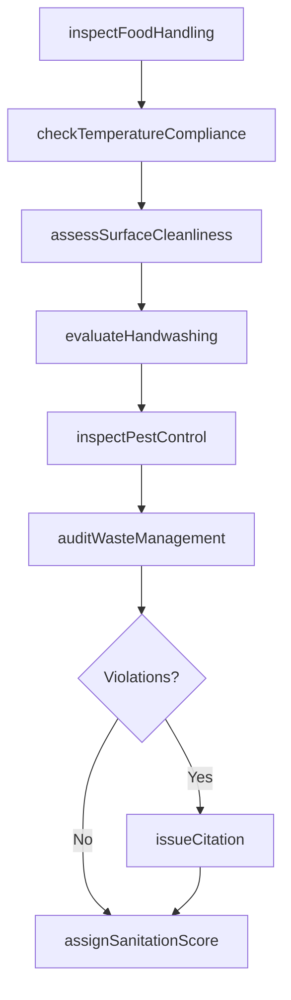
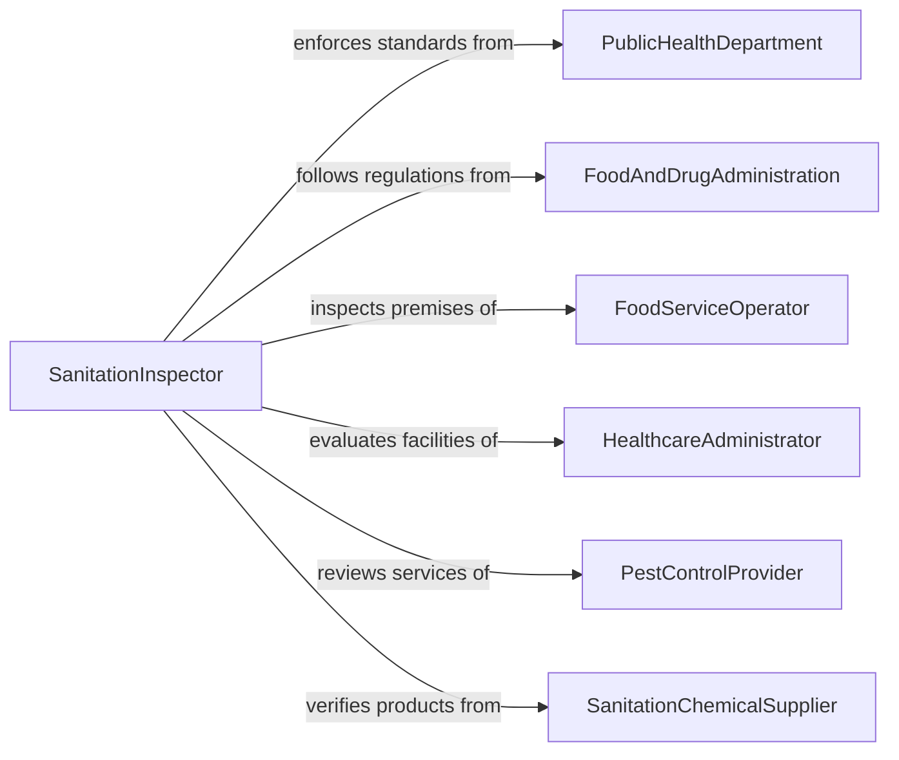

# Inspect Areas for Compliance with Sanitation Standards

> Business-as-Code definition for inspecting areas for compliance with sanitation standards. Models the sanitation inspection workflow of evaluating cleanliness, hygiene practices, pest control, and waste management against public health codes and industry sanitation requirements.

## Overview

Inspecting areas for compliance with sanitation standards involves conducting systematic evaluations of food service establishments, healthcare facilities, food processing plants, hospitality venues, and public spaces to verify adherence to sanitation codes, hygiene regulations, and public health requirements. This definition covers surface cleanliness verification, food safety temperature checks, handwashing compliance, pest control assessments, waste disposal audits, and sanitation documentation review. It supports public health departments, food safety programs, healthcare infection control, and hospitality quality management.

## Actors

| Actor | Description |
|-------|-------------|
| PublicHealthDepartment | Establishes sanitation codes and conducts enforcement inspections |
| FoodAndDrugAdministration | Sets food safety sanitation standards for manufacturing and processing |
| FoodServiceOperator | Manages restaurants, cafeterias, or catering operations subject to sanitation inspection |
| HealthcareAdministrator | Operates facilities requiring infection control and sanitation compliance |
| PestControlProvider | Delivers integrated pest management services for inspected facilities |
| SanitationChemicalSupplier | Provides cleaning agents, sanitizers, and disinfectants meeting regulatory approval |

## Roles

| Role | Description |
|------|-------------|
| SanitationInspector | Conducts official sanitation compliance evaluations and issues findings |
| FoodSafetyManager | Oversees internal sanitation programs and maintains HACCP documentation |
| InfectionControlNurse | Monitors healthcare facility sanitation and sterile processing compliance |
| EnvironmentalServicesManager | Manages cleaning operations and sanitation staff in commercial facilities |

## Entities

| Entity | Description |
|--------|-------------|
| SanitationReport | A formal document recording all findings from a sanitation compliance inspection |
| ViolationCitation | An official notice of non-compliance with a specific sanitation code |
| SurfaceSwabResult | A laboratory analysis of microbial contamination on a tested surface |
| TemperatureLog | Recorded temperatures for refrigeration, hot holding, and cooking equipment |
| HACCPRecord | Hazard Analysis Critical Control Point documentation for food safety systems |
| PestActivityLog | A record of pest monitoring device readings and pest sighting observations |
| CorrectionOrder | A directive to remedy a sanitation violation within a specified timeframe |
| SanitationScore | A numerical grade reflecting overall sanitation compliance level |

## Actions

| Action | Description |
|--------|-------------|
| inspectFoodHandling | Evaluate food preparation, storage, and serving practices for hygiene compliance |
| checkTemperatureCompliance | Verify that cold storage, hot holding, and cooking temperatures meet standards |
| assessSurfaceCleanliness | Inspect and swab food contact surfaces, equipment, and work areas |
| evaluateHandwashing | Verify handwashing station availability, supplies, and employee compliance |
| inspectPestControl | Review pest monitoring devices, exclusion measures, and activity logs |
| auditWasteManagement | Check waste storage, disposal frequency, and separation practices |
| issueCitation | Document and formally cite specific sanitation code violations |
| assignSanitationScore | Calculate and assign an overall sanitation compliance grade |

## Events

| Event | Description |
|-------|-------------|
| foodHandlingInspected | Food preparation and serving practices have been evaluated |
| temperatureComplianceChecked | Cold storage, hot holding, and cooking temperatures have been verified |
| surfaceCleanlinessAssessed | Surface swab testing and visual cleanliness checks are complete |
| handwashingEvaluated | Handwashing station compliance has been verified |
| pestControlInspected | Pest monitoring and exclusion measures have been reviewed |
| wasteManagementAudited | Waste storage and disposal practices have been checked |
| citationIssued | A sanitation code violation has been formally documented |
| sanitationScoreAssigned | An overall sanitation compliance grade has been calculated |

## Searches

| Search | Description |
|--------|-------------|
| findInspections | List sanitation inspections by establishment, date, or score |
| getCitations | Retrieve violation citations by establishment, code section, or status |
| getSwabResults | Query surface swab laboratory results by location, surface, or date |
| getTemperatureLogs | Access temperature monitoring data by equipment, date, or compliance status |
| getSanitationScores | Compare sanitation scores across establishments or over time |

## Workflow



## Actor Relationships



## Usage

### Calling Actions

```typescript
import { inspectAreasComplianceSanitationStandards } from '@headlessly/inspect-areas-compliance-sanitation-standards'

const sanitationInspection = inspectAreasComplianceSanitationStandards()

// Inspect a restaurant for sanitation compliance
const inspection = await sanitationInspection.inspectFoodHandling({
  establishment: 'riverside-bistro',
  permit: 'FP-2026-0412',
  areas: ['kitchen', 'prep-area', 'walk-in-cooler', 'dry-storage', 'dishwashing'],
  observations: [
    { area: 'prep-area', finding: 'raw-chicken-above-ready-to-eat', violation: true, code: 'FDA-3-302.11' },
    { area: 'kitchen', finding: 'proper-cooking-temps-verified', violation: false }
  ]
})

// Check temperature compliance
await sanitationInspection.checkTemperatureCompliance({
  inspectionId: inspection.id,
  readings: [
    { equipment: 'walk-in-cooler', temp: 38, unit: 'fahrenheit', required: { max: 41 }, status: 'compliant' },
    { equipment: 'hot-holding-steam-table', temp: 128, unit: 'fahrenheit', required: { min: 135 }, status: 'violation' },
    { equipment: 'salad-prep-cooler', temp: 40, unit: 'fahrenheit', required: { max: 41 }, status: 'compliant' }
  ]
})

// Assess surface cleanliness with swab testing
await sanitationInspection.assessSurfaceCleanliness({
  inspectionId: inspection.id,
  swabs: [
    { surface: 'cutting-board-3', result: 'ATP-reading-150', threshold: 200, status: 'pass' },
    { surface: 'slicer-blade', result: 'ATP-reading-450', threshold: 200, status: 'fail' }
  ]
})

// Issue citations and assign score
await sanitationInspection.issueCitation({
  inspectionId: inspection.id,
  violations: [
    { code: 'FDA-3-302.11', description: 'Improper food storage - raw above ready-to-eat', severity: 'critical', correctionDeadline: 'immediate' },
    { code: 'FDA-3-501.16', description: 'Hot holding below 135F', severity: 'major', correctionDeadline: '24-hours' }
  ]
})

await sanitationInspection.assignSanitationScore({
  inspectionId: inspection.id,
  score: 78,
  grade: 'C'
})
```

### Event-Driven Automation

```typescript
// Close establishment when critical violations threaten public health
sanitationInspection.citationIssued(async ({ establishment, violations }) => {
  const critical = violations.filter(v => v.severity === 'critical')
  if (critical.length >= 2) {
    await enforcement.issueClosureOrder({
      establishment,
      reason: `${critical.length} critical sanitation violations`,
      reopenCondition: 'pass-reinspection'
    })
    await notify({
      to: 'public-health-director',
      message: `Closure ordered for ${establishment}: ${critical.length} critical violations`
    })
  }
})

// Publish sanitation scores for public transparency
sanitationInspection.sanitationScoreAssigned(async ({ establishment, score, grade }) => {
  await publicRecords.publishScore({
    establishment,
    score,
    grade,
    inspectionDate: new Date().toISOString()
  })
})
```
