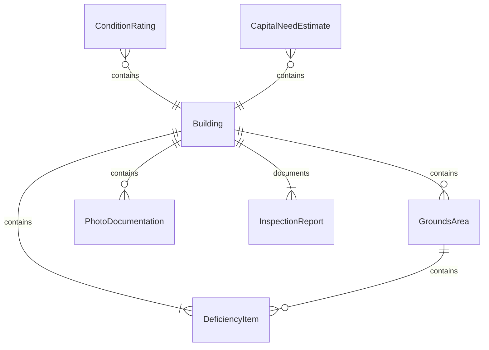
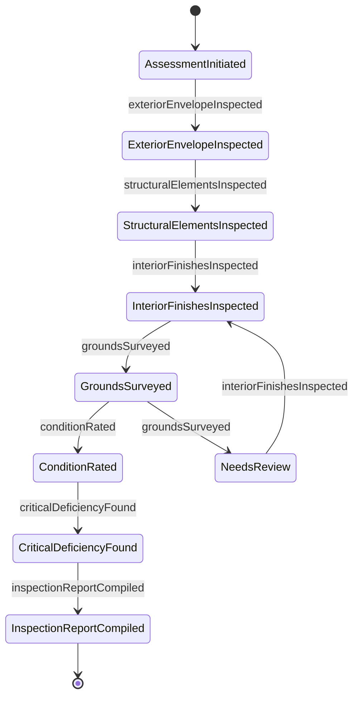
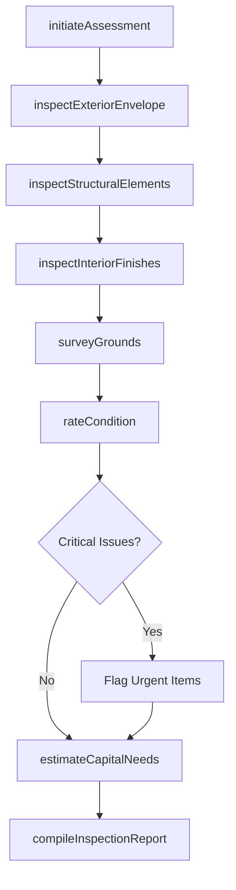
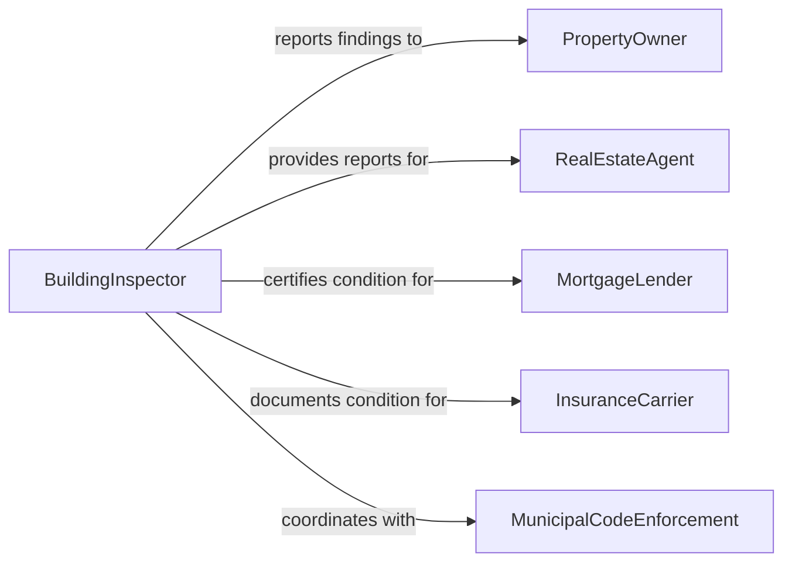

# Inspect Buildings or Grounds to Determine Condition

> Business-as-Code definition for inspecting buildings and grounds to determine their condition. Models the assessment process from structural evaluation through grounds survey and capital planning prioritization.

## Overview

Inspecting buildings or grounds to determine condition involves conducting systematic assessments of roofing, exterior walls, foundations, interior finishes, parking areas, landscaping, drainage systems, fencing, and site infrastructure. Inspectors document material deterioration, structural deficiencies, deferred maintenance, vandalism, erosion, and other conditions that affect property value, safety, or usability. This activity supports property management, real estate transactions, capital improvement planning, and insurance underwriting by providing objective documentation of physical condition at a point in time.

## Actors

| Actor | Description |
|-------|-------------|
| PropertyOwner | Commissions inspections and is responsible for maintaining building and grounds |
| RealEstateAgent | Requests property condition reports as part of purchase or sale transactions |
| MortgageLender | Requires property condition assessments as a condition of financing |
| InsuranceCarrier | Evaluates property condition for coverage decisions and premium calculations |
| MunicipalCodeEnforcement | Enforces property maintenance codes and building standards |
| TenantOrOccupant | Reports visible conditions and is affected by building and grounds maintenance |

## Roles

| Role | Description |
|------|-------------|
| BuildingInspector | Conducts comprehensive assessments of structural and finish conditions |
| GroundsInspector | Evaluates exterior site conditions including pavement, drainage, and landscaping |
| PropertyConditionAssessor | Performs standardized property condition assessments for commercial transactions |
| FacilitiesManager | Uses inspection data to prioritize maintenance and capital improvements |
| CapitalPlanningAnalyst | Translates condition findings into budget projections for repairs and replacements |

## Entities

| Entity | Description |
|--------|-------------|
| Building | A structure assessed for condition including all major systems and finishes |
| GroundsArea | A defined exterior area including pavement, landscape, and site features |
| ConditionRating | A scored assessment of a building component or grounds feature |
| DeficiencyItem | A specific condition requiring repair, replacement, or monitoring |
| PhotoDocumentation | Images capturing current condition of inspected elements |
| CapitalNeedEstimate | Projected cost and timeline for addressing identified deficiencies |
| InspectionReport | Comprehensive document detailing findings across all inspected areas |

## Actions

| Action | Description |
|--------|-------------|
| initiateAssessment | Begin a building and grounds condition inspection for a property |
| inspectExteriorEnvelope | Evaluate roofing, walls, windows, and waterproofing systems |
| inspectStructuralElements | Examine foundation, framing, load-bearing walls, and structural connections |
| inspectInteriorFinishes | Assess flooring, ceilings, walls, doors, and interior fixtures |
| surveyGrounds | Evaluate pavement, landscaping, drainage, fencing, and site lighting |
| rateCondition | Assign condition scores to each inspected component or area |
| estimateCapitalNeeds | Calculate projected repair or replacement costs for deficient items |
| compileInspectionReport | Assemble all findings, ratings, photos, and estimates into a formal report |

## Events

| Event | Description |
|-------|-------------|
| assessmentInitiated | A building and grounds inspection has been started |
| exteriorEnvelopeInspected | Roofing, walls, and waterproofing have been evaluated |
| structuralElementsInspected | Foundation and structural components have been examined |
| interiorFinishesInspected | Interior surfaces and fixtures have been assessed |
| groundsSurveyed | Exterior site conditions have been evaluated |
| conditionRated | A component or area has received a condition score |
| criticalDeficiencyFound | A condition requiring urgent attention has been identified |
| inspectionReportCompiled | The full assessment report has been completed |

## Searches

| Search | Description |
|--------|-------------|
| findPropertiesDueForAssessment | List properties with upcoming or overdue condition inspections |
| getConditionHistory | Retrieve past condition ratings for a property over time |
| findCriticalDeficiencies | Locate properties with unresolved critical condition findings |
| getCapitalNeedsByProperty | Retrieve projected repair costs for a specific property |
| findPropertiesByConditionRating | List properties below a specified overall condition threshold |

## Entity Relationships



## State Diagram



## Workflow



## Actor Relationships



## Usage

### Calling Actions

```typescript
import { inspectBuildingsOrGroundsToDetermineCondition } from '@headlessly/inspect-buildings-or-grounds-to-determine-condition'

const inspector = inspectBuildingsOrGroundsToDetermineCondition()

// Initiate a property condition assessment
const assessment = await inspector.initiateAssessment({
  propertyId: 'PROP-OFFICE-2200',
  purpose: 'annualConditionReview',
  assignedTo: 'assessor-jpark',
  inspectionDate: '2026-03-01'
})

// Inspect exterior envelope
await inspector.inspectExteriorEnvelope({
  assessmentId: assessment.id,
  findings: [
    { component: 'roofMembrane', condition: 'fair', age: 12, expectedLife: 20, unit: 'years', notes: 'Minor ponding at northeast corner' },
    { component: 'exteriorCaulking', condition: 'poor', notes: 'Failed sealant at window perimeters on west elevation' },
    { component: 'brickVeneer', condition: 'good', notes: 'No significant cracking or efflorescence' }
  ]
})

// Survey grounds condition
await inspector.surveyGrounds({
  assessmentId: assessment.id,
  findings: [
    { area: 'parkingLot', condition: 'fair', notes: 'Alligator cracking in drive lanes, seal coat needed' },
    { area: 'landscaping', condition: 'good', notes: 'Irrigation operational, beds maintained' },
    { area: 'stormDrainage', condition: 'fair', notes: 'Catch basin grates corroded, one partially blocked' }
  ]
})
```

### Event-Driven Automation

```typescript
// Escalate critical deficiencies immediately
inspector.criticalDeficiencyFound(async ({ propertyId, component, description }) => {
  await notify({
    to: 'facilities-management',
    priority: 'urgent',
    message: `Critical deficiency at ${propertyId}: ${component} - ${description}`
  })
})

// Feed condition data into capital planning
inspector.inspectionReportCompiled(async ({ propertyId, reportId, capitalNeeds }) => {
  await updateCapitalPlan({
    propertyId,
    source: reportId,
    items: capitalNeeds.map(n => ({
      component: n.component,
      estimatedCost: n.cost,
      recommendedYear: n.year,
      priority: n.priority
    }))
  })
})
```
