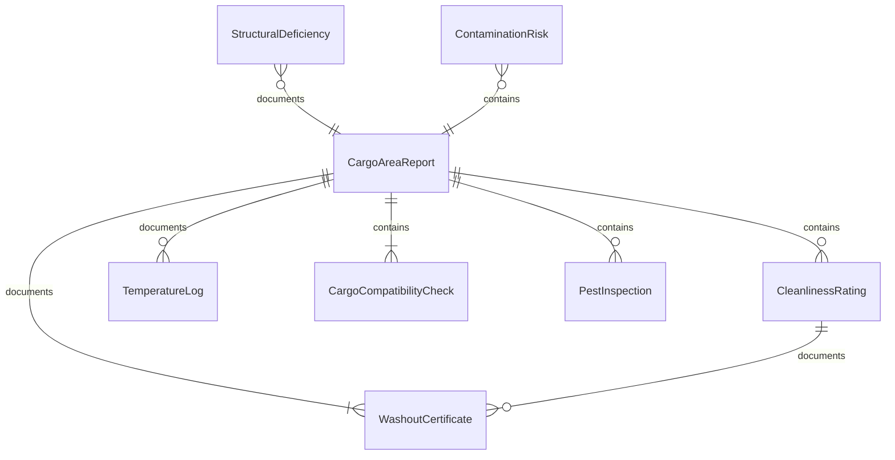
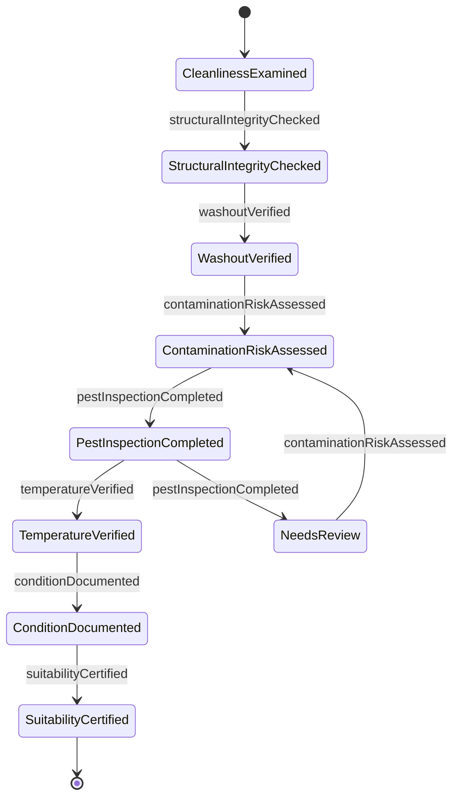
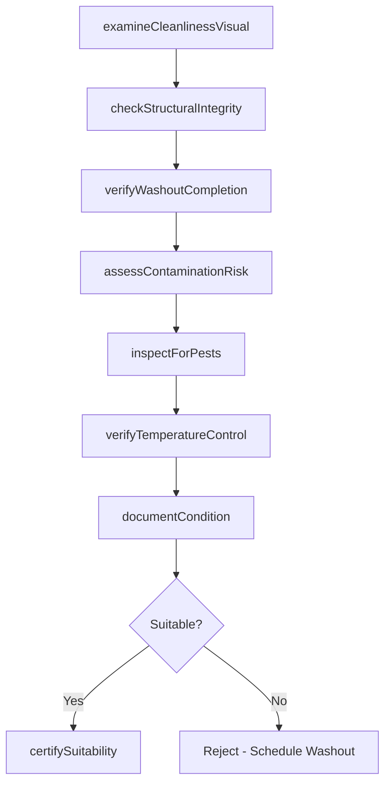
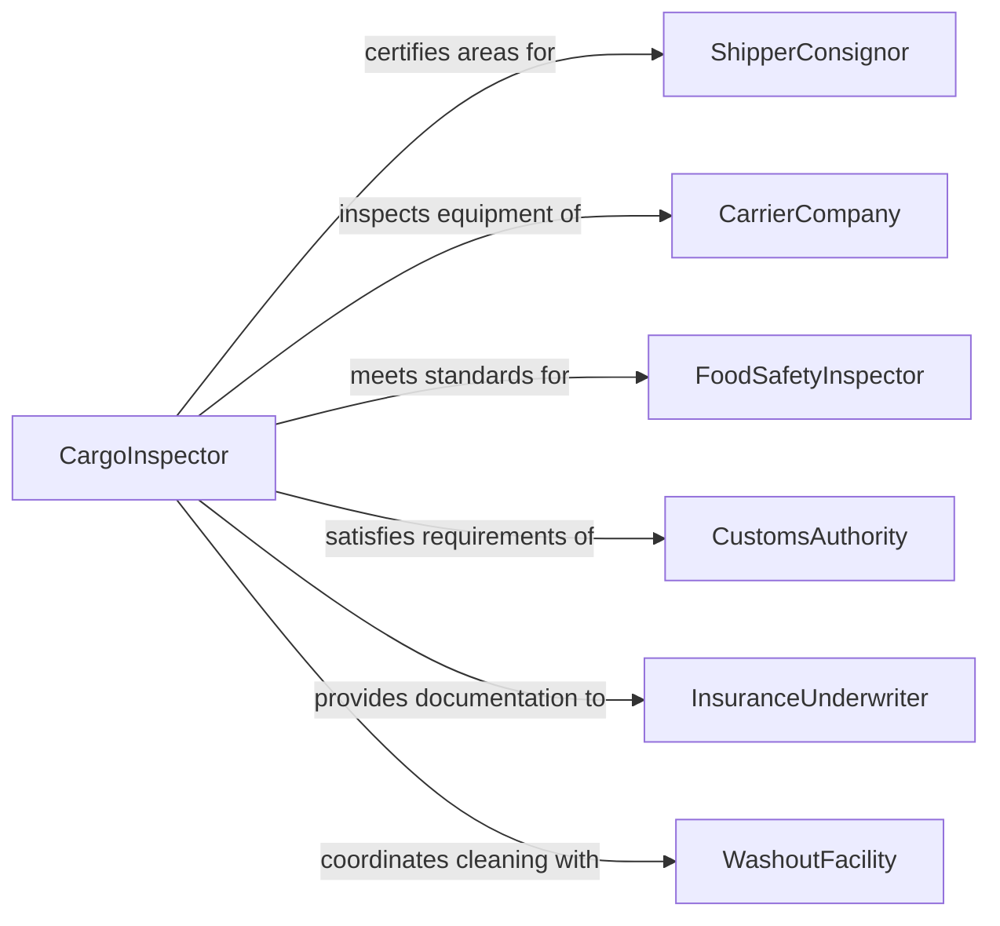

# Inspect Cargo Areas for Cleanliness or Condition

> Business-as-Code definition for inspecting cargo areas for cleanliness or condition. Models the cargo space assessment workflow of examining holds, trailers, containers, and storage areas to verify they are clean, structurally sound, and suitable for loading specific cargo types.

## Overview

Inspecting cargo areas for cleanliness or condition involves examining ship holds, truck trailers, rail cars, aircraft cargo compartments, and warehouse storage zones to verify they are free from contamination, residues, pest activity, and structural damage before loading cargo. This definition covers pre-load inspections, washout verifications, temperature monitoring, structural integrity checks, and cargo compatibility assessments. It supports freight carriers, food-grade logistics operators, chemical transport companies, and warehouse management operations where cargo contamination prevention is essential.

## Actors

| Actor | Description |
|-------|-------------|
| ShipperConsignor | Requires cargo areas to meet cleanliness standards before loading |
| CarrierCompany | Operates transport equipment and maintains cargo area cleanliness |
| FoodSafetyInspector | Verifies food-grade cargo area compliance with FSMA and sanitation standards |
| CustomsAuthority | May inspect cargo areas for biosecurity and quarantine compliance |
| InsuranceUnderwriter | Requires cargo area condition documentation for cargo coverage |
| WashoutFacility | Provides cleaning and sanitization services for cargo containers and trailers |

## Roles

| Role | Description |
|------|-------------|
| CargoInspector | Examines cargo areas and documents cleanliness and structural condition |
| DriverOperator | Performs pre-trip cargo area checks and reports conditions |
| QualityAssuranceCoordinator | Verifies cargo area suitability for specific product requirements |
| LogisticsManager | Assigns clean equipment to loads and manages washout scheduling |

## Entities

| Entity | Description |
|--------|-------------|
| CargoAreaReport | A documented assessment of a cargo space cleanliness and structural condition |
| CleanlinessRating | A graded assessment of contamination level from visual and swab testing |
| StructuralDeficiency | A documented condition such as holes, cracks, or damaged flooring in the cargo area |
| WashoutCertificate | Documentation confirming a cargo area has been professionally cleaned and sanitized |
| TemperatureLog | Recorded temperature readings for refrigerated or temperature-controlled cargo areas |
| ContaminationRisk | An identified potential for cross-contamination from previous cargo residues |
| CargoCompatibilityCheck | A verification that the cargo area is suitable for the intended product type |
| PestInspection | An examination for evidence of insect, rodent, or other pest activity |

## Actions

| Action | Description |
|--------|-------------|
| examineCleanlinessVisual | Perform a visual inspection for debris, residues, stains, and odors |
| checkStructuralIntegrity | Inspect floors, walls, doors, seals, and roof for damage or light leaks |
| verifyWashoutCompletion | Confirm that professional cleaning has been performed and documented |
| assessContaminationRisk | Evaluate potential for cross-contamination based on previous cargo history |
| inspectForPests | Check for evidence of insect, rodent, or other biological pest activity |
| verifyTemperatureControl | Test refrigeration unit operation and review pre-cool temperature logs |
| documentCondition | Record all findings with photographs and condition ratings |
| certifySuitability | Approve the cargo area as suitable for loading specific cargo |

## Events

| Event | Description |
|-------|-------------|
| cleanlinessExamined | A visual cleanliness inspection has been performed |
| structuralIntegrityChecked | Floor, wall, door, and seal condition has been verified |
| washoutVerified | Professional cleaning completion has been confirmed |
| contaminationRiskAssessed | Cross-contamination potential has been evaluated |
| pestInspectionCompleted | Pest activity examination is complete |
| temperatureVerified | Refrigeration system operation and pre-cool status have been confirmed |
| conditionDocumented | All cargo area findings have been recorded |
| suitabilityCertified | The cargo area has been approved for loading specific cargo |

## Searches

| Search | Description |
|--------|-------------|
| findInspections | List cargo area inspections by equipment, date, or outcome |
| getCleanlinessRatings | Retrieve cleanliness scores by equipment type, carrier, or date |
| getStructuralDeficiencies | Query documented structural issues by equipment or severity |
| getWashoutRecords | Access washout certificates by equipment, facility, or date |
| getTemperatureLogs | View temperature records for refrigerated cargo areas |

## Entity Relationships



## State Diagram



## Workflow



## Actor Relationships



## Usage

### Calling Actions

```typescript
import { inspectCargoAreasCleanlinessCondition } from '@headlessly/inspect-cargo-areas-cleanliness-condition'

const cargoInspection = inspectCargoAreasCleanlinessCondition()

// Inspect a refrigerated trailer for food-grade cargo
const inspection = await cargoInspection.examineCleanlinessVisual({
  equipment: 'trailer-ABCD-53R-0412',
  type: 'refrigerated-trailer',
  previousCargo: 'frozen-poultry',
  inspector: 'QA-2026-0078',
  checks: ['floor-debris', 'wall-residue', 'odor', 'drain-condition']
})

await cargoInspection.checkStructuralIntegrity({
  equipmentId: inspection.equipmentId,
  areas: ['floor-boards', 'wall-panels', 'door-seals', 'roof-condition'],
  findings: { doorSealCondition: 'good', floorBoards: 'intact', lightTest: 'no-leaks' }
})

await cargoInspection.verifyWashoutCompletion({
  equipmentId: inspection.equipmentId,
  washoutFacility: 'CleanFleet-Memphis',
  washoutDate: '2026-02-08',
  certificateId: 'WO-2026-0891'
})

await cargoInspection.verifyTemperatureControl({
  equipmentId: inspection.equipmentId,
  unitModel: 'Thermo-King-SB-230',
  setPoint: -18,
  currentTemp: -17.5,
  preCoolDuration: 120
})

// Certify for loading
await cargoInspection.certifySuitability({
  equipmentId: inspection.equipmentId,
  cargo: 'frozen-seafood',
  requiredTemp: -18,
  foodGrade: true
})
```

### Event-Driven Automation

```typescript
// Reject and schedule washout when cargo area fails cleanliness
cargoInspection.cleanlinessExamined(async ({ equipmentId, rating }) => {
  if (rating === 'fail') {
    await dispatch.holdEquipment({
      equipmentId,
      reason: 'Failed cleanliness inspection - washout required'
    })
    await washout.scheduleService({
      equipmentId,
      priority: 'next-available',
      type: 'full-sanitization'
    })
  }
})

// Alert food safety when pest activity is detected
cargoInspection.pestInspectionCompleted(async ({ equipmentId, pestsFound }) => {
  if (pestsFound) {
    await notify({
      to: 'food-safety-coordinator',
      message: `Pest activity detected in ${equipmentId} - equipment quarantined`
    })
    await dispatch.quarantineEquipment({ equipmentId, reason: 'Pest activity detected' })
  }
})
```
