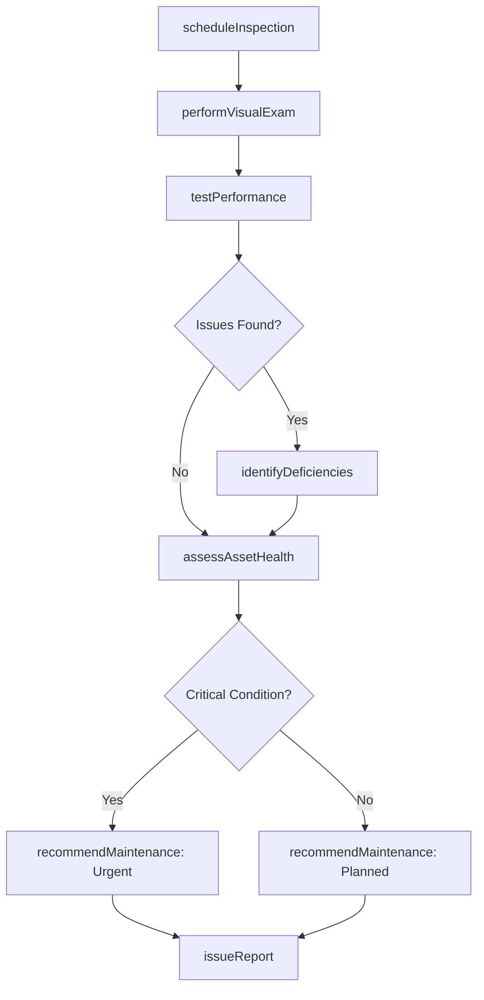
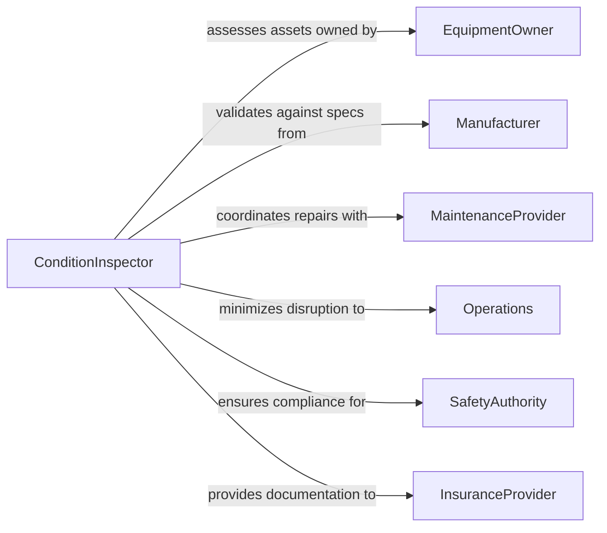

# Inspect Condition Functioning Facilities Equipment

> Business-as-Code definition for inspecting the operational condition and functional status of facilities and equipment. Models the complete condition assessment process from visual examination through performance testing and maintenance recommendations.

## Overview

Facility and equipment condition inspection identifies operational issues, wear patterns, and maintenance needs to ensure reliable performance and prevent failures. This definition provides actions for condition assessment, performance testing, and deficiency tracking with events for automated maintenance scheduling and asset lifecycle management.

## Actors

| Actor | Description |
|-------|-------------|
| EquipmentOwner | Manages assets requiring condition monitoring |
| Manufacturer | Provides operational specifications and guidelines |
| MaintenanceProvider | Executes repairs based on inspection findings |
| Operations | Relies on equipment availability for production |
| SafetyAuthority | Enforces equipment safety standards |
| InsuranceProvider | Requires condition documentation for coverage |

## Roles

| Role | Description |
|------|-------------|
| ConditionInspector | Performs visual and operational assessments |
| MaintenancePlanner | Schedules corrective work based on findings |
| ReliabilityEngineer | Analyzes failure trends and lifecycle data |
| SafetyOfficer | Validates equipment safety compliance |

## Entities

| Entity | Description |
|--------|-------------|
| InspectionRoute | Defined schedule of equipment to assess |
| ConditionReport | Documentation of physical and functional status |
| PerformanceTest | Operational verification against specifications |
| Deficiency | Identified issue requiring corrective action |
| MaintenanceRecommendation | Prescribed repair or replacement work |
| AssetHealthScore | Quantitative assessment of equipment condition |

## Actions

| Action | Description |
|--------|-------------|
| scheduleInspection | Create condition assessment plan for assets |
| performVisualExam | Execute physical condition examination |
| testPerformance | Verify operational parameters against specs |
| identifyDeficiencies | Document issues and degradation |
| assessAssetHealth | Calculate condition score and remaining life |
| recommendMaintenance | Prescribe corrective actions and priority |
| issueReport | Publish formal condition assessment |

## Events

| Event | Description |
|-------|-------------|
| inspectionScheduled | Assessment plan has been created |
| visualExamPerformed | Physical examination is complete |
| performanceTested | Operational verification is complete |
| deficienciesIdentified | Issues have been documented |
| assetHealthAssessed | Condition score has been calculated |
| maintenanceRecommended | Corrective actions have been prescribed |
| reportIssued | Formal assessment has been published |

## Searches

| Search | Description |
|--------|-------------|
| findInspections | List inspections by asset, route, or date |
| getConditionReports | Retrieve assessment documentation |
| getDeficiencies | Find issues by severity or asset type |
| getHealthScores | Analyze asset condition trends over time |

## Workflow



## Actor Relationships



## Usage

### Calling Actions

```typescript
import { inspectConditionFunctioningFacilitiesEquipment } from '@headlessly/inspect-condition-functioning-facilities-equipment'

const inspection = inspectConditionFunctioningFacilitiesEquipment()

// Schedule monthly inspection route
const route = await inspection.scheduleInspection({
  routeName: 'Production Equipment Monthly',
  assets: ['PUMP-101', 'MOTOR-205', 'CONVEYOR-A3', 'HVAC-UNIT-12'],
  frequency: 'Monthly',
  nextInspectionDate: '2026-03-01',
  inspector: 'T.Wilson'
})

// Perform visual examination
await inspection.performVisualExam({
  routeId: route.id,
  assetId: 'PUMP-101',
  findings: [
    { area: 'Pump Casing', condition: 'Good', notes: 'No visible corrosion' },
    { area: 'Motor Coupling', condition: 'Fair', notes: 'Minor wear on rubber element' },
    { area: 'Seal Assembly', condition: 'Poor', notes: 'Active leakage observed' },
    { area: 'Foundation Bolts', condition: 'Good', notes: 'Properly torqued' }
  ]
})

// Test operational performance
await inspection.testPerformance({
  routeId: route.id,
  assetId: 'PUMP-101',
  parameters: [
    { parameter: 'Flow Rate', specification: '500 GPM', actual: '485 GPM', status: 'Below Spec' },
    { parameter: 'Discharge Pressure', specification: '85 PSI', actual: '82 PSI', status: 'Below Spec' },
    { parameter: 'Motor Current', specification: '45 Amps', actual: '48 Amps', status: 'Above Spec' },
    { parameter: 'Vibration', specification: '<0.3 in/sec', actual: '0.2 in/sec', status: 'Within Spec' }
  ]
})

// Identify deficiencies
await inspection.identifyDeficiencies({
  routeId: route.id,
  assetId: 'PUMP-101',
  deficiencies: [
    {
      issue: 'Mechanical Seal Failure',
      severity: 'Critical',
      impact: 'Active leak causing performance degradation',
      rootCause: 'End of service life'
    }
  ]
})

// Recommend maintenance
await inspection.recommendMaintenance({
  routeId: route.id,
  assetId: 'PUMP-101',
  recommendations: [
    {
      action: 'Replace mechanical seal assembly',
      priority: 'Urgent',
      estimatedCost: 2500,
      downtime: '4 hours',
      dueDate: '2026-02-10'
    }
  ]
})
```

### Event-Driven Automation

```typescript
// Alert on critical deficiency
inspection.deficienciesIdentified(async ({ assetId, deficiencies }) => {
  const critical = deficiencies.filter(d => d.severity === 'Critical')
  if (critical.length > 0) {
    await notify({
      to: 'maintenance-team@facility.com',
      priority: 'High',
      subject: `Critical deficiency - Asset ${assetId}`,
      body: `${critical.length} critical issues requiring immediate attention`
    })
  }
})

// Auto-create work orders for urgent maintenance
inspection.maintenanceRecommended(async ({ assetId, recommendations }) => {
  const urgent = recommendations.filter(r => r.priority === 'Urgent')
  for (const rec of urgent) {
    await createWorkOrder({
      assetId,
      description: rec.action,
      priority: 'Urgent',
      dueDate: rec.dueDate,
      estimatedCost: rec.estimatedCost
    })
  }
})
```
