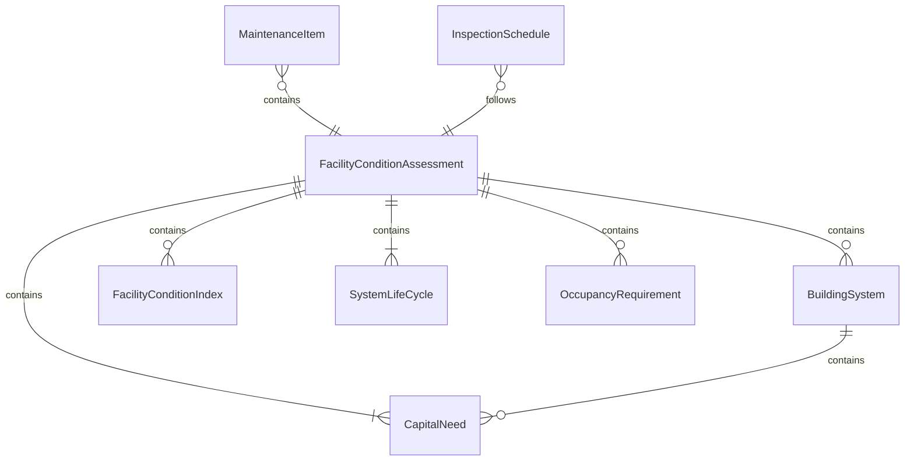
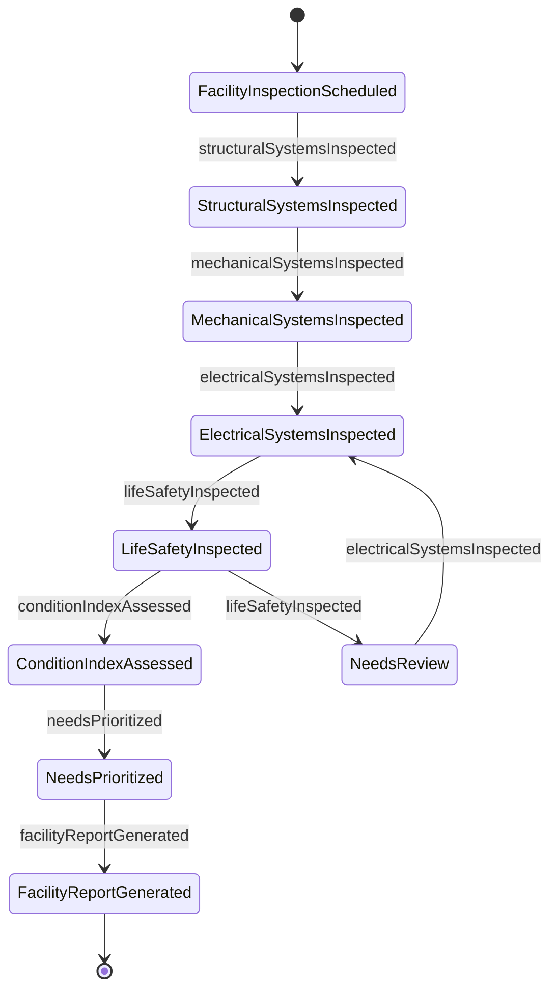
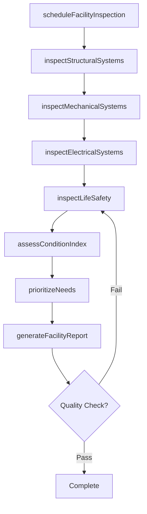
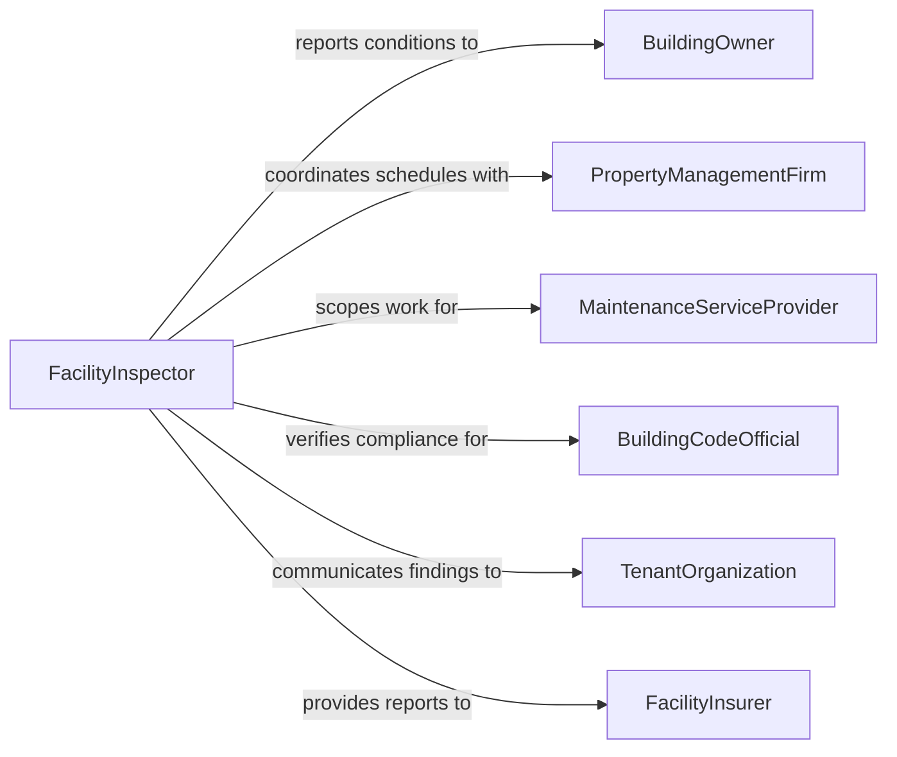

# Inspect Facilities

> Business-as-Code definition for inspecting facilities. Models the general facility inspection workflow of surveying building systems, structural elements, and operational areas to assess condition, identify maintenance needs, and ensure ongoing operational readiness.

## Overview

Inspecting facilities involves conducting comprehensive evaluations of commercial, industrial, institutional, and residential buildings to assess the condition of structural systems, mechanical equipment, electrical infrastructure, plumbing, and life safety systems. This definition covers routine maintenance inspections, pre-lease assessments, due diligence evaluations, and annual building condition surveys. It supports property management companies, corporate real estate departments, school districts, healthcare systems, and government facility programs.

## Actors

| Actor | Description |
|-------|-------------|
| BuildingOwner | Commissions facility inspections and funds maintenance and capital improvements |
| PropertyManagementFirm | Manages day-to-day facility operations and coordinates inspection programs |
| MaintenanceServiceProvider | Performs repairs and preventive maintenance based on inspection findings |
| BuildingCodeOfficial | Enforces local building and occupancy codes during periodic inspections |
| TenantOrganization | Occupies the facility and reports condition issues |
| FacilityInsurer | Requires periodic condition reports for coverage and premium determinations |

## Roles

| Role | Description |
|------|-------------|
| FacilityInspector | Performs comprehensive building system evaluations and documents conditions |
| BuildingEngineer | Maintains building mechanical and electrical systems and supports inspection findings |
| PropertyManager | Coordinates inspection schedules and manages the response to findings |
| CapitalPlanningAnalyst | Incorporates inspection data into long-term facility investment plans |

## Entities

| Entity | Description |
|--------|-------------|
| FacilityConditionAssessment | A comprehensive evaluation of all building systems and components |
| BuildingSystem | A major functional system such as HVAC, electrical, plumbing, or structural |
| MaintenanceItem | A specific condition requiring routine or corrective maintenance |
| CapitalNeed | A significant repair or replacement that requires capital budget allocation |
| FacilityConditionIndex | A ratio comparing deferred maintenance to current replacement value |
| InspectionSchedule | A calendar of planned facility inspections by building and system |
| SystemLifeCycle | The expected useful life remaining for a major building component |
| OccupancyRequirement | A code or regulatory requirement that must be met for continued building use |

## Actions

| Action | Description |
|--------|-------------|
| scheduleFacilityInspection | Plan and calendar an inspection for a specific building or campus |
| inspectStructuralSystems | Evaluate foundations, framing, roofing, and building envelope |
| inspectMechanicalSystems | Check HVAC equipment, plumbing, and fire protection systems |
| inspectElectricalSystems | Assess electrical distribution, lighting, and emergency power |
| inspectLifeSafety | Verify fire alarm, sprinkler, emergency lighting, and egress compliance |
| assessConditionIndex | Calculate the facility condition index from identified maintenance and capital needs |
| prioritizeNeeds | Rank maintenance and capital items by urgency, safety impact, and cost |
| generateFacilityReport | Compile all findings into a formal facility condition assessment report |

## Events

| Event | Description |
|-------|-------------|
| facilityInspectionScheduled | An inspection has been planned and calendared |
| structuralSystemsInspected | Foundation, framing, and envelope evaluation is complete |
| mechanicalSystemsInspected | HVAC, plumbing, and fire protection checks are complete |
| electricalSystemsInspected | Electrical distribution and emergency power assessment is complete |
| lifeSafetyInspected | Fire alarm, sprinkler, and egress compliance has been verified |
| conditionIndexAssessed | The facility condition index has been calculated |
| needsPrioritized | Maintenance and capital items have been ranked by urgency |
| facilityReportGenerated | A formal facility condition assessment report has been produced |

## Searches

| Search | Description |
|--------|-------------|
| findInspections | List facility inspections by building, date, or system |
| getMaintenanceItems | Retrieve identified maintenance needs by building, system, or priority |
| getCapitalNeeds | Query capital improvement needs by building, system, or estimated cost |
| getConditionIndices | Compare facility condition indices across a portfolio of buildings |
| getSystemLifeCycles | Access remaining useful life data for major building components |

## Entity Relationships



## State Diagram



## Workflow



## Actor Relationships



## Usage

### Calling Actions

```typescript
import { inspectFacilities } from '@headlessly/inspect-facilities'

const facilityInspection = inspectFacilities()

// Schedule and perform a facility condition assessment
const inspection = await facilityInspection.scheduleFacilityInspection({
  building: 'corporate-headquarters-tower-A',
  squareFootage: 250000,
  yearBuilt: 2008,
  systems: ['structural', 'mechanical', 'electrical', 'life-safety'],
  inspectionDate: '2026-03-01'
})

await facilityInspection.inspectStructuralSystems({
  inspectionId: inspection.id,
  elements: [
    { component: 'roof-membrane', condition: 'fair', remainingLife: 5, replacementCost: 450000 },
    { component: 'exterior-caulking', condition: 'poor', remainingLife: 1, replacementCost: 85000 },
    { component: 'foundation', condition: 'good', remainingLife: 40, replacementCost: 0 }
  ]
})

await facilityInspection.inspectMechanicalSystems({
  inspectionId: inspection.id,
  elements: [
    { component: 'chiller-1', condition: 'fair', remainingLife: 8, replacementCost: 320000 },
    { component: 'cooling-tower', condition: 'good', remainingLife: 12, replacementCost: 180000 },
    { component: 'boiler-1', condition: 'poor', remainingLife: 2, replacementCost: 150000 }
  ]
})

// Calculate condition index
const fci = await facilityInspection.assessConditionIndex({
  inspectionId: inspection.id,
  currentReplacementValue: 45000000
})
```

### Event-Driven Automation

```typescript
// Flag buildings with poor condition indices for capital planning
facilityInspection.conditionIndexAssessed(async ({ building, fci }) => {
  if (fci > 0.10) {
    await capitalPlanning.flagForReview({
      building,
      fci,
      urgency: fci > 0.30 ? 'critical' : 'elevated'
    })
    await notify({
      to: 'facilities-director',
      message: `${building} FCI at ${(fci * 100).toFixed(1)}% - exceeds 10% threshold`
    })
  }
})

// Auto-generate work orders for life-safety deficiencies
facilityInspection.lifeSafetyInspected(async ({ inspectionId, findings }) => {
  const deficiencies = findings.filter(f => f.condition === 'poor' || f.condition === 'critical')
  for (const item of deficiencies) {
    await maintenance.createWorkOrder({
      building: item.building,
      system: 'life-safety',
      component: item.component,
      priority: 'emergency',
      description: item.description
    })
  }
})
```
