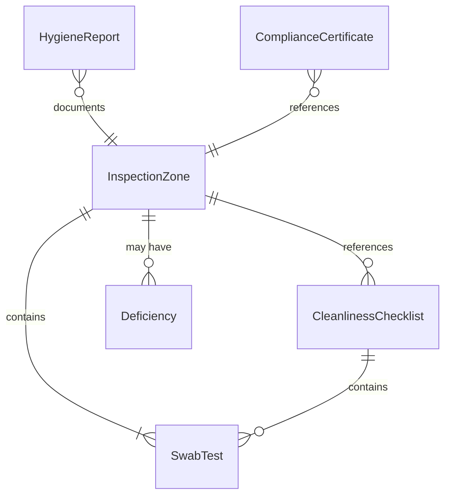
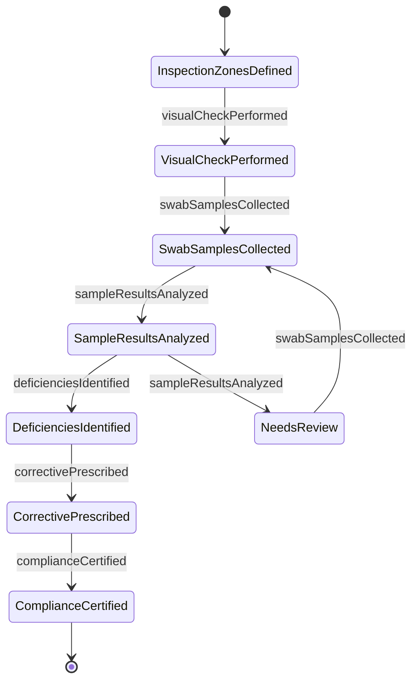
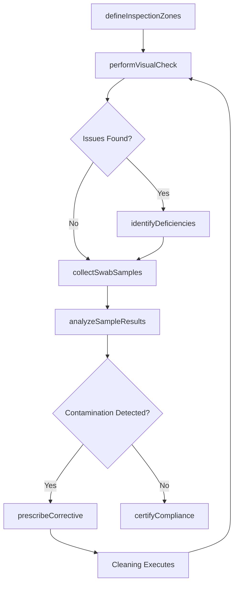
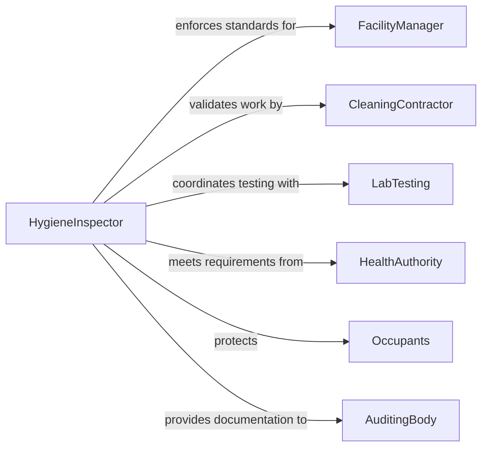

# Inspect Facilities Cleanliness

> Business-as-Code definition for inspecting facility cleanliness to ensure hygiene standards and regulatory compliance. Models the complete cleanliness verification process from zone assessment through corrective action and certification.

## Overview

Facility cleanliness inspection validates sanitation standards for healthcare, food service, manufacturing, and commercial environments. This definition provides actions for hygiene assessment, microbial testing, and compliance tracking with events for automated corrective action and audit trail generation.

## Actors

| Actor | Description |
|-------|-------------|
| FacilityManager | Oversees cleanliness standards and compliance |
| CleaningContractor | Provides sanitation services per specifications |
| HealthAuthority | Enforces hygiene and sanitation regulations |
| Occupants | Work in or visit facilities requiring cleanliness |
| LabTesting | Performs microbial and contamination analysis |
| AuditingBody | Validates compliance for certifications |

## Roles

| Role | Description |
|------|-------------|
| HygieneInspector | Performs visual and physical cleanliness checks |
| EnvironmentalServices | Executes cleaning and sanitation protocols |
| InfectionControl | Monitors pathogen prevention in healthcare |
| QualityAssurance | Validates compliance with cleanliness standards |

## Entities

| Entity | Description |
|--------|-------------|
| InspectionZone | Defined area with specific cleanliness requirements |
| CleanlinessChecklist | Structured verification items for standards |
| HygieneReport | Documentation of cleanliness assessment findings |
| SwabTest | Microbial contamination sample and analysis |
| Deficiency | Identified cleanliness issue requiring correction |
| ComplianceCertificate | Formal approval of hygiene standards |

## Actions

| Action | Description |
|--------|-------------|
| defineInspectionZones | Create cleanliness assessment areas and criteria |
| performVisualCheck | Execute visual examination of surfaces and areas |
| collectSwabSamples | Obtain microbial contamination samples |
| analyzeSampleResults | Review lab findings against thresholds |
| identifyDeficiencies | Document cleanliness issues and violations |
| prescribeCorrective | Define remediation actions for deficiencies |
| certifyCompliance | Issue formal hygiene standards approval |

## Events

| Event | Description |
|-------|-------------|
| inspectionZonesDefined | Assessment areas have been created |
| visualCheckPerformed | Visual examination is complete |
| swabSamplesCollected | Contamination samples have been obtained |
| sampleResultsAnalyzed | Lab findings have been reviewed |
| deficienciesIdentified | Cleanliness issues have been documented |
| correctivePrescribed | Remediation actions have been defined |
| complianceCertified | Formal approval has been issued |

## Searches

| Search | Description |
|--------|-------------|
| findInspectionZones | List zones by facility, type, or status |
| getHygieneReports | Retrieve cleanliness assessment documentation |
| getSwabResults | Find microbial test data by zone or date |
| getDeficiencies | Identify cleanliness violations by severity |

## Entity Relationships



## State Diagram



## Workflow



## Actor Relationships



## Usage

### Calling Actions

```typescript
import { inspectFacilitiesCleanliness } from '@headlessly/inspect-facilities-cleanliness'

const inspection = inspectFacilitiesCleanliness()

// Define inspection zones for hospital wing
const zones = await inspection.defineInspectionZones({
  facilityId: 'HOSPITAL-EAST-WING',
  zones: [
    { id: 'OR-1', name: 'Operating Room 1', classification: 'ISO Class 5', frequency: 'Daily' },
    { id: 'PATIENT-ROOMS', name: 'Patient Rooms 201-220', classification: 'General Care', frequency: 'Daily' },
    { id: 'CAFETERIA', name: 'Staff Cafeteria', classification: 'Food Service', frequency: 'Daily' }
  ]
})

// Perform visual cleanliness check
await inspection.performVisualCheck({
  zoneId: 'OR-1',
  checklistItems: [
    { item: 'Floor - No debris or stains', status: 'Pass' },
    { item: 'Surgical lights - Clean and dust-free', status: 'Pass' },
    { item: 'Equipment surfaces - Sanitized', status: 'Pass' },
    { item: 'Air vents - No dust accumulation', status: 'Fail', notes: 'Visible dust on north vent' }
  ],
  inspector: 'M.Chen, RN'
})

// Collect microbial swab samples
await inspection.collectSwabSamples({
  zoneId: 'OR-1',
  samples: [
    { location: 'Surgical Table', sampleId: 'SWAB-2026-0205-001' },
    { location: 'Door Handle', sampleId: 'SWAB-2026-0205-002' },
    { location: 'Light Switch', sampleId: 'SWAB-2026-0205-003' }
  ],
  collectedBy: 'Lab Tech R.Martinez',
  testingLab: 'Hospital Microbiology Lab'
})

// Analyze sample results
await inspection.analyzeSampleResults({
  zoneId: 'OR-1',
  results: [
    { sampleId: 'SWAB-2026-0205-001', cfu: 0, threshold: '<5 CFU/cm²', status: 'Pass' },
    { sampleId: 'SWAB-2026-0205-002', cfu: 3, threshold: '<5 CFU/cm²', status: 'Pass' },
    { sampleId: 'SWAB-2026-0205-003', cfu: 12, threshold: '<5 CFU/cm²', status: 'Fail' }
  ]
})

// Identify deficiencies
await inspection.identifyDeficiencies({
  zoneId: 'OR-1',
  deficiencies: [
    {
      issue: 'Air vent dust accumulation',
      severity: 'Minor',
      impact: 'Potential contamination of sterile field'
    },
    {
      issue: 'Elevated microbial count on light switch',
      severity: 'Major',
      impact: 'Hand contact surface exceeds sterile standards'
    }
  ]
})

// Prescribe corrective action
await inspection.prescribeCorrective({
  zoneId: 'OR-1',
  actions: [
    {
      deficiency: 'Air vent dust',
      action: 'Clean and sanitize all air vents',
      assignedTo: 'Environmental Services',
      dueDate: '2026-02-06'
    },
    {
      deficiency: 'Light switch contamination',
      action: 'Re-sanitize all touch surfaces and retest',
      assignedTo: 'Environmental Services',
      dueDate: '2026-02-06',
      verificationRequired: true
    }
  ]
})
```

### Event-Driven Automation

```typescript
// Alert on critical contamination
inspection.sampleResultsAnalyzed(async ({ zoneId, results }) => {
  const failures = results.filter(r => r.status === 'Fail')
  if (failures.length > 0) {
    await notify({
      to: 'infection-control@hospital.org',
      priority: 'High',
      subject: `Contamination detected - Zone ${zoneId}`,
      body: `${failures.length} samples exceeded microbial thresholds`
    })
  }
})

// Track corrective action completion
inspection.correctivePrescribed(async ({ zoneId, actions }) => {
  for (const action of actions) {
    await createTask({
      taskType: 'Corrective Cleaning',
      zoneId,
      description: action.action,
      assignee: action.assignedTo,
      dueDate: action.dueDate,
      requiresVerification: action.verificationRequired
    })
  }
})
```
