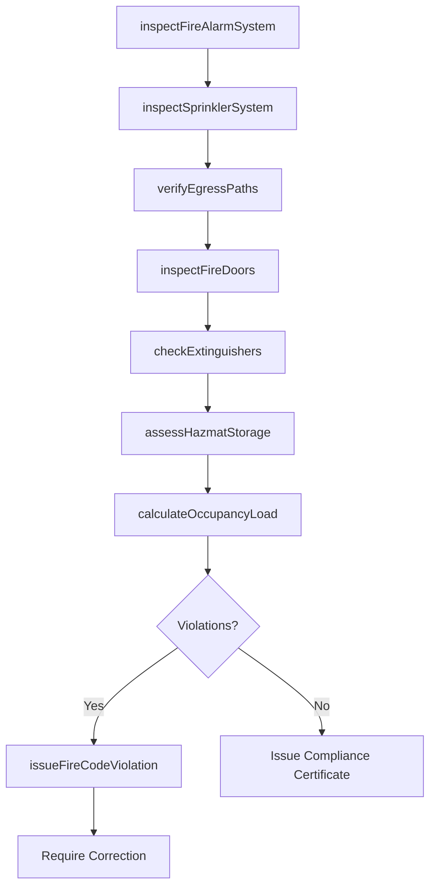
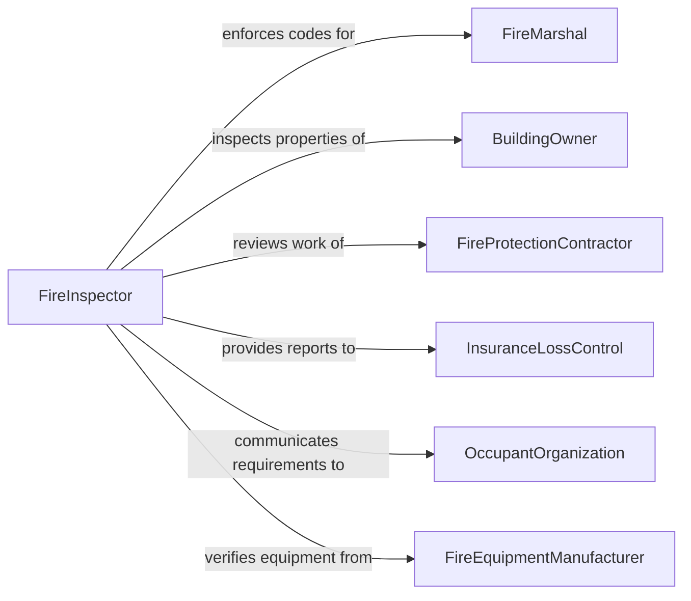

# Inspect Facilities to Ensure Compliance with Fire Regulations

> Business-as-Code definition for inspecting facilities to ensure compliance with fire regulations. Models the fire safety inspection workflow of evaluating fire protection systems, egress paths, fire separation assemblies, and hazardous materials storage against NFPA codes and local fire prevention ordinances.

## Overview

Inspecting facilities to ensure compliance with fire regulations involves conducting detailed evaluations of fire protection systems, means of egress, fire-rated assemblies, hazardous materials storage, and emergency preparedness to verify conformance with NFPA codes, International Fire Code, and local fire prevention ordinances. This definition covers fire alarm and sprinkler system inspections, egress pathway verification, fire door and damper testing, fire extinguisher servicing, and occupancy load compliance. It supports fire departments, fire marshal offices, insurance loss prevention, and building management operations.

## Actors

| Actor | Description |
|-------|-------------|
| FireMarshal | Enforces fire codes and issues occupancy permits based on inspection compliance |
| BuildingOwner | Maintains fire protection systems and ensures ongoing code compliance |
| FireProtectionContractor | Services, tests, and repairs fire alarm, sprinkler, and suppression systems |
| InsuranceLossControl | Assesses fire risk for underwriting and recommends loss prevention improvements |
| OccupantOrganization | Maintains fire safety practices within their leased or owned spaces |
| FireEquipmentManufacturer | Provides fire detection, suppression, and alarm equipment |

## Roles

| Role | Description |
|------|-------------|
| FireInspector | Conducts official fire code compliance inspections and issues citations |
| FireProtectionEngineer | Designs and evaluates fire protection systems for code compliance |
| BuildingFireSafetyDirector | Manages building fire safety programs and coordinates with fire department |
| FireExtinguisherTechnician | Services, inspects, and certifies portable fire extinguishers |

## Entities

| Entity | Description |
|--------|-------------|
| FireInspectionReport | A formal document recording fire code compliance findings |
| FireCodeViolation | A documented non-compliance with a specific fire prevention regulation |
| SprinklerTestReport | Documentation of sprinkler system flow, pressure, and operational testing |
| FireAlarmTestRecord | Results of fire alarm system device testing and signal verification |
| EgressAnalysis | An evaluation of exit pathways, travel distances, and occupant capacity |
| FireDoorInspection | A verification that fire-rated doors close, latch, and seal properly |
| OccupancyLoadCalculation | A determination of maximum permitted occupants based on code requirements |
| HazmatStorageAssessment | An evaluation of hazardous materials storage against fire code limits |

## Actions

| Action | Description |
|--------|-------------|
| inspectFireAlarmSystem | Test fire detection devices, notification appliances, and monitoring connections |
| inspectSprinklerSystem | Verify sprinkler heads, piping, valves, and water supply adequacy |
| verifyEgressPaths | Confirm exit corridors, stairways, and discharge points are clear and properly marked |
| inspectFireDoors | Check fire-rated doors for proper closure, latching, and seal integrity |
| checkExtinguishers | Verify portable fire extinguisher placement, servicing, and accessibility |
| assessHazmatStorage | Evaluate flammable and combustible materials storage against code allowances |
| calculateOccupancyLoad | Determine maximum permitted occupancy based on exit capacity and floor area |
| issueFireCodeViolation | Document and cite specific fire code non-compliance findings |

## Events

| Event | Description |
|-------|-------------|
| fireAlarmInspected | Fire alarm system testing has been completed |
| sprinklerSystemInspected | Sprinkler system verification is complete |
| egressPathsVerified | Exit pathway clearance and marking have been confirmed |
| fireDoorsInspected | Fire-rated door inspection and testing is complete |
| extinguishersChecked | Portable fire extinguisher compliance has been verified |
| hazmatStorageAssessed | Hazardous materials storage compliance has been evaluated |
| occupancyLoadCalculated | Maximum permitted occupancy has been determined |
| fireCodeViolationIssued | A fire code non-compliance finding has been formally cited |

## Searches

| Search | Description |
|--------|-------------|
| findInspections | List fire inspections by building, date, or outcome |
| getViolations | Retrieve fire code violations by building, code section, or status |
| getSprinklerTests | Query sprinkler system test reports by building, date, or result |
| getAlarmTests | Access fire alarm test records by building, device, or date |
| getOccupancyLoads | Look up calculated occupancy loads by building or floor |

## Workflow



## Actor Relationships



## Usage

### Calling Actions

```typescript
import { inspectFacilitiesEnsureComplianceFire } from '@headlessly/inspect-facilities-ensure-compliance-fire'

const fireInspection = inspectFacilitiesEnsureComplianceFire()

// Inspect fire alarm system
const alarm = await fireInspection.inspectFireAlarmSystem({
  building: 'midtown-office-tower',
  system: 'Notifier-NFS2-3030',
  tests: [
    { device: 'smoke-detector-floor-3-zone-A', type: 'photoelectric', result: 'pass' },
    { device: 'pull-station-stairwell-B-floor-5', type: 'manual', result: 'pass' },
    { device: 'horn-strobe-corridor-floor-7', type: 'notification', result: 'fail-dim' }
  ],
  monitoringSignal: 'verified-central-station'
})

// Inspect sprinkler system
await fireInspection.inspectSprinklerSystem({
  building: 'midtown-office-tower',
  system: 'wet-pipe',
  tests: [
    { test: 'main-drain-flow', staticPsi: 95, residualPsi: 82, result: 'pass' },
    { test: 'inspector-test-valve', flowSwitch: 'activated-within-90-seconds', result: 'pass' },
    { test: 'visual-heads', painted: 0, corroded: 2, obstructed: 0 }
  ]
})

// Verify egress paths
await fireInspection.verifyEgressPaths({
  building: 'midtown-office-tower',
  floors: [
    { floor: 3, exitCount: 2, travelDistance: 180, maxAllowed: 250, obstructions: [] },
    { floor: 7, exitCount: 2, travelDistance: 200, maxAllowed: 250, obstructions: ['storage-in-corridor'] }
  ]
})

// Issue violation for obstruction
await fireInspection.issueFireCodeViolation({
  building: 'midtown-office-tower',
  violations: [
    { code: 'NFPA-1-10.3.2', description: 'Storage in exit corridor on floor 7', severity: 'serious', correctionDeadline: '48-hours' },
    { code: 'NFPA-72-10.6.7', description: 'Notification appliance dim on floor 7', severity: 'moderate', correctionDeadline: '30-days' }
  ]
})
```

### Event-Driven Automation

```typescript
// Restrict occupancy when life safety violations are found
fireInspection.fireCodeViolationIssued(async ({ building, violations }) => {
  const lifeSafety = violations.filter(v => v.severity === 'critical' || v.code.includes('egress'))
  if (lifeSafety.length > 0) {
    await buildingOps.restrictOccupancy({
      building,
      restriction: 'reduced-capacity',
      reason: `Fire code violations affecting life safety`
    })
    await notify({
      to: 'building-fire-safety-director',
      message: `${building}: ${lifeSafety.length} life safety violation(s) require immediate correction`
    })
  }
})

// Schedule sprinkler maintenance when test results indicate issues
fireInspection.sprinklerSystemInspected(async ({ building, tests }) => {
  const corroded = tests.find(t => t.test === 'visual-heads' && t.corroded > 0)
  if (corroded) {
    await maintenance.scheduleService({
      building,
      system: 'fire-sprinkler',
      task: `Replace ${corroded.corroded} corroded sprinkler heads`,
      priority: 'within-30-days'
    })
  }
})
```
