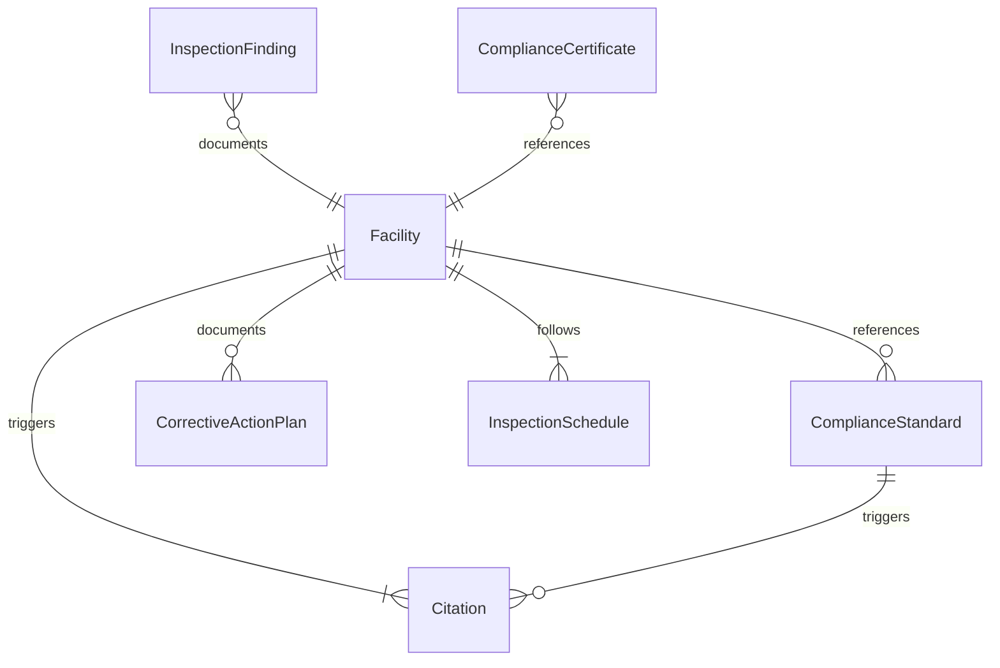
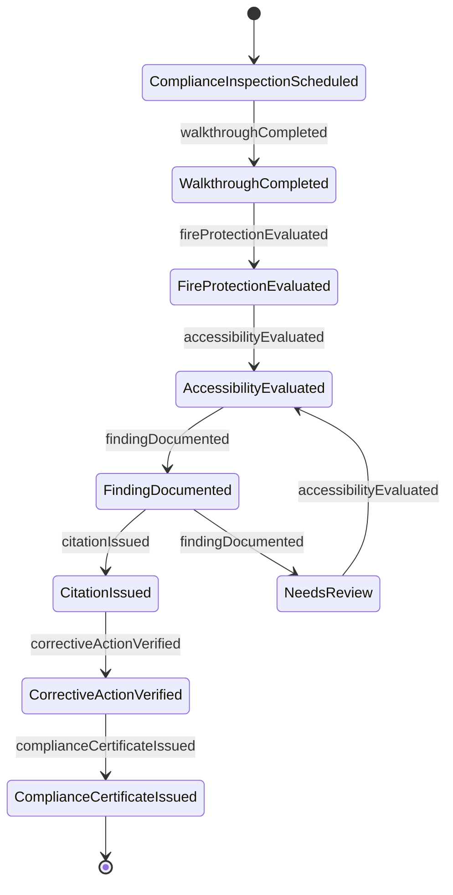
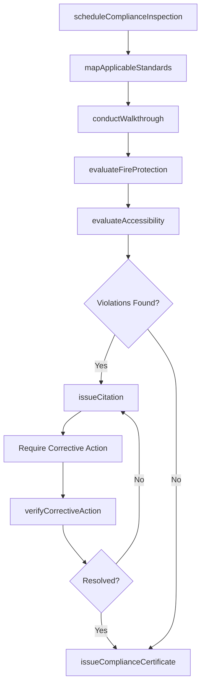
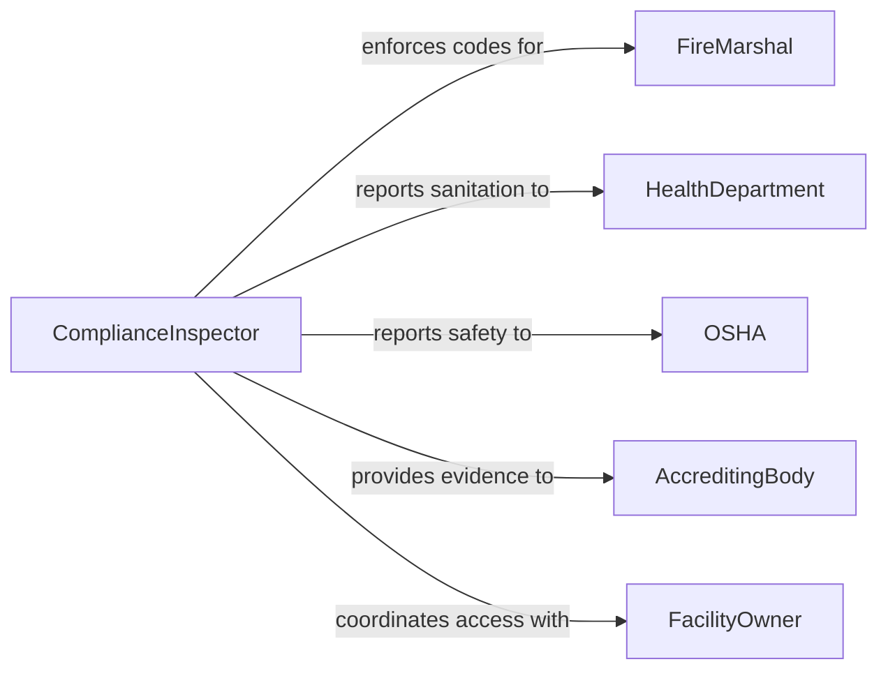

# Inspect Facilities to Ensure Compliance with Safety Standards

> Business-as-Code definition for inspecting facilities to ensure compliance with safety, quality, or service standards. Models the compliance inspection lifecycle from standards mapping through finding resolution and certification.

## Overview

Inspecting facilities to ensure compliance with safety, quality, or service standards involves evaluating physical spaces against applicable regulatory codes, industry standards, and organizational policies. Inspectors assess fire protection systems, emergency egress, ADA accessibility, food safety practices, hazardous material storage, electrical code compliance, occupancy limits, and workplace safety conditions. This activity supports healthcare accreditation, hospitality quality programs, manufacturing safety audits, educational facility assessments, and general workplace compliance. Findings are documented as citations with required corrective timelines.

## Actors

| Actor | Description |
|-------|-------------|
| FireMarshal | Enforces fire code compliance including suppression systems, egress, and occupancy |
| HealthDepartment | Inspects food service, healthcare, and public assembly facilities for sanitation and safety |
| OSHA | Enforces workplace safety standards and investigates hazard complaints |
| AccreditingBody | Evaluates facility compliance for industry-specific accreditation programs |
| FacilityOwner | Responsible for maintaining the facility in compliance with applicable standards |
| BuildingDepartment | Enforces building codes related to structural, mechanical, and electrical systems |

## Roles

| Role | Description |
|------|-------------|
| ComplianceInspector | Conducts standards-based facility inspections and documents findings |
| SafetyOfficer | Manages the facility safety program and coordinates corrective actions |
| QualityAssuranceManager | Oversees quality and service standard compliance for the facility |
| FireProtectionEngineer | Evaluates fire suppression, detection, and egress systems |
| EnvironmentalHealthSpecialist | Inspects for hazardous materials, indoor air quality, and sanitation compliance |

## Entities

| Entity | Description |
|--------|-------------|
| Facility | A building or site subject to compliance inspection |
| ComplianceStandard | A regulatory code, industry standard, or organizational policy being evaluated |
| InspectionFinding | A documented observation of compliance or non-compliance with a specific standard |
| Citation | A formal notice of a code violation requiring corrective action within a deadline |
| CorrectiveActionPlan | A documented plan to resolve identified compliance deficiencies |
| ComplianceCertificate | Formal confirmation that a facility meets all applicable standards |
| InspectionSchedule | Planned calendar of periodic compliance inspections |

## Actions

| Action | Description |
|--------|-------------|
| scheduleComplianceInspection | Plan an inspection based on regulatory intervals or accreditation requirements |
| mapApplicableStandards | Identify which codes and standards apply to a specific facility type |
| conductWalkthrough | Physically inspect all areas of the facility against applicable standards |
| evaluateFireProtection | Assess fire alarm, sprinkler, extinguisher, and egress compliance |
| evaluateAccessibility | Check ADA and accessibility compliance for entrances, restrooms, and pathways |
| documentFinding | Record a specific compliance or non-compliance observation with evidence |
| issueCitation | Formally cite a code violation with a required correction deadline |
| verifyCorrectiveAction | Confirm that previously cited violations have been properly resolved |
| issueComplianceCertificate | Certify that the facility meets all applicable standards |

## Events

| Event | Description |
|-------|-------------|
| complianceInspectionScheduled | A facility compliance inspection has been placed on the calendar |
| walkthroughCompleted | The physical inspection of all facility areas has been finished |
| fireProtectionEvaluated | Fire safety systems and egress have been assessed |
| accessibilityEvaluated | ADA and accessibility features have been checked |
| findingDocumented | A compliance observation has been formally recorded |
| citationIssued | A code violation has been formally cited with a correction deadline |
| correctiveActionVerified | A previously cited violation has been confirmed as resolved |
| complianceCertificateIssued | The facility has been certified as meeting all applicable standards |

## Searches

| Search | Description |
|--------|-------------|
| findFacilitiesDueForInspection | List facilities with upcoming or overdue compliance inspections |
| getOpenCitations | Retrieve unresolved code violations for a facility |
| findFacilitiesByComplianceStatus | List facilities grouped by their current compliance certification status |
| getCitationHistory | Retrieve historical violations and resolutions for a facility |
| getCorrectiveActionStatus | Check progress on corrective action plans across facilities |

## Entity Relationships



## State Diagram



## Workflow



## Actor Relationships



## Usage

### Calling Actions

```typescript
import { inspectFacilitiesToEnsureComplianceWithSafetyStandards } from '@headlessly/inspect-facilities-to-ensure-compliance-with-safety-standards'

const inspector = inspectFacilitiesToEnsureComplianceWithSafetyStandards()

// Schedule a compliance inspection for a restaurant
const inspection = await inspector.scheduleComplianceInspection({
  facilityId: 'FAC-REST-1150',
  facilityType: 'foodService',
  inspectionType: 'routine',
  assignedTo: 'inspector-lmorales'
})

// Map applicable standards for the facility type
const standards = await inspector.mapApplicableStandards({
  facilityId: 'FAC-REST-1150',
  applicableCodes: ['fireCode', 'healthCode', 'buildingCode', 'adaAccessibility']
})

// Evaluate fire protection systems
await inspector.evaluateFireProtection({
  inspectionId: inspection.id,
  findings: [
    { item: 'sprinklerSystem', status: 'compliant', lastServiceDate: '2025-11-15' },
    { item: 'exitSigns', status: 'compliant' },
    { item: 'fireExtinguishers', status: 'nonCompliant', note: 'Kitchen extinguisher expired 2025-09-30' },
    { item: 'egressPaths', status: 'compliant' }
  ]
})

// Issue citation for expired fire extinguisher
await inspector.issueCitation({
  inspectionId: inspection.id,
  codeSection: 'IFC-906.2',
  violation: 'Fire extinguisher past annual service date',
  location: 'kitchen',
  correctionDeadline: '2026-03-15',
  severity: 'moderate'
})
```

### Event-Driven Automation

```typescript
// Notify facility owners when citations are issued
inspector.citationIssued(async ({ facilityId, codeSection, violation, correctionDeadline }) => {
  await notify({
    to: 'facility-owner',
    message: `Citation issued for ${facilityId}: ${codeSection} - ${violation}. Correction required by ${correctionDeadline}.`
  })
})

// Auto-schedule re-inspection when corrective action deadline approaches
inspector.citationIssued(async ({ facilityId, inspectionId, correctionDeadline }) => {
  await inspector.scheduleComplianceInspection({
    facilityId,
    inspectionType: 'reinspection',
    parentInspectionId: inspectionId,
    scheduledDate: correctionDeadline
  })
})
```
