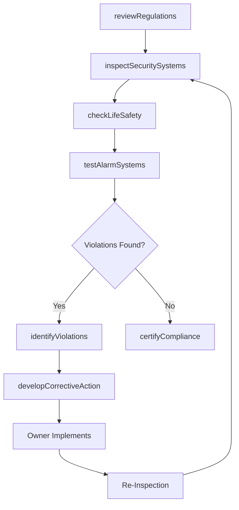
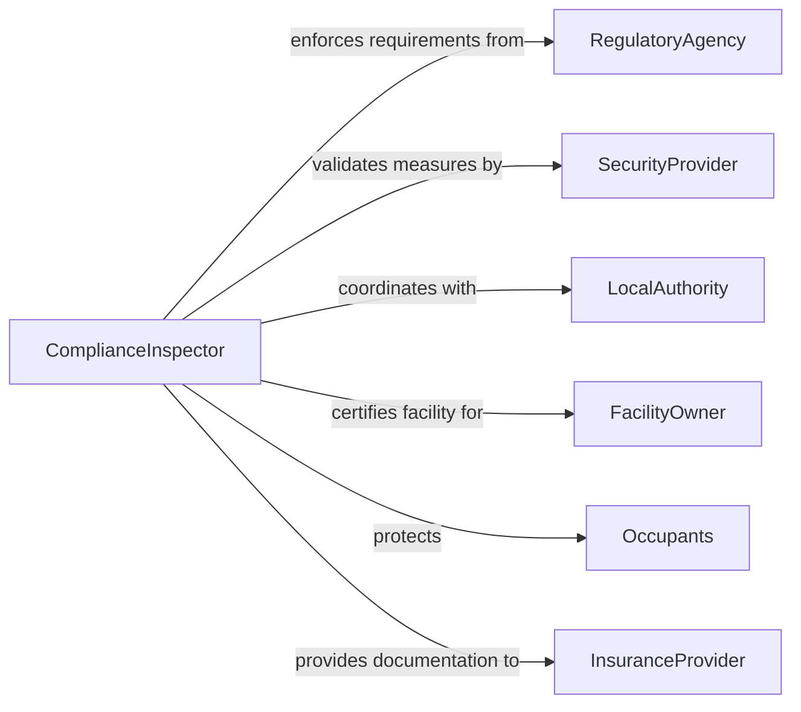

# Inspect Facilities Ensure Compliance Security

> Business-as-Code definition for inspecting facilities to verify compliance with security and safety regulations. Models the complete compliance inspection process from regulatory review through deficiency remediation and certification.

## Overview

Facility compliance inspection validates adherence to security protocols, life safety codes, and regulatory requirements for commercial, industrial, and institutional buildings. This definition provides actions for security assessment, code verification, and violation tracking with events for automated compliance monitoring and audit preparation.

## Actors

| Actor | Description |
|-------|-------------|
| RegulatoryAgency | Enforces building codes and safety standards |
| FacilityOwner | Maintains property and ensures compliance |
| SecurityProvider | Implements physical security measures |
| Occupants | Work in or visit facilities requiring protection |
| InsuranceProvider | Requires compliance for liability coverage |
| LocalAuthority | Enforces fire safety and building codes |

## Roles

| Role | Description |
|------|-------------|
| ComplianceInspector | Verifies regulatory adherence and security measures |
| SafetyOfficer | Validates life safety systems and egress routes |
| SecurityAuditor | Assesses access control and surveillance systems |
| FireMarshal | Enforces fire protection and suppression standards |

## Entities

| Entity | Description |
|--------|-------------|
| ComplianceChecklist | Structured verification items for regulations |
| SecurityAssessment | Evaluation of access control and surveillance |
| SafetyInspectionReport | Documentation of life safety system findings |
| Violation | Identified non-compliance requiring correction |
| CorrectiveActionPlan | Remediation steps to address violations |
| ComplianceCertificate | Formal approval of regulatory conformance |

## Actions

| Action | Description |
|--------|-------------|
| reviewRegulations | Identify applicable codes and security standards |
| inspectSecuritySystems | Verify access control and surveillance functionality |
| checkLifeSafety | Validate fire protection and emergency egress |
| testAlarmSystems | Confirm fire and intrusion alarm operation |
| identifyViolations | Document non-compliance issues |
| developCorrectiveAction | Define remediation plan for violations |
| certifyCompliance | Issue formal regulatory approval |

## Events

| Event | Description |
|-------|-------------|
| regulationsReviewed | Applicable codes have been identified |
| securitySystemsInspected | Access control has been verified |
| lifeSafetyChecked | Fire protection has been validated |
| alarmSystemsTested | Alarm functionality has been confirmed |
| violationsIdentified | Non-compliance has been documented |
| correctiveActionDeveloped | Remediation plan has been created |
| complianceCertified | Formal approval has been issued |

## Searches

| Search | Description |
|--------|-------------|
| findInspections | List inspections by facility, date, or status |
| getViolations | Retrieve non-compliance issues by type or severity |
| getCorrectiveActions | Find remediation plans and completion status |
| getCertificates | Review active compliance certifications |

## Workflow



## Actor Relationships



## Usage

### Calling Actions

```typescript
import { inspectFacilitiesEnsureComplianceSecurity } from '@headlessly/inspect-facilities-ensure-compliance-security'

const inspection = inspectFacilitiesEnsureComplianceSecurity()

// Review applicable regulations for office building
const regulations = await inspection.reviewRegulations({
  facilityId: 'OFFICE-BUILDING-DOWNTOWN',
  facilityType: 'Commercial Office',
  occupancy: 'Business Group B',
  applicableCodes: [
    'IBC 2021 - International Building Code',
    'NFPA 101 - Life Safety Code',
    'NFPA 72 - Fire Alarm Code',
    'Local Ordinance 2025-42 - Security Standards'
  ]
})

// Inspect security systems
await inspection.inspectSecuritySystems({
  facilityId: 'OFFICE-BUILDING-DOWNTOWN',
  systems: [
    { system: 'Card Access Control', areas: '12 entry points', status: 'Functional' },
    { system: 'CCTV Surveillance', coverage: '24 cameras', status: 'Functional' },
    { system: 'Intrusion Detection', zones: '8 perimeter zones', status: 'Functional' },
    { system: 'Visitor Management', status: 'Functional' }
  ],
  inspector: 'J.Williams, CPP'
})

// Check life safety systems
await inspection.checkLifeSafety({
  facilityId: 'OFFICE-BUILDING-DOWNTOWN',
  checks: [
    { item: 'Fire Extinguishers', requirement: 'Inspected annually', status: 'Pass', lastInspection: '2025-11-15' },
    { item: 'Exit Signs', requirement: 'Illuminated and visible', status: 'Pass' },
    { item: 'Emergency Lighting', requirement: '90-minute battery backup', status: 'Fail', notes: '2nd floor east wing units not functional' },
    { item: 'Egress Routes', requirement: 'Clear and unobstructed', status: 'Pass' },
    { item: 'Fire Doors', requirement: 'Self-closing and latching', status: 'Pass' }
  ]
})

// Test alarm systems
await inspection.testAlarmSystems({
  facilityId: 'OFFICE-BUILDING-DOWNTOWN',
  tests: [
    { system: 'Fire Alarm', zones: '12 zones tested', notification: 'Audible and visual', status: 'Pass' },
    { system: 'Sprinkler Monitoring', status: 'Pass' },
    { system: 'Intrusion Alarm', delay: '30 seconds', notification: 'Central station', status: 'Pass' }
  ]
})

// Identify violations
await inspection.identifyViolations({
  facilityId: 'OFFICE-BUILDING-DOWNTOWN',
  violations: [
    {
      code: 'NFPA 101 Section 7.9',
      issue: 'Emergency lighting failure on 2nd floor east wing',
      severity: 'Major',
      hazard: 'Inadequate egress illumination during power loss'
    }
  ]
})

// Develop corrective action plan
await inspection.developCorrectiveAction({
  facilityId: 'OFFICE-BUILDING-DOWNTOWN',
  actions: [
    {
      violation: 'Emergency lighting failure',
      remedy: 'Replace battery packs in 6 emergency light units',
      assignedTo: 'Facility Maintenance',
      dueDate: '2026-02-20',
      estimatedCost: 1200,
      reinspectionRequired: true
    }
  ]
})
```

### Event-Driven Automation

```typescript
// Alert on major violations
inspection.violationsIdentified(async ({ facilityId, violations }) => {
  const major = violations.filter(v => v.severity === 'Major')
  if (major.length > 0) {
    await notify({
      to: 'facility-manager@company.com',
      priority: 'High',
      subject: `Major compliance violations - ${facilityId}`,
      body: `${major.length} major violations requiring immediate attention`
    })
  }
})

// Schedule reinspection after corrective action
inspection.correctiveActionDeveloped(async ({ facilityId, actions }) => {
  const requiresReinspection = actions.filter(a => a.reinspectionRequired)
  if (requiresReinspection.length > 0) {
    const latestDue = Math.max(...requiresReinspection.map(a => new Date(a.dueDate)))
    await scheduleInspection({
      facilityId,
      inspectionType: 'Reinspection',
      scheduledDate: addDays(latestDue, 7),
      reason: 'Verify corrective action completion'
    })
  }
})
```
