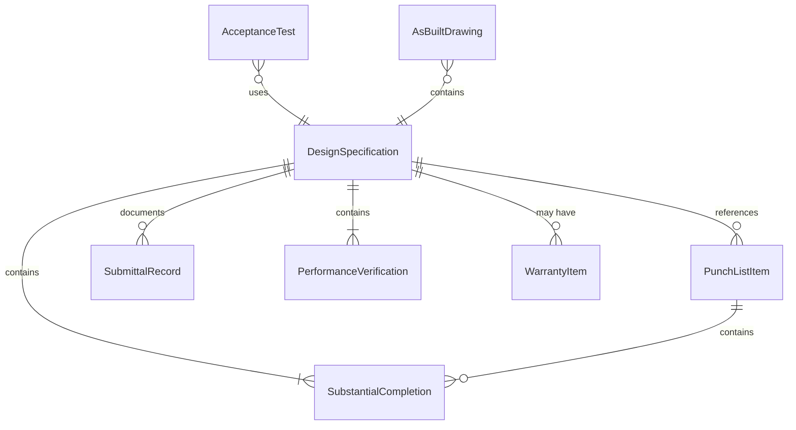
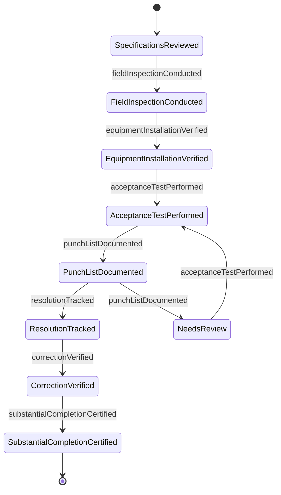
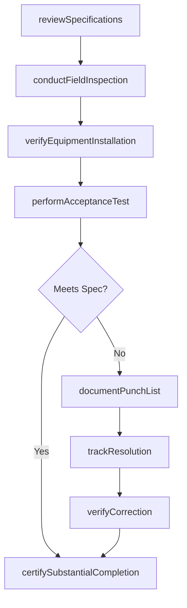
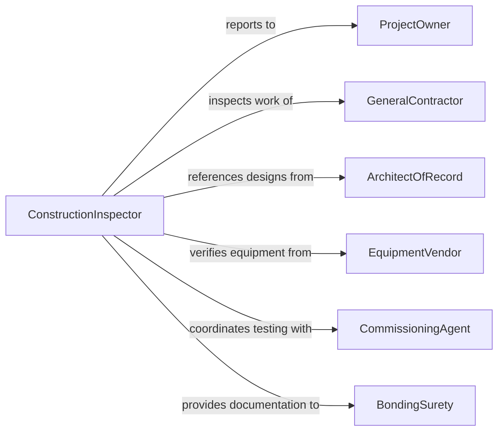

# Inspect Facilities or Equipment to Ensure Specifications Are Met

> Business-as-Code definition for inspecting facilities or equipment to ensure specifications are met. Models the specification verification workflow of comparing installed conditions against design documents, purchase orders, and engineering specifications to confirm that construction and equipment installations meet contractual requirements.

## Overview

Inspecting facilities or equipment to ensure specifications are met involves verifying that constructed facilities, installed equipment, and commissioned systems conform to approved design drawings, engineering specifications, and contractual requirements. This definition covers punch list inspections, equipment acceptance testing, commissioning verification, and substantial completion walkthroughs. It supports construction project management, capital project delivery, equipment procurement, and owner representation across commercial, industrial, and institutional construction projects.

## Actors

| Actor | Description |
|-------|-------------|
| ProjectOwner | Commissions the inspection to verify that contracted work meets specifications |
| GeneralContractor | Delivers the constructed facility and responds to punch list items |
| ArchitectOfRecord | Provides design documents against which installations are verified |
| EquipmentVendor | Supplies and installs equipment that must meet purchase specifications |
| CommissioningAgent | Conducts functional performance testing of building systems |
| BondingSurety | Requires verification of substantial completion for bond release |

## Roles

| Role | Description |
|------|-------------|
| ConstructionInspector | Verifies that installed work conforms to approved plans and specifications |
| CommissioningEngineer | Tests system performance against design intent documentation |
| ProjectEngineer | Reviews shop drawings, submittals, and field conditions for specification compliance |
| PunchListCoordinator | Tracks and manages resolution of specification deviations |

## Entities

| Entity | Description |
|--------|-------------|
| DesignSpecification | An approved document defining materials, methods, and performance requirements |
| PunchListItem | A specific deviation from specification identified during inspection |
| AcceptanceTest | A structured verification that equipment or systems perform as specified |
| SubstantialCompletion | A project milestone indicating the facility is fit for intended use |
| SubmittalRecord | Documentation of materials and equipment proposed by the contractor for approval |
| AsBuiltDrawing | A revised drawing reflecting actual installed conditions |
| PerformanceVerification | A test confirming that systems achieve specified operating parameters |
| WarrantyItem | A deficiency identified during the warranty period requiring contractor correction |

## Actions

| Action | Description |
|--------|-------------|
| reviewSpecifications | Examine design documents to establish inspection criteria |
| conductFieldInspection | Walk the facility to compare installed conditions against specifications |
| verifyEquipmentInstallation | Confirm that equipment is installed per manufacturer and design requirements |
| performAcceptanceTest | Execute structured tests to verify system or equipment performance |
| documentPunchList | Record specification deviations with descriptions, locations, and photographs |
| trackResolution | Monitor contractor progress in correcting punch list items |
| verifyCorrection | Confirm that corrected items now meet specification requirements |
| certifySubstantialCompletion | Issue documentation confirming the facility meets specifications for occupancy |

## Events

| Event | Description |
|-------|-------------|
| specificationsReviewed | Design documents have been examined and inspection criteria established |
| fieldInspectionConducted | An on-site comparison of installed conditions against specifications is complete |
| equipmentInstallationVerified | Equipment installation has been confirmed against requirements |
| acceptanceTestPerformed | System or equipment performance testing is complete |
| punchListDocumented | Specification deviations have been formally recorded |
| resolutionTracked | Progress on correcting punch list items has been updated |
| correctionVerified | A corrected item has been confirmed as meeting specifications |
| substantialCompletionCertified | The facility has been certified as meeting specifications for occupancy |

## Searches

| Search | Description |
|--------|-------------|
| findInspections | List specification inspections by project, date, or trade |
| getPunchListItems | Retrieve open punch list items by project, trade, or status |
| getAcceptanceTests | Query acceptance test results by system, equipment, or outcome |
| getSubmittals | Access submittal records by project, specification section, or approval status |
| getCompletionStatus | Check project completion percentage by trade or specification section |

## Entity Relationships



## State Diagram



## Workflow



## Actor Relationships



## Usage

### Calling Actions

```typescript
import { inspectFacilitiesEquipmentEnsureSpecifications } from '@headlessly/inspect-facilities-equipment-ensure-specifications'

const specInspection = inspectFacilitiesEquipmentEnsureSpecifications()

// Review specifications for a new data center
const review = await specInspection.reviewSpecifications({
  project: 'data-center-phase-2',
  sections: ['mechanical-HVAC', 'electrical-power', 'fire-suppression', 'structural'],
  drawingSet: 'IFC-rev-4'
})

// Conduct field inspection of HVAC installation
const inspection = await specInspection.conductFieldInspection({
  reviewId: review.id,
  area: 'server-hall-B',
  trade: 'mechanical-HVAC',
  inspector: 'PE-2026-0056',
  checks: [
    { item: 'CRAH-unit-B1', spec: '60-ton-precision-cooling', installed: '60-ton-precision-cooling', status: 'conforming' },
    { item: 'ductwork-supply-B', spec: 'galvanized-26-gauge', installed: 'galvanized-24-gauge', status: 'conforming' },
    { item: 'damper-FD-B3', spec: 'fire-damper-UL-555', installed: 'combination-fire-smoke', status: 'deviation' }
  ]
})

// Document punch list and track
await specInspection.documentPunchList({
  inspectionId: inspection.id,
  items: [
    { location: 'server-hall-B-damper-FD-B3', description: 'Installed combination fire-smoke damper instead of specified fire-only damper', trade: 'mechanical', severity: 'minor' }
  ]
})

// Perform acceptance test
await specInspection.performAcceptanceTest({
  project: 'data-center-phase-2',
  system: 'precision-cooling',
  tests: [
    { parameter: 'cooling-capacity', specified: 60, measured: 62, unit: 'tons', result: 'pass' },
    { parameter: 'supply-air-temp', specified: 55, measured: 54.8, unit: 'fahrenheit', result: 'pass' }
  ]
})
```

### Event-Driven Automation

```typescript
// Notify owner and architect when substantial completion is achieved
specInspection.substantialCompletionCertified(async ({ project, completionDate }) => {
  await notify({
    to: ['project-owner', 'architect-of-record'],
    message: `${project} has achieved substantial completion as of ${completionDate}`
  })
  await contracts.triggerMilestonePayment({
    project,
    milestone: 'substantial-completion'
  })
})

// Escalate unresolved punch list items approaching deadline
specInspection.punchListDocumented(async ({ project, items }) => {
  const critical = items.filter(i => i.severity === 'critical')
  if (critical.length > 0) {
    await notify({
      to: 'general-contractor',
      message: `${critical.length} critical punch list items on ${project} require immediate resolution`
    })
  }
})
```
