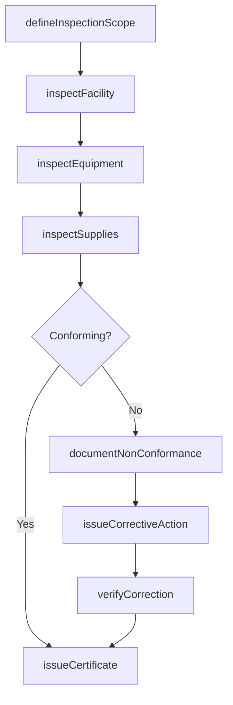
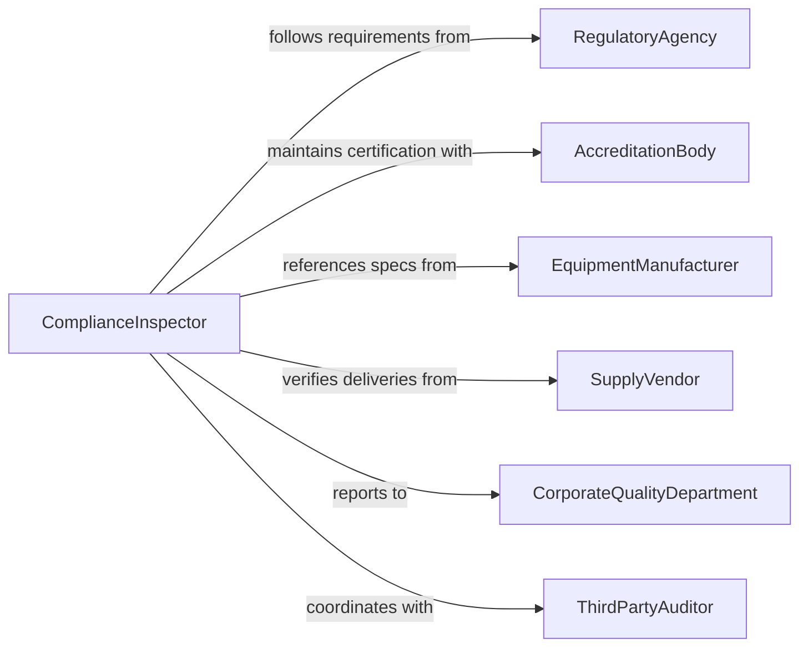

# Inspect Facilities, Equipment, or Supplies to Ensure Conformance to Standards

> Business-as-Code definition for inspecting facilities, equipment, or supplies to ensure conformance to standards. Models the compliance inspection workflow of verifying physical assets against regulatory requirements, industry standards, and organizational specifications.

## Overview

Inspecting facilities, equipment, or supplies to ensure conformance to standards involves verifying that physical assets, machinery, and material inventories meet documented specifications, regulatory requirements, and industry best practices. This definition covers standards-based auditing, equipment calibration verification, supply chain quality checks, and conformance documentation. It supports ISO 9001 quality management systems, GMP manufacturing environments, healthcare facility compliance, and military supply chain acceptance across regulated industries.

## Actors

| Actor | Description |
|-------|-------------|
| RegulatoryAgency | Establishes mandatory standards and conducts compliance audits |
| AccreditationBody | Certifies that facilities meet industry-specific accreditation standards |
| EquipmentManufacturer | Provides specifications and maintenance requirements for installed equipment |
| SupplyVendor | Delivers materials and supplies subject to incoming quality verification |
| CorporateQualityDepartment | Sets internal standards and monitors facility compliance enterprise-wide |
| ThirdPartyAuditor | Conducts independent conformance assessments for certification purposes |

## Roles

| Role | Description |
|------|-------------|
| ComplianceInspector | Performs systematic conformance checks against documented standards |
| QualityAuditor | Evaluates management system implementation and identifies non-conformances |
| CalibrationTechnician | Verifies measurement equipment accuracy against traceable standards |
| ReceivingSpecialist | Inspects incoming supplies and materials for specification compliance |

## Entities

| Entity | Description |
|--------|-------------|
| ConformanceStandard | A documented specification or regulation against which assets are evaluated |
| InspectionChecklist | A structured list of verification points derived from applicable standards |
| NonConformanceReport | A formal record of a deviation from required standards |
| CalibrationRecord | Documentation of measurement equipment accuracy verification |
| CertificateOfConformance | A document attesting that an item meets all applicable specifications |
| AuditFinding | An observation or deviation identified during a conformance audit |
| CorrectiveActionRequest | A formal request to resolve an identified non-conformance |
| ComplianceMatrix | A cross-reference linking facility elements to applicable regulatory requirements |

## Actions

| Action | Description |
|--------|-------------|
| defineInspectionScope | Identify applicable standards and create a checklist for the inspection |
| inspectFacility | Verify physical facility conditions against building, safety, and operational standards |
| inspectEquipment | Check machinery and equipment against manufacturer specifications and calibration requirements |
| inspectSupplies | Verify incoming materials and supplies meet purchase specifications |
| documentNonConformance | Record deviations from standards with evidence and classification |
| issueCorrectiveAction | Create a formal request to resolve identified non-conformances |
| verifyCorrection | Confirm that corrective actions have effectively resolved non-conformances |
| issueCertificate | Produce conformance documentation for assets passing all inspection criteria |

## Events

| Event | Description |
|-------|-------------|
| inspectionScopeDefined | Applicable standards and checklist have been established |
| facilityInspected | Physical facility conformance checks have been completed |
| equipmentInspected | Machinery and equipment verification is complete |
| suppliesInspected | Incoming materials have been checked against specifications |
| nonConformanceDocumented | A deviation from standards has been formally recorded |
| correctiveActionIssued | A formal request to resolve a non-conformance has been created |
| correctionVerified | A corrective action has been confirmed as effective |
| certificateIssued | Conformance documentation has been produced for passing assets |

## Searches

| Search | Description |
|--------|-------------|
| findInspections | List conformance inspections by facility, date, or standard |
| getNonConformances | Retrieve non-conformance reports by type, severity, or resolution status |
| getCalibrationStatus | Query equipment calibration records by instrument, date, or status |
| getCorrectiveActions | Access corrective action requests by facility, standard, or completion status |
| getComplianceMatrix | View the cross-reference of facility elements to applicable regulations |

## Workflow



## Actor Relationships



## Usage

### Calling Actions

```typescript
import { inspectFacilitiesEquipmentSuppliesEnsure } from '@headlessly/inspect-facilities-equipment-supplies-ensure'

const conformanceInspection = inspectFacilitiesEquipmentSuppliesEnsure()

// Define inspection scope for a pharmaceutical facility
const scope = await conformanceInspection.defineInspectionScope({
  facility: 'manufacturing-building-3',
  standards: ['FDA-21CFR211', 'ISO-14644-cleanroom', 'USP-797'],
  areas: ['compounding-suite', 'packaging-line', 'raw-material-warehouse']
})

// Inspect facility against GMP standards
await conformanceInspection.inspectFacility({
  scopeId: scope.id,
  checks: [
    { area: 'compounding-suite', standard: 'ISO-14644', parameter: 'particle-count-class-7', result: 'pass' },
    { area: 'compounding-suite', standard: 'FDA-21CFR211', parameter: 'differential-pressure', result: 'pass' },
    { area: 'packaging-line', standard: 'FDA-21CFR211', parameter: 'line-clearance', result: 'fail' }
  ]
})

// Inspect equipment calibration
await conformanceInspection.inspectEquipment({
  scopeId: scope.id,
  equipment: [
    { id: 'balance-AB-100', type: 'analytical-balance', calibrationDue: '2026-03-01', status: 'current' },
    { id: 'autoclave-AC-02', type: 'sterilizer', calibrationDue: '2026-01-15', status: 'overdue' }
  ]
})

// Document non-conformance for overdue calibration
await conformanceInspection.documentNonConformance({
  scopeId: scope.id,
  findings: [
    { item: 'autoclave-AC-02', standard: 'FDA-21CFR211.68', description: 'Calibration overdue by 21 days', severity: 'major' },
    { item: 'packaging-line', standard: 'FDA-21CFR211.130', description: 'Incomplete line clearance documentation', severity: 'minor' }
  ]
})
```

### Event-Driven Automation

```typescript
// Quarantine affected product when major non-conformances are found
conformanceInspection.nonConformanceDocumented(async ({ facility, findings }) => {
  const major = findings.filter(f => f.severity === 'major')
  if (major.length > 0) {
    await production.quarantineOutput({
      facility,
      reason: `Major non-conformance: ${major.map(f => f.description).join('; ')}`
    })
    await notify({
      to: 'quality-assurance-director',
      message: `${major.length} major non-conformance(s) at ${facility}`
    })
  }
})

// Auto-schedule recalibration when equipment is found overdue
conformanceInspection.equipmentInspected(async ({ equipment }) => {
  const overdue = equipment.filter(e => e.status === 'overdue')
  for (const item of overdue) {
    await calibration.scheduleEmergency({
      equipmentId: item.id,
      priority: 'urgent'
    })
  }
})
```
