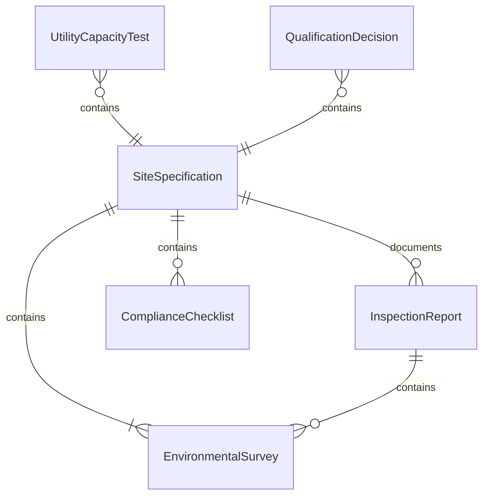
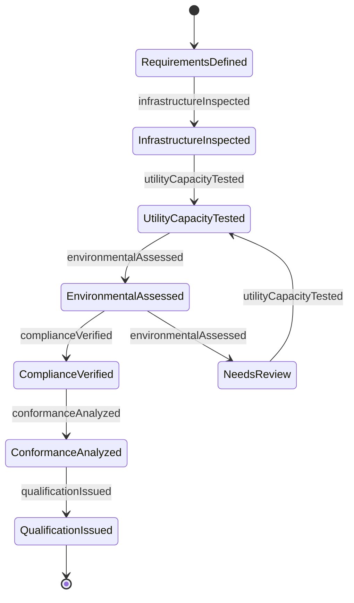
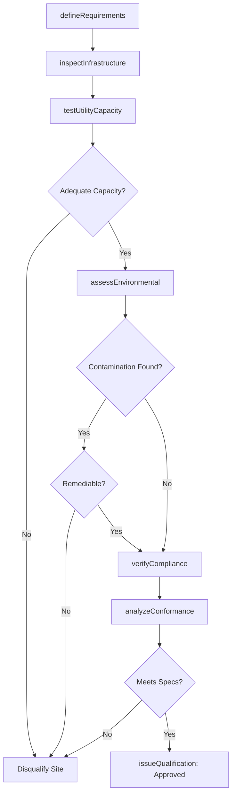
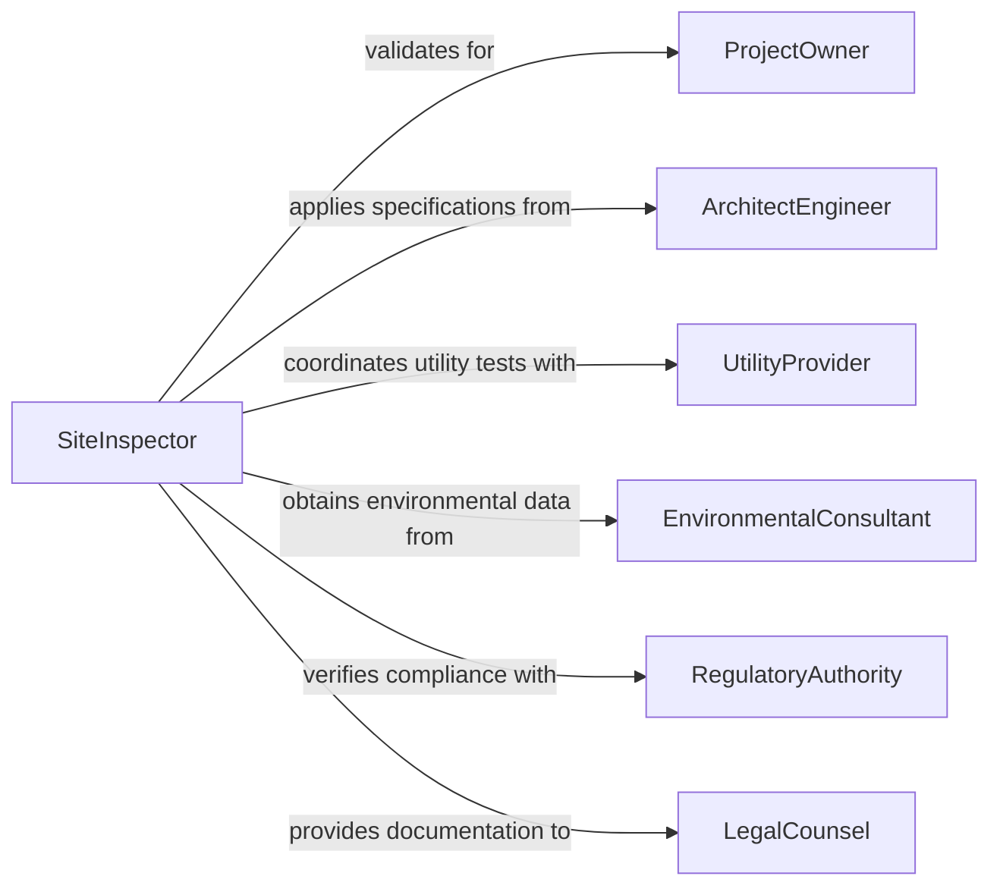

# Inspect Facilities Sites Determine If

> Business-as-Code definition for inspecting facilities and sites to determine if they meet specifications and operational standards. Models the complete site qualification process from requirement review through conformance testing and approval.

## Overview

Facility and site inspection determines suitability for specific operational purposes by verifying infrastructure, utilities, environmental conditions, and regulatory compliance. This definition provides actions for site assessment, specification testing, and qualification tracking with events for automated approval workflows and documentation management.

## Actors

| Actor | Description |
|-------|-------------|
| ProjectOwner | Requires facility or site meeting specific criteria |
| ArchitectEngineer | Defines technical specifications and standards |
| RegulatoryAuthority | Enforces zoning and environmental regulations |
| UtilityProvider | Supplies power, water, and other infrastructure services |
| EnvironmentalConsultant | Assesses site conditions and contamination |
| LegalCounsel | Reviews property rights and compliance obligations |

## Roles

| Role | Description |
|------|-------------|
| SiteInspector | Performs comprehensive facility assessment |
| QualificationEngineer | Validates conformance to technical requirements |
| EnvironmentalSpecialist | Evaluates soil, water, and air quality |
| ComplianceOfficer | Verifies regulatory adherence |

## Entities

| Entity | Description |
|--------|-------------|
| SiteSpecification | Defined requirements for facility qualification |
| InspectionReport | Documentation of site assessment findings |
| UtilityCapacityTest | Verification of infrastructure availability |
| EnvironmentalSurvey | Assessment of site conditions and contamination |
| ComplianceChecklist | Regulatory requirement verification items |
| QualificationDecision | Formal determination of site suitability |

## Actions

| Action | Description |
|--------|-------------|
| defineRequirements | Establish specifications and acceptance criteria |
| inspectInfrastructure | Verify building systems and utility access |
| testUtilityCapacity | Validate power, water, and service availability |
| assessEnvironmental | Evaluate site conditions and contamination |
| verifyCompliance | Confirm regulatory and zoning conformance |
| analyzeConformance | Compare findings against specifications |
| issueQualification | Provide formal suitability determination |

## Events

| Event | Description |
|-------|-------------|
| requirementsDefined | Specifications have been established |
| infrastructureInspected | Building systems have been verified |
| utilityCapacityTested | Service availability has been validated |
| environmentalAssessed | Site conditions have been evaluated |
| complianceVerified | Regulatory conformance has been confirmed |
| conformanceAnalyzed | Findings have been compared to specifications |
| qualificationIssued | Formal determination has been provided |

## Searches

| Search | Description |
|--------|-------------|
| findInspections | List inspections by site, project, or date |
| getQualificationReports | Retrieve suitability assessment documentation |
| getEnvironmentalSurveys | Find site condition and contamination data |
| getApprovedSites | Identify facilities meeting specifications |

## Entity Relationships



## State Diagram



## Workflow



## Actor Relationships



## Usage

### Calling Actions

```typescript
import { inspectFacilitiesSitesDetermineIf } from '@headlessly/inspect-facilities-sites-determine-if'

const inspection = inspectFacilitiesSitesDetermineIf()

// Define requirements for manufacturing facility
const requirements = await inspection.defineRequirements({
  projectId: 'MFG-EXPANSION-2026',
  siteAddress: '1250 Industrial Parkway',
  specifications: {
    minFloorArea: '50000 sq ft',
    ceilingHeight: '24 ft minimum',
    electricalService: '2000 Amps, 480V 3-phase',
    waterSupply: '500 GPM',
    hvacCapacity: '200 tons cooling',
    loadingDocks: '6 docks minimum',
    zoning: 'Industrial M-2'
  }
})

// Inspect infrastructure
await inspection.inspectInfrastructure({
  projectId: 'MFG-EXPANSION-2026',
  findings: [
    { system: 'Building Structure', finding: '75000 sq ft clear span', status: 'Meets Spec' },
    { system: 'Ceiling Height', finding: '28 ft', status: 'Exceeds Spec' },
    { system: 'HVAC System', finding: '180 tons installed', status: 'Below Spec' },
    { system: 'Loading Docks', finding: '8 docks', status: 'Exceeds Spec' },
    { system: 'Sprinkler System', finding: 'ESFR compliant', status: 'Meets Spec' }
  ],
  inspector: 'P.Anderson, PE'
})

// Test utility capacity
await inspection.testUtilityCapacity({
  projectId: 'MFG-EXPANSION-2026',
  tests: [
    {
      utility: 'Electrical Service',
      available: '2500 Amps, 480V 3-phase',
      required: '2000 Amps',
      status: 'Adequate',
      provider: 'Metro Power Company'
    },
    {
      utility: 'Water Supply',
      available: '750 GPM',
      required: '500 GPM',
      status: 'Adequate',
      provider: 'City Water Department'
    },
    {
      utility: 'Natural Gas',
      available: '5000 CFH',
      required: '3000 CFH',
      status: 'Adequate',
      provider: 'Regional Gas'
    }
  ]
})

// Assess environmental conditions
await inspection.assessEnvironmental({
  projectId: 'MFG-EXPANSION-2026',
  surveys: [
    { assessment: 'Phase I Environmental', findings: 'No recognized conditions', status: 'Clear' },
    { assessment: 'Soil Contamination', findings: 'No elevated levels detected', status: 'Clear' },
    { assessment: 'Groundwater Quality', findings: 'Meets drinking water standards', status: 'Clear' },
    { assessment: 'Asbestos Survey', findings: 'ACM present in ceiling tiles', status: 'Requires Abatement' }
  ],
  consultant: 'Environmental Solutions Inc'
})

// Verify regulatory compliance
await inspection.verifyCompliance({
  projectId: 'MFG-EXPANSION-2026',
  checks: [
    { requirement: 'Zoning Classification', status: 'Industrial M-2', compliant: true },
    { requirement: 'Building Permits', status: 'All current and valid', compliant: true },
    { requirement: 'Fire Marshall Approval', status: 'Approved 2025-08-12', compliant: true },
    { requirement: 'ADA Accessibility', status: 'Compliant', compliant: true }
  ]
})

// Issue qualification decision
await inspection.issueQualification({
  projectId: 'MFG-EXPANSION-2026',
  decision: 'Conditionally Approved',
  conditions: [
    'HVAC system must be upgraded to 200 ton capacity',
    'Asbestos-containing materials must be abated before occupancy'
  ],
  validUntil: '2026-08-15',
  approvedBy: 'M.Roberts, Qualification Engineer'
})
```

### Event-Driven Automation

```typescript
// Alert on disqualifying issues
inspection.conformanceAnalyzed(async ({ projectId, findings }) => {
  const critical = findings.filter(f => f.status === 'Below Spec' && f.critical)
  if (critical.length > 0) {
    await notify({
      to: 'project-team@company.com',
      priority: 'High',
      subject: `Site disqualification risks - ${projectId}`,
      body: `${critical.length} critical deficiencies identified`
    })
  }
})

// Track conditional approval items
inspection.qualificationIssued(async ({ projectId, decision, conditions }) => {
  if (decision === 'Conditionally Approved') {
    for (const condition of conditions) {
      await createTask({
        taskType: 'Qualification Condition',
        projectId,
        description: condition,
        assignee: 'project-manager',
        priority: 'High'
      })
    }
  }
})
```
