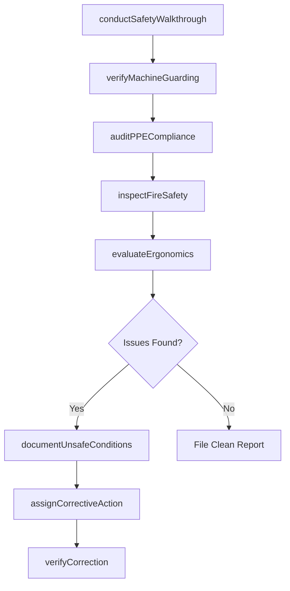
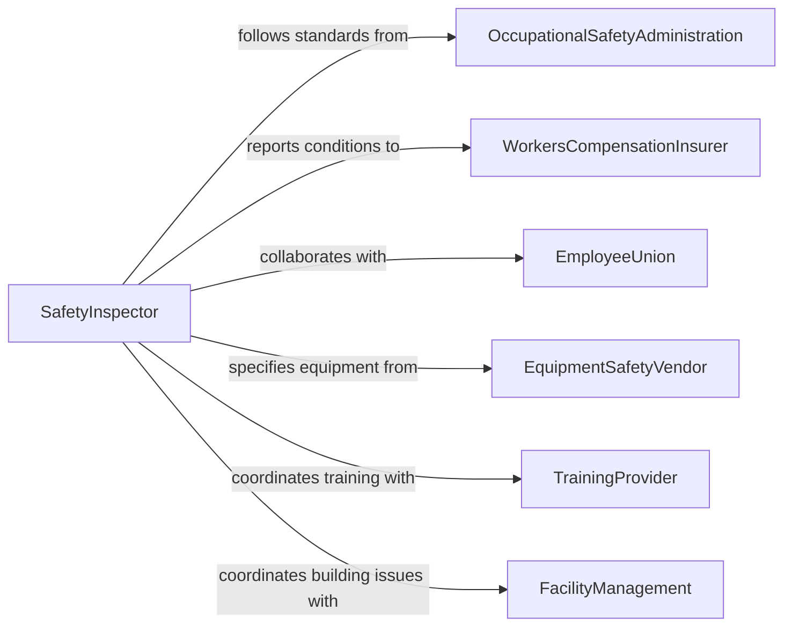

# Inspect Work Environments to Ensure Safety

> Business-as-Code definition for inspecting work environments to ensure safety. Models the workplace safety inspection workflow of evaluating physical conditions, verifying safeguard compliance, identifying unsafe practices, and implementing corrective measures to prevent workplace injuries and illnesses.

## Overview

Inspecting work environments to ensure safety involves conducting routine and targeted assessments of workplace conditions to verify compliance with occupational safety regulations, identify hazardous conditions, and ensure protective measures are in place and functioning. This definition covers housekeeping checks, machine guarding verification, PPE compliance, ergonomic assessments, fire safety inspections, and lockout/tagout audits. It supports OSHA compliance programs, workers compensation loss prevention, corporate safety management systems, and joint health and safety committee operations.

## Actors

| Actor | Description |
|-------|-------------|
| OccupationalSafetyAdministration | Sets workplace safety standards and conducts enforcement inspections |
| WorkersCompensationInsurer | Assesses workplace safety conditions for premium calculation and loss control |
| EmployeeUnion | Advocates for safe working conditions and participates in joint safety committees |
| EquipmentSafetyVendor | Provides machine guards, safety interlocks, and personal protective equipment |
| TrainingProvider | Delivers safety training programs for hazard awareness and prevention |
| FacilityManagement | Maintains physical infrastructure and building safety systems |

## Roles

| Role | Description |
|------|-------------|
| SafetyInspector | Conducts systematic workplace safety assessments and documents findings |
| SafetyManager | Oversees the safety inspection program and manages corrective action implementation |
| FloorSupervisor | Participates in inspections and ensures daily safety compliance in work areas |
| ErgonomicsSpecialist | Evaluates workstation design and recommends adjustments to prevent musculoskeletal injuries |

## Entities

| Entity | Description |
|--------|-------------|
| SafetyInspectionReport | A documented record of all safety observations and findings from a workplace assessment |
| UnsafeCondition | An identified physical hazard such as exposed wiring, missing guards, or blocked exits |
| UnsafePractice | An observed behavior violating safety rules such as improper lifting or bypassed safety devices |
| CorrectiveActionItem | A specific measure to eliminate or mitigate an identified safety concern |
| PPEComplianceCheck | A verification that workers are using required personal protective equipment |
| MachineGuardAudit | An assessment of whether machine guarding meets OSHA and ANSI standards |
| FireSafetyCheck | A verification of fire extinguisher placement, exit signage, and evacuation routes |
| IncidentTrendAnalysis | A review of injury and near-miss data to focus inspection priorities |

## Actions

| Action | Description |
|--------|-------------|
| conductSafetyWalkthrough | Perform a systematic area-by-area workplace safety assessment |
| verifyMachineGuarding | Check that all machine guards, interlocks, and safety devices are present and functional |
| auditPPECompliance | Verify that workers are wearing required personal protective equipment |
| inspectFireSafety | Check fire extinguisher placement, exit paths, alarm systems, and sprinkler operation |
| evaluateErgonomics | Assess workstation design and manual handling practices for injury risk |
| documentUnsafeConditions | Record hazardous conditions with descriptions, locations, and photographs |
| assignCorrectiveAction | Create specific tasks to address identified safety deficiencies |
| verifyCorrection | Confirm that corrective actions have been completed and are effective |

## Events

| Event | Description |
|-------|-------------|
| safetyWalkthroughCompleted | A systematic workplace safety assessment has been performed |
| machineGuardingVerified | Machine guard and safety device compliance has been checked |
| ppeComplianceAudited | Personal protective equipment usage has been verified |
| fireSafetyInspected | Fire protection systems and egress paths have been checked |
| ergonomicsEvaluated | Workstation design and manual handling risks have been assessed |
| unsafeConditionDocumented | A hazardous condition has been formally recorded |
| correctiveActionAssigned | A task to address a safety deficiency has been created |
| correctionVerified | A corrective action has been confirmed as completed and effective |

## Searches

| Search | Description |
|--------|-------------|
| findInspections | List safety inspections by area, date, inspector, or finding count |
| getUnsafeConditions | Retrieve documented unsafe conditions by type, area, or resolution status |
| getCorrectiveActions | Access corrective action items by area, priority, or completion status |
| getPPECompliance | Query PPE compliance rates by department, equipment type, or date |
| getIncidentTrends | Analyze injury and near-miss patterns to inform inspection focus areas |

## Workflow



## Actor Relationships



## Usage

### Calling Actions

```typescript
import { inspectWorkEnvironmentsEnsureSafety } from '@headlessly/inspect-work-environments-ensure-safety'

const safetyInspection = inspectWorkEnvironmentsEnsureSafety()

// Conduct a monthly safety walkthrough of a manufacturing floor
const walkthrough = await safetyInspection.conductSafetyWalkthrough({
  area: 'machine-shop-building-2',
  inspector: 'SI-2026-0023',
  date: '2026-02-10',
  type: 'monthly-routine'
})

// Verify machine guarding
await safetyInspection.verifyMachineGuarding({
  walkthroughId: walkthrough.id,
  machines: [
    { id: 'CNC-lathe-04', guardType: 'interlocked-enclosure', status: 'compliant' },
    { id: 'bench-grinder-07', guardType: 'adjustable-tongue-guard', status: 'gap-exceeds-spec' },
    { id: 'power-press-01', guardType: 'light-curtain', status: 'compliant' }
  ]
})

// Audit PPE compliance
await safetyInspection.auditPPECompliance({
  walkthroughId: walkthrough.id,
  observations: [
    { area: 'grinding-station', requiredPPE: ['safety-glasses', 'face-shield', 'gloves'], complianceRate: 0.85 },
    { area: 'welding-bay', requiredPPE: ['welding-helmet', 'leather-gloves', 'leather-apron'], complianceRate: 1.0 }
  ]
})

// Document and assign corrective actions
await safetyInspection.documentUnsafeConditions({
  walkthroughId: walkthrough.id,
  conditions: [
    { location: 'bench-grinder-07', description: 'Tongue guard gap exceeds 1/4 inch maximum', severity: 'serious', photos: 2 }
  ]
})

await safetyInspection.assignCorrectiveAction({
  walkthroughId: walkthrough.id,
  actions: [
    { condition: 'bench-grinder-07', action: 'Adjust tongue guard to within 1/4 inch of wheel', responsible: 'maintenance-team', deadline: '2026-02-12' }
  ]
})
```

### Event-Driven Automation

```typescript
// Shut down equipment when serious guarding deficiencies are found
safetyInspection.machineGuardingVerified(async ({ machines }) => {
  const violations = machines.filter(m => m.status !== 'compliant')
  for (const machine of violations) {
    await equipment.lockout({
      machineId: machine.id,
      reason: `Guarding deficiency: ${machine.status}`
    })
    await notify({
      to: 'maintenance-supervisor',
      message: `${machine.id} locked out: guard ${machine.status}`
    })
  }
})

// Track PPE compliance trends and trigger retraining
safetyInspection.ppeComplianceAudited(async ({ area, requiredPPE, complianceRate }) => {
  if (complianceRate < 0.90) {
    await training.scheduleRefresher({
      topic: 'ppe-requirements',
      area,
      equipment: requiredPPE,
      reason: `Compliance at ${(complianceRate * 100).toFixed(0)}% - below 90% threshold`
    })
  }
})
```
