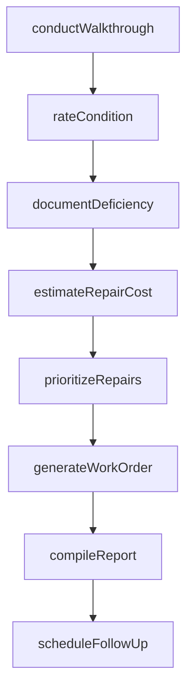
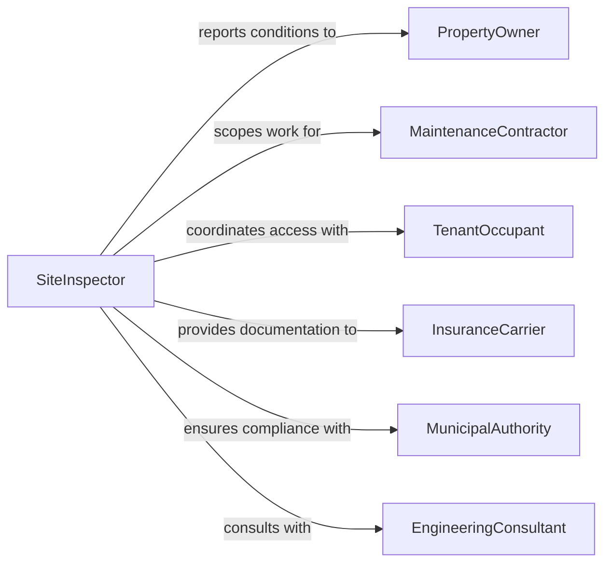

# Inspect Work Sites to Determine Condition or Necessary Repairs

> Business-as-Code definition for inspecting work sites to determine condition or necessary repairs. Models the site assessment workflow of surveying physical conditions, identifying maintenance needs, documenting deficiencies, and prioritizing repair work orders.

## Overview

Inspecting work sites to determine condition or necessary repairs involves conducting systematic surveys of construction sites, industrial facilities, infrastructure assets, and commercial properties to assess their current physical state, identify deterioration, and determine required maintenance or repair actions. This definition covers visual walkthroughs, condition rating, deficiency documentation, repair scoping, and work order generation. It supports facility management, construction project oversight, infrastructure asset management, and property maintenance operations across commercial, industrial, and public sector facilities.

## Actors

| Actor | Description |
|-------|-------------|
| PropertyOwner | Commissions site inspections and funds necessary repairs |
| MaintenanceContractor | Performs repairs identified during site inspections |
| TenantOccupant | Reports site conditions and is affected by repair activities |
| InsuranceCarrier | Requires condition documentation for coverage and claims |
| MunicipalAuthority | Enforces building codes and property maintenance standards |
| EngineeringConsultant | Provides technical assessments for complex structural or system deficiencies |

## Roles

| Role | Description |
|------|-------------|
| SiteInspector | Conducts systematic site walkthroughs and documents conditions |
| FacilityManager | Prioritizes repairs and manages maintenance budgets based on inspection findings |
| MaintenanceSupervisor | Assigns repair work orders and oversees completion of corrective actions |
| ConditionAssessor | Applies standardized rating scales to evaluate asset condition |

## Entities

| Entity | Description |
|--------|-------------|
| SiteConditionReport | A comprehensive document recording the observed state of a work site |
| ConditionRating | A standardized score indicating the severity of deterioration or maintenance need |
| DeficiencyItem | A specific condition requiring repair, maintenance, or replacement |
| RepairEstimate | A projected cost and scope for correcting an identified deficiency |
| WorkOrder | An authorization to perform specific repair or maintenance activities |
| PhotoDocumentation | Images capturing the current condition of site elements |
| MaintenanceBacklog | A prioritized list of outstanding repair and maintenance items |
| InspectionSchedule | A planned frequency for recurring site condition assessments |

## Actions

| Action | Description |
|--------|-------------|
| conductWalkthrough | Perform a systematic visual survey of the work site |
| rateCondition | Apply standardized condition ratings to site elements and systems |
| documentDeficiency | Record specific conditions requiring repair with descriptions and photographs |
| estimateRepairCost | Calculate the projected cost and scope for correcting each deficiency |
| prioritizeRepairs | Rank deficiencies by urgency, safety impact, and cost-effectiveness |
| generateWorkOrder | Create maintenance or repair authorizations for prioritized deficiencies |
| compileReport | Assemble findings into a formal site condition report |
| scheduleFollowUp | Set dates for re-inspection to verify completed repairs |

## Events

| Event | Description |
|-------|-------------|
| walkthroughCompleted | A systematic visual survey of the site has been performed |
| conditionRated | Standardized condition ratings have been applied to site elements |
| deficiencyDocumented | A specific repair need has been recorded with supporting evidence |
| repairEstimated | Cost and scope projections for a deficiency have been calculated |
| repairsPrioritized | Deficiencies have been ranked by urgency and impact |
| workOrderGenerated | A maintenance or repair authorization has been created |
| reportCompiled | A formal site condition report has been assembled |
| followUpScheduled | A re-inspection date has been set for repair verification |

## Searches

| Search | Description |
|--------|-------------|
| findInspections | List site inspections by location, date, or inspector |
| getDeficiencies | Retrieve documented deficiencies by site, severity, or repair status |
| getConditionRatings | Query condition ratings by site element, rating level, or date |
| getWorkOrders | Access repair work orders by site, status, or priority |
| getMaintenanceBacklog | View the prioritized list of outstanding repairs for a site |

## Workflow



## Actor Relationships



## Usage

### Calling Actions

```typescript
import { inspectWorkSitesDetermineCondition } from '@headlessly/inspect-work-sites-determine-condition'

const siteInspection = inspectWorkSitesDetermineCondition()

// Conduct a walkthrough of a commercial property
const walkthrough = await siteInspection.conductWalkthrough({
  site: 'warehouse-complex-east',
  address: '1200 Industrial Blvd',
  areas: ['roof', 'exterior-walls', 'parking-lot', 'loading-docks', 'interior-common'],
  inspector: 'INS-2026-0089'
})

// Rate conditions and document deficiencies
await siteInspection.rateCondition({
  inspectionId: walkthrough.id,
  ratings: [
    { element: 'roof-membrane', rating: 3, scale: '1-5', notes: 'Ponding water at drain locations' },
    { element: 'parking-lot', rating: 2, scale: '1-5', notes: 'Extensive cracking and potholes' },
    { element: 'loading-docks', rating: 4, scale: '1-5', notes: 'Good condition, minor bumper wear' }
  ]
})

await siteInspection.documentDeficiency({
  inspectionId: walkthrough.id,
  items: [
    { element: 'roof-drain-3', description: 'Clogged drain causing water ponding', severity: 'moderate', photos: 4 },
    { element: 'parking-lot-section-B', description: 'Alligator cracking with 2-inch potholes', severity: 'high', photos: 6 }
  ]
})

// Estimate and prioritize
await siteInspection.estimateRepairCost({
  inspectionId: walkthrough.id,
  estimates: [
    { deficiency: 'roof-drain-3', laborHours: 4, materialCost: 250, totalEstimate: 850 },
    { deficiency: 'parking-lot-section-B', laborHours: 40, materialCost: 8500, totalEstimate: 14500 }
  ]
})
```

### Event-Driven Automation

```typescript
// Auto-generate emergency work orders for critical deficiencies
siteInspection.deficiencyDocumented(async ({ site, element, severity }) => {
  if (severity === 'critical') {
    await siteInspection.generateWorkOrder({
      site,
      element,
      priority: 'emergency',
      requestedCompletion: '48-hours'
    })
    await notify({
      to: 'facility-management',
      message: `Critical deficiency at ${site}: ${element} requires immediate attention`
    })
  }
})

// Schedule re-inspection when work orders are completed
siteInspection.workOrderGenerated(async ({ site, workOrderId }) => {
  await siteInspection.scheduleFollowUp({
    site,
    workOrderRef: workOrderId,
    inspectionDate: addDays(new Date(), 30)
  })
})
```
