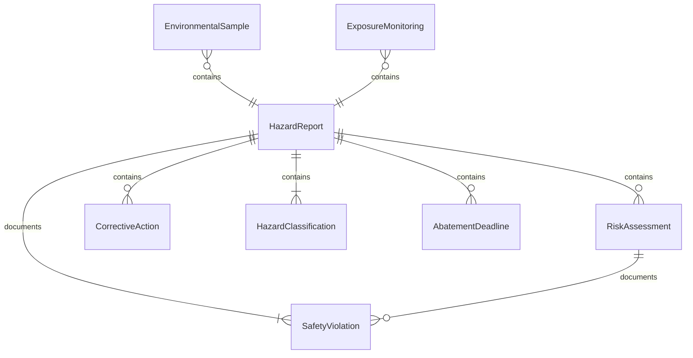
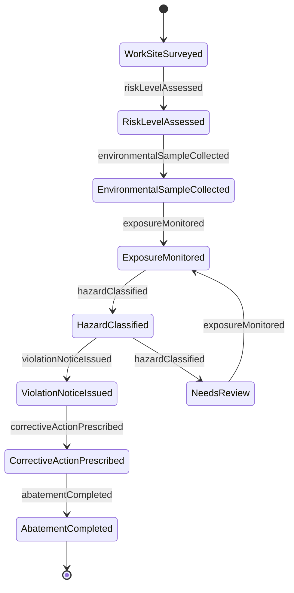
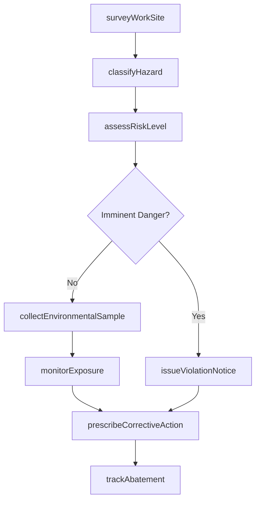
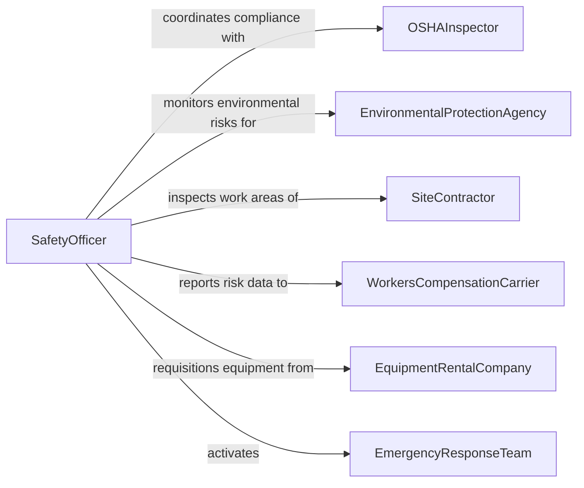

# Inspect Work Sites to Identify Potential Environmental or Safety Hazards

> Business-as-Code definition for inspecting work sites to identify potential environmental or safety hazards. Models the hazard identification workflow of conducting site surveys, assessing risk levels, documenting hazardous conditions, and initiating corrective actions to protect workers and the environment.

## Overview

Inspecting work sites to identify potential environmental or safety hazards involves conducting systematic assessments of construction zones, industrial facilities, and work areas to detect conditions that could cause injury, illness, or environmental contamination. This definition covers hazard identification walkthroughs, environmental monitoring, risk assessment, citation issuance, and corrective action tracking. It supports OSHA compliance programs, environmental health and safety departments, construction safety management, and industrial hygiene operations.

## Actors

| Actor | Description |
|-------|-------------|
| OSHAInspector | Conducts regulatory compliance inspections and issues citations for violations |
| EnvironmentalProtectionAgency | Enforces environmental regulations and monitors contamination risks |
| SiteContractor | Manages work activities and is responsible for maintaining safe conditions |
| WorkersCompensationCarrier | Assesses workplace hazards for underwriting and risk management |
| EquipmentRentalCompany | Provides safety equipment and personal protective gear |
| EmergencyResponseTeam | Responds to imminent hazard situations requiring immediate intervention |

## Roles

| Role | Description |
|------|-------------|
| SafetyOfficer | Conducts hazard identification inspections and enforces safety protocols |
| IndustrialHygienist | Assesses chemical, biological, and physical exposure hazards |
| EnvironmentalSpecialist | Evaluates contamination risks and environmental compliance |
| RiskAssessor | Quantifies hazard severity and likelihood to prioritize corrective actions |

## Entities

| Entity | Description |
|--------|-------------|
| HazardReport | A documented finding of a condition posing risk to workers or the environment |
| RiskAssessment | A quantified evaluation of hazard severity, likelihood, and exposure level |
| EnvironmentalSample | A collected specimen of air, water, soil, or surface for contamination analysis |
| SafetyViolation | A documented non-compliance with regulatory safety standards |
| CorrectiveAction | A prescribed measure to eliminate or control an identified hazard |
| ExposureMonitoring | Measurements of worker exposure to chemical, noise, or radiation hazards |
| HazardClassification | A categorization of hazards by type such as fall, electrical, chemical, or biological |
| AbatementDeadline | A mandated timeline for correcting identified safety or environmental violations |

## Actions

| Action | Description |
|--------|-------------|
| surveyWorkSite | Conduct a systematic walkthrough to identify visible and latent hazards |
| assessRiskLevel | Evaluate the severity and likelihood of harm for each identified hazard |
| collectEnvironmentalSample | Gather air, water, soil, or surface samples for laboratory analysis |
| monitorExposure | Measure worker exposure levels to chemical, noise, or radiation hazards |
| classifyHazard | Categorize identified hazards by type, severity, and regulatory classification |
| issueViolationNotice | Document non-compliance with safety or environmental regulations |
| prescribeCorrectiveAction | Define measures to eliminate or control identified hazards |
| trackAbatement | Monitor progress toward correcting violations within mandated deadlines |

## Events

| Event | Description |
|-------|-------------|
| workSiteSurveyed | A systematic hazard identification walkthrough has been completed |
| riskLevelAssessed | Hazard severity and likelihood have been evaluated |
| environmentalSampleCollected | Air, water, soil, or surface samples have been gathered for analysis |
| exposureMonitored | Worker exposure measurements have been taken |
| hazardClassified | An identified hazard has been categorized by type and severity |
| violationNoticeIssued | A regulatory non-compliance finding has been formally documented |
| correctiveActionPrescribed | Measures to eliminate or control a hazard have been defined |
| abatementCompleted | A violation has been corrected within the mandated deadline |

## Searches

| Search | Description |
|--------|-------------|
| findHazardReports | List hazard reports by site, type, severity, or date |
| getViolations | Retrieve safety or environmental violations by site, regulation, or status |
| getExposureData | Query worker exposure measurements by hazard type, site, or date |
| getCorrectiveActions | Access prescribed corrective actions by site, hazard, or completion status |
| getAbatementStatus | Check progress toward violation correction deadlines |

## Entity Relationships



## State Diagram



## Workflow



## Actor Relationships



## Usage

### Calling Actions

```typescript
import { inspectWorkSitesIdentifyPotential } from '@headlessly/inspect-work-sites-identify-potential'

const hazardInspection = inspectWorkSitesIdentifyPotential()

// Survey a construction site for hazards
const survey = await hazardInspection.surveyWorkSite({
  site: 'downtown-tower-phase-2',
  areas: ['excavation', 'steel-erection', 'concrete-pour-deck-12', 'material-staging'],
  inspector: 'SO-2026-0034',
  date: '2026-02-10'
})

// Classify and assess identified hazards
await hazardInspection.classifyHazard({
  surveyId: survey.id,
  hazards: [
    { location: 'excavation-north', type: 'fall', description: 'Unguarded trench edge, 8-foot depth', regulation: 'OSHA-1926.651' },
    { location: 'deck-12', type: 'struck-by', description: 'Unsecured materials near floor edge', regulation: 'OSHA-1926.502' },
    { location: 'material-staging', type: 'chemical', description: 'Unlabeled solvent containers', regulation: 'OSHA-1910.1200' }
  ]
})

await hazardInspection.assessRiskLevel({
  surveyId: survey.id,
  assessments: [
    { hazard: 'excavation-north', severity: 'critical', likelihood: 'probable', riskScore: 20 },
    { hazard: 'deck-12', severity: 'serious', likelihood: 'occasional', riskScore: 12 },
    { hazard: 'material-staging', severity: 'moderate', likelihood: 'probable', riskScore: 10 }
  ]
})

// Prescribe corrective actions
await hazardInspection.prescribeCorrectiveAction({
  surveyId: survey.id,
  actions: [
    { hazard: 'excavation-north', action: 'Install guardrails or barricades', deadline: '2026-02-11', responsible: 'excavation-subcontractor' },
    { hazard: 'deck-12', action: 'Secure materials and install toe boards', deadline: '2026-02-11', responsible: 'general-contractor' }
  ]
})
```

### Event-Driven Automation

```typescript
// Stop work immediately when imminent danger is identified
hazardInspection.violationNoticeIssued(async ({ site, hazard, severity }) => {
  if (severity === 'imminent-danger') {
    await construction.issueStopWork({
      site,
      area: hazard.location,
      reason: hazard.description
    })
    await notify({
      to: 'site-superintendent',
      message: `STOP WORK: Imminent danger at ${site} - ${hazard.description}`
    })
  }
})

// Escalate overdue abatements
hazardInspection.correctiveActionPrescribed(async ({ site, hazard, deadline }) => {
  await scheduling.createReminder({
    date: deadline,
    action: async () => {
      const status = await hazardInspection.getAbatementStatus({ site, hazard: hazard.id })
      if (status !== 'completed') {
        await notify({
          to: 'safety-director',
          message: `Overdue abatement at ${site}: ${hazard.description}`
        })
      }
    }
  })
})
```
