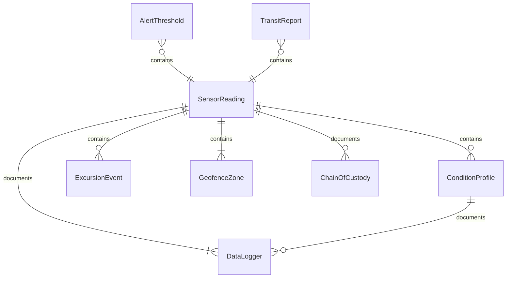
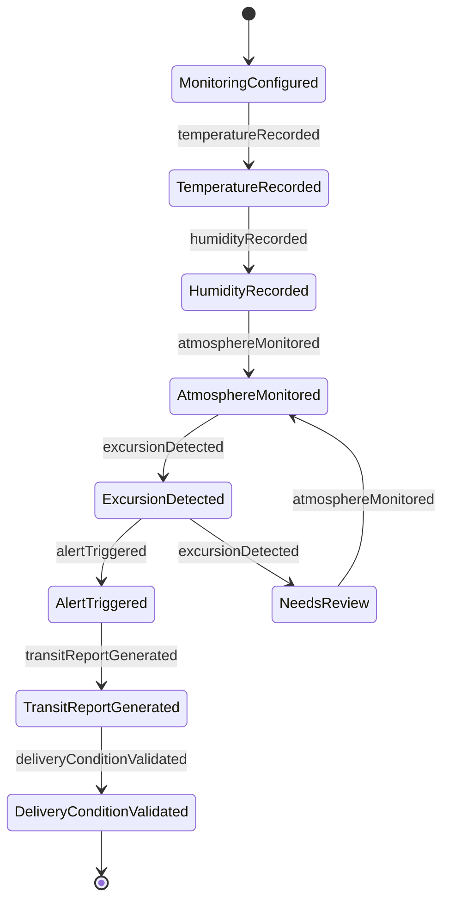
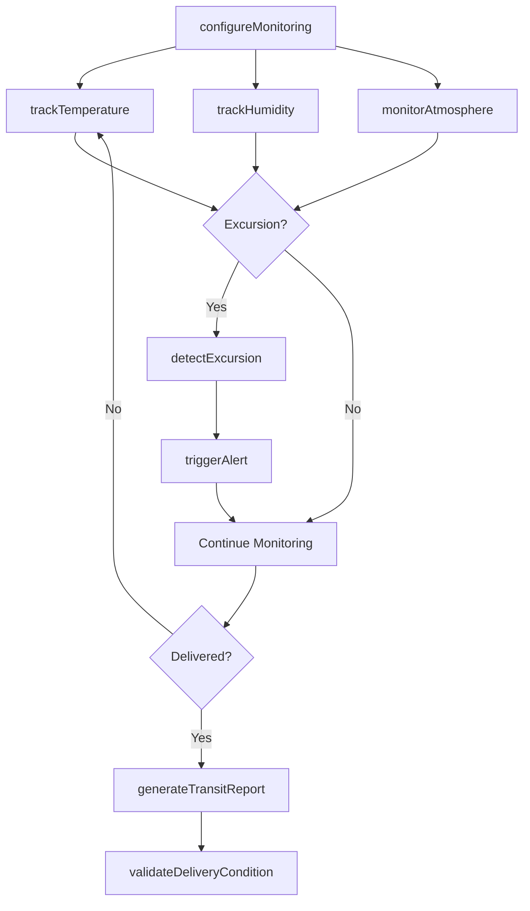
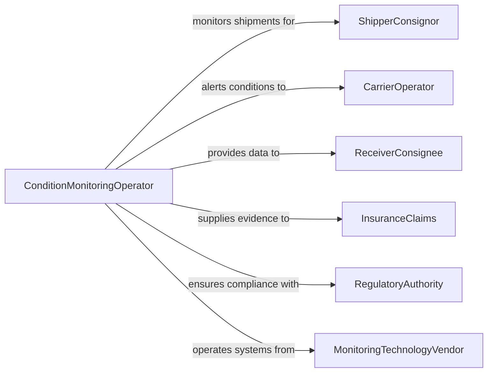

# Monitor Cargo Area Conditions

> Business-as-Code definition for monitoring cargo area conditions. Models the continuous environmental monitoring workflow of tracking temperature, humidity, atmosphere composition, and security status of cargo holds, containers, and storage areas during transit and storage.

## Overview

Monitoring cargo area conditions involves continuously tracking environmental parameters within cargo holds, shipping containers, refrigerated trailers, and warehouse storage zones to ensure cargo integrity throughout the supply chain. This definition covers real-time temperature monitoring, humidity tracking, atmosphere composition sensing, shock and vibration detection, and security intrusion alerting. It supports cold chain logistics, pharmaceutical distribution, hazardous materials transport, and perishable goods shipping across maritime, road, rail, and air freight operations.

## Actors

| Actor | Description |
|-------|-------------|
| ShipperConsignor | Sets cargo condition requirements and monitors compliance during transit |
| CarrierOperator | Manages transport equipment and responds to condition alerts |
| ReceiverConsignee | Verifies cargo condition upon delivery and files claims for deviations |
| InsuranceClaims | Reviews condition monitoring data to adjudicate cargo damage claims |
| RegulatoryAuthority | Mandates temperature monitoring for pharmaceuticals, food, and hazardous materials |
| MonitoringTechnologyVendor | Provides sensors, data loggers, and monitoring platforms |

## Roles

| Role | Description |
|------|-------------|
| ConditionMonitoringOperator | Configures sensors, monitors dashboards, and responds to alerts |
| ColdChainManager | Oversees temperature-controlled supply chain compliance |
| DispatchCoordinator | Reroutes shipments or activates contingency plans when conditions deviate |
| QualityAssuranceAnalyst | Reviews condition data to validate cargo integrity at delivery |

## Entities

| Entity | Description |
|--------|-------------|
| SensorReading | A timestamped measurement from a temperature, humidity, or atmosphere sensor |
| ConditionProfile | A set of acceptable ranges for environmental parameters during transit |
| AlertThreshold | A predefined limit that triggers notification when a monitored value is exceeded |
| DataLogger | A device that records environmental measurements at defined intervals |
| ExcursionEvent | A period during which monitored conditions fall outside acceptable ranges |
| TransitReport | A summary of all environmental data collected during a shipment journey |
| GeofenceZone | A geographic boundary that triggers condition checks or alerts when crossed |
| ChainOfCustody | A documented record of who had control of the cargo and conditions at each transfer |

## Actions

| Action | Description |
|--------|-------------|
| configureMonitoring | Set sensor parameters, alert thresholds, and reporting intervals for a shipment |
| trackTemperature | Continuously record temperature readings within the cargo area |
| trackHumidity | Monitor relative humidity levels to prevent moisture damage |
| monitorAtmosphere | Sense oxygen, carbon dioxide, or ethylene levels in controlled atmosphere shipments |
| detectExcursion | Identify and log periods where environmental conditions exceed acceptable ranges |
| triggerAlert | Send notifications when monitored conditions breach predefined thresholds |
| generateTransitReport | Compile all sensor data into a comprehensive shipment condition report |
| validateDeliveryCondition | Verify that cargo conditions met requirements throughout the entire transit |

## Events

| Event | Description |
|-------|-------------|
| monitoringConfigured | Sensors and alert thresholds have been set for a shipment |
| temperatureRecorded | A temperature reading has been captured and logged |
| humidityRecorded | A humidity measurement has been captured and logged |
| atmosphereMonitored | Atmosphere composition readings have been recorded |
| excursionDetected | Environmental conditions have moved outside acceptable ranges |
| alertTriggered | A threshold breach notification has been sent |
| transitReportGenerated | A comprehensive condition report for the shipment has been compiled |
| deliveryConditionValidated | Cargo condition compliance has been confirmed at delivery |

## Searches

| Search | Description |
|--------|-------------|
| findShipments | List monitored shipments by carrier, route, date, or condition status |
| getReadings | Retrieve sensor readings by shipment, sensor type, or time range |
| getExcursions | Query excursion events by shipment, parameter, or duration |
| getAlerts | Access triggered alerts by shipment, severity, or response status |
| getTransitReports | Look up transit condition reports by shipment or delivery outcome |

## Entity Relationships



## State Diagram



## Workflow



## Actor Relationships



## Usage

### Calling Actions

```typescript
import { monitorCargoAreaConditions } from '@headlessly/monitor-cargo-area-conditions'

const cargoMonitor = monitorCargoAreaConditions()

// Configure monitoring for a pharmaceutical cold chain shipment
const config = await cargoMonitor.configureMonitoring({
  shipmentId: 'SHIP-2026-PHARMA-0412',
  container: 'REEFER-MAEU-1234567',
  profile: {
    temperature: { min: 2, max: 8, unit: 'celsius' },
    humidity: { min: 30, max: 65, unit: 'percent' }
  },
  readingInterval: 300, // seconds
  alertThresholds: {
    temperatureWarning: { min: 3, max: 7 },
    temperatureCritical: { min: 0, max: 10 }
  },
  route: { origin: 'Basel-CH', destination: 'Newark-US', estimatedDays: 12 }
})

// Track temperature readings
await cargoMonitor.trackTemperature({
  configId: config.id,
  readings: [
    { timestamp: '2026-02-10T08:00:00Z', value: 4.2, sensor: 'front-upper' },
    { timestamp: '2026-02-10T08:00:00Z', value: 4.5, sensor: 'center-lower' },
    { timestamp: '2026-02-10T08:00:00Z', value: 4.1, sensor: 'rear-upper' }
  ]
})

// Generate transit report at delivery
const report = await cargoMonitor.generateTransitReport({
  shipmentId: 'SHIP-2026-PHARMA-0412',
  deliveryDate: '2026-02-22T14:30:00Z'
})

await cargoMonitor.validateDeliveryCondition({
  reportId: report.id,
  acceptanceCriteria: { maxExcursionMinutes: 0, temperatureRange: { min: 2, max: 8 } }
})
```

### Event-Driven Automation

```typescript
// Activate contingency plan when temperature excursion is detected
cargoMonitor.excursionDetected(async ({ shipmentId, parameter, value, threshold, duration }) => {
  await notify({
    to: 'cold-chain-manager',
    message: `Temperature excursion on ${shipmentId}: ${value}C (limit: ${threshold.min}-${threshold.max}C) for ${duration} minutes`
  })
  if (duration > 30) {
    await logistics.activateContingency({
      shipmentId,
      action: 'reroute-to-nearest-cold-storage'
    })
  }
})

// Auto-reject shipment at delivery when conditions were not maintained
cargoMonitor.deliveryConditionValidated(async ({ shipmentId, status, excursions }) => {
  if (status === 'failed') {
    await receiving.rejectShipment({
      shipmentId,
      reason: `${excursions.length} temperature excursion(s) during transit`
    })
    await insurance.fileClaim({
      shipmentId,
      type: 'temperature-damage',
      evidence: excursions
    })
  }
})
```
