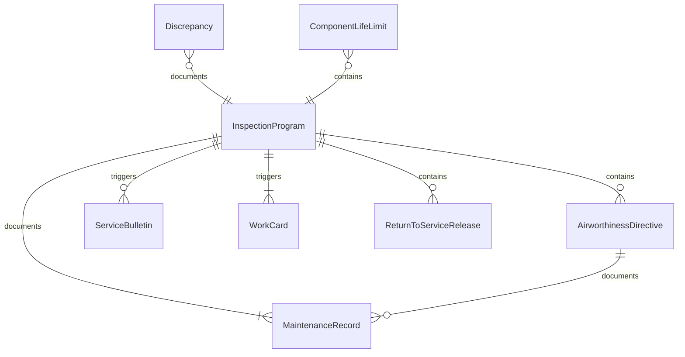
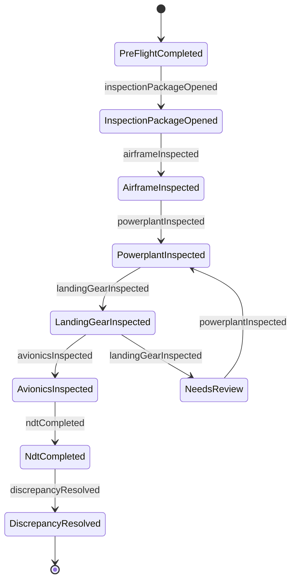
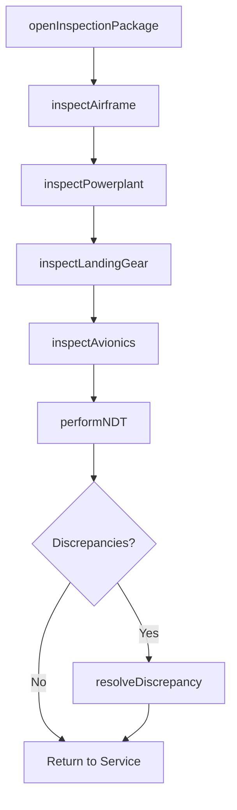
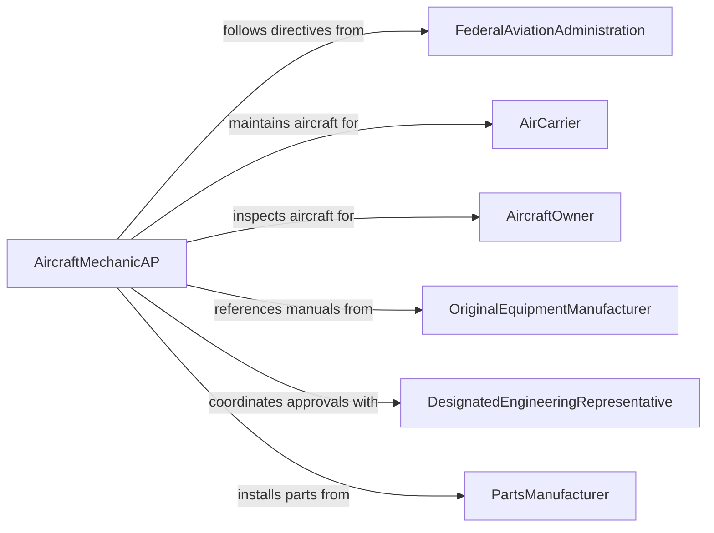

# Inspect Aircraft or Aircraft Components

> Business-as-Code definition for inspecting aircraft or aircraft components. Models the aviation maintenance inspection workflow of performing pre-flight, periodic, and overhaul inspections of airframes, powerplants, avionics, and accessories in compliance with FAA airworthiness directives and manufacturer maintenance programs.

## Overview

Inspecting aircraft or aircraft components involves conducting visual, dimensional, and non-destructive examinations of airframes, engines, propellers, landing gear, flight controls, avionics systems, and accessories to verify continued airworthiness. This definition covers pre-flight walk-arounds, 100-hour and annual inspections, progressive inspection programs, heavy maintenance checks, and component overhaul examinations. It supports Part 121 air carriers, Part 135 charter operators, Part 145 repair stations, and general aviation maintenance organizations under FAA regulatory oversight.

## Actors

| Actor | Description |
|-------|-------------|
| FederalAviationAdministration | Issues airworthiness directives, type certificates, and inspection requirements |
| AirCarrier | Operates aircraft requiring scheduled and unscheduled maintenance inspections |
| AircraftOwner | Maintains general aviation aircraft in compliance with annual inspection requirements |
| OriginalEquipmentManufacturer | Publishes maintenance manuals, service bulletins, and inspection intervals |
| DesignatedEngineeringRepresentative | Approves engineering data for repairs and alterations |
| PartsManufacturer | Supplies PMA and OEM replacement parts with traceability documentation |

## Roles

| Role | Description |
|------|-------------|
| AircraftMechanicAP | Holds airframe and powerplant certificates and performs inspections and repairs |
| InspectorIA | Holds inspection authorization and approves aircraft return to service |
| AvionicsTechnician | Inspects and troubleshoots electronic flight instruments, navigation, and communication systems |
| NDTInspector | Performs non-destructive testing such as eddy current, ultrasonic, and dye penetrant inspections |

## Entities

| Entity | Description |
|--------|-------------|
| InspectionProgram | A structured schedule of inspection events based on flight hours, cycles, or calendar time |
| AirworthinessDirective | A mandatory FAA order requiring specific inspections or modifications |
| Discrepancy | A documented finding of a condition that does not conform to approved data |
| MaintenanceRecord | A logbook entry documenting inspections performed and discrepancies resolved |
| ServiceBulletin | A manufacturer recommendation for inspections, modifications, or component replacements |
| ComponentLifeLimit | A maximum service life in hours, cycles, or calendar time for a life-limited part |
| WorkCard | A task-level instruction for performing a specific inspection or maintenance action |
| ReturnToServiceRelease | An authorized signoff certifying the aircraft is airworthy following inspection |

## Actions

| Action | Description |
|--------|-------------|
| performPreFlightInspection | Conduct a walk-around visual check before each flight |
| openInspectionPackage | Initiate a scheduled inspection by generating work cards and accessing panels |
| inspectAirframe | Examine fuselage, wings, empennage, and control surfaces for damage and corrosion |
| inspectPowerplant | Evaluate engine operation, accessories, mounts, and exhaust system condition |
| inspectLandingGear | Check gear assemblies, struts, tires, brakes, and retraction mechanisms |
| inspectAvionics | Verify operation and condition of flight instruments, radios, and navigation systems |
| performNDT | Conduct non-destructive testing on critical structural components |
| resolveDiscrepancy | Repair or replace components to correct identified discrepancies |

## Events

| Event | Description |
|-------|-------------|
| preFlightCompleted | A pre-flight inspection walk-around has been performed |
| inspectionPackageOpened | A scheduled inspection has been initiated with work cards generated |
| airframeInspected | Airframe structural examination is complete |
| powerplantInspected | Engine and accessories inspection is complete |
| landingGearInspected | Landing gear assembly examination is complete |
| avionicsInspected | Avionics systems verification is complete |
| ndtCompleted | Non-destructive testing has been performed on critical components |
| discrepancyResolved | An identified discrepancy has been corrected and documented |

## Searches

| Search | Description |
|--------|-------------|
| findInspections | List inspections by aircraft, type, date, or status |
| getDiscrepancies | Retrieve open discrepancies by aircraft, system, or severity |
| getAirworthinessDirectives | Query applicable ADs by aircraft type, effectivity, or compliance status |
| getComponentLifeLimits | Check time-limited components by remaining hours, cycles, or calendar life |
| getMaintenanceHistory | Access complete maintenance and inspection records for an aircraft |

## Entity Relationships



## State Diagram



## Workflow



## Actor Relationships



## Usage

### Calling Actions

```typescript
import { inspectAircraftAircraftComponents } from '@headlessly/inspect-aircraft-aircraft-components'

const aircraftInspection = inspectAircraftAircraftComponents()

// Open an annual inspection package
const inspection = await aircraftInspection.openInspectionPackage({
  registration: 'N12345',
  type: 'annual',
  aircraft: { make: 'Cessna', model: '172S', serial: '172S-10234' },
  totalTime: 3245.6,
  totalCycles: 8920
})

// Inspect airframe
const airframe = await aircraftInspection.inspectAirframe({
  inspectionId: inspection.id,
  areas: ['fuselage', 'wings', 'empennage', 'control-surfaces', 'windshield'],
  findings: [
    { area: 'left-wing-root', condition: 'surface-corrosion', severity: 'minor' }
  ]
})

// Inspect powerplant
await aircraftInspection.inspectPowerplant({
  inspectionId: inspection.id,
  engine: { make: 'Lycoming', model: 'IO-360-L2A', serial: 'L-12345-51A' },
  checks: ['compression', 'oil-analysis', 'magneto-timing', 'exhaust-system'],
  compressionResults: [
    { cylinder: 1, psi: 76 },
    { cylinder: 2, psi: 74 },
    { cylinder: 3, psi: 78 },
    { cylinder: 4, psi: 72 }
  ]
})

// Perform NDT on critical structure
await aircraftInspection.performNDT({
  inspectionId: inspection.id,
  method: 'eddy-current',
  component: 'main-spar-lower-cap',
  result: 'no-indications'
})

// Resolve discrepancy
await aircraftInspection.resolveDiscrepancy({
  inspectionId: inspection.id,
  discrepancy: airframe.findings[0],
  action: 'treated-and-primed',
  parts: [],
  reference: 'AC-43.13-1B-Chapter-6'
})
```

### Event-Driven Automation

```typescript
// Track AD compliance when inspections are completed
aircraftInspection.airframeInspected(async ({ registration, inspectionId }) => {
  const ads = await aircraftInspection.getAirworthinessDirectives({
    registration,
    status: 'recurring'
  })
  for (const ad of ads) {
    await compliance.updateAdStatus({
      registration,
      adNumber: ad.number,
      lastComplied: new Date().toISOString(),
      nextDue: ad.nextInterval
    })
  }
})

// Alert when life-limited components approach limits
aircraftInspection.inspectionPackageOpened(async ({ registration, totalTime, totalCycles }) => {
  const components = await aircraftInspection.getComponentLifeLimits({ registration })
  for (const comp of components) {
    const remaining = comp.lifeLimit - (comp.metric === 'hours' ? totalTime : totalCycles)
    if (remaining < 100) {
      await notify({
        to: 'maintenance-planning',
        message: `${registration}: ${comp.description} has ${remaining} ${comp.metric} remaining`
      })
    }
  }
})
```
