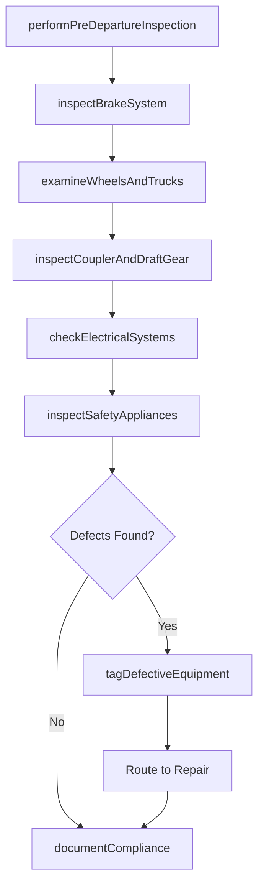
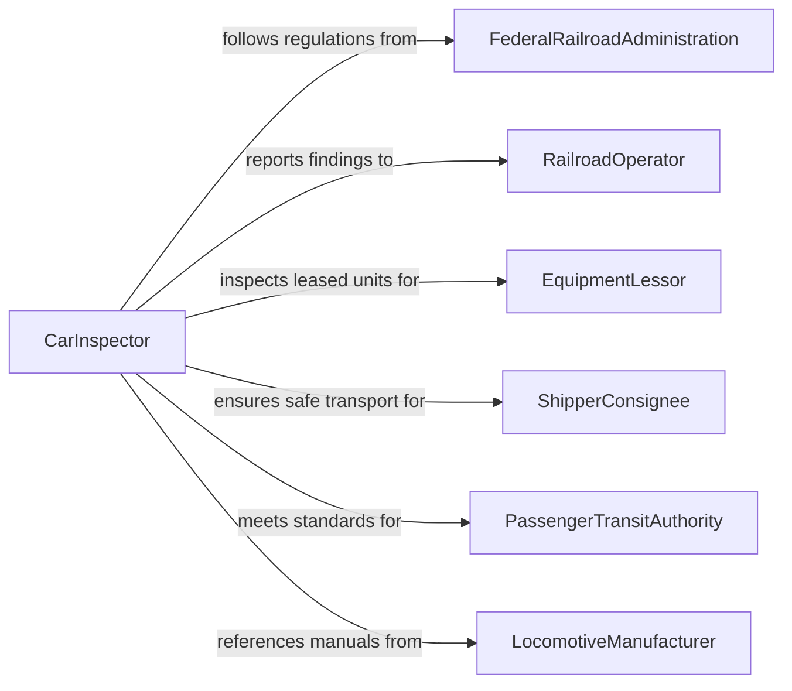

# Inspect Locomotives or Other Railroad Equipment

> Business-as-Code definition for inspecting locomotives or other railroad equipment. Models the railroad inspection workflow of performing mechanical, electrical, and safety examinations of locomotives, freight cars, passenger coaches, and track maintenance equipment to ensure Federal Railroad Administration compliance and operational reliability.

## Overview

Inspecting locomotives or other railroad equipment involves conducting systematic examinations of diesel-electric and electric locomotives, freight rolling stock, passenger cars, and maintenance-of-way equipment to verify compliance with Federal Railroad Administration regulations, Association of American Railroads standards, and railroad operating rules. This definition covers daily pre-departure inspections, periodic mechanical inspections, air brake tests, wheel and truck examinations, and condition-based monitoring. It supports Class I railroads, short line operators, commuter rail agencies, and railroad equipment leasing companies.

## Actors

| Actor | Description |
|-------|-------------|
| FederalRailroadAdministration | Establishes and enforces safety regulations for railroad equipment |
| RailroadOperator | Owns or leases equipment and is responsible for maintaining inspection compliance |
| EquipmentLessor | Provides leased rolling stock requiring periodic inspection and maintenance |
| ShipperConsignee | Relies on equipment integrity for safe transport of freight |
| PassengerTransitAuthority | Operates commuter or intercity rail requiring enhanced safety inspection standards |
| LocomotiveManufacturer | Provides technical specifications, maintenance manuals, and warranty terms |

## Roles

| Role | Description |
|------|-------------|
| CarInspector | Examines freight and passenger cars for mechanical defects and compliance |
| LocomotiveEngineer | Performs pre-departure locomotive inspections before revenue service |
| MechanicalOfficer | Oversees inspection programs and manages regulatory compliance documentation |
| AirBrakeTechnician | Conducts specialized brake system tests and certifications |

## Entities

| Entity | Description |
|--------|-------------|
| InspectionForm | A standardized document for recording equipment examination findings per FRA requirements |
| DefectCard | A tag affixed to equipment identifying a condition requiring repair before return to service |
| AirBrakeTest | A documented verification of brake system operation and leakage compliance |
| WheelMeasurement | A recorded dimension of wheel tread, flange height, and thermal cracks |
| CouplerAssessment | An evaluation of draft gear, knuckle wear, and coupler height alignment |
| LocomotiveLog | A running record of inspections, repairs, and service events for a specific locomotive |
| ComplianceRecord | Documentation demonstrating adherence to FRA inspection interval requirements |
| BadOrderTag | A designation removing equipment from service until specified repairs are completed |

## Actions

| Action | Description |
|--------|-------------|
| performPreDepartureInspection | Conduct a walk-around and operational check before a locomotive enters service |
| inspectBrakeSystem | Test air brake operation, leakage rates, and brake shoe condition |
| examineWheelsAndTrucks | Measure wheel dimensions and inspect truck components for wear or damage |
| inspectCouplerAndDraftGear | Verify coupler height, knuckle condition, and draft gear functionality |
| checkElectricalSystems | Examine traction motors, generators, control circuits, and lighting |
| inspectSafetyAppliances | Verify ladders, handholds, walkways, and reflective markings meet standards |
| tagDefectiveEquipment | Apply a bad order tag to equipment requiring repair before return to service |
| documentCompliance | Record inspection findings in regulatory compliance documentation |

## Events

| Event | Description |
|-------|-------------|
| preDepartureCompleted | A pre-departure inspection has been performed and the locomotive cleared for service |
| brakeSystemInspected | Air brake testing has been conducted with results documented |
| wheelsExamined | Wheel and truck measurements have been taken and evaluated |
| couplerInspected | Coupler and draft gear assessment is complete |
| electricalChecked | Electrical system examination has been performed |
| safetyAppliancesVerified | Safety appliance inspection is complete |
| equipmentTagged | A defective equipment tag has been applied removing the unit from service |
| complianceDocumented | Regulatory inspection records have been completed and filed |

## Searches

| Search | Description |
|--------|-------------|
| findInspections | List equipment inspections by unit number, date, type, or outcome |
| getDefects | Retrieve active defect cards and bad order tags by equipment or location |
| getWheelData | Access wheel measurement history by equipment unit or measurement date |
| getBrakeTestRecords | Query air brake test results by equipment, test type, or date |
| getComplianceStatus | Check FRA inspection compliance status for equipment or fleet segments |

## Workflow



## Actor Relationships



## Usage

### Calling Actions

```typescript
import { inspectLocomotivesRailroadEquipment } from '@headlessly/inspect-locomotives-railroad-equipment'

const railInspection = inspectLocomotivesRailroadEquipment()

// Pre-departure inspection of a diesel-electric locomotive
const preDeparture = await railInspection.performPreDepartureInspection({
  unitNumber: 'BNSF-7845',
  type: 'diesel-electric',
  model: 'GE-ES44C4',
  location: 'Barstow-Yard',
  engineer: 'ENG-2026-0412'
})

// Brake system inspection
const brakeTest = await railInspection.inspectBrakeSystem({
  unitNumber: 'BNSF-7845',
  testType: 'Class-I-brake-test',
  measurements: {
    mainReservoirPressure: 140,
    brakePipePressure: 90,
    leakageRate: 0.5,
    brakeShoeThickness: 1.25
  }
})

// Wheel and truck examination
await railInspection.examineWheelsAndTrucks({
  unitNumber: 'BNSF-7845',
  axles: [
    { position: 1, flangeHeight: 1.12, treadWidth: 5.5, thermalCracks: false },
    { position: 2, flangeHeight: 1.10, treadWidth: 5.4, thermalCracks: false },
    { position: 3, flangeHeight: 1.15, treadWidth: 5.6, thermalCracks: false }
  ]
})

// Document compliance
await railInspection.documentCompliance({
  unitNumber: 'BNSF-7845',
  inspectionType: '92-day-periodic',
  nextDue: '2026-06-15',
  fraForm: 'FRA-F-6180-49A'
})
```

### Event-Driven Automation

```typescript
// Remove equipment from service when tagged defective
railInspection.equipmentTagged(async ({ unitNumber, defects, location }) => {
  await dispatch.removeFromPool({
    unit: unitNumber,
    reason: defects.map(d => d.description).join('; ')
  })
  await maintenance.createWorkOrder({
    unit: unitNumber,
    location,
    priority: defects.some(d => d.severity === 'safety-critical') ? 'emergency' : 'scheduled',
    repairs: defects
  })
})

// Alert mechanical officer when FRA compliance deadlines approach
railInspection.complianceDocumented(async ({ unitNumber, nextDue }) => {
  const daysUntilDue = daysBetween(new Date(), new Date(nextDue))
  if (daysUntilDue <= 14) {
    await notify({
      to: 'mechanical-department',
      message: `${unitNumber} periodic inspection due in ${daysUntilDue} days`
    })
  }
})
```
