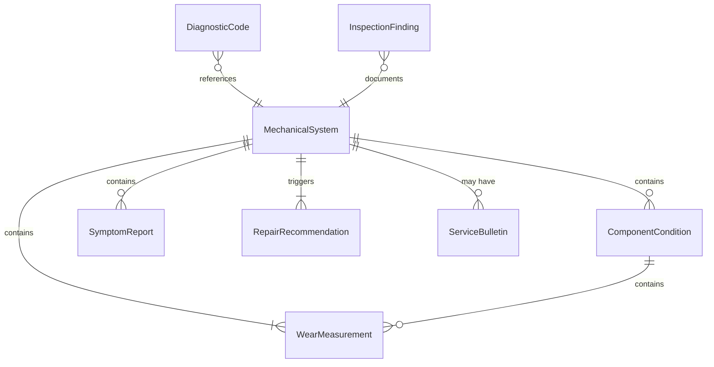
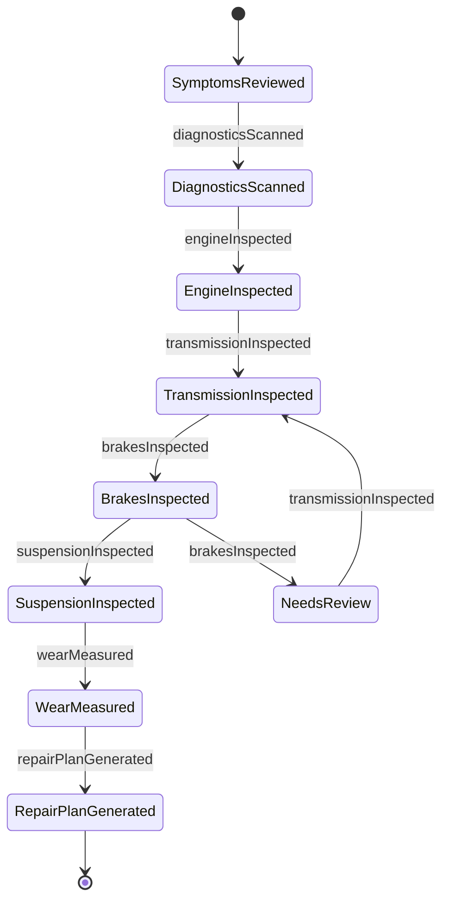
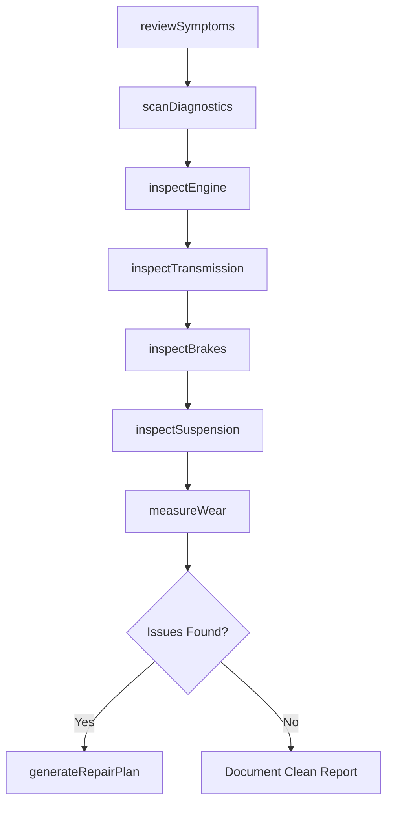
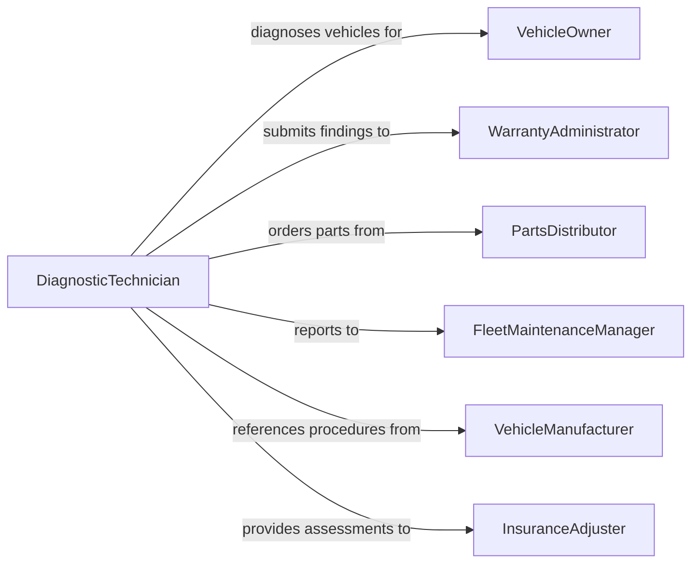

# Inspect Mechanical Components of Vehicles to Identify Problems

> Business-as-Code definition for inspecting mechanical components of vehicles to identify problems. Models the diagnostic inspection workflow of examining engine, transmission, drivetrain, braking, and suspension systems to detect wear, damage, or malfunction before failure occurs.

## Overview

Inspecting mechanical components of vehicles to identify problems involves conducting detailed examinations of engines, transmissions, differentials, braking systems, suspension assemblies, steering mechanisms, and drivetrain components to detect wear patterns, fluid leaks, unusual noises, and incipient failures. This definition covers visual inspection, measurement-based evaluation, diagnostic scanning, road testing, and repair recommendation generation. It supports automotive service shops, heavy equipment maintenance, commercial fleet diagnostics, and warranty claim investigation.

## Actors

| Actor | Description |
|-------|-------------|
| VehicleOwner | Reports symptoms and authorizes diagnostic inspections |
| WarrantyAdministrator | Reviews mechanical findings to determine warranty coverage eligibility |
| PartsDistributor | Supplies replacement components based on inspection findings |
| FleetMaintenanceManager | Prioritizes mechanical inspections across a vehicle fleet |
| VehicleManufacturer | Provides technical service bulletins and diagnostic procedures |
| InsuranceAdjuster | Evaluates mechanical damage for accident or mechanical breakdown claims |

## Roles

| Role | Description |
|------|-------------|
| DiagnosticTechnician | Performs systematic mechanical inspections and diagnostic testing |
| MasterMechanic | Interprets complex mechanical findings and recommends repair strategies |
| ServiceWriter | Documents customer complaints and translates them into inspection tasks |
| QualityControlAuditor | Reviews inspection thoroughness and documentation accuracy |

## Entities

| Entity | Description |
|--------|-------------|
| MechanicalSystem | A functional grouping of components such as engine, transmission, or braking system |
| ComponentCondition | An assessment of wear, damage, or functional status of a specific part |
| DiagnosticCode | A standardized trouble code retrieved from the vehicle electronic control system |
| WearMeasurement | A quantitative reading such as brake pad thickness, belt deflection, or bearing play |
| SymptomReport | A customer or operator description of abnormal vehicle behavior |
| InspectionFinding | A documented observation of a mechanical issue discovered during examination |
| RepairRecommendation | A prescribed corrective action with estimated parts and labor |
| ServiceBulletin | A manufacturer notification of known issues and recommended fixes |

## Actions

| Action | Description |
|--------|-------------|
| reviewSymptoms | Analyze reported vehicle symptoms to guide the inspection focus |
| scanDiagnostics | Read electronic diagnostic codes and live data from vehicle control modules |
| inspectEngine | Examine engine components for leaks, wear, abnormal sounds, and performance issues |
| inspectTransmission | Check transmission operation, fluid condition, and shift quality |
| inspectBrakes | Measure brake component wear and verify hydraulic system integrity |
| inspectSuspension | Evaluate suspension and steering components for wear, play, and alignment |
| measureWear | Take quantitative readings of component dimensions and clearances |
| generateRepairPlan | Compile findings into a prioritized repair recommendation with cost estimates |

## Events

| Event | Description |
|-------|-------------|
| symptomsReviewed | Customer-reported symptoms have been analyzed and inspection scope defined |
| diagnosticsScanned | Electronic control module codes and data have been retrieved |
| engineInspected | Engine component examination is complete |
| transmissionInspected | Transmission evaluation has been performed |
| brakesInspected | Brake system measurements and checks are complete |
| suspensionInspected | Suspension and steering components have been evaluated |
| wearMeasured | Quantitative component measurements have been recorded |
| repairPlanGenerated | A prioritized repair recommendation has been compiled |

## Searches

| Search | Description |
|--------|-------------|
| findInspections | List mechanical inspections by vehicle, date, or system |
| getFindings | Retrieve inspection findings by vehicle, component, or severity |
| getDiagnosticCodes | Query diagnostic trouble codes by vehicle, module, or code category |
| getWearData | Access wear measurements by component type, vehicle, or date range |
| getServiceBulletins | Look up applicable manufacturer service bulletins by vehicle model |

## Entity Relationships



## State Diagram



## Workflow



## Actor Relationships



## Usage

### Calling Actions

```typescript
import { inspectMechanicalComponentsVehiclesIdentify } from '@headlessly/inspect-mechanical-components-vehicles-identify'

const mechInspection = inspectMechanicalComponentsVehiclesIdentify()

// Review customer symptoms
const symptoms = await mechInspection.reviewSymptoms({
  vehicleVin: '2T1BU4EE9DC123456',
  complaints: ['grinding-noise-braking', 'vibration-at-highway-speed'],
  mileage: 78500
})

// Scan diagnostics and inspect systems
const codes = await mechInspection.scanDiagnostics({
  vehicleVin: '2T1BU4EE9DC123456',
  modules: ['ECM', 'TCM', 'ABS', 'SRS']
})

const brakes = await mechInspection.inspectBrakes({
  vehicleVin: '2T1BU4EE9DC123456',
  checks: ['pad-thickness', 'rotor-condition', 'caliper-operation', 'brake-lines']
})

await mechInspection.measureWear({
  vehicleVin: '2T1BU4EE9DC123456',
  measurements: [
    { component: 'front-brake-pad-left', value: 2.1, unit: 'mm', minSpec: 3.0 },
    { component: 'front-brake-pad-right', value: 2.3, unit: 'mm', minSpec: 3.0 },
    { component: 'front-rotor-left', value: 24.8, unit: 'mm', minSpec: 25.0 }
  ]
})

// Generate repair plan
await mechInspection.generateRepairPlan({
  vehicleVin: '2T1BU4EE9DC123456',
  findings: [brakes],
  priority: 'safety-critical'
})
```

### Event-Driven Automation

```typescript
// Alert fleet manager when safety-critical issues are found
mechInspection.repairPlanGenerated(async ({ vehicleVin, findings, priority }) => {
  if (priority === 'safety-critical') {
    await fleet.groundVehicle({
      vin: vehicleVin,
      reason: 'Safety-critical mechanical issue detected'
    })
    await notify({
      to: 'fleet-maintenance',
      message: `Vehicle ${vehicleVin} grounded: ${findings.length} safety issues found`
    })
  }
})

// Check for applicable service bulletins on diagnostic code retrieval
mechInspection.diagnosticsScanned(async ({ vehicleVin, codes }) => {
  for (const code of codes) {
    const bulletins = await mechInspection.getServiceBulletins({
      vehicleVin,
      relatedCode: code.id
    })
    if (bulletins.length > 0) {
      await notify({
        to: 'service-advisor',
        message: `TSB available for ${code.id} on ${vehicleVin}: ${bulletins[0].title}`
      })
    }
  }
})
```
