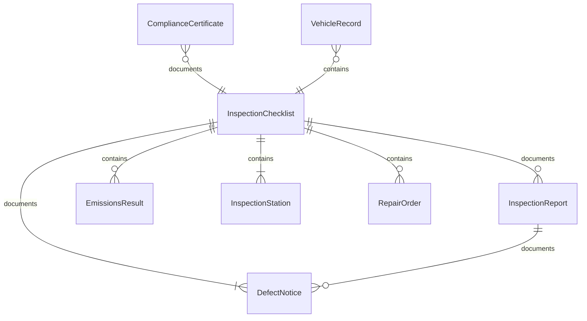
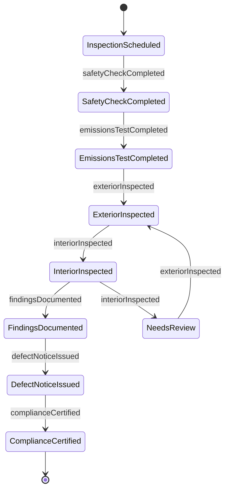
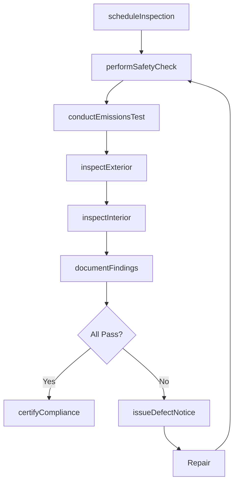
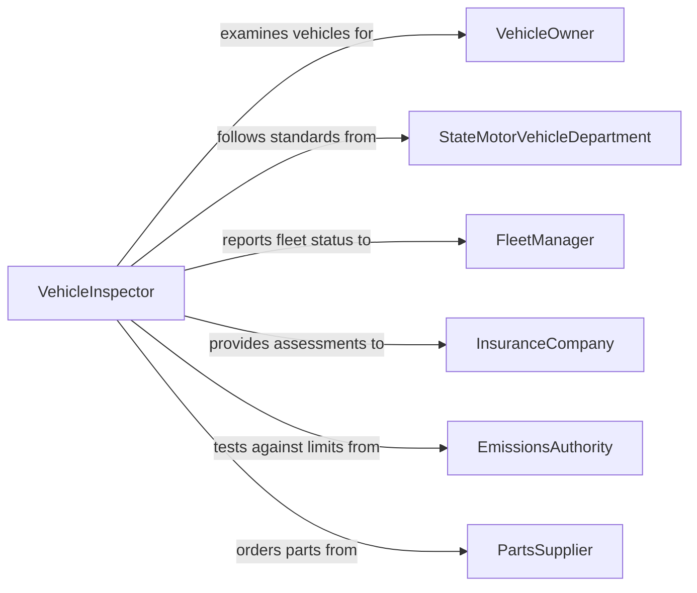

# Inspect Motor Vehicles

> Business-as-Code definition for inspecting motor vehicles. Models the vehicle inspection workflow of scheduling examinations, performing safety and emissions checks, documenting findings, and issuing compliance certifications or repair orders.

## Overview

Inspecting motor vehicles involves conducting systematic examinations of automobiles, trucks, buses, and other road vehicles to verify compliance with safety standards, emissions regulations, and roadworthiness requirements. This definition covers pre-trip inspections, periodic safety inspections, emissions testing, commercial vehicle compliance checks, and post-accident assessments. It supports state motor vehicle programs, commercial fleet management, dealership reconditioning, and insurance appraisal operations.

## Actors

| Actor | Description |
|-------|-------------|
| VehicleOwner | Presents the vehicle for inspection and receives compliance documentation |
| StateMotorVehicleDepartment | Sets inspection standards, licenses inspection stations, and enforces compliance |
| FleetManager | Schedules inspections for commercial vehicle fleets and tracks compliance status |
| InsuranceCompany | Requires vehicle condition assessments for underwriting and claims processing |
| EmissionsAuthority | Establishes emissions testing requirements and acceptable pollutant thresholds |
| PartsSupplier | Provides replacement components when inspection findings require repairs |

## Roles

| Role | Description |
|------|-------------|
| VehicleInspector | Performs systematic vehicle examinations and records findings |
| CertifiedEmissionsTester | Conducts emissions analysis using approved testing equipment |
| ServiceAdvisor | Communicates inspection results to vehicle owners and coordinates repairs |
| ComplianceOfficer | Monitors fleet inspection status and ensures regulatory deadlines are met |

## Entities

| Entity | Description |
|--------|-------------|
| InspectionChecklist | A standardized list of examination points covering safety, emissions, and mechanical systems |
| InspectionReport | A documented record of all findings from a vehicle examination |
| ComplianceCertificate | An official document certifying the vehicle meets inspection requirements |
| DefectNotice | A documented finding of a condition requiring repair before the vehicle can pass |
| EmissionsResult | Measured pollutant levels from tailpipe or onboard diagnostics testing |
| VehicleRecord | Historical inspection and maintenance data for a specific vehicle |
| InspectionStation | A licensed facility authorized to perform official vehicle inspections |
| RepairOrder | A work authorization to correct deficiencies identified during inspection |

## Actions

| Action | Description |
|--------|-------------|
| scheduleInspection | Book a vehicle for a scheduled inspection appointment |
| performSafetyCheck | Examine brakes, tires, lights, steering, and other safety-critical systems |
| conductEmissionsTest | Measure exhaust pollutants or read onboard diagnostic codes |
| inspectExterior | Check body condition, glass integrity, mirrors, and lighting equipment |
| inspectInterior | Verify seatbelts, airbag indicators, instrument panel, and horn functionality |
| documentFindings | Record all inspection observations and measurements |
| issueDefectNotice | Formally notify the vehicle owner of conditions requiring repair |
| certifyCompliance | Issue an official certificate confirming the vehicle passes inspection |

## Events

| Event | Description |
|-------|-------------|
| inspectionScheduled | A vehicle has been booked for an inspection appointment |
| safetyCheckCompleted | Safety system examinations have been performed |
| emissionsTestCompleted | Emissions measurements or diagnostic readings have been captured |
| exteriorInspected | Body and exterior equipment examination is complete |
| interiorInspected | Interior systems and occupant safety equipment have been verified |
| findingsDocumented | All inspection observations have been recorded |
| defectNoticeIssued | A repair requirement has been formally communicated |
| complianceCertified | The vehicle has been officially certified as passing inspection |

## Searches

| Search | Description |
|--------|-------------|
| findInspections | List inspections by vehicle, date, station, or outcome |
| getDefects | Retrieve defect notices by vehicle, type, or repair status |
| getEmissionsResults | Query emissions test data by vehicle, date, or pollutant level |
| getComplianceStatus | Check current inspection compliance for a vehicle or fleet |
| getVehicleHistory | Access complete inspection history for a specific vehicle |

## Entity Relationships



## State Diagram



## Workflow



## Actor Relationships



## Usage

### Calling Actions

```typescript
import { inspectMotorVehicles } from '@headlessly/inspect-motor-vehicles'

const inspection = inspectMotorVehicles()

// Schedule an annual safety inspection
const appointment = await inspection.scheduleInspection({
  vehicle: { vin: '1HGBH41JXMN109186', year: 2024, make: 'Honda', model: 'Accord' },
  type: 'annual-safety',
  station: 'station-047',
  requestedDate: '2026-03-15'
})

// Perform the safety check
const safety = await inspection.performSafetyCheck({
  inspectionId: appointment.id,
  systems: ['brakes', 'tires', 'steering', 'suspension', 'lights', 'horn', 'wipers'],
  measurements: {
    brakePadFront: 6.2,
    brakePadRear: 5.8,
    tireTreadFL: 5.5,
    tireTreadFR: 5.3
  }
})

// Conduct emissions test
const emissions = await inspection.conductEmissionsTest({
  inspectionId: appointment.id,
  method: 'OBD-II',
  readings: { dtcCount: 0, readinessMonitors: 'all-complete' }
})

// Document and certify
await inspection.documentFindings({ inspectionId: appointment.id })
await inspection.certifyCompliance({
  inspectionId: appointment.id,
  validUntil: '2027-03-15'
})
```

### Event-Driven Automation

```typescript
// Notify fleet manager when a vehicle fails inspection
inspection.defectNoticeIssued(async ({ vehicleVin, defects }) => {
  await notify({
    to: 'fleet-operations',
    message: `Vehicle ${vehicleVin} failed inspection: ${defects.map(d => d.system).join(', ')}`
  })
  await fleet.removeFromService({ vin: vehicleVin, reason: 'inspection-failure' })
})

// Auto-update fleet compliance records on certification
inspection.complianceCertified(async ({ vehicleVin, validUntil }) => {
  await fleet.updateComplianceStatus({
    vin: vehicleVin,
    status: 'compliant',
    nextInspectionDue: validUntil
  })
})
```
