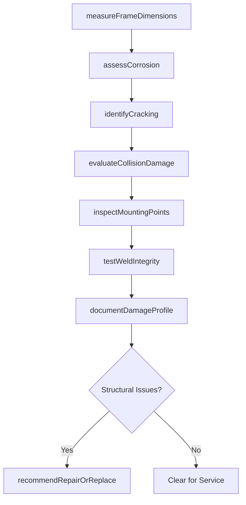
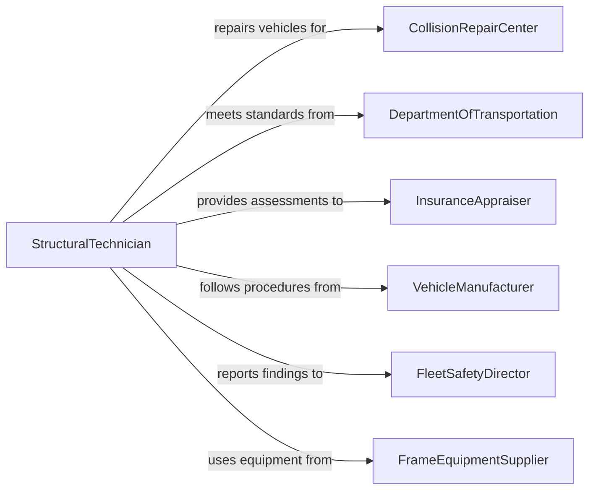

# Inspect Structural Components of Vehicles to Identify Problems

> Business-as-Code definition for inspecting structural components of vehicles to identify problems. Models the structural integrity assessment workflow of examining frames, chassis, unibody structures, and load-bearing members to detect corrosion, fatigue cracking, collision damage, and structural deformation.

## Overview

Inspecting structural components of vehicles to identify problems involves evaluating the integrity of frames, subframes, unibody structures, cross-members, outriggers, and load-bearing mounting points to detect corrosion, stress fractures, weld failures, collision damage, and dimensional deformation. This definition covers visual examination, dimensional measurement, non-destructive testing, and structural repair assessment. It supports collision repair facilities, commercial vehicle maintenance operations, DOT compliance inspections, and heavy equipment structural evaluations.

## Actors

| Actor | Description |
|-------|-------------|
| CollisionRepairCenter | Assesses structural damage and performs frame corrections on accident-damaged vehicles |
| DepartmentOfTransportation | Mandates structural inspection standards for commercial motor vehicles |
| InsuranceAppraiser | Evaluates structural damage extent for repair-versus-total-loss decisions |
| VehicleManufacturer | Provides structural repair procedures and sectioning guidelines |
| FleetSafetyDirector | Ensures commercial fleet vehicles maintain structural integrity |
| FrameEquipmentSupplier | Provides measuring systems and straightening equipment for structural repair |

## Roles

| Role | Description |
|------|-------------|
| StructuralTechnician | Performs frame measurements, damage analysis, and structural repairs |
| CollisionEstimator | Assesses structural damage and creates repair cost estimates |
| DOTInspector | Conducts regulatory structural inspections on commercial motor vehicles |
| WeldingInspector | Evaluates weld quality on structural repairs and original manufacturing joints |

## Entities

| Entity | Description |
|--------|-------------|
| FrameMeasurement | A dimensional reading of structural reference points compared to manufacturer specifications |
| CorrosionAssessment | An evaluation of oxidation severity and remaining material thickness |
| DamageProfile | A comprehensive description of structural damage including type, location, and extent |
| StructuralRepairPlan | A documented procedure for correcting identified structural deficiencies |
| WeldInspection | An evaluation of weld integrity on structural joints |
| DimensionalSpecification | Manufacturer-published reference point measurements for the vehicle structure |
| LoadTestResult | A measurement of structural response under applied loads |
| ComplianceDecal | A marking indicating the structure has passed regulatory inspection |

## Actions

| Action | Description |
|--------|-------------|
| measureFrameDimensions | Take reference point measurements and compare against manufacturer specifications |
| assessCorrosion | Evaluate the extent and depth of corrosion on structural members |
| identifyCracking | Inspect welds and base metal for stress fractures and fatigue cracks |
| evaluateCollisionDamage | Determine the extent of structural deformation from impact forces |
| inspectMountingPoints | Check engine, suspension, and body mounting points for damage or deterioration |
| testWeldIntegrity | Verify the soundness of structural welds using visual or NDT methods |
| documentDamageProfile | Record all structural findings with measurements and photographs |
| recommendRepairOrReplace | Advise whether structural components should be repaired, sectioned, or replaced |

## Events

| Event | Description |
|-------|-------------|
| frameMeasured | Structural reference point measurements have been taken and compared |
| corrosionAssessed | Corrosion extent and severity have been evaluated |
| crackingIdentified | Stress fractures or fatigue cracks have been detected in structural members |
| collisionDamageEvaluated | The extent of impact-related structural deformation has been determined |
| mountingPointsInspected | Engine, suspension, and body mounting points have been checked |
| weldIntegrityTested | Structural weld soundness has been verified |
| damageProfileDocumented | All structural findings have been recorded with supporting evidence |
| repairRecommended | A repair, section, or replacement recommendation has been issued |

## Searches

| Search | Description |
|--------|-------------|
| findInspections | List structural inspections by vehicle, date, or finding type |
| getFrameMeasurements | Retrieve dimensional data by vehicle, reference point, or measurement date |
| getCorrosionRecords | Query corrosion assessments by vehicle, location, or severity rating |
| getDamageProfiles | Access structural damage documentation by vehicle or damage type |
| getRepairHistory | Look up structural repair records by vehicle, component, or repair method |

## Workflow



## Actor Relationships



## Usage

### Calling Actions

```typescript
import { inspectStructuralComponentsVehiclesIdentify } from '@headlessly/inspect-structural-components-vehicles-identify'

const structuralInspection = inspectStructuralComponentsVehiclesIdentify()

// Measure frame dimensions on a collision-damaged vehicle
const measurements = await structuralInspection.measureFrameDimensions({
  vin: '1FTFW1ET5DFA12345',
  vehicle: { year: 2024, make: 'Ford', model: 'F-150' },
  system: 'Car-O-Liner',
  referencePoints: [
    { point: 'front-frame-horn-left', measured: { x: 0, y: 0, z: 0 }, spec: { x: 0, y: 0, z: 0 } },
    { point: 'front-frame-horn-right', measured: { x: 1420, y: -2, z: 3 }, spec: { x: 1422, y: 0, z: 0 } },
    { point: 'cowl-reference', measured: { x: 850, y: 1, z: -1 }, spec: { x: 850, y: 0, z: 0 } }
  ]
})

// Assess corrosion on a commercial vehicle
await structuralInspection.assessCorrosion({
  vin: '1FTFW1ET5DFA12345',
  locations: [
    { member: 'right-frame-rail', position: 'rear-axle-area', severity: 'moderate', thicknessRemaining: 4.2, originalThickness: 6.0 },
    { member: 'cross-member-3', position: 'center', severity: 'minor', thicknessRemaining: 5.5, originalThickness: 6.0 }
  ]
})

// Evaluate collision damage
await structuralInspection.evaluateCollisionDamage({
  vin: '1FTFW1ET5DFA12345',
  impactDirection: 'front-offset-left',
  affectedComponents: ['front-frame-rail-left', 'apron-assembly-left', 'radiator-support'],
  deformationMeasured: { maxDisplacement: 45, unit: 'mm' }
})

// Document and recommend
await structuralInspection.documentDamageProfile({
  vin: '1FTFW1ET5DFA12345',
  findings: measurements.deviations,
  photographs: 24
})
```

### Event-Driven Automation

```typescript
// Flag vehicles for total loss review when structural damage exceeds thresholds
structuralInspection.collisionDamageEvaluated(async ({ vin, deformationMeasured, affectedComponents }) => {
  if (deformationMeasured.maxDisplacement > 60 || affectedComponents.length > 4) {
    await insurance.flagForTotalLossReview({
      vin,
      reason: `Structural deformation ${deformationMeasured.maxDisplacement}mm across ${affectedComponents.length} components`
    })
  }
})

// Remove commercial vehicles from service when critical corrosion is found
structuralInspection.corrosionAssessed(async ({ vin, locations }) => {
  const critical = locations.filter(l => l.thicknessRemaining / l.originalThickness < 0.5)
  if (critical.length > 0) {
    await fleet.removeFromService({
      vin,
      reason: `Critical corrosion: ${critical.map(c => c.member).join(', ')}`
    })
    await notify({
      to: 'fleet-safety',
      message: `Vehicle ${vin} removed from service: structural corrosion below 50% thickness`
    })
  }
})
```
