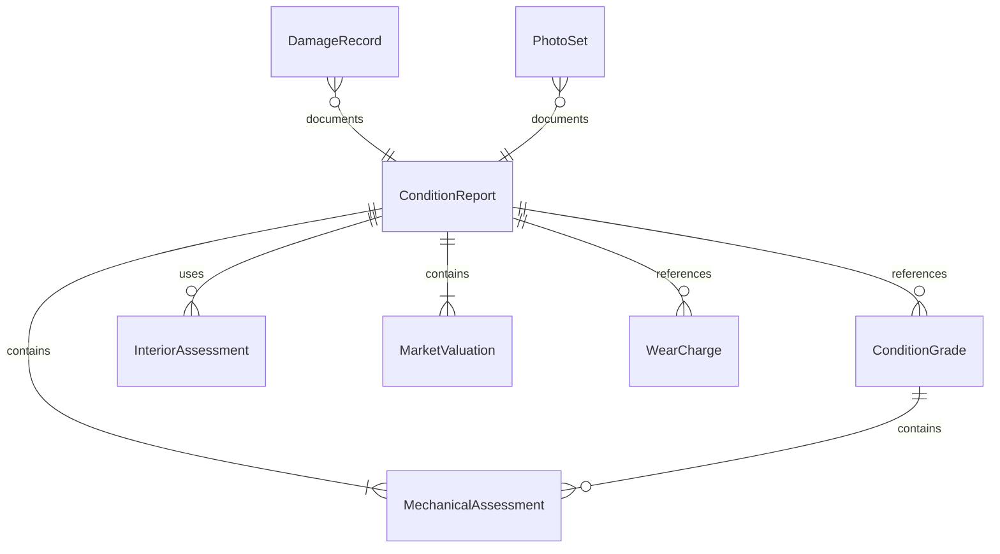
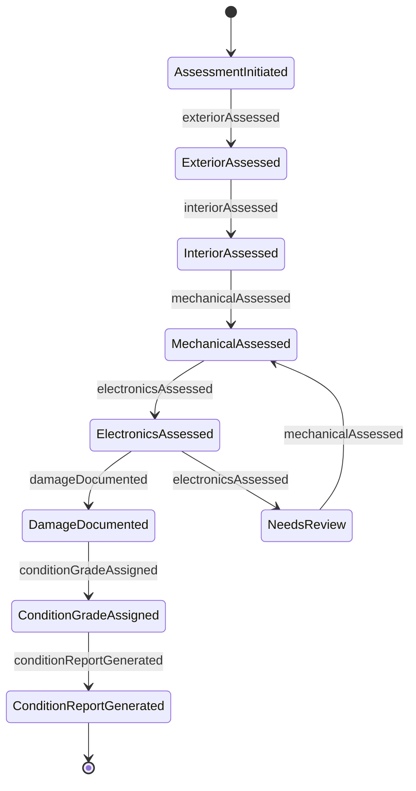
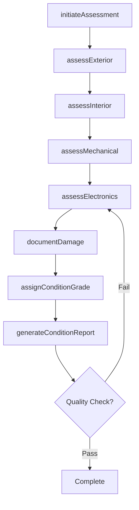
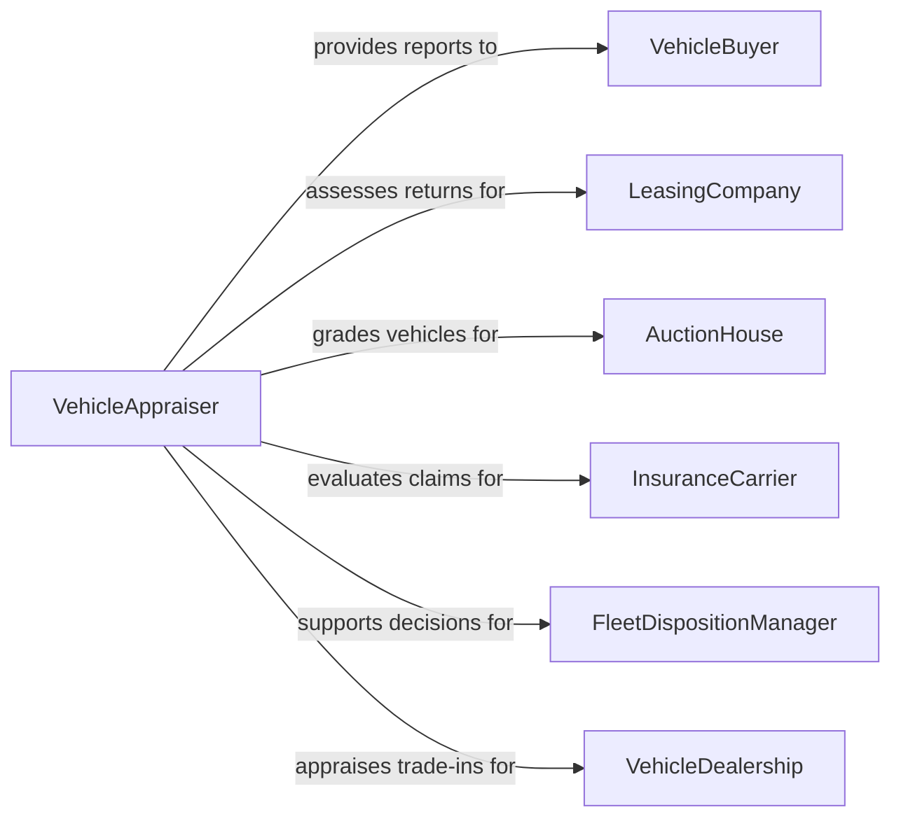

# Inspect Vehicles to Determine Overall Condition

> Business-as-Code definition for inspecting vehicles to determine overall condition. Models the comprehensive vehicle assessment workflow of evaluating mechanical, cosmetic, and functional condition to produce an accurate condition rating for resale, lease return, insurance, or fleet management purposes.

## Overview

Inspecting vehicles to determine overall condition involves conducting multi-point assessments that evaluate the mechanical soundness, cosmetic appearance, interior condition, electronic functionality, and documentation completeness of automobiles, trucks, and specialty vehicles. This definition covers pre-purchase inspections, lease-end evaluations, fleet disposition assessments, auction grading, and insurance appraisals. It supports used vehicle dealers, leasing companies, rental car operators, fleet management organizations, and independent appraisal services.

## Actors

| Actor | Description |
|-------|-------------|
| VehicleBuyer | Commissions a pre-purchase inspection before completing a vehicle transaction |
| LeasingCompany | Requires end-of-lease condition assessments to determine excess wear charges |
| AuctionHouse | Grades vehicles by condition for wholesale auction pricing |
| InsuranceCarrier | Requests condition reports for total loss valuation or diminished value claims |
| FleetDispositionManager | Evaluates fleet vehicles for resale, redeployment, or retirement decisions |
| VehicleDealership | Appraises trade-in vehicles and assesses reconditioning costs |

## Roles

| Role | Description |
|------|-------------|
| VehicleAppraiser | Conducts comprehensive condition evaluations and assigns condition grades |
| PhotoDocumentationSpecialist | Captures detailed images supporting the condition assessment |
| MechanicalEvaluator | Assesses drivetrain, chassis, and safety system condition |
| ConditionReportReviewer | Quality-checks assessment completeness and grading consistency |

## Entities

| Entity | Description |
|--------|-------------|
| ConditionReport | A comprehensive document detailing the vehicle overall condition assessment |
| ConditionGrade | A standardized rating such as NAAA scale from 1 to 5 indicating overall vehicle quality |
| DamageRecord | A documented instance of cosmetic or structural damage with location and severity |
| MechanicalAssessment | An evaluation of engine, transmission, and chassis system functionality |
| InteriorAssessment | An evaluation of seats, carpets, headliner, and cabin equipment condition |
| PhotoSet | A collection of images documenting the vehicle condition at time of inspection |
| MarketValuation | An estimated fair market value based on condition, mileage, and market data |
| WearCharge | A calculated cost for damage or wear exceeding normal use standards |

## Actions

| Action | Description |
|--------|-------------|
| initiateAssessment | Begin a vehicle condition evaluation by recording vehicle identification and mileage |
| assessExterior | Evaluate paint, body panels, glass, trim, and lighting for damage or wear |
| assessInterior | Examine seats, carpeting, dashboard, controls, and cabin accessories |
| assessMechanical | Test engine operation, transmission shifting, brakes, and suspension response |
| assessElectronics | Verify operation of infotainment, climate control, safety systems, and powered accessories |
| documentDamage | Record specific damage items with location, size, severity, and photographs |
| assignConditionGrade | Apply a standardized grading scale based on aggregate findings |
| generateConditionReport | Compile all assessments into a formal condition report with valuation |

## Events

| Event | Description |
|-------|-------------|
| assessmentInitiated | A vehicle condition evaluation has been started with identification recorded |
| exteriorAssessed | Exterior condition evaluation is complete |
| interiorAssessed | Interior condition evaluation is complete |
| mechanicalAssessed | Mechanical systems evaluation is complete |
| electronicsAssessed | Electronic systems verification is complete |
| damageDocumented | Specific damage items have been recorded with photographs |
| conditionGradeAssigned | A standardized condition grade has been applied to the vehicle |
| conditionReportGenerated | A comprehensive condition report has been produced |

## Searches

| Search | Description |
|--------|-------------|
| findAssessments | List condition assessments by vehicle, date, assessor, or grade |
| getDamageRecords | Retrieve damage documentation by vehicle, location, or severity |
| getConditionHistory | Access historical condition reports for a specific vehicle |
| getFleetConditions | Query condition grades across a fleet by grade range or age |
| getValuations | Look up market valuations by vehicle, condition grade, or date |

## Entity Relationships



## State Diagram



## Workflow



## Actor Relationships



## Usage

### Calling Actions

```typescript
import { inspectVehiclesDetermineOverallCondition } from '@headlessly/inspect-vehicles-determine-overall-condition'

const conditionInspection = inspectVehiclesDetermineOverallCondition()

// Initiate a lease-end assessment
const assessment = await conditionInspection.initiateAssessment({
  vin: '5YJSA1DN5DFP12345',
  year: 2023,
  make: 'Tesla',
  model: 'Model S',
  mileage: 36420,
  purpose: 'lease-return',
  leasingCompany: 'US-Bank-Leasing'
})

// Perform multi-point assessment
await conditionInspection.assessExterior({
  assessmentId: assessment.id,
  panels: { hood: 'good', fenderFL: 'scratch-6in', doorFL: 'good', doorRL: 'dent-2in' },
  glass: 'good',
  tires: { treadFL: 5.2, treadFR: 5.0, treadRL: 6.1, treadRR: 6.0 }
})

await conditionInspection.assessInterior({
  assessmentId: assessment.id,
  seats: 'normal-wear',
  carpet: 'good',
  dashboard: 'good',
  headliner: 'good'
})

await conditionInspection.assessMechanical({
  assessmentId: assessment.id,
  engine: 'normal-operation',
  brakes: 'adequate',
  suspension: 'no-issues'
})

// Document damage and generate report
await conditionInspection.documentDamage({
  assessmentId: assessment.id,
  items: [
    { location: 'front-left-fender', type: 'scratch', length: 6, unit: 'inches' },
    { location: 'rear-left-door', type: 'dent', diameter: 2, unit: 'inches' }
  ]
})

await conditionInspection.assignConditionGrade({
  assessmentId: assessment.id,
  scale: 'NAAA',
  grade: 3.5
})
```

### Event-Driven Automation

```typescript
// Calculate excess wear charges on lease-end assessments
conditionInspection.conditionReportGenerated(async ({ assessmentId, purpose, damageItems }) => {
  if (purpose === 'lease-return') {
    const charges = damageItems
      .filter(d => d.exceedsNormalWear)
      .map(d => ({ description: d.description, charge: d.repairCost }))
    if (charges.length > 0) {
      await leasing.issueWearCharges({ assessmentId, charges })
    }
  }
})

// Flag low-grade fleet vehicles for disposition
conditionInspection.conditionGradeAssigned(async ({ vin, grade, purpose }) => {
  if (purpose === 'fleet-evaluation' && grade < 2.5) {
    await fleet.recommendDisposition({
      vin,
      recommendation: 'wholesale-auction',
      reason: `Condition grade ${grade} below redeployment threshold`
    })
  }
})
```
