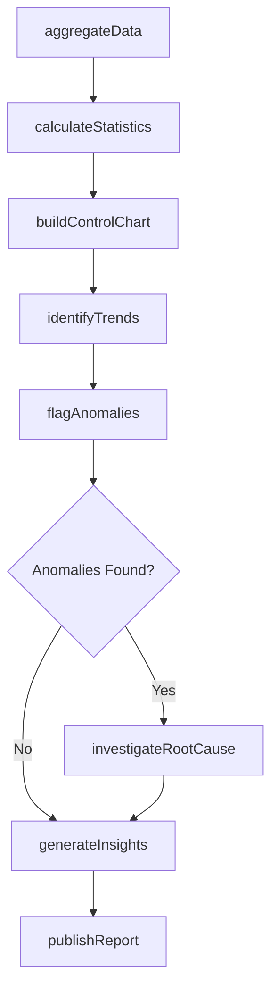
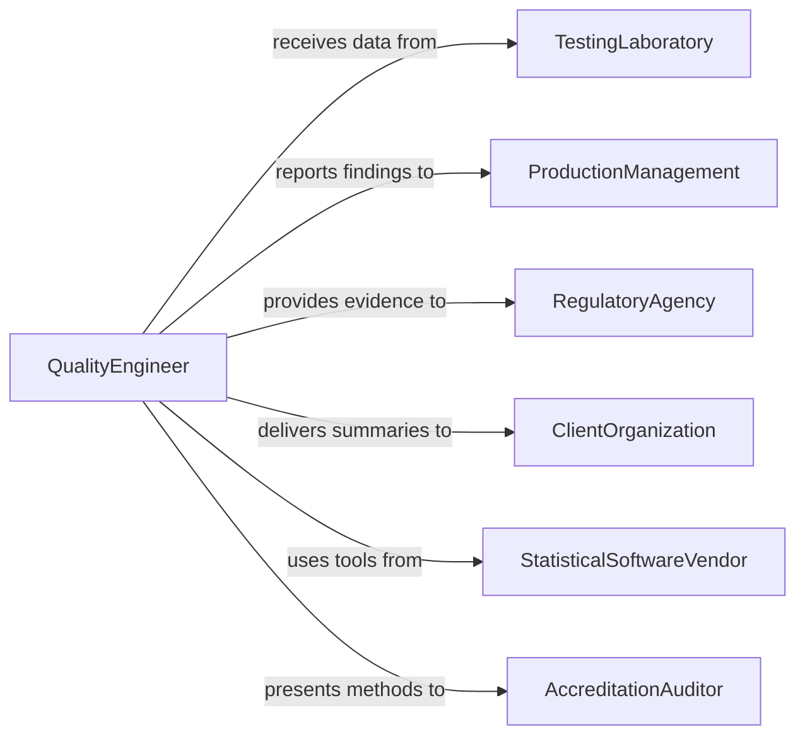

# Analyze Test Results

> Business-as-Code definition for analyzing test results. Models the data analysis workflow of aggregating test data, applying statistical methods, identifying trends and anomalies, and generating actionable insights for quality improvement and decision-making.

## Overview

Analyzing test results involves collecting, organizing, and statistically evaluating data from quality control tests, laboratory analyses, and performance evaluations to draw conclusions about product quality, process stability, and compliance with specifications. This definition provides actions for data aggregation, statistical process control, trend analysis, root cause investigation, and insight reporting. It supports quality engineering, laboratory management, and continuous improvement programs across manufacturing, healthcare, and environmental testing domains.

## Actors

| Actor | Description |
|-------|-------------|
| TestingLaboratory | Generates raw test data requiring analysis and interpretation |
| ProductionManagement | Uses analysis findings to adjust manufacturing processes |
| RegulatoryAgency | Requires statistical evidence of compliance with standards |
| ClientOrganization | Receives analytical summaries and trend reports |
| StatisticalSoftwareVendor | Provides tools for SPC, DOE, and advanced analytics |
| AccreditationAuditor | Reviews analytical methods and statistical practices during audits |

## Roles

| Role | Description |
|------|-------------|
| DataAnalyst | Aggregates test data and performs statistical calculations |
| QualityEngineer | Interprets analysis findings and drives process improvements |
| StatisticalConsultant | Designs experiments and advises on advanced analytical methods |
| LaboratoryManager | Oversees data integrity and ensures analytical procedures are followed |

## Entities

| Entity | Description |
|--------|-------------|
| DataSet | A collection of test results organized for analysis |
| StatisticalSummary | Calculated metrics including mean, standard deviation, Cpk, and confidence intervals |
| ControlChart | A time-series plot used to monitor process stability and detect special causes |
| TrendReport | A document showing how test results change over time or across conditions |
| AnomalyFlag | A marker indicating a data point that deviates significantly from expected patterns |
| RootCauseAnalysis | An investigation linking anomalous results to their underlying causes |
| ComplianceEvidence | Statistical documentation demonstrating conformance to regulatory requirements |
| ActionableInsight | A specific, data-supported recommendation for process or product improvement |

## Actions

| Action | Description |
|--------|-------------|
| aggregateData | Collect and organize test results from multiple sources into a unified data set |
| calculateStatistics | Compute descriptive and inferential statistics on the aggregated data |
| buildControlChart | Create SPC charts to monitor process stability over time |
| identifyTrends | Detect patterns, shifts, or drifts in test results across time or conditions |
| flagAnomalies | Mark data points that fall outside expected statistical boundaries |
| investigateRootCause | Trace anomalous results back to their underlying process or material causes |
| generateInsights | Produce actionable recommendations based on the analysis findings |
| publishReport | Distribute the analysis summary and recommendations to stakeholders |

## Events

| Event | Description |
|-------|-------------|
| dataAggregated | Test results from multiple sources have been collected and organized |
| statisticsCalculated | Descriptive and inferential metrics have been computed |
| controlChartUpdated | An SPC chart has been updated with new data points |
| trendIdentified | A significant pattern or shift in test results has been detected |
| anomalyFlagged | A data point outside expected boundaries has been marked |
| rootCauseIdentified | The underlying cause of an anomaly has been determined |
| insightsGenerated | Data-supported recommendations have been produced |
| reportPublished | The analysis summary has been distributed to stakeholders |

## Searches

| Search | Description |
|--------|-------------|
| findDataSets | List aggregated data sets by product, test type, or date range |
| getStatistics | Retrieve calculated statistics for a specific data set or parameter |
| getControlCharts | Access SPC charts by process, parameter, or time period |
| getTrends | Query identified trends by direction, significance, or parameter |
| getAnomalies | Find flagged anomalies awaiting root cause investigation |

## Workflow



## Actor Relationships



## Usage

### Calling Actions

```typescript
import { analyzeTestResults } from '@headlessly/analyze-test-results'

const analysis = analyzeTestResults()

// Aggregate test data from a production run
const dataSet = await analysis.aggregateData({
  source: 'quality-lab',
  product: 'Widget-A200',
  parameter: 'tensile-strength',
  period: { start: '2026-01-01', end: '2026-01-31' },
  sampleCount: 500
})

// Calculate statistics and build control charts
const stats = await analysis.calculateStatistics({
  dataSetId: dataSet.id,
  metrics: ['mean', 'stddev', 'cpk', 'ppk']
})

await analysis.buildControlChart({
  dataSetId: dataSet.id,
  chartType: 'Xbar-R',
  subgroupSize: 5,
  controlLimits: 'calculated'
})

// Identify trends and flag anomalies
await analysis.identifyTrends({
  dataSetId: dataSet.id,
  rules: ['western-electric', 'nelson']
})

const anomalies = await analysis.flagAnomalies({
  dataSetId: dataSet.id,
  threshold: 3 // sigma
})
```

### Event-Driven Automation

```typescript
// Auto-investigate when anomalies are detected
analysis.anomalyFlagged(async ({ dataSetId, parameter, dataPoint }) => {
  await analysis.investigateRootCause({
    dataSetId,
    anomaly: dataPoint,
    methods: ['5-why', 'fishbone']
  })
  await notify({
    to: 'quality-engineering',
    message: `Anomaly detected in ${parameter}: value ${dataPoint.value} at ${dataPoint.timestamp}`
  })
})

// Publish monthly trend reports automatically
analysis.statisticsCalculated(async ({ dataSetId, stats }) => {
  if (stats.cpk < 1.33) {
    await notify({
      to: 'process-engineering',
      message: `Process capability below target: Cpk = ${stats.cpk.toFixed(2)}`
    })
  }
})
```
