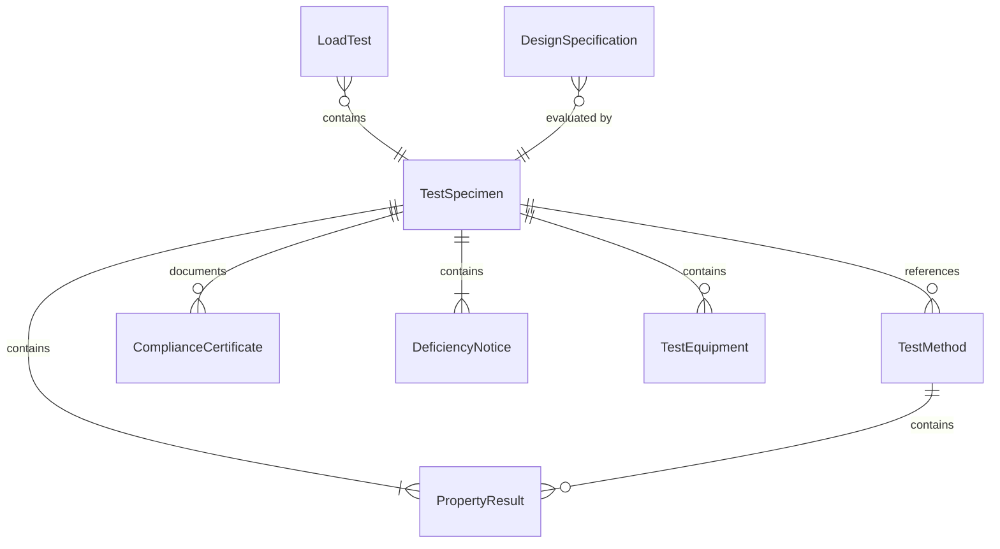
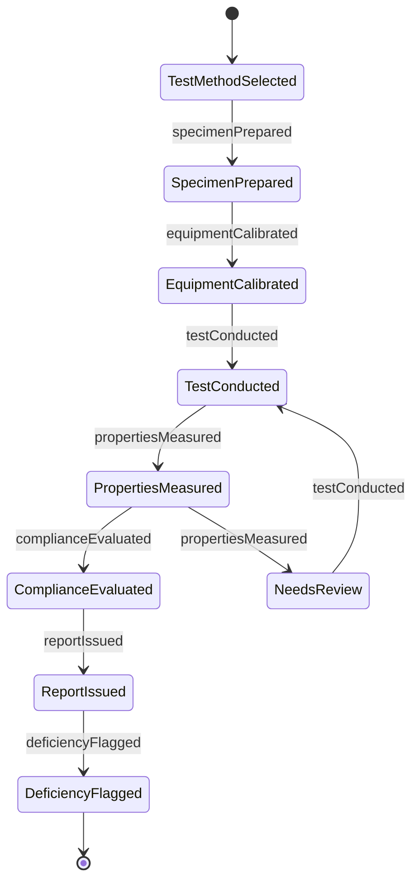
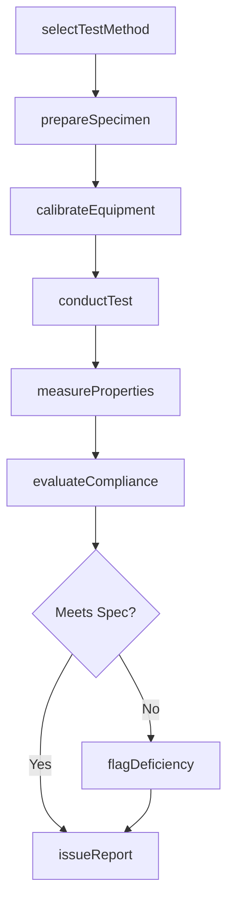
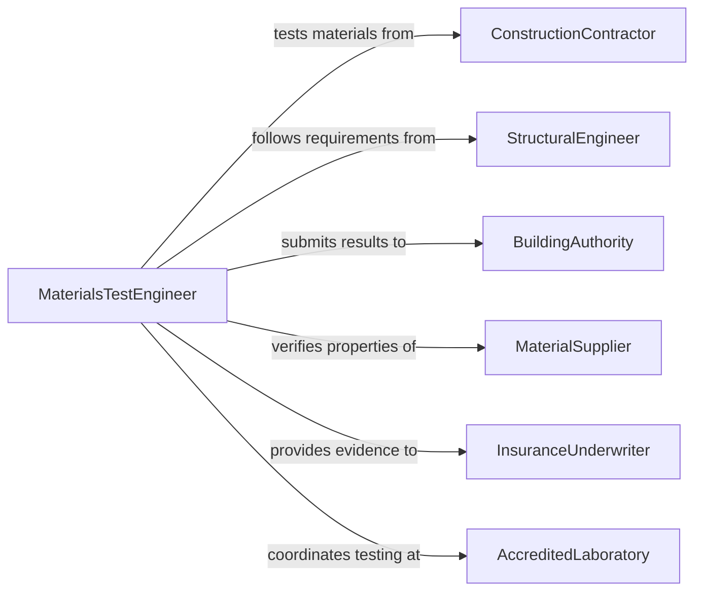

# Test Characteristics of Materials or Structures

> Business-as-Code definition for testing characteristics of materials or structures. Models the structural evaluation workflow of selecting test methods, preparing specimens, performing mechanical and physical property measurements, and reporting compliance with design and safety standards.

## Overview

Testing characteristics of materials or structures involves applying mechanical, physical, and non-destructive evaluation techniques to determine the strength, durability, integrity, and performance properties of construction materials, structural components, and assembled structures. This definition covers specimen preparation, load testing, hardness measurement, impact resistance evaluation, fatigue analysis, and structural integrity assessment. It supports civil engineering, construction quality assurance, materials science research, and building code compliance across infrastructure, commercial construction, and industrial facility domains.

## Actors

| Actor | Description |
|-------|-------------|
| ConstructionContractor | Provides materials and structural elements requiring testing before installation |
| StructuralEngineer | Specifies testing requirements based on design calculations and load criteria |
| BuildingAuthority | Enforces code compliance and may require independent testing for permit approval |
| MaterialSupplier | Furnishes raw materials with mill certificates and declared properties |
| InsuranceUnderwriter | Requires structural testing evidence to assess risk and set coverage terms |
| AccreditedLaboratory | Performs certified testing under ISO 17025 or equivalent accreditation |

## Roles

| Role | Description |
|------|-------------|
| MaterialsTestEngineer | Selects test methods, interprets results, and certifies material properties |
| TestTechnician | Prepares specimens, operates test equipment, and records measurements |
| QualityAssuranceManager | Ensures testing procedures follow standards and maintains documentation |
| FieldInspector | Conducts on-site structural tests and collects samples for laboratory analysis |

## Entities

| Entity | Description |
|--------|-------------|
| TestSpecimen | A prepared sample of material or structural component subjected to evaluation |
| TestMethod | A standardized procedure such as ASTM or EN for measuring a specific property |
| LoadTest | An application of controlled force to measure structural response and capacity |
| PropertyResult | A quantitative measurement of a material characteristic such as tensile strength or modulus |
| ComplianceCertificate | A document confirming that material or structural properties meet specification requirements |
| DesignSpecification | Engineering criteria defining required material properties and safety factors |
| DeficiencyNotice | A formal notification when tested properties fall below required thresholds |
| TestEquipment | Calibrated instruments such as universal testing machines, hardness testers, or ultrasonic probes |

## Actions

| Action | Description |
|--------|-------------|
| selectTestMethod | Choose the appropriate standardized test procedure for the material or structure |
| prepareSpecimen | Cut, machine, or condition test specimens according to the selected method |
| calibrateEquipment | Verify test instrument accuracy using reference standards before testing |
| conductTest | Apply loads, forces, or measurements to the specimen and record data |
| measureProperties | Extract quantitative property values from raw test data |
| evaluateCompliance | Compare measured properties against design specifications and code requirements |
| issueReport | Produce a formal test report with results, compliance status, and recommendations |
| flagDeficiency | Document and communicate properties that fail to meet required thresholds |

## Events

| Event | Description |
|-------|-------------|
| testMethodSelected | A standardized test procedure has been chosen for the evaluation |
| specimenPrepared | Test specimens have been cut and conditioned per the selected method |
| equipmentCalibrated | Test instruments have been verified against reference standards |
| testConducted | Loads or measurements have been applied and raw data captured |
| propertiesMeasured | Quantitative property values have been extracted from test data |
| complianceEvaluated | Measured properties have been compared against specifications |
| reportIssued | A formal test report has been produced and distributed |
| deficiencyFlagged | A property falling below required thresholds has been documented |

## Searches

| Search | Description |
|--------|-------------|
| findSpecimens | List test specimens by material type, project, or preparation status |
| getPropertyResults | Retrieve measured property values by material, test method, or date range |
| getComplianceStatus | Query compliance evaluations by project, material, or outcome |
| getDeficiencies | Find flagged deficiencies by severity, material, or resolution status |
| getCalibrationRecords | Check equipment calibration status and certification history |

## Entity Relationships



## State Diagram



## Workflow



## Actor Relationships



## Usage

### Calling Actions

```typescript
import { testCharacteristicsMaterialsStructures } from '@headlessly/test-characteristics-materials-structures'

const structuralTest = testCharacteristicsMaterialsStructures()

// Select test method for reinforcing steel
const method = await structuralTest.selectTestMethod({
  material: 'reinforcing-steel-grade-60',
  standard: 'ASTM-A615',
  properties: ['tensile-strength', 'yield-strength', 'elongation'],
  specimenType: 'rebar-coupon'
})

// Prepare and test specimens
await structuralTest.prepareSpecimen({
  methodId: method.id,
  source: 'LOT-2026-REBAR-0234',
  quantity: 6,
  dimensions: { length: 600, gauge: 200 }
})

await structuralTest.calibrateEquipment({
  instrument: 'UTM-500kN-01',
  standard: 'ISO-7500-1',
  calibrationDate: '2026-01-15'
})

const result = await structuralTest.conductTest({
  methodId: method.id,
  specimen: 'SPEC-001',
  parameters: { crossheadSpeed: 10, preload: 5 }
})

// Evaluate against design specifications
await structuralTest.evaluateCompliance({
  resultId: result.id,
  specification: {
    tensileStrength: { min: 620 },
    yieldStrength: { min: 420 },
    elongation: { min: 9 }
  }
})
```

### Event-Driven Automation

```typescript
// Halt construction when deficiencies are found in structural materials
structuralTest.deficiencyFlagged(async ({ material, property, measuredValue, requiredValue }) => {
  await notify({
    to: 'structural-engineering',
    message: `Material deficiency: ${material} ${property} = ${measuredValue} (required: ${requiredValue})`
  })
  await construction.issueStopWork({
    material,
    reason: `Failed ${property} test - below specification`
  })
})

// Auto-release materials when compliance is confirmed
structuralTest.complianceEvaluated(async ({ specimenId, material, status }) => {
  if (status === 'compliant') {
    await materials.releaseForUse({ materialId: material, certificateRef: specimenId })
  }
})
```
