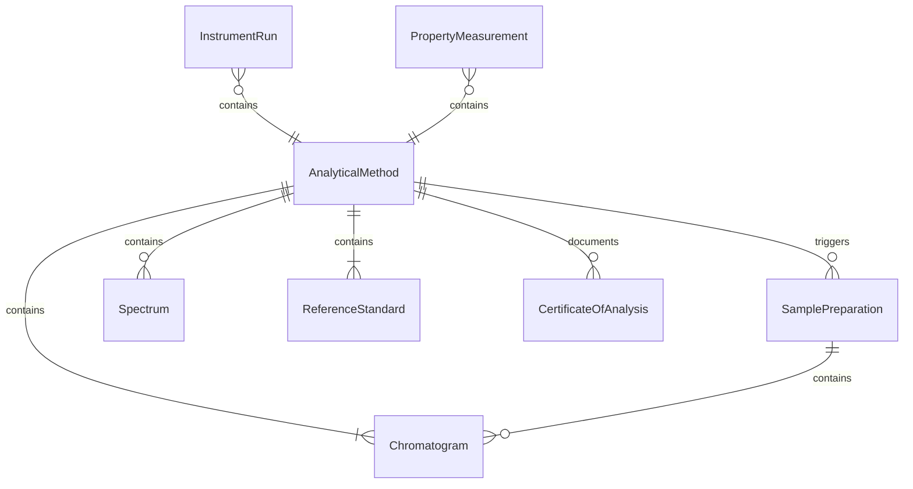
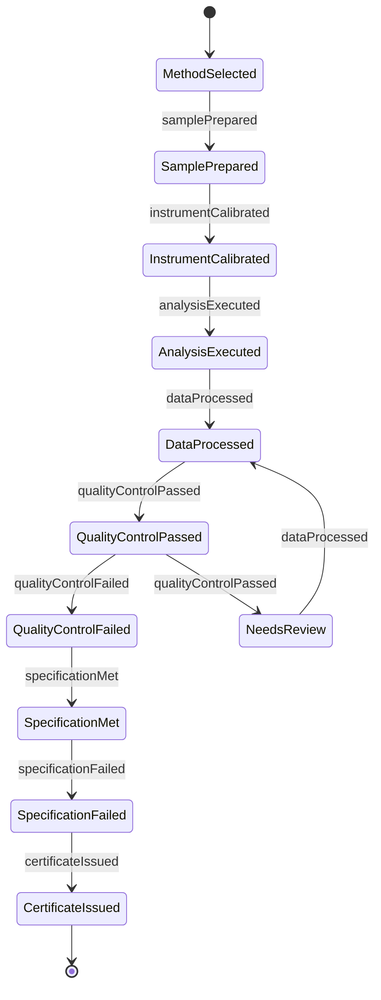
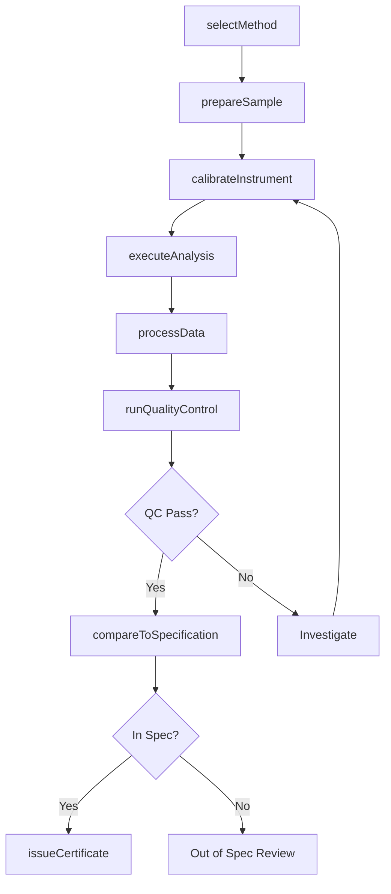
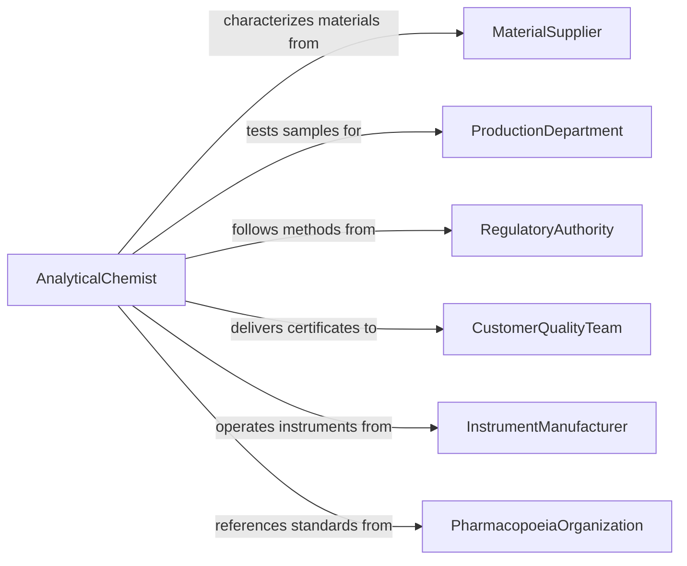

# Test Chemical or Physical Characteristics of Materials or Products

> Business-as-Code definition for testing chemical or physical characteristics of materials or products. Models the analytical characterization workflow of selecting methods, preparing samples, performing instrumental and wet-chemistry analyses, and reporting measured properties against acceptance specifications.

## Overview

Testing chemical or physical characteristics of materials or products involves applying analytical chemistry, spectroscopy, chromatography, thermal analysis, and physical measurement techniques to determine the composition, purity, density, viscosity, melting point, particle size, and other properties of raw materials, intermediate products, and finished goods. This definition covers method selection, sample preparation, instrument operation, quality control checks, and certificate-of-analysis generation. It supports pharmaceutical manufacturing, chemical production, food processing, polymer engineering, and metallurgical quality assurance.

## Actors

| Actor | Description |
|-------|-------------|
| MaterialSupplier | Provides raw materials requiring incoming quality characterization |
| ProductionDepartment | Submits in-process and finished product samples for release testing |
| RegulatoryAuthority | Mandates specific analytical methods and reportable parameters |
| CustomerQualityTeam | Specifies acceptance criteria and reviews certificates of analysis |
| InstrumentManufacturer | Provides analytical instruments, consumables, and technical support |
| PharmacopoeiaOrganization | Publishes compendial methods and reference standards for regulated products |

## Roles

| Role | Description |
|------|-------------|
| AnalyticalChemist | Selects methods, interprets spectra, and validates analytical procedures |
| LaboratoryTechnician | Prepares samples, operates instruments, and records observations |
| QualityControlManager | Reviews data integrity and authorizes release decisions |
| MethodValidationSpecialist | Develops and validates new analytical methods for emerging products |

## Entities

| Entity | Description |
|--------|-------------|
| AnalyticalMethod | A validated procedure for measuring a specific chemical or physical property |
| SamplePreparation | The set of steps to condition a sample for analysis such as dissolution, extraction, or dilution |
| InstrumentRun | A sequence of measurements performed on an analytical instrument |
| Chromatogram | An output graph from chromatographic analysis showing separated components |
| Spectrum | An output from spectroscopic analysis showing absorption or emission patterns |
| PropertyMeasurement | A quantitative determination of a specific chemical or physical characteristic |
| ReferenceStandard | A certified material of known composition used to calibrate instruments |
| CertificateOfAnalysis | A formal document reporting measured properties and compliance status |

## Actions

| Action | Description |
|--------|-------------|
| selectMethod | Choose the appropriate validated analytical method for the requested characterization |
| prepareSample | Perform dissolution, extraction, dilution, or other conditioning steps |
| calibrateInstrument | Run reference standards to establish instrument response curves |
| executeAnalysis | Operate the analytical instrument and collect raw measurement data |
| processData | Convert raw instrument signals into quantitative property values |
| runQualityControl | Analyze control samples to verify measurement accuracy and precision |
| compareToSpecification | Evaluate measured values against acceptance criteria |
| issueCertificate | Produce a certificate of analysis documenting results and compliance |

## Events

| Event | Description |
|-------|-------------|
| methodSelected | A validated analytical method has been chosen for the characterization |
| samplePrepared | Sample conditioning steps are complete and the specimen is ready |
| instrumentCalibrated | Reference standards have established valid response curves |
| analysisExecuted | Instrument measurements have been collected |
| dataProcessed | Raw signals have been converted to quantitative property values |
| qualityControlPassed | Control sample results confirm measurement accuracy |
| qualityControlFailed | Control sample results indicate a measurement accuracy problem |
| specificationMet | Measured values fall within acceptance criteria |
| specificationFailed | Measured values fall outside acceptance criteria |
| certificateIssued | A certificate of analysis has been produced and authorized |

## Searches

| Search | Description |
|--------|-------------|
| findSamples | List samples by material, product, submission date, or analysis status |
| getResults | Retrieve property measurements by sample, method, or date range |
| getMethods | Look up validated analytical methods by property, material, or standard |
| getCalibrations | Query instrument calibration records by instrument, date, or status |
| getCertificates | Access certificates of analysis by product, lot, or customer |

## Entity Relationships



## State Diagram



## Workflow



## Actor Relationships



## Usage

### Calling Actions

```typescript
import { testChemicalPhysicalCharacteristicsMaterials } from '@headlessly/test-chemical-physical-characteristics-materials'

const charTest = testChemicalPhysicalCharacteristicsMaterials()

// Select method for polymer characterization
const method = await charTest.selectMethod({
  material: 'polyethylene-HDPE',
  properties: ['melt-flow-index', 'density', 'tensile-strength', 'ash-content'],
  standards: ['ASTM-D1238', 'ASTM-D792', 'ASTM-D638', 'ASTM-D5630']
})

// Prepare sample and calibrate
await charTest.prepareSample({
  methodId: method.id,
  sampleId: 'RM-2026-HDPE-0445',
  preparation: ['pellet-conditioning-23C-50RH', 'compression-molding']
})

await charTest.calibrateInstrument({
  instrument: 'MFI-tester-01',
  standard: 'NIST-SRM-1473a',
  temperature: 190,
  load: 2.16
})

// Execute analysis and process results
const run = await charTest.executeAnalysis({
  methodId: method.id,
  sampleId: 'RM-2026-HDPE-0445',
  replicates: 5
})

const results = await charTest.processData({
  runId: run.id,
  calculations: ['mean', 'rsd', 'uncertainty']
})
```

### Event-Driven Automation

```typescript
// Quarantine material when specification fails
charTest.specificationFailed(async ({ sampleId, property, measuredValue, specification }) => {
  await inventory.quarantine({
    materialId: sampleId,
    reason: `${property} = ${measuredValue} (spec: ${specification.min}-${specification.max})`
  })
  await notify({
    to: 'quality-control',
    message: `Out-of-spec result on ${sampleId}: ${property}`
  })
})

// Rerun analysis when quality control fails
charTest.qualityControlFailed(async ({ runId, instrument, controlSample }) => {
  await notify({
    to: 'lab-supervisor',
    message: `QC failure on ${instrument}: control sample ${controlSample} out of range`
  })
  await charTest.calibrateInstrument({
    instrument,
    standard: controlSample,
    forceRecalibration: true
  })
})
```
