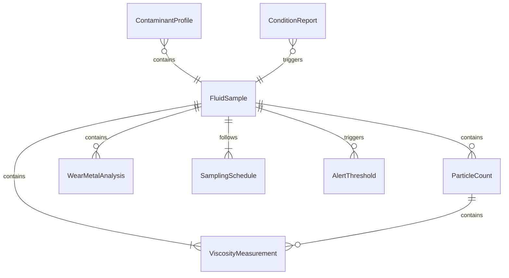
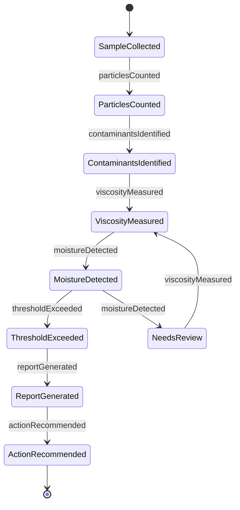
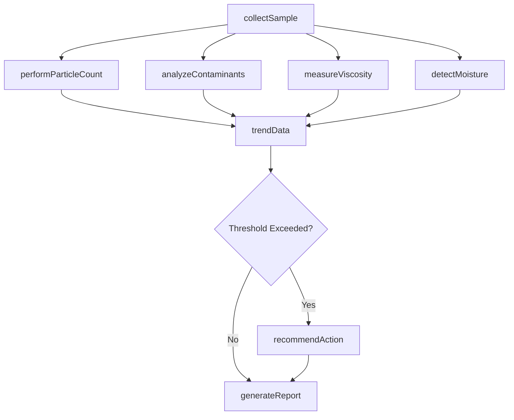
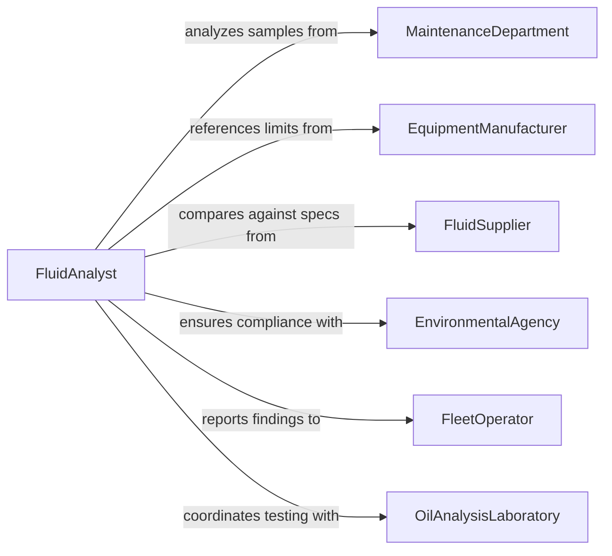

# Test Fluids to Identify Contamination or Other Problems

> Business-as-Code definition for testing fluids to identify contamination or other problems. Models the fluid analysis workflow of collecting samples, performing chemical and particulate testing, identifying contaminants, and generating corrective action recommendations for equipment maintenance and process control.

## Overview

Testing fluids to identify contamination or other problems involves sampling and analyzing hydraulic fluids, lubricants, coolants, fuels, water supplies, and process chemicals to detect particulate matter, chemical degradation, microbial growth, and cross-contamination. This definition covers sample collection, particle counting, spectroscopic analysis, moisture detection, viscosity measurement, and trending of fluid condition data over time. It supports predictive maintenance programs, industrial lubrication management, water treatment operations, and fuel quality assurance across manufacturing, aviation, marine, and power generation industries.

## Actors

| Actor | Description |
|-------|-------------|
| MaintenanceDepartment | Submits fluid samples from operating equipment for condition monitoring |
| EquipmentManufacturer | Specifies fluid requirements and contamination limits for warranty compliance |
| FluidSupplier | Provides lubricants, coolants, and hydraulic fluids with baseline specifications |
| EnvironmentalAgency | Regulates discharge limits and contamination thresholds for water and waste fluids |
| FleetOperator | Manages vehicles or aircraft requiring routine fluid condition monitoring |
| OilAnalysisLaboratory | Performs specialized tribological and fluid condition analyses |

## Roles

| Role | Description |
|------|-------------|
| FluidAnalyst | Performs fluid testing, interprets results, and recommends corrective actions |
| MaintenancePlanner | Schedules fluid changes and equipment maintenance based on analysis findings |
| SampleCollector | Draws fluid samples from equipment following proper sampling procedures |
| ReliabilityEngineer | Trends fluid data over time to predict equipment failures and optimize intervals |

## Entities

| Entity | Description |
|--------|-------------|
| FluidSample | A quantity of fluid drawn from equipment or a process for laboratory analysis |
| ParticleCount | A measurement of solid contaminant particles categorized by size distribution |
| ContaminantProfile | An identification of specific contaminants such as metals, water, fuel, or glycol |
| ViscosityMeasurement | A determination of fluid flow resistance indicating degradation or contamination |
| WearMetalAnalysis | Spectroscopic identification of metallic particles indicating component wear |
| ConditionReport | A summary of fluid health status with trend data and recommended actions |
| SamplingSchedule | A planned frequency and location for routine fluid sample collection |
| AlertThreshold | A predefined limit that triggers corrective action when exceeded |

## Actions

| Action | Description |
|--------|-------------|
| collectSample | Draw a fluid sample from equipment or process following standardized procedures |
| performParticleCount | Measure and classify solid contaminant particles by size and quantity |
| analyzeContaminants | Identify specific chemical, metallic, or biological contaminants in the fluid |
| measureViscosity | Determine fluid viscosity and compare against baseline specifications |
| detectMoisture | Measure water content in oil or fuel using Karl Fischer or other methods |
| trendData | Plot fluid condition metrics over time to identify degradation patterns |
| generateReport | Produce a condition report with findings, trends, and recommendations |
| recommendAction | Prescribe corrective measures such as fluid change, filtration, or equipment repair |

## Events

| Event | Description |
|-------|-------------|
| sampleCollected | A fluid sample has been drawn and logged into the analysis system |
| particlesCounted | Particle count analysis has been completed with size distribution data |
| contaminantsIdentified | Specific contaminants in the fluid have been characterized |
| viscosityMeasured | Fluid viscosity has been determined and compared against baseline |
| moistureDetected | Elevated water content has been found in the fluid |
| thresholdExceeded | A fluid condition metric has exceeded a predefined alert limit |
| reportGenerated | A fluid condition report has been produced with recommendations |
| actionRecommended | Corrective measures have been prescribed based on analysis findings |

## Searches

| Search | Description |
|--------|-------------|
| findSamples | List fluid samples by equipment, date, fluid type, or analysis status |
| getConditionHistory | Retrieve historical fluid condition data for trending and comparison |
| getAlerts | Find fluid condition alerts by equipment, severity, or resolution status |
| getContaminantProfiles | Query identified contaminants by type, concentration, or equipment |
| getScheduledSampling | Look up upcoming sample collection dates by equipment or circuit |

## Entity Relationships



## State Diagram



## Workflow



## Actor Relationships



## Usage

### Calling Actions

```typescript
import { testFluidsIdentifyContaminationProblems } from '@headlessly/test-fluids-identify-contamination-problems'

const fluidTest = testFluidsIdentifyContaminationProblems()

// Collect a hydraulic fluid sample from a press
const sample = await fluidTest.collectSample({
  equipment: 'hydraulic-press-HP-200',
  fluidType: 'hydraulic-oil-ISO-46',
  samplePoint: 'return-line-valve',
  operatingHours: 4200,
  collectionMethod: 'vacuum-bottle'
})

// Run comprehensive fluid analysis
const particles = await fluidTest.performParticleCount({
  sampleId: sample.id,
  standard: 'ISO-4406',
  channels: [4, 6, 14, 21]
})

const contaminants = await fluidTest.analyzeContaminants({
  sampleId: sample.id,
  tests: ['ICP-spectroscopy', 'FTIR', 'acid-number'],
  metals: ['iron', 'copper', 'chromium', 'lead', 'aluminum']
})

const viscosity = await fluidTest.measureViscosity({
  sampleId: sample.id,
  temperatures: [40, 100],
  method: 'ASTM-D445'
})

// Trend and report
await fluidTest.trendData({
  equipment: 'hydraulic-press-HP-200',
  metrics: ['particle-count', 'iron-ppm', 'viscosity-40C'],
  period: { months: 12 }
})
```

### Event-Driven Automation

```typescript
// Schedule immediate fluid change when contamination threshold is exceeded
fluidTest.thresholdExceeded(async ({ equipment, metric, value, threshold }) => {
  await maintenance.createWorkOrder({
    equipment,
    type: 'fluid-change',
    priority: 'urgent',
    reason: `${metric} at ${value} exceeds limit of ${threshold}`
  })
  await notify({
    to: 'maintenance-supervisor',
    message: `Critical fluid condition on ${equipment}: ${metric} = ${value}`
  })
})

// Auto-generate trending reports on schedule
fluidTest.reportGenerated(async ({ equipment, conditionStatus }) => {
  if (conditionStatus === 'caution') {
    await maintenance.adjustSamplingFrequency({
      equipment,
      newInterval: 'biweekly'
    })
  }
})
```
