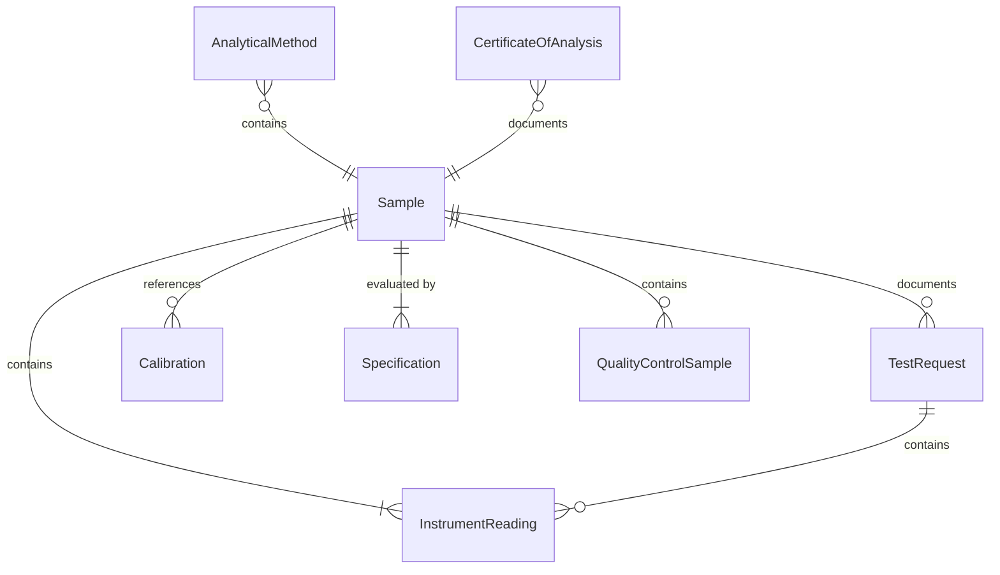
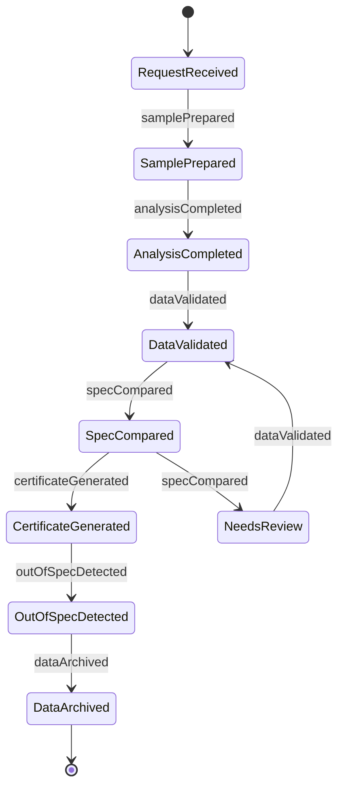
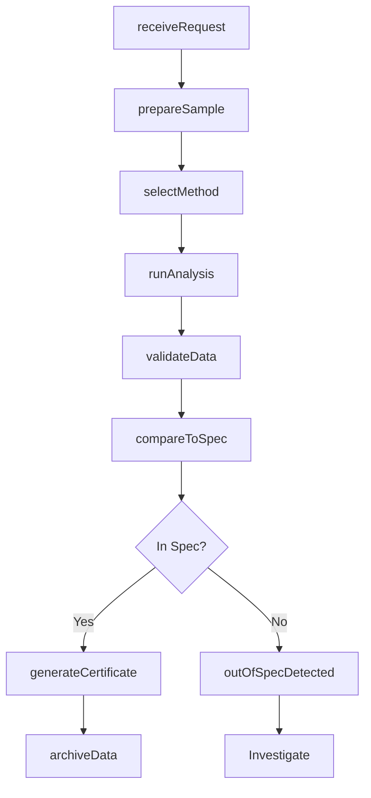
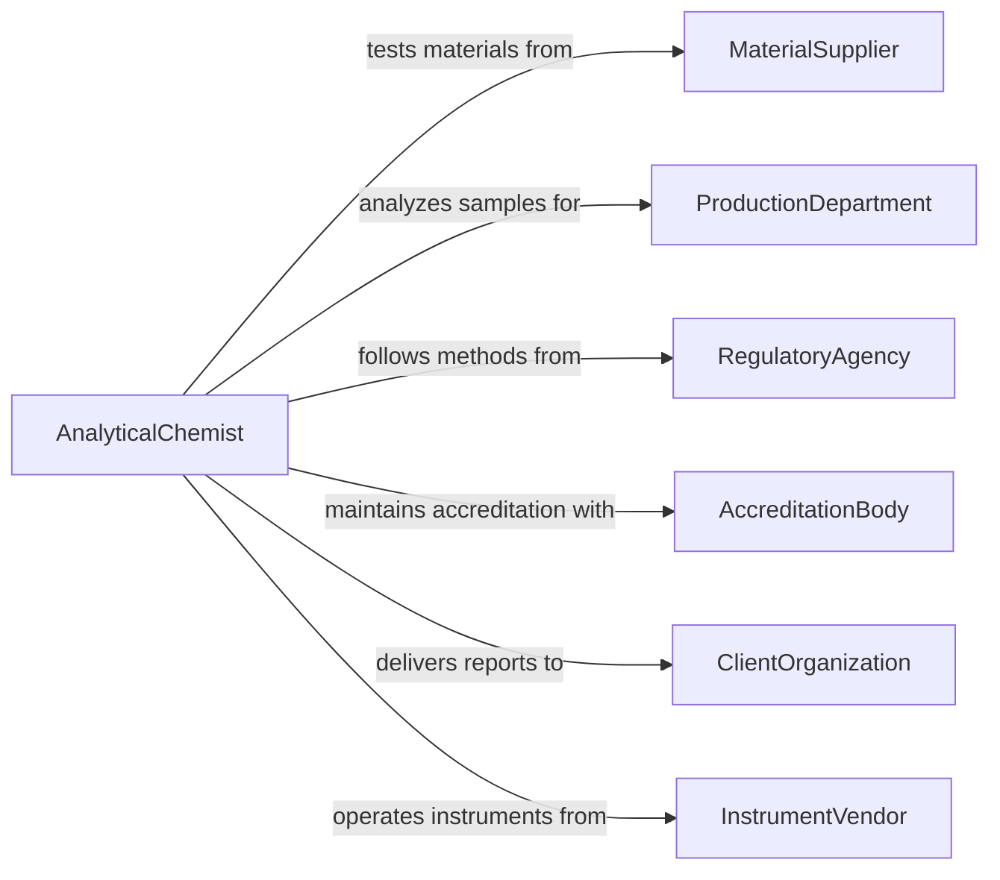

# Test Materials, Solutions, or Samples

> Business-as-Code definition for testing materials, solutions, or samples. Models the analytical laboratory workflow of receiving test requests, preparing specimens, performing chemical, physical, and instrumental analyses, and reporting results against acceptance specifications.

## Overview

Testing materials, solutions, or samples involves applying analytical chemistry, physical measurement, and instrumental analysis techniques to determine the composition, purity, concentration, and properties of raw materials, in-process solutions, and environmental or industrial samples. This definition covers sample intake, preparation, method selection, instrument operation, data analysis, and certificate-of-analysis generation. It supports quality control laboratories, environmental testing facilities, and research institutions.

## Actors

| Actor | Description |
|-------|-------------|
| MaterialSupplier | Provides raw materials requiring incoming quality verification |
| ProductionDepartment | Submits in-process samples for monitoring and release testing |
| RegulatoryAgency | Sets analytical method requirements and reportable limits |
| AccreditationBody | Certifies laboratory competence through ISO 17025 or equivalent programs |
| ClientOrganization | Commissions testing services and receives certificates of analysis |
| InstrumentVendor | Provides analytical instruments, calibration standards, and maintenance services |

## Roles

| Role | Description |
|------|-------------|
| AnalyticalChemist | Selects methods, performs analyses, and interprets instrument data |
| LaboratoryTechnician | Prepares samples, operates routine instruments, and records observations |
| QualityManager | Ensures analytical methods are validated and results meet accreditation standards |
| LaboratoryDirector | Authorizes final reports and manages laboratory operations |

## Entities

| Entity | Description |
|--------|-------------|
| Sample | A material, solution, or specimen submitted for analytical testing |
| TestRequest | A documented request specifying the sample, tests, and required turnaround |
| AnalyticalMethod | A validated procedure for measuring a specific property or analyte |
| InstrumentReading | Raw data output from an analytical instrument |
| Calibration | A verification of instrument accuracy using certified reference standards |
| CertificateOfAnalysis | A formal report documenting test results and compliance status |
| Specification | Acceptance criteria defining allowable ranges for tested properties |
| QualityControlSample | A known-value reference material analyzed alongside unknowns to verify accuracy |

## Actions

| Action | Description |
|--------|-------------|
| receiveRequest | Accept a test request and log the sample into the laboratory system |
| prepareSample | Perform dilution, extraction, digestion, or other preparation steps |
| selectMethod | Choose the appropriate validated analytical method for the requested tests |
| runAnalysis | Execute the analytical procedure using calibrated instrumentation |
| validateData | Review instrument readings against quality control criteria |
| compareToSpec | Evaluate results against the applicable acceptance specifications |
| generateCertificate | Produce a certificate of analysis with results and compliance status |
| archiveData | Store raw data, calculations, and reports per retention policies |

## Events

| Event | Description |
|-------|-------------|
| requestReceived | A test request and sample have been logged into the system |
| samplePrepared | Sample preparation steps are complete and the specimen is ready for analysis |
| analysisCompleted | Instrument analysis has been performed and raw data captured |
| dataValidated | Quality control checks have confirmed the accuracy of results |
| specCompared | Results have been evaluated against acceptance specifications |
| certificateGenerated | A certificate of analysis has been produced and authorized |
| outOfSpecDetected | A test result falls outside allowable specification limits |
| dataArchived | Raw data and reports have been stored per retention requirements |

## Searches

| Search | Description |
|--------|-------------|
| findSamples | List samples by client, material type, date, or status |
| getResults | Retrieve analytical results by sample, test, or date range |
| getOutOfSpec | Find all results flagged as out of specification |
| getCalibrationRecords | Check instrument calibration status and history |
| getCertificates | Look up certificates of analysis by sample or client |

## Entity Relationships



## State Diagram



## Workflow



## Actor Relationships



## Usage

### Calling Actions

```typescript
import { testMaterialsSolutionsSamples } from '@headlessly/test-materials-solutions-samples'

const labTesting = testMaterialsSolutionsSamples()

// Receive a raw material sample for incoming QC
const request = await labTesting.receiveRequest({
  sampleId: 'RM-2026-08912',
  material: 'sodium-hydroxide-50pct',
  client: 'production-line-A',
  tests: ['concentration', 'specific-gravity', 'chloride-content'],
  turnaround: '24-hours'
})

// Prepare and analyze
await labTesting.prepareSample({
  requestId: request.id,
  preparation: ['dilution-1to10', 'filtration']
})

const results = await labTesting.runAnalysis({
  requestId: request.id,
  methods: ['titration-HCl', 'hydrometer', 'ion-chromatography'],
  instruments: ['auto-titrator-01', 'digital-hydrometer', 'IC-2100']
})

// Validate and generate certificate
await labTesting.validateData({ resultId: results.id })
await labTesting.compareToSpec({
  resultId: results.id,
  specification: 'RM-SPEC-NaOH-50'
})
```

### Event-Driven Automation

```typescript
// Hold incoming material when out-of-spec results are detected
labTesting.outOfSpecDetected(async ({ sampleId, test, value, spec }) => {
  await inventory.placeHold({
    materialId: sampleId,
    reason: `OOS: ${test} = ${value} (spec: ${spec.min}-${spec.max})`
  })
  await notify({
    to: 'quality-team',
    message: `Out-of-spec result on ${sampleId}: ${test}`
  })
})

// Auto-release material when certificate is generated with passing results
labTesting.certificateGenerated(async ({ sampleId, status }) => {
  if (status === 'pass') {
    await inventory.releaseMaterial({ materialId: sampleId })
  }
})
```
