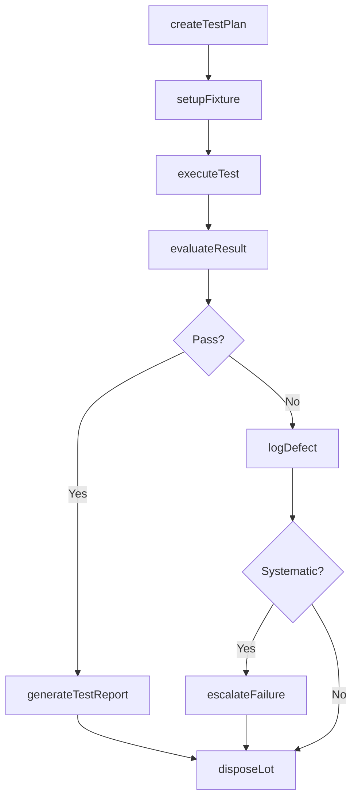
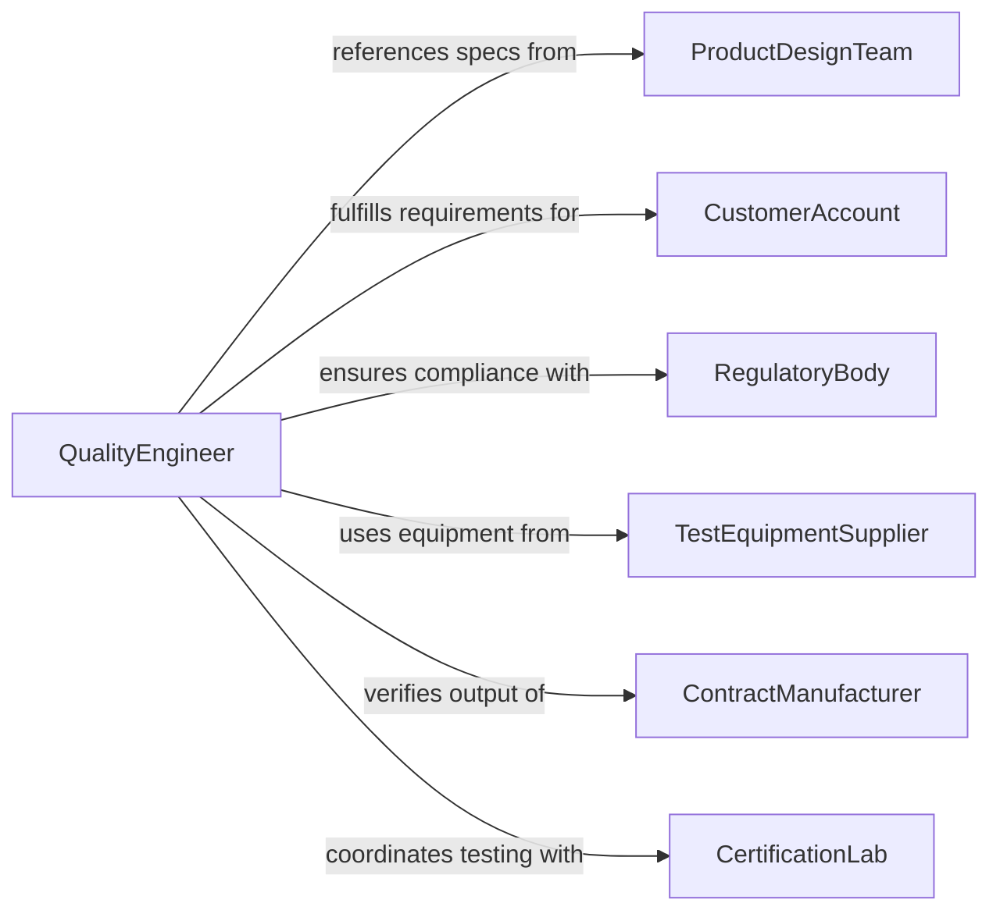

# Test Products for Functionality or Quality

> Business-as-Code definition for testing products for functionality or quality. Models the quality assurance workflow of defining test plans, executing functional and performance tests, recording pass/fail results, and managing disposition of tested products.

## Overview

Testing products for functionality or quality involves executing structured test procedures to verify that finished goods or assemblies meet design specifications, performance standards, and customer requirements before release. This definition covers test plan creation, fixture setup, functional testing, performance measurement, defect logging, and lot disposition. It supports manufacturing quality assurance, incoming inspection, final product release, and returned goods evaluation across consumer goods, electronics, automotive, and industrial product lines.

## Actors

| Actor | Description |
|-------|-------------|
| ProductDesignTeam | Defines functional requirements and acceptance criteria for testing |
| CustomerAccount | Specifies quality standards and testing requirements in purchase agreements |
| RegulatoryBody | Mandates safety, performance, or compliance testing for market release |
| TestEquipmentSupplier | Provides test fixtures, measurement instruments, and calibration services |
| ContractManufacturer | Produces goods requiring third-party quality verification |
| CertificationLab | Performs independent testing for product certifications such as UL or CE |

## Roles

| Role | Description |
|------|-------------|
| QualityEngineer | Designs test plans, analyzes results, and drives corrective actions |
| TestTechnician | Executes test procedures and records results using fixtures and instruments |
| ProductionSupervisor | Manages lot disposition based on test outcomes |
| ReliabilityEngineer | Designs accelerated life testing and evaluates failure modes |

## Entities

| Entity | Description |
|--------|-------------|
| TestPlan | A structured document defining test procedures, equipment, and acceptance criteria |
| TestResult | A recorded outcome of executing a test step on a specific product unit |
| DefectReport | A documented finding when a product fails to meet a test criterion |
| ProductLot | A batch of products tested together under the same conditions |
| TestFixture | Specialized equipment or jigs used to hold and interface with the product during testing |
| AcceptanceCriteria | Quantitative thresholds that define pass or fail for each test parameter |
| DispositionRecord | A decision document specifying whether a tested lot is released, reworked, or scrapped |
| CalibrationCertificate | Proof that test instruments are within accuracy specifications |

## Actions

| Action | Description |
|--------|-------------|
| createTestPlan | Define the test procedures, equipment, and acceptance criteria for a product |
| setupFixture | Prepare test fixtures and verify instrument calibration before testing |
| executeTest | Run the defined test procedure on a product unit and record measurements |
| evaluateResult | Compare test measurements against acceptance criteria |
| logDefect | Document a failed test result with root cause classification |
| disposeLot | Determine whether a tested lot is released, reworked, or scrapped |
| generateTestReport | Compile test data into a summary report for the product lot |
| escalateFailure | Route systematic failures to engineering for root cause investigation |

## Events

| Event | Description |
|-------|-------------|
| testPlanCreated | A test plan has been defined and approved for a product |
| fixtureReady | Test fixtures are set up and instruments are calibrated |
| testExecuted | A test procedure has been performed on a product unit |
| resultEvaluated | A test measurement has been compared against acceptance criteria |
| defectLogged | A product failure has been documented with classification |
| lotDisposed | A tested lot has been assigned a disposition decision |
| testReportGenerated | A summary report for the tested lot is available |
| systematicFailureDetected | A recurring defect pattern has been identified across multiple units |

## Searches

| Search | Description |
|--------|-------------|
| findTestResults | List test results by product, lot, date, or outcome |
| getDefects | Retrieve defect reports filtered by type, severity, or product |
| getTestPlans | Look up active test plans by product or revision |
| getLotDispositions | Query lot disposition records by product or decision type |
| getYieldMetrics | Calculate pass rates and yield statistics for a product or line |

## Workflow



## Actor Relationships



## Usage

### Calling Actions

```typescript
import { testProductsFunctionalityQuality } from '@headlessly/test-products-functionality-quality'

const qa = testProductsFunctionalityQuality()

// Create a test plan for a new electronic controller
const plan = await qa.createTestPlan({
  product: 'ECU-Model-X500',
  revision: 'rev-3.2',
  tests: [
    { name: 'power-on-self-test', criteria: { bootTime: { max: 2000 } } },
    { name: 'voltage-regulation', criteria: { output: { min: 4.95, max: 5.05 } } },
    { name: 'thermal-cycling', criteria: { cycles: 500, failureRate: { max: 0.001 } } }
  ],
  sampleSize: 32,
  samplingPlan: 'AQL-1.0'
})

// Execute testing on a production lot
await qa.setupFixture({
  planId: plan.id,
  fixture: 'ECU-test-jig-03',
  calibrationId: 'CAL-2026-0042'
})

const result = await qa.executeTest({
  planId: plan.id,
  lotId: 'LOT-2026-X500-0189',
  unitId: 'UNIT-001',
  test: 'power-on-self-test'
})

await qa.evaluateResult({
  resultId: result.id,
  criteria: plan.tests[0].criteria
})
```

### Event-Driven Automation

```typescript
// Escalate systematic failures to engineering
qa.systematicFailureDetected(async ({ product, defectType, failureRate }) => {
  await notify({
    to: 'product-engineering',
    message: `Systematic ${defectType} failure on ${product}: ${(failureRate * 100).toFixed(1)}% rate`
  })
  await qa.escalateFailure({
    product,
    defectType,
    action: 'halt-production-pending-investigation'
  })
})

// Auto-release lots with 100% pass rate
qa.testReportGenerated(async ({ lotId, passRate }) => {
  if (passRate === 1.0) {
    await qa.disposeLot({ lotId, disposition: 'release' })
  }
})
```
